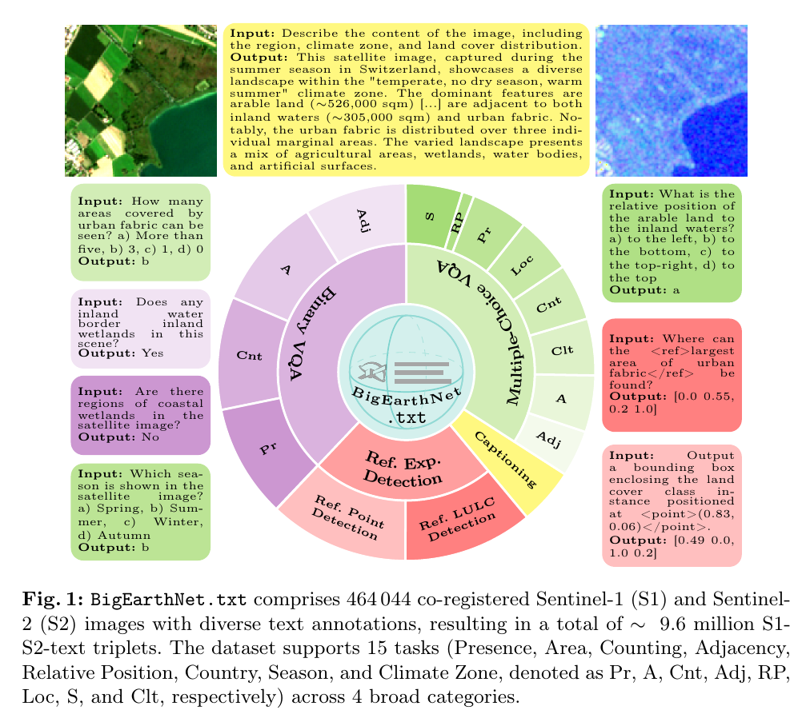
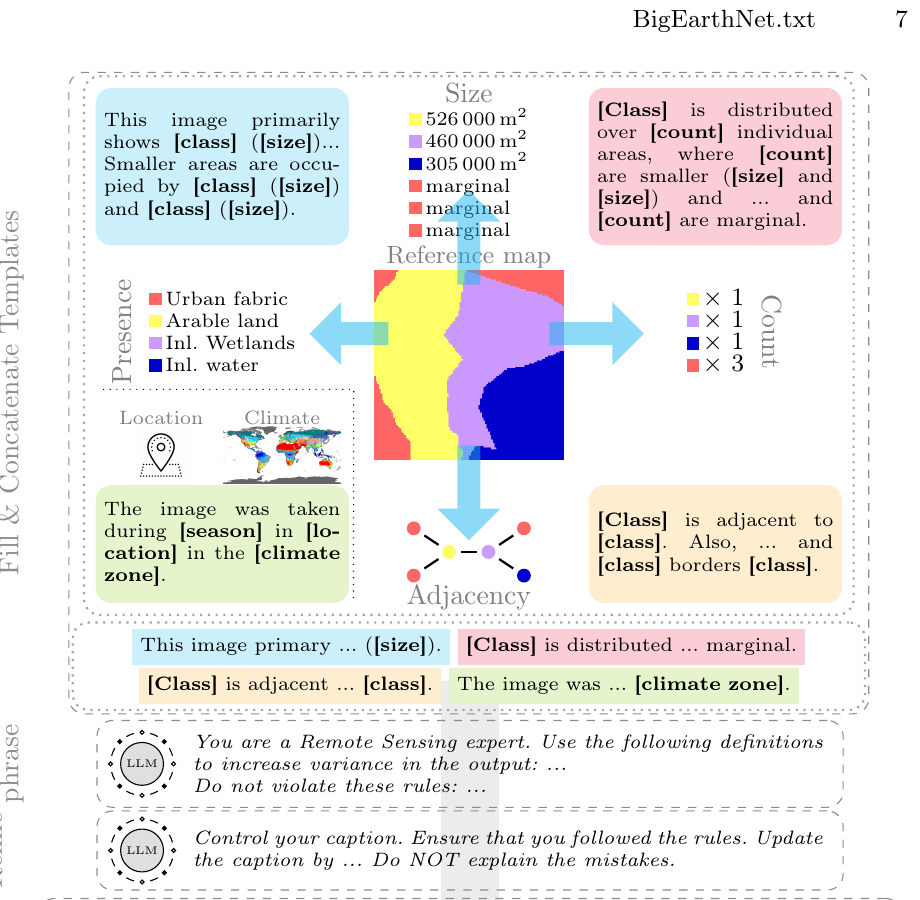
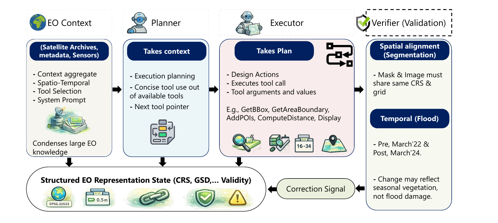
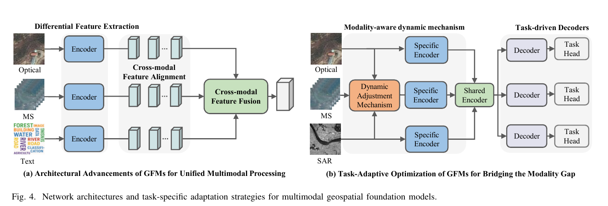

# Beginner’s Guide to SatQuery AI: From “What is a Satellite Image?” to Multimodal VLMs and Agentic Remote Sensing

I read the five papers as a connected body of work rather than five isolated papers, and I also cross-checked the remote-sensing fundamentals against NASA/ESA material and the public benchmarks referenced by the papers.

The first misconception to destroy is this:

> **A satellite image is not simply a photograph taken from very far away.**

That mental model works for ordinary RGB satellite pictures, but it breaks almost immediately once you encounter multispectral imagery, SAR, GeoTIFFs, sensor resolution, change detection, or multimodal AI.

A better mental model is:

> **A satellite is a measuring instrument. A satellite image is a geographically located grid of physical measurements. AI then learns patterns in those measurements.**

And SatQuery AI adds one more layer:

> **Instead of asking one AI model to know everything, an agent understands the question, examines what data are available, chooses appropriate specialist tools/models, checks whether their operations are scientifically valid, and turns the resulting evidence into an answer.**

That distinction is at the heart of all five papers. One review explicitly warns that fluent geographic language does not itself establish geographic competence: results need to be grounded in coordinates, scale, topology, sensor characteristics and executable geographic operations. 

I’ll build everything from zero.

---

## Part I — Before AI: what exactly are we observing?

### 1. What is remote sensing?

Imagine trying to determine whether a cup of tea is hot.

You could:

* touch it directly,
* look at steam coming from it,
* point an infrared thermometer at it.

The last two are examples of **remote sensing** because you are learning something without physically touching the target.

Satellite remote sensing follows the same idea.

A sensor hundreds of kilometres above Earth measures electromagnetic energy associated with Earth's surface.

That energy might have:

* come from the Sun and reflected from Earth,
* been emitted by Earth,
* or been transmitted by the satellite itself and reflected back.

NASA distinguishes sensors broadly into **passive** and **active** instruments. Passive instruments receive naturally emitted or reflected energy; active instruments transmit energy and measure the return. ([Earthdata GCMD][1])

So:

```text
                  REMOTE SENSING

       Passive                         Active
          │                               │
          │                               │
     Sun provides                   Sensor transmits
        energy                          energy
          │                               │
          ↓                               ↓
        Earth                           Earth
          │                               │
          ↓                               ↓
      Satellite                      Satellite
      measures                       measures
     reflection                       return
```

Optical satellite imagery is usually on the passive side.

SAR radar imagery is active.

We'll soon see why this difference matters enormously.

---

### 2. What is electromagnetic radiation?

You've already interacted with electromagnetic radiation your entire life:

* radio waves,
* microwaves,
* infrared,
* visible light,
* ultraviolet,
* X-rays.

These are fundamentally the same family of phenomena but have different **wavelengths**.

NASA describes visible light as only a small part of the electromagnetic spectrum. ([NASA Science][2])

Think about a piano.

The piano contains many notes.

Your eyes effectively hear only a tiny group of those notes.

Satellite sensors can “listen” to many frequencies your eyes cannot see.

Conceptually:

```text
Long wavelength                                      Short wavelength

Radio ── Microwave ── Infrared ── Visible ── UV ── X-ray
                                  ↑
                            your eyes see
                           only this region
```

This turns out to be incredibly valuable.

Two materials that look similarly green to a human can reflect infrared light very differently.

That's why satellite imaging is often much more than simply taking RGB photographs.

---

### 3. What does a pixel actually contain?

On your phone, you may think of an image pixel as:

```text
Pixel = [Red, Green, Blue]
```

For example:

```text
[255, 0, 0] → red pixel
```

But that is only one type of imagery.

A satellite pixel may look more like:

```text
Pixel = [
    blue measurement,
    green measurement,
    red measurement,
    red-edge measurement,
    near-infrared measurement,
    short-wave infrared measurement,
    ...
]
```

Or for radar:

```text
Pixel = [
    VV backscatter,
    VH backscatter
]
```

The important idea is:

> **Each channel/band represents a measurement made in some specific part of the electromagnetic spectrum or measurement configuration.**

So an image can be represented mathematically as a three-dimensional tensor:

$$
X \in \mathbb{R}^{H\times W\times C}
$$

where:

* \(H\) = image height,
* \(W\) = image width,
* \(C\) = number of channels/bands.

A normal photograph has:

$$
C=3
$$

for RGB.

Sentinel-2 has **13 spectral bands**, covering 443–2190 nm. ESA states that four bands are available at 10 m spatial resolution, six at 20 m and three at 60 m. ([European Space Agency][3])

Already, you can see why:

```text
normal image model
        ≠
remote-sensing model
```

---

### 4. What does “band” mean?

Imagine putting coloured filters in front of a camera.

A red filter allows mainly red wavelengths through.

A green filter isolates another wavelength range.

Satellite bands are much more precise versions of this idea.

Each band measures energy within a particular wavelength interval.

For example:

```text
Band 2 → blue-ish wavelengths
Band 3 → green-ish wavelengths
Band 4 → red-ish wavelengths
Band 8 → near infrared
...
```

Sentinel-2 does this across 13 spectral channels. ([European Space Agency][4])

And this gives us our first important remote-sensing concept:

#### Spectral signature

Different materials reflect different wavelengths differently.

Imagine:

```text
             Visible               Near infrared
                │                       │

Healthy leaf    ███                     █████████
Concrete        █████                   ████
Water           ████                    ▏
Dry soil        ████                    █████
```

That pattern of reflection across wavelengths is approximately the material's **spectral signature**.

It is why multispectral/hyperspectral imagery can distinguish things ordinary RGB images struggle with.

The GFM survey specifically notes that multispectral imagery uses several narrow bands and can discriminate surfaces using their shape, structure and spectral response. 

---

### 5. RGB optical imagery

Let's start with the most familiar satellite sensor.

An RGB optical image records approximately the wavelengths humans see:

* red,
* green,
* blue.

The survey gives the visible range as roughly **400–700 nm** and describes optical RGB as measuring surface reflectance in the visible solar spectrum. 

You can think of it as:

```text
SUN
 │
 │ sunlight
 ▼
GROUND
 │
 │ reflected light
 ▼
OPTICAL SATELLITE SENSOR
```

#### Strengths

RGB images are:

* intuitive for humans,
* easy to visualize,
* great for texture and shape,
* useful for roads, buildings, rivers and land-cover patterns.

#### Weakness

The sensor depends heavily on reflected light.

So:

```text
cloud
  ↓
████████████████
Earth hidden underneath
```

is a problem.

Night is another problem for passive reflected-light imaging.

This is one reason radar is so important.

---

### 6. Panchromatic imagery

You may encounter another term:

> **Panchromatic**

Instead of dividing light into multiple narrow colour bands, a panchromatic sensor usually measures a relatively broad range as one grayscale channel.

Think:

```text
RGB:

R ─────┐
G ─────┼─ separate channels
B ─────┘
```

versus:

```text
Panchromatic:

wide wavelength range
          ↓
one intensity value
```

One reason panchromatic imagery is useful is that it can often be captured at higher spatial detail than multispectral channels for a given sensor design.

That's also why **pan-sharpening** exists: combine the spatial detail of a panchromatic image with the colour/spectral information of lower-resolution multispectral imagery.

You don't need pan-sharpening to understand SatQuery immediately, but the term is common in high-resolution EO systems.

---

### 7. Multispectral imagery

Now we're entering the data SatQuery really cares about.

#### Intuition

Imagine having superhuman vision.

Instead of seeing only:

```text
red
green
blue
```

you can also see:

```text
near infrared
shortwave infrared
red edge
...
```

That's approximately what multispectral sensors give us.

#### Formal definition

The paper describes multispectral data as several narrow spectral bands imaging the same scene. 

Sentinel-2 is a major example:

**13 bands**

with:

* 4 at 10 m,
* 6 at 20 m,
* 3 at 60 m.

Its swath is 290 km and the baseline two-satellite configuration has a five-day revisit time at the equator. ([European Space Agency][3])

#### Why do those extra bands matter?

Suppose two fields look equally green.

RGB model:

```text
field A → green
field B → green

"Probably similar."
```

Multispectral model:

```text
             RED   RED-EDGE   NIR   SWIR

field A       ●       ●       ●      ●
field B       ●       ○       ○      ●

"These are spectrally different."
```

The additional information can help characterize vegetation, water, soil and land cover.

The BigEarthNet.txt paper explicitly explains that visible RGB may separate broad classes such as water and forest, while spectral information outside ordinary RGB can be necessary to distinguish more complex land-cover categories, such as different forest types. 

That sentence is central to SatQuery.

---

### 8. Hyperspectral imagery

Multispectral:

```text
several bands
```

Hyperspectral:

```text
dozens or hundreds of narrow,
often contiguous bands
```

Imagine instead of asking:

> “What colour is this?”

you record a very detailed curve:

```text
Reflectance
    ^
    │                  /\
    │         /\      /  \
    │   _____/  \____/    \____
    └───────────────────────────> wavelength
```

That curve can act almost like a material fingerprint.

The survey says hyperspectral sensing collects **hundreds of contiguous narrow bands**, creating dense spectral signatures at each pixel. This enables fine material discrimination for applications such as land-cover analysis, vegetation analysis and mineral exploration. 

SatQuery's defined scope does not require hyperspectral support, but understanding it helps you see that:

> “Satellite image” is an extremely broad category.

---

### 9. What is SAR?

This is probably the least intuitive part for a beginner.

SAR means:

> **Synthetic Aperture Radar**

Forget conventional photographs for a moment.

A SAR satellite emits microwave radar pulses toward Earth.

Then it listens to what comes back.

```text
SATELLITE
   │
   │ microwave pulse
   ▼
~~~~~~~~ EARTH ~~~~~~~~
   ▲
   │ returned echo
   │
SATELLITE
```

This returned signal is called **backscatter**.

ESA describes Sentinel-1 as carrying a **C-band Synthetic Aperture Radar** that supplies all-weather, day-and-night imagery. ([European Space Agency][5])

NASA similarly notes that SAR enables imaging during poor weather and both night and day. ([Earthdata GCMD][6])

That's a major operational advantage.

---

### 10. Why can radar see through clouds?

Cloud droplets are very troublesome for visible wavelengths.

Microwave wavelengths used by many radar systems are much longer.

As a result, many clouds interact much less strongly with these radar wavelengths than with visible light.

So:

```text
OPTICAL

Satellite
   ↓
 CLOUD ☁☁☁
   ✕
 ground obscured
```

while approximately:

```text
SAR

Satellite
   ↓ radar
 CLOUD ☁☁☁
   ↓
GROUND
   ↑ echo
   ↑
Satellite
```

This doesn't mean radar is magically unaffected by every atmospheric situation, but it is dramatically less dependent on cloud-free daylight conditions than ordinary optical imaging.

This complementarity is exactly why SatQuery requires joint optical-SAR analysis.

---

### 11. SAR images don't show “colour”

Here's where people get confused.

In an optical image:

> bright or coloured pixel ≈ reflected light in a wavelength.

In SAR:

> brightness ≈ strength of radar backscatter after processing.

Different things affect that return.

NASA documentation notes that backscatter is affected by surface structure/roughness and dielectric properties such as moisture. A smooth surface can reflect most of the signal away from the radar, while complex structures can return more energy. ([Earthdata][7])

So calm water often looks dark in radar imagery.

But this does **not** imply:

```text
dark = water
```

in every situation.

Wind can roughen water.

Radar geometry matters.

Different targets can be dark for different reasons.

Different wavelengths and polarizations behave differently.

That is why a SAR image cannot be interpreted using simple RGB intuition.

The agentic-EO paper puts the distinction nicely: optical sensors measure reflected radiation affected by illumination and atmosphere, whereas SAR backscatter encodes properties including roughness and moisture. 

---

### 12. What are VV, VH, HH and HV?

Radar waves have an electric-field orientation called **polarization**.

A radar can transmit and receive different orientations.

The common labels are:

```text
HH
HV
VH
VV
```

For example:

```text
VV = transmit vertical
     receive vertical

VH = transmit vertical
     receive horizontal
```

Different polarization channels interact differently with vegetation, soil and structures.

NASA's SAR material describes HH/VV as co-polarized measurements and HV/VH as cross-polarized measurements, noting that they can provide complementary information. ([Earthdata][7])

You do **not** need to memorize radar scattering physics yet.

For SatQuery, remember:

> A SAR channel is not equivalent to an RGB colour channel.

The model must know what sensor and polarization it is dealing with.

---

### 13. Why combine optical and SAR?

This is central to PS 26167.

Think of two doctors examining the same patient.

Doctor A has an X-ray.

Doctor B has a blood test.

Neither measurement is “better” universally.

They're sensitive to different things.

Likewise:

| Optical/multispectral               | SAR                                      |
| ----------------------------------- | ---------------------------------------- |
| reflected electromagnetic radiation | emitted radar → backscatter              |
| strong spectral information         | strong structural/scattering information |
| intuitive visually                  | harder for humans to interpret           |
| affected by cloud/daylight          | often usable through clouds/day/night    |
| vegetation/material spectral clues  | roughness/moisture/geometry clues        |

NASA's crop-mapping training summarizes the complementarity similarly: optical data relate strongly to vegetation's chemical/reflective properties, while radar provides structural/moisture-sensitive information. ([Earthdata Forum][8])

The multimodal GFM survey consequently describes multispectral and SAR information as complementary spectral and structural information. 

This gives us:

```text
OPTICAL                   SAR
   │                       │
   │ spectral clues        │ structural/radar clues
   │                       │
   └──────────┬────────────┘
              ↓
          FUSION MODEL
              ↓
        stronger shared
        interpretation
```

That's the theory.

Actually making the fusion work is much harder—we'll reach that later.

---

### 14. Four different kinds of “resolution”

This terminology trips up almost every beginner.

#### A. Spatial resolution

> How much ground area corresponds approximately to one image sample/pixel.

Suppose a product is 10 m resolution.

The simplified interpretation is:

```text
one pixel ≈ 10 m × 10 m ground footprint
```

But be careful: **pixel spacing/GSD and true resolving power are related but not identical physical concepts**. For beginner purposes they are often discussed together.

Higher spatial resolution means finer detail.

```text
0.5 m    → individual vehicles/building detail may be visible
10 m     → fields/roads/urban blocks
250 m    → regional phenomena
```

The agentic EO paper emphasizes something deeper:

> Scale isn't merely preprocessing. It determines what phenomena can actually be observed and therefore what conclusions are scientifically valid. 

That's important.

You cannot upscale a 250 m pixel and suddenly discover a 2 m car.

---

#### B. Spectral resolution

> How finely a sensor divides the electromagnetic spectrum.

Conceptually:

```text
Low spectral resolution
████████████████████

High spectral resolution
██ ██ ██ ██ ██ ██ ██ ██
```

More/narrower wavelength bands can separate materials more precisely.

---

#### C. Temporal resolution

> How frequently a sensor can observe the same area.

Examples:

```text
every day
every 5 days
every 12 days
...
```

This matters for:

* crop growth,
* flood evolution,
* wildfires,
* urban expansion.

Sentinel-2's baseline constellation revisit is five days at the equator. ([European Space Agency][3])

---

#### D. Radiometric resolution

> How finely a sensor distinguishes differences in measured energy.

A simplified example:

```text
2-bit measurement:
4 possible levels

8-bit measurement:
256 possible levels

12-bit measurement:
4096 possible levels
```

More levels can encode subtler intensity differences, although actual useful signal quality depends on far more than bit depth.

---

### 15. Raster vs vector data

You will encounter both constantly in GIS.

#### Raster

A grid.

Examples:

```text
satellite image
elevation map
classification mask
temperature surface
```

Representation:

```text
┌───┬───┬───┬───┐
│ 4 │ 4 │ 3 │ 3 │
├───┼───┼───┼───┤
│ 4 │ 2 │ 2 │ 3 │
├───┼───┼───┼───┤
│ 1 │ 1 │ 2 │ 3 │
└───┴───┴───┴───┘
```

#### Vector

Explicit geometry.

Examples:

```text
point     → tower
line      → road
polygon   → lake boundary
```

Conceptually:

```text
POINT:      •

LINE:     ─────

POLYGON:   ┌────┐
           │    │
           └────┘
```

SatQuery may receive raster satellite data and return vector-like evidence such as:

* boxes,
* polygons,
* regions.

---

### 16. Why GeoTIFF is different from JPEG

JPEG says approximately:

> “Here are coloured pixels.”

GeoTIFF can additionally encode:

> “These pixels correspond to this location on Earth using this coordinate system and this transform.”

A proper geospatial raster may contain:

```text
pixels
bands
CRS
geographic transform
resolution
bounds
NoData values
metadata
```

That information makes operations such as:

```text
Where exactly is this lake?
How many hectares changed?
Do these two images overlap?
```

possible.

Without georeferencing, you may still analyze imagery visually, but many geographic conclusions become impossible or unreliable.

---

### 17. What is a CRS?

CRS means:

> **Coordinate Reference System**

This sounds frightening but the underlying idea is simple.

Earth is curved.

Computer screens and maps are flat.

We therefore need rules that define how Earth locations are represented as coordinates.

Example:

```text
Latitude / Longitude:
30.3165°, 78.0322°
```

versus a projected system:

```text
X =  ...
Y =  ...
```

Different coordinate systems can represent the same physical location using very different numbers.

Therefore:

```text
Raster A coordinates
+
Raster B coordinates
```

cannot simply be overlaid unless their coordinate systems are compatible or transformed correctly.

This matters so much that the agentic remote-sensing paper repeatedly treats CRS as part of the **state of the problem**, not incidental metadata. Its formal EO state includes the current data, CRS, resolution/GSD, extent, temporal window, modality, uncertainty, provenance and tool history. 

---

### 18. What does “co-registered” mean?

Imagine two transparent maps of the same neighbourhood.

On map A, the river is here:

```text
      ~~~~~~~
```

On map B, because the images don't align properly, the same river appears shifted:

```text
             ~~~~~~~
```

If you compare them pixel-by-pixel, your system might think:

> “The river moved!”

when actually the maps are simply misaligned.

**Co-registration** means aligning images so corresponding geographic locations correspond spatially.

For cross-modal imagery:

```text
Optical pixel/location
       │
       └──── same ground location ──── SAR pixel/location
```

For change detection:

```text
T1 location(x, y)
       │
       └──── same ground location ──── T2 location(x, y)
```

This is a prerequisite for meaningful paired analysis.

---

### 19. What is bi-temporal imagery?

**Bi** = two.

**Temporal** = time.

So:

```text
Image at time T1
+
Image at time T2
```

Example:

```text
June 2024               June 2026

farmland                new buildings
  ↓                           ↓
[image 1]                 [image 2]
      \                     /
       \                   /
         CHANGE ANALYSIS
```

This is what SatQuery's:

> “Has built-up area increased?”

query requires.

---

### 20. Difference detection is not automatically change understanding

Suppose:

```text
T1 = January
T2 = August
```

A crop field may look radically different.

Did:

> land use change?

Maybe not.

The crops may simply be at different seasonal stages.

The agentic EO paper emphasizes that satellite observations are often irregular, affected by cloud gaps, sensor changes and seasonal cycles. A change model must distinguish meaningful changes from seasonal variation, noise and incomplete observations. 

This is a crucial difference:

```text
Pixel difference
      ≠
Meaningful real-world change
```

---

## Part II — Now let's build AI knowledge from zero

### 21. AI vs ML vs deep learning

These words are often used interchangeably, but that's sloppy.

Think of nested circles:

```text
┌──────────────────────────────┐
│ Artificial Intelligence      │
│                              │
│   ┌──────────────────────┐   │
│   │ Machine Learning     │   │
│   │                      │   │
│   │  ┌───────────────┐   │   │
│   │  │ Deep Learning │   │   │
│   │  └───────────────┘   │   │
│   └──────────────────────┘   │
└──────────────────────────────┘
```

#### Artificial Intelligence

Broad idea:

> machines performing tasks associated with intelligent behaviour.

Could include:

* search,
* rule systems,
* planning,
* machine learning.

#### Machine Learning

Instead of manually writing every rule:

```python
if pixel is dark:
    return "water"
```

we show the computer examples and optimize a mathematical model to discover useful patterns.

#### Deep Learning

A branch of ML using multilayer neural networks that learn complex representations.

Modern:

* image models,
* LLMs,
* VLMs,

are primarily deep-learning systems.

---

### 22. The simplest useful ML model

Suppose we want to predict:

```text
vegetation
or
not vegetation
```

We collect observations:

```text
Input X                   Label y

spectral values   →       vegetation
spectral values   →       water
spectral values   →       vegetation
...
```

A model implements some function:

$$
f_\theta(X)=\hat y
$$

where:

* \(X\) = input,
* \(\theta\) = model parameters,
* \(\hat y\) = prediction.

Training means finding parameters \(\theta\) that make predictions match known examples well.

---

### 23. What are parameters?

A parameter is a learned numerical value inside the model.

Think about:

$$
y = wx+b
$$

Here:

* \(w\) = parameter,
* \(b\) = parameter.

A modern neural network may contain millions or billions of these numbers.

When people say:

> “a 1B model”

they roughly mean around one billion learned parameters.

The BigEarthNet paper's adapted InternVL has approximately **1.1 billion total parameters**, but only **5.8 million are trainable** during their adaptation procedure. We'll eventually understand why. 

---

### 24. Training versus inference

These are different phases.

#### Training

Model sees examples and changes its parameters.

```text
input
  ↓
model
  ↓
prediction
  ↓
compare with truth
  ↓
error/loss
  ↓
adjust parameters
  ↓
repeat
```

#### Inference

Training has finished.

Now:

```text
new unseen image
      ↓
trained model
      ↓
prediction
```

SatQuery's public web application mostly performs **inference**.

Fine-tuning happens beforehand.

---

### 25. What is a loss function?

Suppose truth is:

```text
water
```

and model predicts:

```text
forest
```

The model needs a numerical signal that says:

> you're wrong.

A **loss function** measures prediction error.

Conceptually:

$$
L(\theta)=\text{how wrong the model is}
$$

Training tries to reduce:

$$
L
$$

by changing:

$$
\theta
$$

You can imagine descending a hill:

```text
Loss
 ^
 │        ●
 │       /
 │     ●
 │   /
 │ ●
 │____●____________> parameters
      minimum-ish
```

The common family of algorithms used to adjust parameters is **gradient descent**.

---

### 26. Epoch, batch and learning rate

These terms appear constantly in papers.

#### Epoch

One pass through the training dataset.

```text
entire dataset once = 1 epoch
```

#### Batch

Instead of processing a million images simultaneously, training works with smaller groups.

```text
batch 1 = samples 1–32
batch 2 = samples 33–64
...
```

#### Learning rate

Controls how aggressively parameters change.

Too high:

```text
jump over good solution
```

Too low:

```text
training takes forever
```

The BigEarthNet RS-InternVL experiment warms its learning rate from \(10^{-6}\) to \(10^{-4}\) during the first 1% of steps and then follows cosine decay. 

You don't need to understand cosine scheduling yet. Just recognize it as control over how large the training updates are.

---

### 27. Training, validation and test sets

One of the most important concepts in all of machine learning.

Suppose you have 100,000 examples.

You don't want to train on every example and then ask:

> “How well do you perform on those same examples?”

That's like giving a student the exam paper before the exam.

Instead:

```text
Dataset
   │
   ├── Training set
   │      model learns from this
   │
   ├── Validation set
   │      choose settings/check progress
   │
   └── Test set
          final unbiased evaluation
```

This leads directly to another concept.

---

### 28. Overfitting

Imagine memorizing answers to 100 questions without understanding the topic.

When the exam contains the same questions:

```text
100/100
```

but new questions:

```text
20/100
```

That's analogous to **overfitting**.

A model becomes excellent on training patterns but poor on new data.

What we really care about is:

> **generalization**

Can the model perform on observations it didn't memorize?

---

### 29. Domain shift

Now we get to one of the most important concepts for SatQuery.

Suppose you learn to identify cars from:

```text
daytime street photos
```

Then you're evaluated on:

```text
nighttime thermal images
```

Same semantic concept:

> car

but very different data distribution.

That's **domain shift**.

Remote sensing has enormous domain-shift problems:

```text
Sentinel → RISAT
Europe → India
10 m → 0.5 m
summer → winter
optical → SAR
one radar polarization → another
one incidence angle → another
```

The multimodal GFM survey identifies sensor heterogeneity, spatial/temporal resolution differences, spectral range, noise and sensor distribution differences as central causes of difficulty in cross-modal representation learning. 

The agentic EO position paper goes even further: a model can operate in a perfectly valid CRS with correctly aligned imagery and still produce the wrong semantic result because its learned model is being used outside its training distribution. 

That will be extremely important for your SatQuery solution.

---

### 30. Supervised learning

You provide labels.

```text
image                        label

[forest image]      →        forest
[water image]       →        water
[urban image]       →        urban
```

The model learns from explicit target answers.

Typical supervised remote-sensing tasks:

* classification,
* detection,
* segmentation,
* VQA.

---

### 31. Self-supervised learning

Remote-sensing labels are expensive.

But unlabeled satellite images are abundant.

So researchers invent tasks where data creates its own supervision.

Example:

Take:

```text
[full image]
```

hide parts:

```text
[ visible ][MASK]
[MASK    ][visible]
```

ask model to reconstruct missing information.

The model learns useful representations even though no human said:

> “this is agriculture.”

This family of ideas underlies many Earth-observation foundation models.

---

### 32. Classification

Question:

> “What category does this entire image belong to?”

Input:

```text
image
```

Output:

```text
urban
```

or:

```text
forest
```

One output for the whole scene.

---

### 33. Object detection

Question:

> “Where are the aircraft?”

Output:

```text
aircraft 1: [x1, y1, x2, y2]
aircraft 2: [x1, y1, x2, y2]
```

Typically visualized:

```text
┌───────────────────────────┐
│         ┌──────┐          │
│         │plane │          │
│         └──────┘          │
│                           │
└───────────────────────────┘
```

Those rectangles are **bounding boxes**.

---

### 34. Semantic segmentation

Instead of saying:

```text
"There is water somewhere here."
```

segmentation labels individual pixels.

Example:

```text
Input                         Mask

🌳🌳🏠💧                      F F U W
🌳🏠🏠💧          →           F U U W
🌳🌳💧💧                      F F W W
```

where:

```text
F = forest
U = urban
W = water
```

This is much more useful when you need:

* area,
* boundaries,
* change maps.

---

### 35. Change detection

Input:

```text
Image at T1
Image at T2
```

Output:

```text
changed/not changed
```

often per pixel.

More advanced systems identify:

```text
forest → urban
water → dry land
agriculture → built-up
```

That is **semantic change detection**.

---

## Part III — Neural networks and vision models

### 36. What is a neural network?

Don't be intimidated by the biological analogy.

At its core, a neural network is a giant differentiable mathematical function made of many layers.

```text
input
 ↓
layer
 ↓
layer
 ↓
layer
 ↓
output
```

An individual unit roughly performs:

$$
z=w_1x_1+w_2x_2+\ldots+b
$$

then applies a nonlinear function.

Stack millions of these operations and train the weights, and networks can learn complicated mappings.

---

### 37. Why don't we manually tell the network what a building is?

Because “building” doesn't have one universal pixel pattern.

Buildings vary in:

* colour,
* material,
* shape,
* orientation,
* sensor,
* shadow,
* resolution,
* geographical region.

Instead, a deep model learns increasingly abstract **features**.

Simplified:

```text
early layers:
edges, corners, textures

middle:
roof-like structures
roads
repetitive shapes

later:
urban structure
building
airport
```

These learned features are often called **representations**.

---

### 38. What is an embedding?

One of the most important AI concepts.

An embedding is a numerical vector representing some piece of information.

For example:

```text
"water"

→ [0.12, -0.84, 0.31, ...]
```

An image:

```text
[water-body image]

→ [0.15, -0.80, 0.27, ...]
```

If a model learns a good joint space, semantically related things lie close together.

Conceptually:

```text
embedding space

   forest ● ● tree
           \
            ● woodland


                             ● airplane
                     ● airport


      ● river
   ● lake
       ● water
```

This becomes the bridge between:

```text
vision
and
language
```

---

### 39. CNNs

CNN means:

> **Convolutional Neural Network**

#### Intuition

Imagine sliding a small detector across an image:

```text
image
┌─────────────┐
│ []          │
│             │
│             │
└─────────────┘
```

It asks:

```text
Is there an edge here?
Is there a texture here?
Is there a corner here?
```

and repeats that across the image.

CNNs are very good at learning **local spatial patterns**.

The multimodal GFM survey describes CNNs as exploiting local connectivity and hierarchical representation, supporting multi-scale analysis and fine boundary capture. 

---

### 40. Transformers

Transformers originated in language processing but now dominate many visual foundation models.

Their key mechanism is:

> **attention**

Instead of only examining nearby pixels, a model can learn:

> which other parts of the input matter for understanding this part?

For a satellite scene:

```text
pixel/patch here
      │
      ├──────── road elsewhere
      ├──────── neighbouring buildings
      └──────── river boundary
```

The survey notes that transformers use self-attention for long-range and cross-modal dependencies, helping capture global correlations and semantics, though often at substantial computational cost. 

---

### 41. Vision Transformer — ViT

A ViT turns an image into small patches.

Imagine:

```text
original image

┌────┬────┬────┬────┐
│ P1 │ P2 │ P3 │ P4 │
├────┼────┼────┼────┤
│ P5 │ P6 │ P7 │ P8 │
├────┼────┼────┼────┤
│... │... │... │... │
└────┴────┴────┴────┘
```

Each patch becomes a vector/token.

Then:

```text
P1 → token
P2 → token
P3 → token
...
```

and the transformer processes their relationships.

This is analogous to an LLM processing words/tokens.

That's why vision and language transformers fit together so naturally.

---

## Part IV — Language models

### 42. What is an LLM?

LLM means:

> **Large Language Model**

A useful simplified description is:

> a neural network trained to predict tokens based on preceding context.

If input is:

```text
"The capital of India is"
```

it learns a probability distribution such as:

```text
Delhi       0.93
Mumbai      0.02
...
```

Then repeats the process token by token.

The agentic geospatial survey formalizes an LLM exactly this way: as an autoregressive model predicting the next token conditioned on previous tokens. 

This seemingly simple objective at huge scale gives rise to:

* writing,
* summarization,
* code generation,
* question answering,
* some reasoning capabilities.

---

### 43. Why can't an LLM understand an image directly?

Text looks like:

```text
[token1, token2, token3, ...]
```

An image looks like:

```text
height × width × channels
```

Different representation.

So we need a visual encoder.

---

### 44. Vision-Language Model — VLM

A simplified VLM:

```text
IMAGE
  ↓
Vision Encoder
  ↓
Visual embeddings
  ↓
Projection/Connector
  ↓
Language-model-compatible tokens
         +
      QUESTION
         ↓
        LLM
         ↓
      ANSWER
```

Example:

```text
image: satellite scene

question:
"Is there a river visible?"

                ↓

"Yes."
```

That is **Visual Question Answering — VQA**.

---

### 45. Why do we need remote-sensing VLMs?

A generic VLM learns primarily from conventional images:

```text
cats
people
cars
rooms
web images
memes
documents
```

Satellite data is radically different:

```text
top-down perspective
tiny objects
large geographic regions
arbitrary object rotation
multispectral channels
radar imagery
multi-temporal observations
geospatial metadata
```

The GFM survey says general-purpose foundation models face a substantial domain gap because remote-sensing imagery varies from sub-meter to tens-of-meters spatial resolution, contains spectral dimensions beyond RGB and frequently requires temporal reasoning. 

So this idea:

```text
Generic VLM
+
good prompt
=
remote sensing expert
```

does **not** survive scrutiny.

And BigEarthNet.txt gives us experimental evidence for exactly this.

---

## Part V — Vision-language tasks you must distinguish

### 46. Image captioning

Input:

```text
image
```

Output:

```text
"The scene contains agricultural land, urban areas
and a water body..."
```

Goal:

> describe the image.

---

### 47. Visual Question Answering — VQA

Input:

```text
image + question
```

Output:

```text
answer
```

Example:

```text
Q: Is there inland water?
A: Yes
```

This is a mandatory SatQuery capability.

---

### 48. Multiple-choice VQA

Same idea, but answer comes from options.

```text
Which season is represented?

A. Winter
B. Summer
C. Autumn
D. Spring
```

BigEarthNet.txt explicitly includes both binary VQA and MCQ VQA. 

---

### 49. Visual grounding

This is more important than it sounds.

Question:

> “Where is the water body?”

A normal VLM may say:

```text
"The water body is in the upper-right."
```

A **grounding** model returns coordinates:

```text
[x1, y1, x2, y2]
```

or a region/mask.

```text
┌───────────────────────────┐
│                     ┌───┐ │
│                     │~~~│ │
│                     └───┘ │
│                           │
└───────────────────────────┘
```

This turns language into **spatial evidence**.

The geographic-science review highlights why this distinction matters: semantic caption/VQA success can coexist with incorrect object location, scale or topology. 

That is why SatQuery should care enormously about grounding.

---

### 50. Image-text retrieval

Input:

```text
"airport surrounded by agricultural fields"
```

System searches imagery and retrieves matching scenes.

Or reverse:

```text
image → relevant text
```

This isn't the core mandatory SatQuery task but is an important VLM capability.

---

## Part VI — Foundation models

### 51. What is a foundation model?

Traditional approach:

```text
Model A → forests

Model B → buildings

Model C → water

Model D → roads
```

Foundation-model philosophy:

```text
               Large pretrained model
                       │
        ┌──────────────┼───────────────┐
        ↓              ↓               ↓
     Forests       Buildings         Water
```

A foundation model is pretrained broadly enough that its representations can later be adapted to many downstream tasks.

The GFM survey defines them as large-scale pretrained models learning broadly useful representations that can be adapted to downstream domains/tasks. 

---

### 52. Pretraining versus fine-tuning

Imagine becoming a doctor.

#### Pretraining

You first learn:

```text
biology
chemistry
anatomy
general medicine
```

#### Fine-tuning

Then specialize:

```text
cardiology
```

Same idea:

```text
large generic/pretrained model
             ↓
     remote-sensing data
             ↓
         fine-tuning
             ↓
remote-sensing-specialized model
```

The GFM survey formally describes fine-tuning as updating some or all parameters of a pretrained model using task-specific data. 

---

### 53. Why not fine-tune all billion parameters?

Because it's expensive.

GPU memory.

Training time.

Storage.

And sometimes you don't need to change everything.

This motivates:

> **PEFT — Parameter-Efficient Fine-Tuning**

One famous PEFT method is LoRA.

---

### 54. LoRA

LoRA means:

> **Low-Rank Adaptation**

You don't need the linear algebra immediately.

The intuition is enough:

Instead of rewriting a giant textbook:

```text
████████████████████████
████████████████████████
████████████████████████
```

you attach a relatively small specialized set of notes:

```text
████████████████████████
████████████████████████
████████████████████████
             +
      [small adapter]
```

Most original model weights remain frozen.

Only small low-rank matrices are trained.

This can reduce trainable parameter count dramatically.

And BigEarthNet gives a beautiful real-world example.

---

## Part VII — Multimodal learning

### 55. What does multimodal mean?

A **modality** is a distinct kind/form of information.

Examples:

```text
text
image
audio
SAR
optical
multispectral
LiDAR
```

Multimodal model:

```text
uses >1 modality
```

SatQuery is fundamentally multimodal:

```text
natural language
+
optical imagery
+
SAR imagery
+
possibly time
+
geospatial metadata
```

---

### 56. Why can't we simply concatenate everything?

Suppose:

```text
RGB value = 180
SAR backscatter = ...
NIR reflectance = ...
```

These numbers don't mean the same physical thing.

The paper calls this **modality heterogeneity**.

Different modalities have different:

* imaging physics,
* viewpoints,
* spatial resolution,
* temporal resolution,
* spectral range,
* noise.


So naïvely doing:

```text
optical tensor
+
SAR tensor
=
done
```

doesn't solve multimodal understanding.

---

### 57. Semantic gap

Suppose optical sees:

```text
bright rectangular rooftops
```

SAR sees:

```text
strong radar scattering structures
```

Text says:

```text
"built-up area"
```

All three describe related reality using radically different representations.

The job of multimodal learning is to align them into shared **semantics**.

This mismatch is called a **semantic gap**.

---

### 58. Contrastive learning

One powerful solution is contrastive learning.

Suppose:

```text
Optical image A
SAR image A
```

are measurements of the same place.

They are a **positive pair**.

Meanwhile:

```text
Optical image A
SAR image Z
```

from unrelated places can act as a **negative pair**.

Training encourages:

$$
d(A_\text{optical},A_\text{SAR})
$$

to become small while unrelated representations become more separated.

Intuition:

```text
BEFORE

optical A ●                    ● SAR A


AFTER

optical A ●● SAR A
```

The multimodal GFM survey describes contrastive learning exactly in terms of aligning modalities using positive and negative samples, and cites CROMA's use of co-registered multispectral and SAR pairs. 

---

### 59. CLIP

CLIP applied a related idea to:

```text
image
+
text
```

Example positive pair:

```text
[image of river]
"A river running through agricultural land"
```

A shared embedding space can become:

```text
image river ●
              ● text "river"
```

This is enormously useful because language now acts like an open semantic interface.

---

### 60. Generative learning

Another route is to reconstruct or generate information.

For example:

```text
masked image
     ↓
 model
     ↓
reconstruct missing patches
```

or:

```text
modality A
     ↓
 model
     ↓
predict modality B
```

The GFM survey distinguishes contrastive learning—which emphasizes discriminative alignment—from generative learning, which learns joint structure through reconstruction/generation. 

Both appear throughout geospatial foundation-model research.

---

## Part VIII — Now we can finally understand BigEarthNet.txt

This is the paper most directly tied to your SIH problem statement.

### 61. Why was BigEarthNet.txt created?

Earlier remote-sensing image-text datasets had problems such as:

* mostly RGB imagery,
* limited sensor diversity,
* short descriptions,
* limited annotation/task diversity.

Yet Earth observation contains:

```text
multispectral
SAR
geographic context
land-cover relationships
spatial information
```

BigEarthNet.txt was designed to make vision-language models learn richer multi-sensor Earth-observation semantics.

The authors explicitly argue that existing RS image-text resources were limited in co-registered multi-sensor imagery with >3 bands and annotation variety. 

---

### 62. What is inside BigEarthNet.txt?

<figure class="paper-figure" data-figure>
  
</figure>


The headline numbers matter, so don't lose them:

#### 464,044

co-registered:

```text
Sentinel-1 SAR
+
Sentinel-2 multispectral
```

image pairs.

#### Approximately 9.6 million

text annotations.

#### 15 tasks

grouped into four broad families:

1. captioning,
2. binary VQA,
3. multiple-choice VQA,
4. referring-expression detection.


These are not synthetic numbers from me; they are the reported dataset statistics.

---

### 63. Where did the imagery come from?

The source was BigEarthNet v2.0.

That collection contains **549,488 Sentinel-1/Sentinel-2 pairs acquired across ten European countries** with pixel-level land-use/land-cover reference information based on CORINE Land Cover 2018. 

The authors removed image pairs affected by things such as:

* seasonal snow,
* clouds,
* cloud shadows,
* unclassified reference pixels.

That filtering yielded the final:

**464,044 pairs.** 

---

### 64. What is LULC?

You'll see this acronym constantly.

> **Land Use / Land Cover**

#### Land cover

What physically covers the surface:

```text
forest
water
grass
concrete
bare soil
```

#### Land use

How humans use the land:

```text
residential
industrial
agricultural
recreational
```

They overlap but aren't identical.

A grass surface could be:

```text
park
pasture
golf course
```

same-ish cover, different use.

---

### 65. How were BigEarthNet.txt captions created?

<figure class="paper-figure paper-figure--portrait" data-figure>
  
</figure>


This section is particularly clever.

The authors didn't simply ask an LLM:

> “Look at this image and invent a caption.”

Instead they started with structured ground-truth information.

From the reference map they extracted:

1. **presence** — which LULC classes exist,
2. **count** — how many contiguous regions of each class,
3. **size** — area per class/instance,
4. **adjacency** — which classes border one another.


Then captions were created from templates.

Conceptually:

```text
Reference map
      ↓
extract verified facts
      ↓
template:
"The image contains [CLASS] covering [AREA]..."
      ↓
fact-grounded caption
```

This is much safer than unconstrained image description generation.

---

### 66. Primary, secondary and marginal regions

The authors categorize land cover based on image coverage:

```text
Primary      >25%
Secondary     5–25%
Marginal      <5%
```

and round area values to the nearest **1,000 m²** to reduce label noise. 

Again, these details matter if you later use the dataset.

---

### 67. Why involve an LLM at all?

Template:

```text
"Urban fabric is present. Water is present.
Urban fabric borders water."
```

is factually controlled but linguistically boring.

A VLM trained only on one rigid sentence pattern might learn the template rather than language understanding.

So BigEarthNet.txt used a two-stage language augmentation process.

#### Stage 1 — paraphrase

Make the text linguistically richer.

#### Stage 2 — self-refinement

Compare the rewrite against the original factual template and remove unsupported information/restore omissions.


This is a smart design:

```text
structured truth
      ↓
language variation
      ↓
truth check
```

rather than:

```text
LLM imagination
      ↓
dataset
```

---

### 68. But the generated captions were not perfect

This is one of the most important details in the paper.

The authors manually evaluated **3,209 randomly sampled augmented captions** using four criteria:

* linguistic correctness,
* factual accuracy,
* completeness,
* absence of generation artifacts.

Average correctness across the criteria was:

**93.76%**

but only:

**77.50%**

of captions passed **all four criteria simultaneously**. 

That teaches us a broader AI lesson:

> A large generated dataset can be highly useful without every generated annotation being perfect.

It also explains why BigEarthNet.txt has a separate verified benchmark.

---

### 69. Caption dataset richness

Reported caption corpus statistics include approximately:

* **50 million words**
* **2.1 million sentences**
* average **107 words**
* average **4.5 sentences**
* **12,394 unique terms**
* MTLD lexical-diversity score **64.69**

The paper reports this as over **1.7×** the lexical diversity of the largest compared >3-band RS image-text dataset. 

You don't need to obsess over MTLD itself.

The important thing is:

> they were deliberately trying to create varied natural-language descriptions rather than repetitive labels.

---

### 70. How was the VQA data made?

BigEarthNet.txt includes binary questions related to:

* presence,
* count,
* size,
* adjacency.

But there is a subtle dataset-design problem.

Consider:

> “Are there exactly three water regions?”

If the image contains no water at all, a model can answer:

```text
No
```

without learning counting.

That's a **shortcut**.

The authors deliberately construct some negative count/size questions so the queried class exists but the proposed quantity is wrong. 

This is excellent dataset design.

It forces:

```text
actual reasoning
```

instead of:

```text
class-presence shortcut
```

---

### 71. MCQ tasks

The multiple-choice questions extend beyond simple presence and include things such as:

* relative position,
* country,
* season,
* Köppen-Geiger climate zone.

Each question has:

```text
1 correct answer
+
3 incorrect answers
```


---

### 72. Referring-expression detection

Example:

> “Where is the largest area of urban fabric?”

Model should return coordinates.

This connects language:

```text
"largest urban fabric"
```

to:

```text
specific spatial region
```

That's exactly the sort of evidence SatQuery needs.

Approximately **80% of image pairs** in the dataset contain at least one referring-expression annotation, and each image pair can contain up to **16 VQA pairs**. 

---

### 73. The manually verified BigEarthNet benchmark

For fair evaluation, the authors construct a curated benchmark containing:

#### 1,082 image pairs

with:

#### 15,029 annotations

broken into:

| Task                           | Verified annotations |
| ------------------------------ | -------------------: |
| Binary VQA                     |            **6,927** |
| MCQ VQA                        |            **5,550** |
| Captions                       |              **970** |
| Referring-expression detection |            **1,582** |


This smaller verified set is much more appropriate for trustworthy evaluation than assuming every automatically augmented caption is perfect.

---

## Part IX — The experiment that matters enormously for SatQuery

### 74. What happened when existing VLMs were tested?

The BigEarthNet researchers evaluated both:

```text
general computer-vision VLMs
```

and:

```text
remote-sensing-specific VLMs
```

on their verified benchmark.

Here's the surprising part.

Many existing remote-sensing models did **not** decisively outperform the generic computer-vision VLMs.

For example, the benchmark table reports:

| Model               | Caption BLEU-4 | Binary VQA |       MCQ | Grounding mIoU |
| ------------------- | -------------: | ---------: | --------: | -------------: |
| GeoChat 7B          |           0.75 |      50.82 |     28.36 |           4.85 |
| EarthMind RGB 4B    |           1.66 |      57.90 |     34.25 |          12.12 |
| EarthMind S1+S2 4B  |           1.46 |      57.79 |     35.26 |          16.18 |
| Qwen 8B             |           0.57 |  **61.96** | **37.55** |          18.00 |
| GPT model evaluated |           0.30 |      60.39 |     34.93 |      **31.73** |
| InternVL 1B         |           0.45 |      54.11 |     26.76 |           5.76 |

These scores are percentages as reported by the paper for the stated metrics. 

Don't compare these numbers casually to another benchmark—they only mean something under this benchmark and evaluation setup.

---

### 75. More input channels did not automatically solve the problem

Look at:

```text
EarthDial RGB:
Binary VQA = 58.38

EarthDial multispectral S2:
Binary VQA = 44.06
```

And:

```text
EarthMind RGB:
57.90

EarthMind S1 + S2:
57.79
```


The exact models have many architectural differences, so don't interpret this as “multispectral is bad.”

The correct lesson is:

> **Simply giving a model extra sensors does not guarantee that it knows how to use them.**

Multimodal alignment has to be learned properly.

That is precisely what the next experiment demonstrates.

---

### 76. RS-InternVL

The researchers adapted **InternVL3-1B**.

Instead of discarding the existing model, they added specialist visual paths for:

```text
Sentinel-1
Sentinel-2
```

Conceptually:

```text
RGB image
   ↓
original InternVL visual path
   │
   │
   ├───────────────────────────────┐
                                   │

Sentinel-1 SAR                     │
      ↓                            │
   S1 ViT                          │
      ↓                            │
 projection                        │
      │                            │
      ├──────────────┐             │
                     │             │

Sentinel-2           │             │
multispectral        │             │
      ↓              │             │
   S2 ViT            │             │
      ↓              │             │
 projection          │             │
      │              │             │
      └──────────────┴─────────────┘
                     ↓
           combined visual tokens
                     +
               instruction
                     ↓
                    LLM
                     ↓
                  answer
```

Each sensor gets a pretrained Vision Transformer.

The resulting patch embeddings are projected into the embedding space expected by InternVL's language model. 

---

### 77. What is that “projection layer”?

Imagine the SAR encoder speaks:

```text
French
```

and the LLM understands:

```text
English
```

A projection layer acts like a learned translator:

```text
SAR feature space
      ↓
linear projection
      ↓
LLM-compatible feature space
```

Same for multispectral data.

This is not translating literal language—it is mapping vectors from one coordinate space into another.

---

### 78. Frozen backbone

The researchers freeze all ViT backbones.

Meaning:

```text
Don't change these:
██████████████████
```

Train only:

```text
sensor projections
+
LoRA adapters in LLM
```

This preserves pretrained knowledge and makes training cheaper.

---

### 79. RS-InternVL parameter efficiency

Total model:

**1.1 billion parameters**

Trainable:

**5.8 million**

LoRA settings:

```text
rank = 8
alpha = 32
dropout = 0.1
```


That means only a small fraction of the full model had to be modified.

This is why LoRA is so relevant for student teams.

---

### 80. Which Sentinel-2 bands were used?

The authors use Sentinel-2's **10 m and 20 m bands**.

They exclude the 60 m bands, explaining those are mainly used for cloud screening/atmospheric correction and contribute less to their target semantic understanding task. 

Again:

> this is a design choice for their experiment—not a universal statement that 60 m bands are never useful.

---

### 81. Compute used in the experiment

Their fine-tuning was performed for one epoch on combined training+validation data.

Reported compute:

> approximately **two days on four NVIDIA H200 GPUs** in total.


This is important for your team.

You should not read:

> “only 5.8M trainable parameters”

and conclude:

> “we can reproduce the entire BigEarthNet training on my laptop.”

The dataset itself is enormous.

---

### 82. The result

This is probably the single most important table for your project.

| Model category                          | Caption BLEU-4 | Binary VQA |       MCQ | Referring-expression mIoU |
| --------------------------------------- | -------------: | ---------: | --------: | ------------------------: |
| Best existing RS baseline in comparison |       **1.66** |  **58.38** | **35.26** |                 **16.18** |
| Best existing CV baseline in comparison |       **0.96** |  **61.96** | **37.55** |                 **31.73** |
| **RS-InternVL**                         |      **34.04** |  **73.29** | **51.49** |                 **65.84** |


Stop and interpret that carefully.

Not:

> “InternVL is universally best.”

Not:

> “these values will transfer to RISAT.”

What it proves within this experiment is:

> **A relatively small model explicitly adapted on appropriate multisensor remote-sensing image-text data can improve dramatically over unadapted models on the corresponding benchmark.**

That is direct experimental support for SatQuery's requirement that a generic VLM is insufficient.

---

## Part X — How do we measure model quality?

### 83. Accuracy

For VQA:

$$
Accuracy=\frac{\text{correct answers}}{\text{total questions}}
$$

If 80 answers out of 100 are correct:

```text
accuracy = 80%
```

Simple.

But accuracy can hide class imbalance.

---

### 84. Intersection over Union — IoU

Critical for spatial tasks.

Suppose:

```text
ground truth box/mask
          A

prediction
          B
```

IoU:

$$
IoU=\frac{|A\cap B|}{|A\cup B|}
$$

Visually:

```text
Truth:
┌──────────────┐
│              │
│              │
└──────────────┘

Prediction:
      ┌──────────────┐
      │              │
      │              │
      └──────────────┘
```

Their shared overlap is the numerator.

Everything covered by either is the denominator.

Perfect alignment:

$$
IoU=1
$$

No overlap:

$$
IoU=0
$$

---

### 85. mIoU

**Mean Intersection over Union**

Average IoU over many samples/classes.

BigEarthNet's grounding result:

```text
RS-InternVL mIoU = 65.84%
```

is therefore telling us how well predicted spatial boxes/regions overlap ground truth—not merely whether a text answer sounds right.

---

### 86. Acc@0.5 for grounding

VRSBench uses metrics such as:

```text
Acc@0.5
Acc@0.7
```

Meaning roughly:

> fraction of predictions whose IoU is at least that threshold.

The current VRSBench release contains:

* **29,614 images**
* **29,614 human-verified detailed captions**
* **52,472 object references**
* **123,221 VQA pairs**

and evaluates captioning, visual grounding and VQA. ([GitHub][9])

This makes it highly relevant for SatQuery's single-image baseline.

---

### 87. BLEU

BLEU was originally designed for machine translation.

Very roughly, it measures overlap of word sequences/n-grams between:

```text
generated sentence
```

and:

```text
reference sentence
```

BLEU-4 considers sequences up to four words.

Problem:

Reference:

```text
"A river passes through agricultural land."
```

Prediction:

```text
"Farmland surrounds a flowing waterway."
```

Meaning may be similar.

Exact wording is quite different.

So BLEU alone is imperfect for open-ended captioning.

That's why papers often report several metrics.

---

### 88. METEOR, ROUGE, CIDEr and semantic metrics

You will encounter:

* BLEU,
* METEOR,
* ROUGE,
* CIDEr,
* BERTScore,
* LLM-based evaluators.

Each compares generated text with references differently.

You do **not** need to memorize all formulas right now.

The crucial lesson:

> Text generation is harder to evaluate than classification because many different sentences can all be correct.

---

## Part XI — Another major benchmark: RSVQA

The 2020 RSVQA paper attacked exactly this accessibility problem:

> experts could analyze remote-sensing imagery, but ordinary users should be able to ask natural-language questions.

The authors built low- and high-resolution remote-sensing VQA datasets using information queried from OpenStreetMap. ([arXiv][10])

BigEarthNet's literature review reports:

* **77,232** low-resolution QA triplets
* **1,066,316** high-resolution QA triplets

for RSVQA. 

Why is RSVQA useful to you?

Because it tests whether:

```text
image understanding
+
language question
```

can produce useful remote-sensing answers beyond the exact BigEarthNet dataset.

---

## Part XII — Change detection meets language: CDVQA

### 89. Why normal VQA isn't enough

Question:

> “Is there a building?”

requires one image.

Question:

> “Has the built-up area increased?”

requires:

```text
T1
+
T2
```

So a new task was created:

> **Change Detection Visual Question Answering — CDVQA**

The original CDVQA work frames the problem as querying multitemporal aerial imagery using change-related natural-language questions. ([arXiv][11])

---

### 90. CDVQA baseline architecture

The original architecture consists of four major stages:

```text
T1 ──→ feature encoder ──┐
                         │
T2 ──→ feature encoder ──┤
                         ↓
                temporal fusion
                         │
Question ────────────────┤
                         ↓
                multimodal fusion
                         ↓
                 answer prediction
```

([arXiv][11])

Let's decode the terminology.

#### Multi-temporal feature encoding

Turn T1 and T2 into learned representations.

#### Temporal fusion

Compare/combine the two times.

#### Multimodal fusion

Combine image-change representation with the language question.

#### Answer prediction

Return:

```text
increased
decreased
unchanged
```

or whatever answer vocabulary is used.

This decomposition is far safer conceptually than merely showing two images to a generic chatbot.

---

## Part XIII — Why remote-sensing multimodal models are difficult

The survey identifies three major problems that you should learn by heart.

### 91. Modality heterogeneity

Optical and radar differ in:

* sensing physics,
* noise,
* resolution,
* geometry,
* spectral characteristics.

Meaning:

```text
SAR ≠ weird grayscale RGB
```

The model must learn each modality appropriately. 

---

### 92. Distribution shift

Training:

```text
Europe
Sentinel
10 m
summer
```

deployment:

```text
India
different satellite
sub-meter
monsoon
```

The statistical world has changed.

Even if:

```text
class = "building"
```

exists in both.

This is one of the biggest dangers in SatQuery.

---

### 93. Semantic gap

Vision ↔ language mismatch.

SAR ↔ optical mismatch.

Different sensors may observe different physical properties of the same ground object.

The model needs a shared semantic representation such that:

```text
SAR pattern
optical roof
text "building"
```

can become conceptually connected.

---

## Part XIV — Examples of modern EO foundation models

You don't need to use every model, but the names in these papers will make far more sense now.

### 94. CROMA

CROMA stands for:

> Contrastive Radar-Optical Masked Autoencoder.

Its core idea combines:

```text
radar
+
optical
+
contrastive learning
+
masked reconstruction
```

The GFM survey cites it as an example where co-registered multispectral and SAR observations are used for cross-modal representation alignment. 

The agentic RS paper also lists CROMA among important EO foundation models. 

Think of CROMA as:

> a representation learner that tries to understand what radar and optical measurements have in common while preserving useful modality-specific information.

It is not inherently an LLM chatbot.

---

### 95. AnySat

AnySat takes a broader philosophy:

> one Earth-observation representation model across many resolutions, scales and modalities.

The agentic remote-sensing paper explicitly cites AnySat among newer EO foundation models designed for broader multimodal/resolution settings. 

This matters because SatQuery's hidden sensor distribution may not look exactly like Sentinel imagery.

A model philosophy that treats:

```text
resolution
modality
sensor
```

as variable rather than fixed can be useful.

But remember:

> architecture alone does not guarantee your hidden-test performance.

You need experiments.

---

## Part XV — Now we can understand “Agentic AI”

This is the other half of your problem statement.

### 96. An LLM is not automatically an agent

A normal chatbot:

```text
User
 ↓
LLM
 ↓
Answer
```

One pass.

An agent:

```text
User goal
   ↓
interpret
   ↓
choose action/tool
   ↓
execute tool
   ↓
observe result
   ↓
decide next action
   ↓
...
   ↓
answer
```

The geographic-science review defines an agent as a system that **iteratively** combines perception/retrieval, planning, tool/code execution, feedback and further action. It explicitly excludes simple one-shot prompting or isolated API calls. 

---

### 97. Tool use

Suppose a user asks:

> “How much forest was lost?”

The LLM shouldn't mentally calculate pixels.

Instead:

```text
LLM/Planner
   ↓
"Need change mask."
   ↓
Change Detection Model
   ↓
mask
   ↓
"Need physical area."
   ↓
GIS Area Tool
   ↓
number
   ↓
LLM explains result
```

Tools might include:

* Rasterio,
* GDAL,
* GeoPandas,
* Shapely,
* segmentation models,
* object detectors,
* change models.

The geospatial-agent survey finds these categories repeatedly across agentic systems. 

---

### 98. RAG

RAG means:

> **Retrieval-Augmented Generation**

Suppose the model needs to answer:

> “What does this land-cover category mean under CORINE nomenclature?”

Rather than relying on memorized knowledge:

```text
LLM memory
```

the system searches an authoritative document/database:

```text
question
   ↓
retriever
   ↓
relevant source
   ↓
LLM + source
   ↓
grounded answer
```

The agentic geospatial survey describes RAG as retrieving external evidence and conditioning generation on it, supporting domain grounding and reduced reliance on parametric memory. 

But here's a very important SatQuery distinction:

> **RAG cannot replace visual evidence.**

Retrieving a paper explaining water detection does not tell you where water actually is in the uploaded image.

You still need perception models/GIS.

---

### 99. Memory

An agent may need to remember:

```text
image A loaded
SAR modality confirmed
CRS = ...
T1 date = ...
change model already executed
result mask = ...
```

Without state tracking, each step behaves like it has amnesia.

The geospatial-agent survey describes explicit memory as storing intermediate results, historical actions and task context beyond the immediate prompt. 

But in Earth observation, normal conversational memory is not enough.

We need **structured geospatial state**.

---

## Part XVI — The most important idea in the agentic EO paper

### 100. An EO agent is a state updater

This is a deeper definition than:

> “an LLM that calls APIs.”

The position paper proposes that the state should include information such as:

$$
s_t=(x_t,c_t,r_t,e_t,\tau_t,m_t,u_t,p_t,h_t)
$$

Don't panic about the symbols.

They mean approximately:

| Symbol     | Meaning                     |
| ---------- | --------------------------- |
| \(x_t\)    | current image/mask/data     |
| \(c_t\)    | coordinate reference system |
| \(r_t\)    | resolution/GSD              |
| \(e_t\)    | spatial extent              |
| \(\tau_t\) | time window                 |
| \(m_t\)    | sensing modality            |
| \(u_t\)    | uncertainty/reliability     |
| \(p_t\)    | provenance                  |
| \(h_t\)    | tool history                |


This is brilliant for understanding SatQuery.

A tool isn't just:

```text
function()
```

It transforms the current Earth-observation state.

---

### 101. Why tool order matters

Suppose you have two rasters in different coordinate systems.

Incorrect workflow:

```text
compare pixels
     ↓
resample
     ↓
reproject later
```

Correct workflow may require:

```text
check metadata
     ↓
reproject consistently
     ↓
align grids
     ↓
compare
```

Once you resample/aggregate data incorrectly, information may be lost.

The position paper therefore argues that geospatial tools are **stateful, order-dependent and sometimes partly irreversible**. 

This is one reason ordinary agent frameworks don't transfer cleanly to EO.

---

### 102. A fantastic example from the paper

The paper includes an illustrative flood-area workflow.

It deliberately shows two agents.

#### Generic agent

Uses:

```text
pre = 2024-01-05
post = 2024-08-20
```

then performs problematic operations including:

* mismatched temporal window,
* resampling before proper alignment,
* CRS mismatch,
* wrong area conversion.

It eventually produces:

**23.8 km²**

Looks believable.

But the trace is scientifically invalid.

#### EO-native agent

Uses a better-matched event window:

```text
pre = 2024-08-12
post = 2024-08-20
```

then:

```text
reproject to common CRS
→ align grid
→ preserve resolution metadata
→ compute flood change
→ calculate area from metadata
```

and obtains the paper's illustrative:

**8.6 km²**.


Important:

**Those numbers are an illustrative example created by the position paper, not measured flood results that I am presenting as real-world ground truth.**

The lesson is more valuable than the numbers:

> A plausible final answer can come from an invalid pipeline.

---

### 103. “The model answered correctly” is not enough

Suppose model guesses:

```text
8.6 km²
```

by accident.

Should it pass?

In ordinary QA evaluation:

```text
correct number → yes
```

For scientific EO:

```text
wrong images
wrong CRS
wrong pixel area
random guess

but right final number
```

is still unacceptable.

That's why the agentic EO paper argues for evaluating the **entire trajectory** rather than only final-answer accuracy. 

This philosophy matches SatQuery's requested execution summary very well.

---

## Part XVII — Planner, Executor and Verifier

<figure class="paper-figure paper-figure--wide" data-figure>
  
</figure>


The strongest architecture idea from the agentic papers is beautifully simple.

```text
              USER QUERY
                  ↓
               PLANNER
                  ↓
               EXECUTOR
                  ↓
               VERIFIER
                  │
           invalid│ valid
              ┌───┘
              ↓
            revise
                             
                  ↓
               ANSWER
```

---

### 104. Planner

Planner asks:

```text
What does the user want?
What data are available?
Which operations are needed?
Which model/tool is appropriate?
```

Example:

> “Has built-up area increased?”

Planner sees:

```text
2 temporally separated optical images
```

and chooses:

```text
temporal change workflow
```

---

### 105. Executor

Executor performs actual operations.

Examples:

```text
reproject
align
tile
run segmentation
run change model
calculate area
```

The paper says the executor should invoke geospatial tools with explicit parameters such as:

* CRS,
* spatial resolution,
* extent,
* temporal window.


---

### 106. Verifier

This is the most important component.

Verifier asks:

#### Geometry

```text
Same CRS?
Aligned grids?
Compatible resolution?
```

#### Time

```text
Dates sensible?
Seasonality considered?
```

#### Physics

```text
Are measurement/index values meaningful?
```

#### Provenance

```text
Where did this mask come from?
Which model?
Which parameters?
```

#### Statistics

```text
Confidence calibrated?
Domain shift?
Output suspicious?
```

The position paper formalizes these five verifier families as geometric, temporal, physical/radiometric, provenance and statistical reliability checks. 

This is much stronger than simply asking an LLM:

> “Are you sure?”

---

### 107. Why LLM self-critique isn't enough

Imagine:

```text
LLM: "The CRS seems fine."
```

But it never actually inspected the GeoTIFF.

Meaningless.

Instead:

```python
assert raster_a.crs == raster_b.crs
```

or use a real geometry transformation test.

The paper explicitly argues that EO verification should combine deterministic geospatial audits with probabilistic model checks rather than relying on language-model self-consistency. 

That is a crucial architectural lesson.

---

## Part XVIII — Not everything should be “AI”

This is another unusually good point from the papers.

Suppose you need:

```text
reprojection
```

You already have proven GIS algorithms.

Don't ask:

```text
LLM:
"Please imagine the new coordinates."
```

Use:

```text
GDAL / PROJ / Rasterio
```

Likewise:

```text
calculate known spectral index
tile raster
mosaic imagery
convert coordinates
calculate polygon area
```

are deterministic operations.

The position paper explicitly says tasks such as:

* atmospheric correction,
* radiometric calibration,
* predefined reprojection,
* vegetation-index calculation,
* tiling,
* mosaicking,
* batch inference,

are usually execution-oriented rather than things that should themselves become agentic reasoning problems. 

Agent intelligence belongs primarily in:

```text
What should I do?
Which tool?
In which order?
Under what conditions?
Do I trust the output?
```

---

## Part XIX — What hallucination means in geospatial AI

Normal hallucination:

> model invents a fact.

Geospatial hallucination can be more subtle.

For example:

```text
"The lake is north-east of the village."
```

Maybe both lake and village exist.

But the spatial relationship is wrong.

Or:

```text
"Flood area = 20 km²"
```

because area conversion ignored coordinate units.

The geographic-science review says the hierarchy of evidence progresses roughly from fluent language to correct spatial relation reasoning, executable tool use, and finally reproducible workflows that remain valid under changed regions, scales and data sources. 

This is a powerful hierarchy:

```text
Sounds smart
    ↓
Answers correctly
    ↓
Locates correctly
    ↓
Executes correctly
    ↓
Scientifically reproducible
```

You want SatQuery near the bottom, not the top.

---

## Part XX — Confidence is not “AI says 92%”

Suppose an LLM produces:

```text
Confidence: 94%
```

Where did that number come from?

Unless tied to measurable/calibrated quantities, it's decoration.

A better system might combine:

```text
model probability
spatial agreement
cross-model consistency
domain-shift signal
input quality
```

and calibrate the resulting confidence on validation data.

The agentic position paper specifically recommends associating learned-tool outputs with reliability estimates conditioned on sensor modality, scale, temporal regime and current EO state. 

---

## Part XXI — What is calibration?

Imagine a model makes 100 predictions all labelled:

```text
90% confident
```

If the confidence is well calibrated, roughly 90 of those predictions should be correct over many comparable examples.

If only 50 are correct:

```text
90% confidence
```

was misleading.

This matters hugely when SatQuery outputs:

> “Built-up area increased.”

The system should distinguish:

```text
strong evidence
```

from:

```text
weak suggestion
```

---

## Part XXII — How all of this maps onto SatQuery AI

Now the entire problem statement should look much less mysterious.

#### Query 1

> “Describe the land cover and major objects visible.”

Flow:

```text
single image
    ↓
metadata/sensor validation
    ↓
RS-adapted VLM
    ↓
scene understanding
    ↓
grounded description
```

---

### 108. Query 2 — grounding

> “Highlight the water body referred to in the query.”

```text
image
+
query
    ↓
remote-sensing grounding model
    ↓
bbox/mask
    ↓
overlay
    ↓
text explanation
```

Not:

```text
LLM says "upper left"
```

The model should return actual evidence.

---

### 109. Query 3 — temporal reasoning

> “What changed between these two dates?”

```text
T1               T2
│                 │
└──── validate ───┘
       │
       ↓
spatial alignment check
       ↓
temporal compatibility
       ↓
change specialist
       ↓
change map/features
       ↓
question/description model
       ↓
text + spatial evidence
```

---

### 110. Query 4 — cross-modal reasoning

> “Use optical and SAR images together to identify built-up and water-covered regions.”

```text
Optical
   ↓
optical encoder
   │
   │
   ├─────────────┐
                 ↓
             fusion
                 ↑
   ┌─────────────┘
   │
SAR encoder
   ↑
SAR
```

Then perhaps:

```text
fused features
    ↓
segmentation/classification/grounding
    ↓
built-up mask
water mask
    ↓
answer
```

This is **not** equivalent to visually stacking the images.

---

### 111. Query 5 — quantitative change

> “How much did the built-up area increase?”

This should add deterministic GIS computation:

```text
T1 + T2
   ↓
change segmentation
   ↓
changed-built-up mask
   ↓
GeoTIFF transform / ground geometry
   ↓
GIS area computation
   ↓
physical area
   ↓
LLM explanation
```

The LLM does not guess the hectares.

The geometry tool computes them.

---

## Part XXIII — A robust SatQuery internal architecture

After reading all five papers, I would teach the architecture like this:

```text
┌─────────────────────────────────────────────────────┐
│                    USER QUERY                       │
└────────────────────────┬────────────────────────────┘
                         │
                         ↓
                QUERY INTERPRETER
                         │
                         ↓
┌─────────────────────────────────────────────────────┐
│                  INPUT INSPECTOR                    │
│                                                     │
│ file type                                           │
│ number of images                                    │
│ sensor/modality                                     │
│ bands                                               │
│ CRS                                                 │
│ GSD/resolution                                      │
│ extent                                              │
│ acquisition time                                    │
│ co-registration                                     │
└────────────────────────┬────────────────────────────┘
                         ↓
                STRUCTURED EO STATE
                         ↓
                     PLANNER
                         │
       ┌─────────────────┼─────────────────┐
       ↓                 ↓                 ↓
 SINGLE IMAGE       MULTITEMPORAL      OPTICAL-SAR
       │                 │                 │
       ↓                 ↓                 ↓
  VQA/GROUNDING      CHANGE MODEL       FUSION MODEL
       │                 │                 │
       └─────────────────┼─────────────────┘
                         ↓
                    GIS TOOLS
                         ↓
                      EVIDENCE
                         ↓
                     VERIFIER
                         │
              ┌──────────┴──────────┐
              │                     │
            INVALID               VALID
              │                     │
              ↓                     ↓
       revise/reject          ANSWER GENERATOR
                                    │
                    ┌───────────────┼───────────────┐
                    ↓               ↓               ↓
                  TEXT          MAP/MASK        TRACE/REPORT
```

This synthesizes the architecture principles in the papers without claiming that this exact diagram is a published architecture.

---

## Part XXIV — Why a single VLM is not enough

Let's stress-test the obvious alternative:

```text
Qwen/InternVL
+
all uploaded images
+
prompt
```

Why can that fail?

#### 1. Sensor physics

SAR ≠ RGB.

#### 2. Geometry

LLM may not preserve CRS/grid validity.

#### 3. Numeric analysis

Language generation isn't a GIS calculator.

#### 4. Change

Two images may differ due to season/registration rather than actual event.

#### 5. Grounding

Correct sentence can accompany wrong location.

#### 6. Domain shift

Training sensor may differ from deployment sensor.

#### 7. Traceability

You need to know which evidence/model produced the result.

This is why the agentic EO paper's central argument is that EO is not simply another generic tool-use domain. Early geospatial mistakes can silently propagate while leaving the final reasoning internally coherent. 

---

## Part XXV — The five papers viewed together

Now you can see how they fit.

#### Paper 1 — BigEarthNet.txt

Answers:

> **What data can teach a VLM multisensor remote-sensing semantics?**

and experimentally demonstrates the value of domain adaptation.

---

#### Paper 2 — Multimodal GFM survey

Answers:

> **What kinds of sensors/models/training strategies exist, and why is cross-modal learning difficult?**

It gives us:

* RGB,
* multispectral,
* SAR,
* hyperspectral,
* LiDAR,
* CNN/Transformer,
* contrastive/generative learning,
* PEFT,
* multimodal fusion,
* generalization problems.

---

#### Paper 3 — Agentic AI for geospatial data

Answers:

> **How can AI systems use planning, tools, retrieval and memory for geospatial tasks?**

It surveys:

* planning,
* RAG,
* memory,
* GIS tools,
* multi-agent coordination.

This document explicitly labels itself a **not-peer-reviewed Preprints.org version**, so treat it as a broad literature synthesis rather than established experimental proof. 

---

#### Paper 4 — Foundation Models and AI Agents in Geographic Science

Answers:

> **How do perception → reasoning → action → decisions fit together?**

Its review examines **1,147 Web of Science records**, with **151 representative studies** selected for qualitative synthesis, and identifies spatial grounding, cross-sensor/cross-region generalization, hallucination and workflow verification as recurring limitations. 

This is also explicitly a non-peer-reviewed Preprints.org version.

---

#### Paper 5 — Agentic AI for Remote Sensing

Answers the most important engineering question:

> **Why can't we just attach GIS tools to an LLM and call it an EO agent?**

Because Earth-observation operations alter geospatial state and must remain:

* spatially valid,
* temporally valid,
* physically valid,
* traceable.


It is best read as a **position/design paper**: its formulas and proposed verifier framework are design principles, not evidence that one production architecture has already solved all these problems.

---

## Part XXVI — Terms from the papers that beginners usually misunderstand

| Term                 | Beginner translation                                             |
| -------------------- | ---------------------------------------------------------------- |
| EO                   | Earth Observation                                                |
| RS                   | Remote Sensing                                                   |
| LULC                 | Land Use/Land Cover                                              |
| RGB                  | Red/Green/Blue optical bands                                     |
| MS                   | Multispectral imagery                                            |
| HS                   | Hyperspectral imagery                                            |
| SAR                  | Active microwave radar imaging                                   |
| GSD                  | Ground Sampling Distance                                         |
| CRS                  | Coordinate Reference System                                      |
| Raster               | Grid of values/pixels                                            |
| Vector               | Points/lines/polygons                                            |
| Co-registration      | Spatially aligning two images                                    |
| Bi-temporal          | Two observations from different times                            |
| Modality             | A type/form of data                                              |
| Multimodal           | Using multiple data types/sensors                                |
| AI                   | Broad field of intelligent computation                           |
| ML                   | Systems learning patterns from data                              |
| DL                   | Machine learning using deep neural networks                      |
| CNN                  | Image-oriented convolutional neural network                      |
| Transformer          | Attention-based neural-network architecture                      |
| ViT                  | Vision Transformer                                               |
| LLM                  | Large Language Model                                             |
| VLM                  | Vision-Language Model                                            |
| FM                   | Foundation Model                                                 |
| GFM                  | Geospatial Foundation Model                                      |
| VQA                  | Visual Question Answering                                        |
| Grounding            | Mapping language to image regions                                |
| Segmentation         | Predicting labels/regions per pixel                              |
| Embedding            | Learned numeric representation                                   |
| Attention            | Mechanism for dynamically weighting relationships                |
| Pretraining          | Broad initial model training                                     |
| Fine-tuning          | Adapting pretrained model                                        |
| PEFT                 | Parameter-efficient fine-tuning                                  |
| LoRA                 | Low-rank parameter-efficient adaptation                          |
| Contrastive learning | Pull related representations together, push unrelated ones apart |
| Self-supervised      | Learning supervisory signal from data itself                     |
| Domain shift         | Deployment data differs from training data                       |
| Fusion               | Combining information from multiple modalities                   |
| Agent                | Model/system that iteratively chooses and executes actions       |
| Tool calling         | Agent invoking external functions/models                         |
| RAG                  | Retrieve external knowledge before generation                    |
| Provenance           | Record of where data/results came from                           |
| Calibration          | Making reported confidence correspond to real reliability        |
| IoU                  | Spatial overlap quality                                          |
| mIoU                 | Mean IoU across samples/classes                                  |

---

## Part XXVII — What you should learn first, in order

Do **not** attempt to read these papers linearly from equation 1 onward as a beginner.

You now know why that would be inefficient.

Follow this dependency graph:

```text
REMOTE SENSING BASICS
        │
        ├── pixels / raster
        ├── EM spectrum
        ├── RGB / multispectral / SAR
        ├── spatial resolution
        ├── CRS / GeoTIFF
        └── temporal imagery
                │
                ↓
             AI / ML
                │
        ├── dataset
        ├── train/val/test
        ├── neural networks
        ├── loss
        └── generalization
                │
                ↓
           DEEP VISION
                │
        ├── CNN
        ├── Transformer
        ├── ViT
        ├── detection
        └── segmentation
                │
                ↓
          FOUNDATION MODELS
                │
        ├── embeddings
        ├── pretraining
        ├── fine-tuning
        ├── LoRA
        └── contrastive learning
                │
                ↓
          VISION + LANGUAGE
                │
        ├── VLM
        ├── VQA
        ├── captioning
        └── grounding
                │
                ↓
        MULTIMODAL REMOTE SENSING
                │
        ├── optical + SAR
        ├── temporal fusion
        ├── domain shift
        └── sensor adaptation
                │
                ↓
            AGENTIC EO
                │
        ├── planner
        ├── executor
        ├── verifier
        ├── structured state
        └── provenance
                │
                ↓
             SATQUERY
```

That is the learning path I would use.

---

## Part XXVIII — Small practical exercises that make these concepts real

You don't need to train a billion-parameter model immediately.

#### Exercise 1 — Understand an ordinary image

Load an RGB image and inspect:

```python
from PIL import Image
import numpy as np

image = Image.open("image.jpg")
pixels = np.array(image)

print(pixels.shape)
```

You might see:

```text
(512, 512, 3)
```

Now you know:

```text
512 height
512 width
3 RGB channels
```

---

### 112. Exercise 2 — Inspect a GeoTIFF

Once you've installed Rasterio:

```python
import rasterio

with rasterio.open("satellite.tif") as src:
    print("Size:", src.width, src.height)
    print("Bands:", src.count)
    print("CRS:", src.crs)
    print("Resolution:", src.res)
    print("Bounds:", src.bounds)
```

Do this before trying any AI.

The point is to internalize:

> the raster carries much more than pixels.

---

### 113. Exercise 3 — inspect bands individually

```python
import rasterio

with rasterio.open("multispectral.tif") as src:
    band1 = src.read(1)
    band2 = src.read(2)

print(band1.shape)
print(band2.shape)
```

Now:

```text
multispectral image
```

stops being an abstract word.

It's several physically meaningful measurement arrays.

---

### 114. Exercise 4 — build a simple segmentation understanding

Don't immediately use an LLM.

Understand this concept:

```text
image
  ↓
segmentation network
  ↓
mask
```

If mask value:

```text
0 = background
1 = water
```

then a prediction might look like:

```text
0 0 0 0 0
0 0 1 1 0
0 1 1 1 0
0 0 1 0 0
```

That's spatial evidence.

---

### 115. Exercise 5 — calculate IoU manually

Prediction:

```text
0 0 0
0 1 1
0 1 0
```

Truth:

```text
0 0 0
0 1 0
0 1 1
```

Identify:

```text
intersection
union
```

Then compute:

$$
IoU=\frac{intersection}{union}
$$

Once you've done it manually once, grounding metrics become intuitive.

---

### 116. Exercise 6 — temporal change

Take two aligned images.

Compute something as primitive as:

```python
difference = image_t2.astype(float) - image_t1.astype(float)
```

Don't treat this as a production change detector.

The goal is to see:

```text
T1 vs T2
→ numerical difference
```

Then ask:

> Why doesn't numerical difference automatically equal semantic change?

You'll immediately encounter:

* lighting,
* season,
* noise,
* registration,
* different sensor conditions.

Which brings you directly back to the research papers.

---

## Part XXIX — The single most important conceptual architecture for your team

After working through all this, I would put this sentence on your whiteboard:

> **In SatQuery, the LLM should orchestrate and explain evidence—not manufacture physical evidence.**

That leads to:

```text
language model
    │
    ├── interprets query
    ├── selects workflow
    ├── integrates structured results
    └── explains them

specialist models
    │
    ├── VQA
    ├── grounding
    ├── segmentation
    ├── change
    └── cross-modal perception

GIS tools
    │
    ├── coordinates
    ├── alignment
    ├── area
    └── raster/vector operations

verifier
    │
    ├── CRS
    ├── time
    ├── sensor
    ├── confidence
    └── provenance
```

This is far closer to where the research literature is heading than:

```text
one massive VLM
+
hope
```

The broader geographic-science review reaches essentially the same conclusion: the strongest evidence comes from reproducible geographic workflows, not merely fluent answers. 

---

## Part XXX — What you should understand before we touch SatQuery implementation

You **do not need to become an ML researcher first**.

But before designing models, you should be able to answer these without looking them up:

#### Satellite side

```text
What does a pixel measure?
What is a band?
Why isn't SAR a photograph?
Why can radar work through cloud/night?
What is multispectral imagery?
What is spatial resolution?
What is GSD?
What is a CRS?
What is a GeoTIFF?
What is co-registration?
Why can seasonality look like change?
```

#### AI side

```text
What is training?
What is inference?
What is a parameter?
What is a loss?
What is overfitting?
What is domain shift?
What is an embedding?
What does a ViT do?
What does an LLM do?
What makes a VLM different?
What is fine-tuning?
What is LoRA?
What is contrastive learning?
What is grounding?
What is segmentation?
```

#### Agent side

```text
What is a tool?
What is state?
What does the planner decide?
What does the executor do?
What does the verifier validate?
Why isn't self-confidence enough?
What is provenance?
Why can the correct final answer still come from a wrong workflow?
```

Once those are clear, the SatQuery problem statement changes from:

> “What the hell are they asking us to build?”

into a relatively clean systems problem:

```text
UNDERSTAND SENSOR
      +
UNDERSTAND QUESTION
      +
CHOOSE SPECIALIST
      +
PROCESS DATA CORRECTLY
      +
GENERATE EVIDENCE
      +
VERIFY IT
      +
EXPLAIN IT
```

And that is the core idea tying all five research papers together.

The papers also expose the main unresolved research problem your team cannot hand-wave away: **generalization across sensor, scale, region and acquisition conditions**. BigEarthNet adaptation demonstrates that domain training can yield dramatic improvements, but the surveys warn that cross-sensor and cross-region transfer remains much less solved than basic semantic understanding. 

For SatQuery, that distinction is critical: getting a great BigEarthNet score is **not the same thing as proving your model will generalize to unseen ISRO imagery**. That is where we need to be especially skeptical when we design the actual system.

## Part XXXI — The part most beginner tutorials skip: **raw satellite data is not automatically model-ready**

Up to now, we built the vocabulary and the AI concepts. Now we can start understanding what actually happens between:

```text
satellite file
```

and:

```text
model prediction
```

This is where a lot of remote-sensing projects quietly become scientifically wrong.

A tempting architecture is:

```text
GeoTIFF
   ↓
resize to 224 × 224
   ↓
VLM
   ↓
answer
```

That architecture may run. It may even produce visually convincing answers.

But it does **not** survive scrutiny.

The image may have:

* clouds,
* atmospheric distortion,
* uncalibrated radar intensity,
* different coordinate systems,
* different resolutions,
* misaligned pixels,
* different acquisition dates,
* invalid NoData pixels,
* completely different sensor statistics.

The agentic-EO paper's entire argument is that these transformations and metadata belong to the analytical state itself; preprocessing mistakes can silently propagate while later steps continue to look reasonable. 

So let's understand preprocessing properly.

---

### 117. What is a satellite “product level”?

A satellite normally doesn't send you a beautiful PNG.

The processing chain looks more like:

```text
RAW SENSOR SIGNAL
       ↓
instrument processing
       ↓
geometric/radiometric processing
       ↓
atmospheric/terrain corrections
       ↓
analysis-ready-ish product
```

Different missions use slightly different level definitions, so don't assume:

```text
Level-1
```

means exactly the same thing for every satellite.

For Sentinel-2, two terms are especially useful.

#### Level-1C

Contains **Top-Of-Atmosphere reflectance**.

Think:

```text
Sun
 ↓
atmosphere
 ↓
Earth
 ↑
atmosphere influences measurement
 ↑
satellite
```

The value still includes effects from the atmosphere.

#### Level-2A

ESA's Level-2A processing applies:

* scene classification,
* atmospheric correction,

to Level-1C and produces **Bottom-Of-Atmosphere reflectance** plus products such as aerosol, water-vapour and scene-classification maps. ([STEP][12])

Conceptually:

```text
Level-1C
"what reached the sensor"

        ↓ correction

Level-2A
"better estimate of surface reflectance"
```

That distinction becomes important when comparing two dates.

---

### 118. What is reflectance?

Suppose the Sun sends:

```text
100 units of energy
```

toward a surface.

The surface reflects:

```text
30 units
```

A simplified reflectance idea would be:

$$
\rho \approx \frac{\text{reflected energy}}{\text{incoming energy}}
$$

so here:

$$
\rho\approx0.3
$$

Real satellite radiometry is more complicated, but the intuition matters.

Reflectance is closer to a **surface property** than raw pixel brightness.

Why do we care?

Imagine two images:

```text
Image A:
bright sunny day

Image B:
different atmosphere / illumination
```

Raw brightness differences can exist even if the ground did not change.

Therefore:

```text
brightness difference
        ≠
surface change
```

---

### 119. Atmospheric correction

Imagine photographing a mountain through smoke.

The mountain hasn't changed.

But:

```text
clear atmosphere       hazy atmosphere
      ↓                        ↓
 sharp signal             altered signal
```

Satellite optical measurements pass through kilometres of atmosphere.

The atmosphere can:

* scatter light,
* absorb certain wavelengths,
* introduce haze,
* affect apparent brightness.

Atmospheric correction tries to estimate the underlying surface signal more faithfully.

ESA's Sentinel-2 Level-2A system converts Top-Of-Atmosphere measurements toward Bottom-Of-Atmosphere reflectance and also estimates aerosol optical thickness and water vapour. ([STEP][12])

This matters particularly for:

```text
T1 vs T2
```

comparisons.

Otherwise the model may learn:

```text
atmospheric difference
```

instead of:

```text
land-cover difference
```

---

### 120. Cloud masking

Clouds aren't merely ugly white patches.

They are **missing observations of the surface**.

Suppose:

```text
T1:
forest visible

T2:
cloud
```

A stupid change detector could produce:

```text
FOREST → WHITE REGION

"Major land-cover change!"
```

That's nonsense.

Correct conceptual workflow:

```text
T1
T2
 │
 ↓
cloud detection
 │
 ↓
valid-pixel mask
 │
 ↓
compare only valid observations
```

Sentinel-2's Level-2A processing includes a scene-classification product specifically supporting categories such as clouds and other surface/quality states. ([lps25.esa.int][13])

For temporal SatQuery tasks, the model should know:

```text
no observation
```

is different from:

```text
observed absence
```

That distinction is extremely important.

---

### 121. NoData values

A raster sometimes contains locations where no valid measurement exists.

Those pixels may be stored as something like:

```text
0
-9999
NaN
```

depending on the dataset.

Imagine:

```text
real water value = 0

NoData value = 0
```

If metadata are ignored, the model cannot distinguish them.

That's why proper raster handling involves:

```text
pixel values
+
validity mask
+
metadata
```

rather than pixel values alone.

---

## Part XXXII — SAR preprocessing is a different world

SAR is especially dangerous because it may look like an ordinary grayscale image even though it isn't one.

A beginner sees:

```text
[grayscale raster]
```

and thinks:

> "I'll normalize it like a photograph."

Bad assumption.

SAR measurements have radar-specific geometry and radiometry.

---

### 122. Radiometric calibration

A raw or partially processed SAR intensity value isn't automatically comparable across acquisitions.

Calibration transforms the measurements into a quantity more meaningfully related to radar backscatter.

Conceptually:

```text
sensor-dependent number
        ↓
radiometric calibration
        ↓
physically interpretable
backscatter quantity
```

ESA training material emphasizes that radiometric correction is necessary when pixel values are to meaningfully represent radar backscatter and be compared across acquisitions/sensors. ([eo science for society][14])

You'll often encounter quantities such as:

```text
sigma nought
gamma nought
beta nought
```

written:

$$
\sigma^0,\gamma^0,\beta^0
$$

You don't need to master the radar equations today.

For now:

> **They are calibrated radar-backscatter representations, not RGB intensities.**

---

### 123. Speckle

Look at a SAR image and you'll notice a grainy texture.

That isn't necessarily bad image compression.

It's largely related to coherent radar imaging and interference among many reflected radar waves.

This produces **speckle**.

Simplified appearance:

```text
true area:

████████████████
████████████████

SAR-like observed texture:

█▓██░██▓█░██▓██
▓██░███▓██░██▓█
```

Speckle complicates things because two nearby pixels representing similar surfaces can have noticeably different values.

One approach is **speckle filtering**.

But here's the trade-off:

```text
strong filtering
        ↓
less noise
        +
potentially lost detail
```

So filtering isn't free.

ESA material describes common SAR processing chains containing operations such as calibration, speckle filtering, orthorectification and terrain correction. ([ESA Climate Office][15])

---

### 124. Terrain effects in SAR

SAR observes Earth from a side-looking geometry.

Mountains therefore introduce geometric distortions.

Imagine:

```text
               satellite
                  *
                 /
                /
               /
             /\
            /  \
           /    \
        mountain
```

Different terrain slopes have different distances and orientations relative to the radar.

This produces effects such as:

```text
foreshortening
layover
radar shadow
```

We'll simplify those.

#### Foreshortening

A slope facing the radar can appear compressed.

#### Layover

The top of a tall object/mountain may be recorded before its base, effectively causing geometry to fold over itself.

#### Radar shadow

A steep terrain surface can block the radar from seeing what lies behind it.

These are not equivalent to optical shadows.

That's why terrain correction is important.

---

### 125. Why “same location” does not automatically mean “same pixel”

Suppose:

```text
Optical pixel (100, 250)
```

and:

```text
SAR pixel (100, 250)
```

You cannot assume they represent exactly the same Earth location.

Their:

* CRS,
* geotransform,
* resolution,
* acquisition geometry,

may differ.

For multimodal reasoning, the correct question is:

> **Which ground location does each pixel represent?**

not:

> “Do their array indexes match?”

---

## Part XXXIII — Resampling: the deceptively dangerous operation

Suppose you have:

```text
Image A = 10 m pixels
Image B = 20 m pixels
```

and want pixel-wise fusion.

The grids differ.

So you may resample one.

---

### 126. Upsampling versus downsampling

#### Upsampling

Example:

```text
20 m → 10 m grid
```

You create more samples.

But:

> **You do not create genuinely new spatial information.**

Consider one 20 m cell:

```text
┌────────────┐
│     7      │
└────────────┘
```

Upsample to four 10 m cells:

```text
┌─────┬─────┐
│  7  │  7  │
├─────┼─────┤
│  7  │  7  │
└─────┴─────┘
```

You now have four numbers.

But you did **not** suddenly measure four independent pieces of Earth.

---

#### Downsampling

Example:

```text
10 m → 20 m
```

Several original pixels are combined.

```text
┌───┬───┐
│ 5 │ 7 │
├───┼───┤
│ 8 │ 4 │
└───┴───┘

     ↓

┌─────────┐
│   6.0   │
└─────────┘
```

Some fine information has been lost.

This is why the agentic-EO paper treats resampling as a **state-transforming operation**, not harmless formatting. 

---

### 127. Interpolation methods

When new pixels are generated, you need rules.

Common methods include:

| Method            | Intuition                           |
| ----------------- | ----------------------------------- |
| Nearest neighbour | use closest original value          |
| Bilinear          | blend nearby pixels                 |
| Cubic             | smoother higher-order interpolation |

Which is correct depends on what the raster represents.

For continuous reflectance:

```text
bilinear
```

may be reasonable.

For categorical labels:

```text
forest = 1
water = 2
```

bilinear interpolation would produce something like:

```text
1.47
```

What is class 1.47?

Nothing.

For class masks you generally want categorical-safe resampling such as nearest neighbour.

This is an example of a rule that should live in a deterministic **verifier/tool contract**, not be reinvented by an LLM each time.

---

## Part XXXIV — Tiling: why huge satellite images are cut into pieces

Satellite rasters can be enormous.

Suppose:

```text
30,000 × 30,000 pixels
```

For RGB alone:

$$
30,000\times30,000\times3
$$

is:

$$
2.7\text{ billion values}
$$

before even considering model activations.

A VLM expecting:

```text
448 × 448
```

can't simply ingest that full raster.

So remote-sensing pipelines often use **tiles** or **patches**.

```text
large scene

┌────┬────┬────┬────┐
│ T1 │ T2 │ T3 │ T4 │
├────┼────┼────┼────┤
│ T5 │ T6 │ T7 │ T8 │
├────┼────┼────┼────┤
│ T9 │... │... │... │
└────┴────┴────┴────┘
```

Each tile can be processed independently.

But this introduces new problems.

---

### 128. Boundary problems

Imagine a building lies across two tiles.

```text
Tile A         Tile B

     ┌────│─────┐
     │building  │
     └────│─────┘
```

Tile A sees half.

Tile B sees half.

Either may fail detection.

One solution is overlapping tiles:

```text
Tile 1
────────────

      Tile 2
      ────────────
```

Then predictions from overlapping regions are merged.

Again:

```text
tiling strategy
```

becomes part of the system design.

---

### 129. Context versus detail

Suppose the question is:

> “Is this airport located beside an urban settlement?”

A tiny tile might clearly see:

```text
runway
```

but not the surrounding city.

A huge tile sees:

```text
airport + city context
```

but individual structures become tiny.

This is the **multi-scale problem**.

The papers repeatedly stress that remote-sensing reasoning operates across different scales, and the agentic EO paper explicitly treats spatial scale as a decision variable because it determines which phenomena are observable. 

So advanced SatQuery may require:

```text
coarse view
      ↓
identify relevant region
      ↓
zoom / crop
      ↓
fine analysis
```

This is one place where an agent genuinely helps.

---

## Part XXXV — Normalization: making numbers suitable for neural networks

Suppose one channel has values:

```text
0–1
```

another:

```text
0–10,000
```

another:

```text
-35 to 5 dB
```

Blindly stacking them produces very different numerical scales.

Neural networks generally behave better if inputs are normalized according to training assumptions.

A common abstract form is:

$$
x'=\frac{x-\mu}{\sigma}
$$

where:

* \(\mu\) = mean,
* \(\sigma\) = standard deviation.

But in remote sensing:

> **The normalization must match the representation the model was trained on.**

If a pretrained SAR encoder expects calibrated log-scaled backscatter and you give it raw integer values, the fact that array shapes match is meaningless.

---

## Part XXXVI — Three ways to fuse modalities

<figure class="paper-figure paper-figure--wide" data-figure>
  
</figure>


Now we can properly understand **fusion**.

Suppose SatQuery receives:

```text
Sentinel-2 optical
+
Sentinel-1 SAR
```

There are several broad design philosophies.

---

### 130. Early fusion

Combine data near the input.

```text
Optical bands ─┐
               ├→ stacked tensor → shared encoder
SAR channels ──┘
```

Example conceptually:

```text
[R,G,B,NIR,SWIR,VV,VH]
```

#### Advantage

Simple.

The model can learn cross-modal relationships immediately.

#### Problem

The sensors have very different physical meanings.

Their:

* noise,
* resolution,
* statistics,

are different.

A single generic encoder may struggle.

---

### 131. Late fusion

Process modalities separately first.

```text
Optical
   ↓
Optical encoder
   ↓
optical features ─────┐

                      ├→ fusion → prediction

SAR features ─────────┘
   ↑
SAR encoder
   ↑
SAR
```

This allows each specialist encoder to learn the physics/statistics of its modality.

---

### 132. Intermediate fusion

This is somewhere between those extremes.

For example:

```text
optical encoder blocks
       ↓
optical features
       ↘
      cross-attention
       ↗
SAR features
       ↑
SAR encoder blocks
```

Fusion can happen at multiple feature levels.

The GFM survey's central point is that **heterogeneous sensors cannot simply be treated as interchangeable channels**: differences in imaging physics, resolution and noise create modality and semantic gaps that must be explicitly handled. 

---

### 133. Why separate modality encoders make intuitive sense

Imagine two experts:

```text
Expert A:
optical scientist

Expert B:
radar scientist
```

Both examine the same field.

Instead of forcing one expert to interpret both unfamiliar measurements:

```text
optical expert interprets optical
radar expert interprets radar
             ↓
combine conclusions/features
```

That is basically the intuition behind modality-specific branches such as the adapted InternVL architecture in BigEarthNet.txt.

The paper adds separate Sentinel-1 and Sentinel-2 vision branches, projects those representations into the language model's embedding space, and combines them with the language instruction. 

---

## Part XXXVII — Missing modality: what if SAR isn't provided?

This becomes important in a real application.

Suppose the system was trained on:

```text
Optical + SAR
```

but user uploads only:

```text
Optical
```

A badly designed system may fail completely.

A robust multimodal system should have a defined policy such as:

```text
Available:
optical ✓
SAR ✗

Allowed workflow:
optical-only VQA

Not allowed:
claims requiring SAR corroboration
```

This is one reason agent state needs to include:

```text
modality availability
```

The EO paper explicitly treats sensing modality as part of structured state and feasibility checking. 

---

## Part XXXVIII — Zero-shot, few-shot and fine-tuned: terms you'll see everywhere

These phrases describe how much task-specific learning a model gets.

#### Zero-shot

Model has not been explicitly trained on your target examples.

You simply ask:

```text
"Classify this scene as urban, forest or water."
```

and rely on existing knowledge.

---

#### Few-shot prompting

Give a few examples in context:

```text
Example 1:
image → forest

Example 2:
image → urban

Now classify this:
image → ?
```

The model weights may not change.

---

#### Few-shot training

Actually train/adapt the model using a small labelled dataset.

---

#### Fine-tuning

Train on a substantial task/domain dataset.

The GFM survey discusses fine-tuning, parameter-efficient methods, few-shot adaptation and prompt-based strategies as different ways of adapting pretrained models rather than treating them as one concept. 

---

## Part XXXIX — Prompt tuning is not ordinary prompting

This distinction often gets mangled.

Ordinary prompt:

```text
"Identify flooded areas."
```

You manually write words.

**Prompt tuning** can instead involve learned continuous vectors.

Conceptually:

```text
[learned prompt vectors]
        +
image features
        ↓
model
```

Those vectors are optimized during training.

They aren't necessarily human-readable sentences.

---

### 134. Adapter

Another PEFT mechanism:

```text
original network block
        │
        ├──── small trainable module
        │
        ↓
next block
```

Instead of retraining the full backbone, train the small adapter.

Conceptually:

```text
General knowledge
       +
small remote-sensing specialization
```

---

### 135. Mixture of Experts — MoE

Suppose your system contains specialist subnetworks:

```text
Expert 1 → optical
Expert 2 → SAR
Expert 3 → segmentation
Expert 4 → change
```

A **gating mechanism** decides which experts should be active.

```text
input
 ↓
router/gate
 ├→ Expert 1
 ├→ Expert 3
 └→ Expert 4
       ↓
    combine
```

The GFM survey describes modality/task-aware expert routing as one way of achieving specialization without using all components equally for every example. 

Don't confuse this with an **LLM multi-agent system**.

They are different ideas.

```text
Mixture of Experts
=
neural-network architecture

Multi-agent system
=
multiple reasoning/operational agents
```

---

## Part XL — What exactly is an “encoder”?

This word appears constantly now.

An encoder transforms raw information into a useful latent representation.

```text
raw image
   ↓
ENCODER
   ↓
feature representation
```

For example:

```text
512 × 512 × 13 multispectral array
```

may become something conceptually like:

```text
256 feature tokens × 768 dimensions
```

The actual sizes depend on architecture.

The key idea:

> the model doesn't reason directly over millions of raw pixel values forever; the encoder converts them into learned features.

---

### 136. Decoder

A decoder converts learned features into a target output.

Examples:

```text
features
   ↓
segmentation decoder
   ↓
pixel mask
```

or:

```text
visual/text features
   ↓
language decoder
   ↓
sentence
```

Therefore:

```text
ENCODER:
"What is represented here?"

DECODER:
"Turn that representation into the output we want."
```

Not perfectly literal, but a good beginner model.

---

## Part XLI — Training an agent is different from training an image classifier

Now we can revisit the most advanced paper.

For a classifier:

```text
image → class
```

Training supervision might simply be:

```text
correct class = forest
```

For an EO agent, desired behaviour could be:

```text
inspect metadata
→ choose temporal images
→ reproject
→ align grids
→ choose change model
→ execute
→ verify mask
→ calculate area
→ answer
```

There isn't just one correct token.

There is an entire **trajectory**.

The paper represents one as roughly:

$$
\tau=(s_0,a_0,s_1,a_1,\ldots,s_T)
$$

where:

* \(s\) = state,
* \(a\) = action.


---

### 137. SFT for agents

SFT means:

> **Supervised Fine-Tuning**

You give the agent examples of desirable behaviour.

Example conceptual demonstration:

```text
State:
two GeoTIFFs,
different CRS

Correct action:
reproject to compatible CRS

Next:
align analysis grid

Next:
run change detection
```

The paper argues SFT is particularly suitable for stabilizing things such as:

* structured tool calls,
* spatial extents,
* reprojection parameters,
* masks,
* reasoning/action formats.


In plain English:

> **SFT teaches the agent the grammar and habits of a good geospatial analyst.**

---

## Part XLII — Reinforcement Learning

Now let's demystify RL.

Imagine a game.

Agent chooses an action:

```text
move left
move right
jump
```

Environment responds.

Good outcome:

```text
+reward
```

Bad outcome:

```text
-reward
```

The agent learns a policy:

$$
\pi(a\mid s)
$$

meaning approximately:

> probability of choosing action \(a\) when in state \(s\).

---

### 138. Why RL could matter for EO agents

Suppose user asks:

> “Estimate flood extent.”

The agent might choose between:

```text
A. Optical only
B. SAR only
C. Optical + SAR
D. Acquire another date
```

The best decision depends on:

* clouds,
* compute budget,
* data availability,
* required accuracy.

And an early choice may affect something much later.

That's where long-horizon decision optimization becomes relevant.

The EO paper contrasts SFT with RL this way: SFT is suited to structured tool behaviour, while RL can optimize delayed decisions involving scale, modality, temporal retrieval and computational allocation. 

---

### 139. Discount factor \(\gamma\)

RL papers often contain:

$$
\gamma
$$

This determines how much the agent cares about future rewards.

Imagine:

#### \(\gamma\) small

Agent thinks:

> “Did this action look good immediately?”

#### \(\gamma\) near 1

Agent thinks:

> “Even if this step looked fine, did it damage the final analysis six steps later?”

The paper explicitly connects larger future weighting with delayed consequences such as accumulated uncertainty and geospatial misalignment. 

---

## Part XLIII — Why a generic “+1 if final answer is correct” reward is bad

Suppose agent performs:

```text
wrong CRS
↓
bad alignment
↓
bad mask
↓
lucky numerical coincidence
↓
correct final answer
```

Reward:

```text
+1
```

The model may learn:

> “Great workflow!”

This is exactly what the EO paper is warning against.

Instead reward may need multiple components:

$$
r=
\lambda_{\text{geo}}q_{\text{geo}}
+
\lambda_{\text{phys}}q_{\text{phys}}
-
\lambda_{\text{cost}}c
-\ldots
$$

The paper proposes geospatial quality terms involving things such as:

```text
CRS consistency
alignment
temporal validity
unit consistency
provenance
```


Don't worry about the lambdas.

They just mean:

> assign different importance weights to different criteria.

---

### 140. Hybrid training

The paper eventually gives the conceptual objective:

$$
\mathcal{L}_{hybrid}
=
\mathcal{L}_{SFT}
+
\eta\mathcal{L}_{RL}
$$


Meaning:

```text
learn from expert demonstrations
           +
improve long-horizon decisions through RL
```

This is interesting research.

But for your SatQuery hackathon, don't make the mistake:

> “The paper mentions RL, therefore we need RL.”

You probably **do not** need to train an RL agent for your first working system.

A deterministic workflow planner with strong tool contracts and verification could be much more reliable.

The paper itself presents these as future-oriented design directions, not a requirement that every EO agent use RL.

---

## Part XLIV — Data leakage: one of the easiest ways to fool yourself

This deserves its own section because many student ML projects accidentally commit it.

Imagine one huge satellite image:

```text
████████████████████████
████████████████████████
████████████████████████
```

You cut it into neighbouring tiles.

Then randomly split:

```text
tile 1 → training
tile 2 right beside it → testing
```

Those tiles may contain nearly identical:

* land cover,
* illumination,
* structures,
* geography.

Your test set isn't truly independent.

The model can appear to generalize while mostly recognizing the same region.

---

### 141. Spatial leakage

Training:

```text
north half of Dehradun
```

Testing:

```text
neighbouring 256 × 256 patch
```

This is far easier than:

```text
training → Uttarakhand

testing → Maharashtra
```

or a completely unseen geography.

---

### 142. Temporal leakage

Imagine:

```text
Training:
same field on 1 June

Test:
same field on 6 June
```

A model can exploit persistent spatial appearance.

If you're claiming general temporal reasoning, that's dangerous.

The agentic EO paper explicitly argues that benchmarks need spatial/temporal split protocols that prevent leakage and shortcut exploitation. 

---

### 143. Sensor leakage

Training and testing only on:

```text
Sentinel-2
```

then claiming:

> “General remote-sensing model.”

That claim is too broad.

You demonstrated:

```text
Sentinel-2 generalization under your split
```

not universal sensor generalization.

---

## Part XLV — Domain generalization: the real monster in SatQuery

Let's break domain shift into separate axes.

| Shift          | Training                 | Deployment              |
| -------------- | ------------------------ | ----------------------- |
| Geographic     | Europe                   | India                   |
| Sensor         | Sentinel                 | RISAT/Resourcesat/other |
| Spatial        | 10 m                     | sub-metre               |
| Spectral       | Sentinel bands           | different bands         |
| Temporal       | summer                   | monsoon                 |
| Atmospheric    | clear                    | haze/cloud              |
| Radar          | one acquisition geometry | another                 |
| Label ontology | CORINE                   | another taxonomy        |

A model may handle one shift and fail another.

The Foundation Models review therefore argues that evaluating only one benchmark is inadequate; it emphasizes cross-region, cross-sensor, computational and localization failure evaluation. 

---

### 144. Why BigEarthNet.txt does not solve SatQuery by itself

This is worth making explicit.

BigEarthNet.txt is extremely relevant.

But:

```text
BigEarthNet.txt
=
S1 + S2
European geography
CORINE labels
specific tasks
```

The source dataset originates from Sentinel-1/Sentinel-2 pairs from ten European countries. 

Therefore this reasoning is invalid:

```text
RS-InternVL performs well on BigEarthNet.txt
        ↓
therefore
        ↓
RS-InternVL will perform equally well
on unseen Indian satellite sensors
```

No.

What the paper experimentally establishes is narrower:

> domain-specific multisensor training dramatically improves performance **on its benchmark**.


That's useful evidence.

But it is not universal transfer proof.

---

## Part XLVI — Why benchmarks need multiple levels

Suppose SatQuery answers:

> “Yes, water expanded.”

There are several independent questions:

```text
1. Did it understand the question?

2. Did it choose the right images?

3. Were the images properly aligned?

4. Did the water model produce a good mask?

5. Was area computed correctly?

6. Was uncertainty reported?

7. Is the textual explanation faithful?
```

A single:

```text
accuracy = 87%
```

can't capture all of this.

---

### 145. Pipeline Integrity

The position paper proposes an idea called **Pipeline Integrity**.

Very roughly:

$$
PI(\tau)
=
\frac{\text{valid steps}}{\text{all steps}}
$$

A workflow:

```text
Step 1 ✓
Step 2 ✓
Step 3 ✗
Step 4 ✓
Step 5 ✓
```

would not have perfect pipeline integrity even if its final answer accidentally looks correct.

The paper formalizes this using verifier scores over state transitions. 

---

### 146. Trajectory Validity Score

Instead of saying every step is simply:

```text
valid
invalid
```

assign a quality score.

Example:

```text
CRS handling           1.00
temporal alignment     0.95
radiometric validity   0.80
provenance             1.00
uncertainty handling   0.60
```

Then aggregate them.

That allows:

```text
partly questionable workflow
```

instead of forcing binary judgement.

The paper proposes this as **TVS — Trajectory Validity Score**. 

---

### 147. Why early errors deserve special attention

Imagine:

```text
Step 1:
wrong image selected

Step 2:
perfect reprojection

Step 3:
perfect segmentation

Step 4:
perfect area calculation
```

Steps 2–4 are mathematically excellent.

Entire analysis is still useless.

This motivates the paper's idea of **Discounted Inconsistency Burden**, where early errors can be weighted more heavily because they corrupt more of the downstream pipeline. 

Very sensible.

---

### 148. Cost-aware efficiency

Suppose:

```text
Model A
accuracy = 91%
runtime = 1 second

Model B
accuracy = 91.2%
runtime = 8 minutes
```

Model B isn't automatically preferable.

For large satellite archives, compute matters enormously.

The EO paper therefore suggests considering answer quality together with:

* runtime,
* memory,
* tool-call budget,
* API cost.


This matters directly for a hackathon demo.

A system that gives:

```text
good answer in 5 seconds
```

may be operationally far better than one that provides a microscopic accuracy gain after several minutes.

---

## Part XLVII — Reproducibility

Suppose SatQuery says:

> “14.2 hectares of built-up land were added.”

A scientist should be able to ask:

```text
Which images?

Which dates?

Which bands?

Which CRS?

Which preprocessing?

Which model?

Which model version?

Which threshold?

Which mask?

Which area equation?
```

If your answer is:

> “The AI figured it out.”

that's not an acceptable scientific workflow.

This is **provenance**.

---

### 149. Provenance record

Conceptually:

```text
Result
│
├─ Input image IDs
├─ Acquisition timestamps
├─ Sensor / bands
├─ Preprocessing operations
├─ Model name/version
├─ Model parameters/config
├─ Tool calls
├─ Intermediate outputs
└─ Final derived result
```

The agentic paper argues that analytical trajectories should preserve tool identities, parameters, data sources and pre/post state transitions so they remain traceable and reproducible. 

That is exactly the type of execution trace SatQuery should expose.

---

## Part XLVIII — Explainability versus “show chain of thought”

These are not the same thing.

For SatQuery you don't need:

```text
all hidden internal language-model thoughts
```

What you need is **auditable evidence**.

Good:

```text
Query interpreted as:
multitemporal water-change analysis

Inputs:
T1: 2026-06-12 optical
T2: 2026-07-18 optical

Operations:
cloud mask
→ reprojection
→ grid alignment
→ water segmentation
→ area calculation

Evidence:
change mask

Result:
+14.2 ha

Confidence:
moderate

Warning:
8% of AOI masked by cloud
```

That's far more useful than:

> “The model reasoned deeply and concluded 14.2 ha.”

The reviews similarly argue that explanations in geospatial systems must show not only **what**, but **where** and **when**, and should connect reasoning with spatial evidence. 

---

## Part XLIX — The four-stage framework now makes complete sense

One of your uploaded reviews organizes geographic AI into:

```text
PERCEPTION
    ↓
REASONING
    ↓
ACTION
    ↓
DECISION
```

Let's make that concrete.

---

#### PERCEPTION

Question:

> “What is in the data?”

Examples:

```text
forest
water
buildings
roads
flood mask
```

Models:

```text
VLM
segmentation
detector
foundation model
```

---

#### REASONING

Question:

> “What do these observations mean together?”

Examples:

```text
water increased
building is north of river
change is probably seasonal
```

---

#### ACTION

Question:

> “What should I execute next?”

Examples:

```text
retrieve another date
reproject image
run SAR model
calculate area
```

---

#### DECISION

Question:

> “What useful conclusion should be presented?”

Examples:

```text
Flood extent increased by X km²
with Y confidence.

Built-up growth occurred mainly
in the north-eastern AOI.
```

The review's major warning is that success at one stage does not guarantee success at the next. A VLM may describe imagery while getting geometry wrong; an LLM may generate executable code that is geographically invalid; an agent may complete a workflow while propagating hidden errors. 

This is possibly the cleanest mental model for the entire SatQuery project.

---

## Part L — A critical distinction: **prediction system vs analytical system**

Traditional ML:

```text
input
  ↓
model
  ↓
prediction
```

SatQuery should increasingly look like:

```text
              QUERY
                ↓
           ANALYSIS PLAN
                ↓
       OBSERVATION SELECTION
                ↓
           PREPROCESSING
                ↓
       SPECIALIST PREDICTION
                ↓
         GIS COMPUTATION
                ↓
           VERIFICATION
                ↓
        EVIDENCE + ANSWER
```

That is the transition the agentic EO paper describes from **predictive models** toward **decision-oriented models**. 

---

## Part LI — The strongest case against going “full agentic”

Now we should challenge our own architecture.

Someone might say:

> “If agents are the future, let's create ten agents.”

For example:

```text
Query Agent
Sensor Agent
Optical Agent
SAR Agent
Change Agent
GIS Agent
Verification Agent
Confidence Agent
Explanation Agent
Manager Agent
```

Sounds futuristic.

But most of that may be needless complexity.

The research itself says multi-agent systems are meaningful only when there is a real coordination strategy; chaining several LLM modules sequentially doesn't magically make the system robust. 

And the EO position paper explicitly says that routine operations such as reprojection, calibration, vegetation-index calculation, tiling and mosaicking should generally remain reliable deterministic operators rather than becoming standalone agents. 

So a better first architecture is probably:

```text
ONE ORCHESTRATOR
      │
      ├── deterministic GIS tools
      ├── specialist vision models
      ├── metadata validator
      └── evidence verifier
```

not:

```text
LLM talking to LLM
talking to LLM
talking to LLM
```

That simpler design survives the critique much better.

---

## Part LII — What your SatQuery system should **never** infer blindly

A robust system should be willing to say:

```text
insufficient evidence
```

Examples:

| Situation           | Wrong behaviour            | Better behaviour                      |
| ------------------- | -------------------------- | ------------------------------------- |
| Cloud covers AOI    | guess land cover           | report insufficient optical evidence  |
| T1/T2 misaligned    | compute change             | align/reject                          |
| Unknown sensor      | assume Sentinel statistics | identify or request/derive metadata   |
| Missing GSD         | invent area                | refuse physical area calculation      |
| SAR model far OOD   | confidently classify       | lower confidence / seek corroboration |
| Seasonal mismatch   | claim destruction          | warn of temporal confound             |
| Missing second date | run change analysis        | explain temporal data are required    |

This is an important design principle that doesn't usually improve flashy demos—but substantially improves scientific credibility.

---

## Part LIII — Your current knowledge map

At this point, you've moved far beyond merely knowing:

```text
"VLM = image + language"
```

You should now mentally see SatQuery as this:

```text
                        USER
                         │
                         ▼
                 NATURAL LANGUAGE
                         │
                         ▼
                 QUERY INTERPRETER
                         │
                         ▼
                 TASK REQUIREMENTS
                         │
            ┌────────────┴────────────┐
            │                         │
            ▼                         ▼
       DATA INSPECTOR            EO KNOWLEDGE
            │
            │
            ├── modality
            ├── sensor
            ├── bands
            ├── CRS
            ├── resolution
            ├── timestamp
            ├── validity masks
            └── provenance
            │
            ▼
                    PLANNER
                       │
        ┌──────────────┼──────────────┐
        │              │              │
        ▼              ▼              ▼
   OPTICAL MODEL    SAR MODEL    TEMPORAL MODEL
        │              │              │
        └──────────────┼──────────────┘
                       │
                       ▼
                 FUSION / RESULT
                       │
                       ▼
                    GIS TOOLS
                       │
             ┌─────────┴─────────┐
             │                   │
             ▼                   ▼
        geometry             statistics
        area                 counts
        distance             trends
             │                   │
             └─────────┬─────────┘
                       ▼
                    VERIFIER
                       │
     ┌─────────────────┼──────────────────┐
     │                 │                  │
 geometry          temporal           physical
 validation        validation         validation
     │                 │                  │
     └─────────────────┼──────────────────┘
                       │
                 provenance +
                  uncertainty
                       │
                       ▼
                 FINAL RESPONSE
                       │
          ┌────────────┼────────────┐
          ▼            ▼            ▼
        TEXT          MAP         TRACE
```

And the papers collectively support why the system needs these layers: remote-sensing perception is multimodal, geospatial reasoning needs explicit spatial validity, and agentic execution must preserve scientifically valid state transitions.  

The next major step is no longer more terminology. It is to go **inside the actual model architectures**—how CNNs, ViTs, attention, CLIP-style contrastive training, LLaVA/InternVL-style VLM connectors, SAR-optical encoders, segmentation heads and change-detection Siamese networks work mathematically and architecturally—and then connect those components into a concrete SatQuery training/inference design.


## Part LIV — How Neural Networks Actually Learn

Now we enter the machinery underneath almost everything we've discussed.

So far we've been saying things like:

```text
image
  ↓
encoder
  ↓
features
  ↓
model
  ↓
answer
```

But what actually happens inside that box?

Ultimately, almost everything comes down to four ideas:

```text
NUMBERS
   ↓
MATHEMATICAL OPERATIONS
   ↓
COMPARE OUTPUT WITH CORRECT ANSWER
   ↓
ADJUST NUMBERS INSIDE MODEL
```

A neural network is not storing rules like:

```text
IF pixel is green
AND shape looks like canopy
THEN forest
```

Instead it contains millions or billions of numerical parameters.

Training is the process of finding useful values for those parameters.

---

### 150. First foundation: everything becomes numbers

Let's start with something simple.

Suppose we have a tiny grayscale image:

```text
┌─────┬─────┐
│  20 │ 180 │
├─────┼─────┤
│  40 │ 220 │
└─────┴─────┘
```

The computer sees something like:

$$
X=
\begin{bmatrix}
20 & 180\\
40 & 220
\end{bmatrix}
$$

This is a **matrix**.

A color image has multiple matrices.

For RGB:

```text
Red channel
Green channel
Blue channel
```

So instead of:

$$
H\times W
$$

we have:

$$
H\times W\times 3
$$

For Sentinel-2 with multiple spectral bands:

$$
H\times W\times C
$$

where \(C\) could be 10, 12, 13, etc. depending on preprocessing and model design.

The general word for an n-dimensional array is:

# Tensor

---

### 151. Scalar, vector, matrix, tensor

These terms appear constantly.

#### Scalar

One number:

$$
7
$$

Examples:

```text
temperature = 25.4
loss = 0.42
confidence = 0.83
```

---

#### Vector

A list of numbers:

$$
[2,5,7]
$$

Example:

```text
feature vector =
[forest_score,
 water_score,
 urban_score]
```

---

#### Matrix

Rows and columns:

$$
\begin{bmatrix}
1 & 2\\
3 & 4
\end{bmatrix}
$$

---

#### Tensor

General multidimensional structure.

Example image:

$$
512\times512\times3
$$

Batch of images:

$$
32\times512\times512\times3
$$

Sometimes PyTorch uses:

$$
[B,C,H,W]
$$

instead:

```text
B = batch size
C = channels
H = height
W = width
```

So:

$$
[32,3,512,512]
$$

means:

> 32 RGB images, each 512 × 512.

---

### 152. Remote-sensing tensors

Here's where remote sensing becomes interesting.

An RGB photograph:

```text
H × W × 3
```

A multispectral scene:

```text
H × W × 10
```

A SAR image with two polarizations:

```text
H × W × 2
```

A bi-temporal multispectral pair:

```text
T1: H × W × C
T2: H × W × C
```

You might stack them:

$$
H\times W\times 2C
$$

or process them separately with two branches.

Later you'll see why that architectural choice matters.

---

## Part LV — What is a neural network parameter?

Suppose we want to build a tiny model.

Input:

```text
vegetation signal = 0.8
SAR backscatter   = 0.2
```

Model has weights:

```text
w₁ = 1.5
w₂ = -0.4
```

It computes:

$$
z=x_1w_1+x_2w_2
$$

Substitute:

$$
z=(0.8)(1.5)+(0.2)(-0.4)
$$

$$
z=1.2-0.08
$$

$$
z=1.12
$$

The weights:

$$
w_1,w_2
$$

are **parameters**.

The model learns them.

---

### 153. Weight

A weight controls how strongly some input influences a result.

Suppose:

$$
y=w_1x_1+w_2x_2
$$

If:

$$
w_1=10
$$

and:

$$
w_2=0.01
$$

then \(x_1\) has much more influence.

Very roughly:

```text
large positive weight
→ strong positive influence

large negative weight
→ strong negative influence

weight near zero
→ little influence
```

Real networks are vastly more complicated, but this intuition survives.

---

### 154. Bias

Most neural layers also add a bias:

$$
z=Wx+b
$$

Why?

Imagine:

$$
y=wx
$$

If:

$$
x=0
$$

then:

$$
y=0
$$

always.

Adding bias:

$$
y=wx+b
$$

allows:

$$
x=0,\qquad y=b
$$

So the model can shift its learned function.

Think of bias as:

> an adjustable baseline.

---

## Part LVI — The basic neuron

A simplified artificial neuron does:

$$
z=w_1x_1+w_2x_2+\cdots+w_nx_n+b
$$

Then usually:

$$
a=f(z)
$$

where \(f\) is an **activation function**.

Diagram:

```text
x₁ ──×w₁──┐
           │
x₂ ──×w₂──┼──→ SUM + bias ─→ activation ─→ output
           │
x₃ ──×w₃──┘
```

In matrix notation:

$$
z=Wx+b
$$

This equation will appear everywhere in deep learning.

---

### 155. Why matrix multiplication?

Suppose we have:

$$
x=
\begin{bmatrix}
x_1\\
x_2\\
x_3
\end{bmatrix}
$$

and want four new features.

Instead of writing four separate equations:

$$
z_1=w_{11}x_1+w_{12}x_2+w_{13}x_3
$$

$$
z_2=w_{21}x_1+w_{22}x_2+w_{23}x_3
$$

etc., we put the weights into:

$$
W=
\begin{bmatrix}
w_{11}&w_{12}&w_{13}\\
w_{21}&w_{22}&w_{23}\\
w_{31}&w_{32}&w_{33}\\
w_{41}&w_{42}&w_{43}
\end{bmatrix}
$$

Then:

$$
z=Wx
$$

performs all four calculations.

This is one reason neural networks map beautifully onto GPUs:

> enormous amounts of neural-network computation are matrix operations.

---

## Part LVII — Why linear layers alone aren't enough

Imagine stacking layers:

$$
x\rightarrow W_1x\rightarrow W_2(W_1x)
$$

We can combine them:

$$
W_2W_1x
$$

into another matrix:

$$
W'x
$$

Meaning:

```text
100 linear layers
```

without nonlinear activation would still effectively behave like:

```text
one linear transformation
```

That severely limits what the network can learn.

So we introduce:

# Non-linearity

---

### 156. Activation functions

One very common activation is **ReLU**:

$$
\text{ReLU}(x)=\max(0,x)
$$

So:

```text
x = -5 → 0
x = -1 → 0
x =  0 → 0
x =  2 → 2
x = 10 → 10
```

Graphically:

```text
output
  |
  |        /
  |       /
  |      /
──┼─────/──────── input
  |
```

Simple.

But extremely important.

---

### 157. GELU

Transformers commonly use functions such as **GELU**.

You don't need its exact formula yet.

Conceptually it behaves like a smoother nonlinear gate than ReLU.

You'll see structures like:

```text
Linear
 ↓
GELU
 ↓
Linear
```

inside transformer MLP blocks.

Remember:

> activation functions give networks the ability to model complicated nonlinear relationships.

---

## Part LVIII — Layers

Instead of one neuron, we usually have many neurons together.

Example:

```text
INPUT

x₁ ●
x₂ ●
x₃ ●
       \
        ↓
HIDDEN LAYER

● ● ● ● ●
 \|/|\|/
   ↓
OUTPUT

● ●
```

Each connection has learned parameters.

A network with many layers is a:

# Deep neural network

Hence:

> deep learning.

---

### 158. What does “hidden layer” mean?

Not mysterious.

Input layer:

```text
receives data
```

Output layer:

```text
produces answer
```

Everything between them:

```text
hidden layers
```

Example:

```text
image
 ↓
edge-like features
 ↓
texture features
 ↓
object/region features
 ↓
semantic representation
 ↓
classification
```

This hierarchical interpretation is especially intuitive for CNNs.

---

## Part LIX — Forward propagation

Suppose:

$$
x=2
$$

Weight:

$$
w=3
$$

Bias:

$$
b=1
$$

Then:

$$
z=wx+b
$$

$$
z=(3)(2)+1
$$

$$
z=7
$$

After activation:

$$
a=f(7)
$$

This process of taking input and computing all the way to output is called:

# Forward pass

or

# Forward propagation

Conceptually:

```text
INPUT
  ↓
Layer 1
  ↓
Layer 2
  ↓
Layer 3
  ↓
PREDICTION
```

No learning has occurred yet.

The model has simply produced a result using its current parameters.

---

## Part LX — Prediction probabilities

Suppose we classify land cover into:

```text
Forest
Water
Urban
```

The model may output raw values:

$$
[2.1,-0.7,1.2]
$$

These are often called:

# Logits

They are not probabilities yet.

We can apply **softmax**:

$$
P_i=\frac{e^{z_i}}{\sum_j e^{z_j}}
$$

The result might become:

```text
Forest: 0.67
Water:  0.04
Urban:  0.29
```

which sums to:

$$
1.0
$$

The predicted class:

```text
Forest
```

---

### 159. Why logits instead of direct probabilities?

Neural networks usually produce unconstrained values:

$$
-\infty<z<+\infty
$$

Softmax converts them into:

$$
0\le P_i\le1
$$

and:

$$
\sum_iP_i=1
$$

Very convenient for mutually exclusive classification.

---

## Part LXI — The model needs to know how wrong it was

Suppose true answer:

```text
Water
```

Model predicts:

```text
Forest 90%
Water   5%
Urban   5%
```

Obviously terrible.

But we need a mathematical quantity expressing:

> how terrible?

That is the:

# Loss function

---

### 160. Loss

Think of loss as:

```text
prediction error score
```

Generally:

```text
low loss
→ good

high loss
→ bad
```

Training tries to minimize:

$$
\mathcal L
$$

---

### 161. Cross-entropy loss

For classification, a common loss is cross entropy.

For a correct class probability \(p\):

$$
\mathcal L=-\log(p)
$$

Suppose correct answer is water.

#### Model says:

$$
P(\text{water})=0.9
$$

Then loss:

$$
-\log(0.9)\approx0.105
$$

Small.

---

#### Model says:

$$
P(\text{water})=0.01
$$

Then:

$$
-\log(0.01)\approx4.605
$$

Much larger.

So the model is punished strongly when it is very confident and very wrong.

---

## Part LXII — Training example

Let's simplify the network enormously.

We have:

```text
Input:
vegetation signal x = 0.7

Correct output:
forest = 1
```

Model:

$$
\hat y=wx
$$

Initial weight:

$$
w=0.2
$$

Prediction:

$$
\hat y=0.2\times0.7
$$

$$
\hat y=0.14
$$

Correct answer:

$$
y=1
$$

Clearly bad.

Suppose we use squared error:

$$
\mathcal L=(y-\hat y)^2
$$

Then:

$$
\mathcal L=(1-0.14)^2
$$

$$
\mathcal L=0.7396
$$

Now the key question:

> How should we change \(w\)?

Increase it?

Decrease it?

By how much?

That's where calculus enters.

---

## Part LXIII — Gradient

A **gradient** tells us:

> how much the loss changes when a parameter changes.

Written:

$$
\frac{\partial\mathcal L}{\partial w}
$$

Read:

> partial derivative of loss with respect to weight \(w\).

Don't let the notation intimidate you.

Conceptually:

```text
If I move w slightly upward,
does loss increase or decrease?

And how strongly?
```

---

### 162. Visual intuition

Imagine loss is terrain:

```text
Loss
 ^
 |           *
 |        *     *
 |      *         *
 |    *             *
 |___*_______________*_____→ weight
              ↓
          minimum
```

Training wants to descend into the valley.

Gradient tells you the slope.

---

### 163. Gradient descent

Update rule:

$$
w_{\text{new}}
=
w_{\text{old}}
-
\eta
\frac{\partial \mathcal L}{\partial w}
$$

where:

$$
\eta
$$

is the **learning rate**.

The minus sign matters because gradient points uphill.

We want downhill.

So:

```text
parameter
    ↓
compute gradient
    ↓
move opposite gradient
    ↓
hopefully lower loss
```

---

## Part LXIV — Learning rate

The learning rate controls how large each parameter update is.

Imagine walking down a mountain.

#### Tiny learning rate

```text
.
 .
  .
   .
    .
```

Safe but painfully slow.

---

#### Huge learning rate

```text
     valley
      \  /
       \/
    → leap →
      overshoot
```

You may bounce around and never converge.

---

#### Reasonable learning rate

Progressively approach a useful minimum.

Typical learning rates can be numbers such as:

```text
1e-3
1e-4
1e-5
```

but the correct value depends heavily on architecture, optimizer, batch size, fine-tuning setup, etc.

There is no universal magic learning rate.

---

## Part LXV — Backpropagation

This sounds intimidating but the central idea is straightforward.

Suppose:

```text
input
 ↓
Layer 1
 ↓
Layer 2
 ↓
Layer 3
 ↓
prediction
 ↓
loss
```

We want to know:

```text
How much did every parameter
contribute to that loss?
```

Backpropagation calculates gradients backward through the network.

```text
FORWARD

input
  ↓
L1
  ↓
L2
  ↓
L3
  ↓
prediction
  ↓
loss


BACKWARD

loss
  ↑
gradient through L3
  ↑
gradient through L2
  ↑
gradient through L1
```

That is backpropagation.

---

### 164. Chain rule

Backpropagation works because of the calculus **chain rule**.

Suppose:

$$
x\rightarrow z\rightarrow y\rightarrow\mathcal L
$$

To understand how \(x\) affects loss:

$$
\frac{\partial\mathcal L}{\partial x}
=
\frac{\partial\mathcal L}{\partial y}
\frac{\partial y}{\partial z}
\frac{\partial z}{\partial x}
$$

Meaning:

> follow the chain of influence backward.

This is the mathematical heart of neural-network training.

---

## Part LXVI — One complete training step

Now we can finally describe one training iteration.

```text
1. Load batch
       ↓
2. Forward pass
       ↓
3. Calculate loss
       ↓
4. Backpropagation
       ↓
5. Compute gradients
       ↓
6. Optimizer updates parameters
       ↓
7. Repeat
```

More formally:

$$
X
\overset{f_\theta}{\longrightarrow}
\hat{Y}
$$

where:

$$
\theta
$$

represents all trainable parameters.

Calculate:

$$
\mathcal L(\hat Y,Y)
$$

Then:

$$
\nabla_\theta\mathcal L
$$

Then update:

$$
\theta
\leftarrow
\theta-\eta\nabla_\theta\mathcal L
$$

This equation describes an enormous fraction of modern deep learning.

---

## Part LXVII — What is an optimizer?

Gradient descent is the basic idea.

Real training often uses smarter update algorithms.

Common optimizers:

```text
SGD
Adam
AdamW
```

Adam keeps information about recent gradients and adapts parameter updates.

AdamW is extremely common in transformer training.

You don't need its full formula right now.

Think:

```text
backprop
   ↓
gradients
   ↓
optimizer decides
how to use gradients
   ↓
parameter updates
```

---

### 165. Important distinction

Backpropagation does **not** update weights itself.

It computes:

```text
gradients
```

The optimizer uses them to update:

```text
weights
```

So:

```text
Backpropagation
=
calculate gradients

Optimizer
=
use gradients to change parameters
```

This distinction matters.

---

## Part LXVIII — Batch

Suppose your dataset contains:

```text
100,000 images
```

Training all 100,000 simultaneously would require enormous memory.

Instead:

```text
batch 1 → 32 images
batch 2 → 32 images
batch 3 → 32 images
...
```

A batch size could be:

$$
B=32
$$

Each batch performs:

```text
forward
loss
backward
update
```

---

### 166. Why not train on one image at a time?

You can.

But gradients may be noisy.

Suppose one example says:

```text
increase weight strongly
```

another says:

```text
decrease slightly
```

A batch averages information across examples.

This often produces more stable optimization and better GPU utilization.

---

## Part LXIX — Epoch

One **epoch** means:

> the model has gone through the entire training dataset once.

Dataset:

```text
10,000 samples
```

Batch size:

```text
100
```

Then approximately:

$$
\frac{10,000}{100}=100
$$

training steps per epoch.

If training for:

```text
20 epochs
```

the network sees the full dataset about 20 times.

---

## Part LXX — Step / iteration

Terminology varies slightly, but commonly:

#### Batch

group of samples.

#### Step / iteration

one optimizer update.

#### Epoch

one full traversal through training data.

Example:

```text
Dataset = 10,000

Batch = 100

Steps per epoch = 100

Epochs = 20

Total steps ≈ 2,000
```

---

## Part LXXI — Training vs inference

Very important distinction.

#### Training

```text
input
 ↓
prediction
 ↓
compare with truth
 ↓
loss
 ↓
backprop
 ↓
update model
```

Weights change.

---

#### Inference

```text
input
 ↓
model
 ↓
prediction
```

No gradient calculation.

No weight update.

The model is just being used.

Therefore:

```text
training = learning

inference = using what was learned
```

---

## Part LXXII — Why inference uses less memory

Training must keep information from the forward pass so gradients can later be calculated.

Conceptually:

```text
training:

input
 ↓
activation 1 ── save
 ↓
activation 2 ── save
 ↓
activation 3 ── save
 ↓
prediction
 ↓
backprop uses saved values
```

Inference can discard much more intermediate information because no backward pass is needed.

That's one reason:

```text
model fits for inference
```

doesn't necessarily mean:

```text
model fits for training
```

on the same GPU.

---

## Part LXXIII — Why GPUs are so useful

Neural networks perform enormous amounts of operations like:

$$
C=AB
$$

for huge matrices.

CPUs are excellent general-purpose processors.

GPUs contain many computational units designed to perform large numbers of operations in parallel.

Imagine computing:

```text
1 multiplication
2 multiplication
3 multiplication
...
1,000,000 multiplication
```

CPU:

```text
fewer powerful workers
```

GPU:

```text
huge number of smaller workers
```

That's massively simplified, but it's the right intuition.

Deep learning workloads are extremely parallel.

---

## Part LXXIV — CPU, GPU and VRAM

Don't confuse:

```text
RAM
```

and:

```text
VRAM
```

#### RAM

System memory.

#### VRAM

GPU memory.

Training stores:

* model weights,
* gradients,
* optimizer states,
* activations,
* input tensors.

Those consume VRAM.

That's why training a 1B-parameter model can need far more than merely:

```text
1 billion parameters × parameter bytes
```

because weights aren't the only thing stored.

---

### 167. Parameter size example

Suppose a model has:

$$
1,000,000,000
$$

parameters.

If each parameter is FP32:

$$
4 \text{ bytes}
$$

Then weights alone require:

$$
4,000,000,000 \text{ bytes}
$$

roughly:

$$
4\text{ GB}
$$

But training additionally requires:

```text
gradients
optimizer states
activations
```

so memory can become many times larger.

This is why parameter-efficient fine-tuning is so important.

---

## Part LXXV — Numerical precision

You'll often see:

```text
FP32
FP16
BF16
INT8
INT4
```

These refer roughly to how numbers are represented.

#### FP32

32-bit floating point.

Accurate but memory-heavy.

#### FP16

16-bit floating point.

Less memory, faster on many GPUs.

#### BF16

Another 16-bit format particularly popular in modern deep learning.

#### INT8 / INT4

Low-bit quantized representations often used to reduce model size and inference memory.

---

### 168. Quantization

Imagine weight:

$$
0.827143
$$

Full precision stores it accurately.

Quantized representation might approximate it:

$$
0.82
$$

The exact process is more sophisticated.

General trade-off:

```text
fewer bits
 ↓
less memory
faster computation sometimes
 ↓
potential accuracy loss
```

Modern quantization techniques can preserve surprisingly good performance.

---

## Part LXXVI — Trainable versus frozen parameters

Now we reach something directly important for SatQuery.

Suppose model:

```text
Vision Encoder
      ↓
Projector
      ↓
LLM
```

A full fine-tune might update:

```text
Vision Encoder ✓
Projector      ✓
LLM            ✓
```

Potentially billions of parameters.

But we could freeze:

```text
Vision Encoder 🔒
```

meaning:

> don't update its parameters during training.

Then train only:

```text
Projector ✓
LoRA      ✓
```

---

### 169. Why freeze anything?

Because pretrained models have already learned useful representations.

We don't always need to retrain everything.

Advantages:

```text
less GPU memory
less compute
faster training
lower risk of destroying pretrained knowledge
```

Trade-off:

```text
less flexibility
```

If the new domain is drastically different, too much freezing can prevent adequate adaptation.

---

## Part LXXVII — Fine-tuning

Suppose a model learned from millions of ordinary photographs.

It understands patterns like:

```text
edges
textures
objects
spatial relationships
```

Now we want satellite imagery.

Instead of learning everything from scratch:

```text
random model
      ↓
remote-sensing dataset
```

we use:

```text
pretrained model
      ↓
remote-sensing fine-tuning
```

That's transfer learning.

---

### 170. Why remote sensing needs adaptation

A generic model sees:

```text
cars from street level
houses from ground level
trees from normal perspective
```

Remote sensing sees:

```text
cars from above
rooftops
crop geometry
SAR scattering
multispectral bands
huge spatial scales
```

The multimodal GFM survey explicitly highlights this domain gap: remote-sensing data differ from natural imagery in spatial resolution, spectral dimensions, temporal structure and sensing modalities, which is why generic foundation models often require domain adaptation. 

---

## Part LXXVIII — Pretraining

Before fine-tuning, we usually have:

# Pretraining

Training a model on a very large dataset to learn broadly useful representations.

Examples conceptually:

```text
millions of images
 ↓
vision pretraining
 ↓
general visual encoder
```

Then:

```text
general encoder
 ↓
BigEarthNet / VRSBench / change data
 ↓
remote-sensing specialist
```

The advantage is enormous:

> we don't need to teach edge detection, textures, shapes and all basic representations from scratch.

---

## Part LXXIX — Supervised learning

Suppose training examples look like:

```text
image → "forest"

image → "urban"

image → "water"
```

We know the correct output.

That's:

# Supervised learning

We minimize:

$$
\mathcal L(f_\theta(X),Y)
$$

where \(Y\) contains ground truth.

---

### 171. Remote-sensing supervised examples

Classification:

```text
image
→ land-cover label
```

Detection:

```text
image
→ bounding boxes
```

Segmentation:

```text
image
→ pixel mask
```

VQA:

```text
image + question
→ answer
```

Change detection:

```text
T1 + T2
→ change mask
```

Ground truth determines the training objective.

---

## Part LXXX — Self-supervised learning

But labelled satellite data are expensive.

Imagine annotating:

```text
500,000 images
```

manually.

Painful.

Self-supervised learning creates training tasks using the data itself.

Example:

```text
image

████████████
████▓▓██████
████▓▓██████
████████████

hide some patches
        ↓
ask model to reconstruct them
```

That's a form of masked-image modeling.

No human needed to label:

```text
"This pixel is forest."
```

The image itself provides supervision.

---

### 172. Contrastive self-supervision

Suppose we have co-registered:

```text
Optical image A
SAR image A
```

from the same location.

Treat:

```text
Optical A ↔ SAR A
```

as a positive pair.

And:

```text
Optical A ↔ SAR B
```

from a different location as a negative pair.

Train:

```text
same location
→ embeddings close

different locations
→ embeddings apart
```

This is one reason contrastive learning is attractive for optical-SAR representation learning. The multimodal GFM survey discusses contrastive learning specifically as a mechanism for aligning heterogeneous remote-sensing modalities in a shared representation space. 

We'll go deeply into this when we reach **CLIP and CROMA**.

---

## Part LXXXI — Representation learning

One of the most important ideas in AI.

A model shouldn't merely memorize:

```text
pixel 127 = forest
```

It should build useful internal representations.

Imagine encoder output:

$$
z=
[0.13,-1.22,0.71,\ldots]
$$

Humans may not understand each dimension.

But collectively the vector may encode things such as:

```text
vegetation characteristics
texture
geometry
context
material properties
```

This internal vector is often called:

# Embedding

or:

# Feature representation

---

### 173. Embedding space intuition

Imagine a 2D toy embedding:

```text
          🌲 forest
       🌲
    🌲

                 🏢 urban
                    🏢
                     🏢

💧 water
   💧
 💧
```

Similar examples cluster.

A real embedding might have:

$$
768
$$

or:

$$
1024
$$

or thousands of dimensions.

We can't visualize it directly, but the concept is similar.

---

## Part LXXXII — Overfitting

Suppose training accuracy:

```text
99.9%
```

Test accuracy:

```text
55%
```

Model memorized training data instead of learning patterns that generalize.

That's:

# Overfitting

Conceptually:

```text
TRAINING DATA

A B C D E

model memorizes:
A B C D E

NEW EXAMPLE F

model:
"uhhh..."
```

---

### 174. Underfitting

Opposite problem.

Training accuracy:

```text
55%
```

Test accuracy:

```text
53%
```

Model may be:

* too weak,
* insufficiently trained,
* badly optimized,
* using poor features.

It hasn't even learned the training distribution properly.

---

## Part LXXXIII — Train, validation and test splits

Dataset:

```text
100%
```

split into:

```text
Training
Validation
Test
```

#### Training

Used to update weights.

#### Validation

Used during development for:

* model selection,
* hyperparameter tuning,
* early stopping.

#### Test

Ideally touched only for final evaluation.

Why?

If you repeatedly tune based on the test set, the test set becomes part of your development process.

Your final evaluation becomes biased.

---

### 175. Remote-sensing caveat

Random image splitting is often dangerous because neighboring spatial patches may be extremely similar.

So:

```text
random train/test
```

may accidentally create leakage.

For SatQuery, eventual evaluation should pay attention to:

```text
geographic separation
sensor separation
temporal separation
```

not merely random samples.

This connects directly with the agentic EO paper's emphasis on spatially and temporally valid evaluation rather than benchmark shortcuts. 

---

## Part LXXXIV — Hyperparameters vs parameters

Another distinction you'll see everywhere.

#### Parameters

Learned by model:

```text
weights
biases
LoRA matrices
```

Examples:

$$
W,b
$$

---

#### Hyperparameters

Chosen by us.

Examples:

```text
learning rate
batch size
number of epochs
LoRA rank
weight decay
image resolution
number of layers
```

Training learns:

```text
parameters
```

Experiment design chooses:

```text
hyperparameters
```

---

## Part LXXXV — Why a 1B model doesn't mean one billion neurons

Important misconception.

When someone says:

```text
1B parameter model
```

it means roughly:

$$
10^9
$$

learned numerical values.

Not:

```text
1 billion neurons
```

For example a matrix:

$$
4096\times4096
$$

already contains:

$$
16,777,216
$$

parameters.

A few large matrices quickly produce billions.

---

## Part LXXXVI — Now RS-InternVL makes more sense

Remember the BigEarthNet.txt architecture we discussed?

Very simplified:

```text
Sentinel-1
    ↓
S1 ViT
    ↓
projection
    ↓

Sentinel-2
    ↓
S2 ViT
    ↓
projection
    ↓

RGB branch
    ↓

visual tokens
    +
question tokens
    ↓
InternVL language model
    ↓
answer
```

The paper froze the vision backbones and trained modality-specific projections plus LoRA adaptation in the LLM, totaling only about **5.8 million trainable parameters out of roughly 1.1 billion total parameters**. 

Now this statement should mean something concrete.

It means approximately:

```text
1,100,000,000 total parameters

but only

~5,800,000

receive gradients / optimizer updates
```

Most of the network is:

```text
frozen 🔒
```

---

### 176. Why this is clever

Instead of:

```text
update 1.1 billion parameters
```

they essentially say:

> Keep most pretrained visual knowledge and modify a relatively small set of components so the model can better understand remote-sensing sensor representations and language tasks.

The specific BigEarthNet.txt configuration reported:

```text
LoRA rank = 8
alpha = 32
dropout = 0.1
```

along with frozen ViT backbones and modality-specific projectors. 

We haven't explained LoRA mathematically yet.

Soon we will.

---

## Part LXXXVII — The complete learning loop

You should now be able to read this:

$$
X
\rightarrow
f_\theta(X)
\rightarrow
\hat Y
\rightarrow
\mathcal L(\hat Y,Y)
\rightarrow
\nabla_\theta\mathcal L
\rightarrow
\theta'
$$

as:

```text
training data
      ↓
model with current parameters
      ↓
prediction
      ↓
compare prediction to truth
      ↓
calculate loss
      ↓
calculate gradients
      ↓
optimizer changes parameters
      ↓
slightly better model
```

Repeat this:

```text
thousands
millions
sometimes billions
```

of optimization steps.

And eventually:

```text
random-ish mathematical function
```

becomes:

```text
useful learned model
```

---

### 177. What the model actually “learns”

This is subtle.

The model doesn't generally learn explicit sentences like:

```text
"water absorbs NIR"
```

unless language/data causes those semantics to become encoded.

Instead its parameters settle into values that make:

```text
certain input patterns
```

produce:

```text
certain useful internal representations
```

and eventually:

```text
desired outputs
```

This is why neural networks can be extremely effective while still being difficult to interpret.

---

## Part LXXXVIII — One mental model I want you to keep

Imagine a neural network as an enormous sound mixer:

```text
             MODEL

Input ────┬── knob
          ├── knob
          ├── knob
          ├── knob
          ├── knob
          ├── knob
          └── ... billions
                 ↓
              output
```

At first the knobs are badly configured.

Training repeatedly says:

```text
"You were wrong by this much."
```

Backpropagation determines approximately:

```text
which knobs contributed
and in what direction
```

Optimizer moves them.

Repeat.

Eventually:

```text
the configuration becomes useful.
```

Obviously a neural network is mathematically much richer than a mixer, but this is an excellent intuition for **parameter optimization**.

---

# Before moving on: the concepts you should now own

You don't need to derive calculus manually yet, but these shouldn't feel mysterious anymore:

| Term             | Meaning                                      |
| ---------------- | -------------------------------------------- |
| Tensor           | multidimensional array of numbers            |
| Parameter        | learned numerical value                      |
| Weight           | learned influence                            |
| Bias             | learned offset                               |
| Layer            | mathematical transformation                  |
| Activation       | nonlinear transformation                     |
| Forward pass     | input → prediction                           |
| Logit            | raw model output score                       |
| Loss             | how wrong prediction is                      |
| Gradient         | direction/rate loss changes                  |
| Backpropagation  | calculate gradients backward                 |
| Optimizer        | updates parameters                           |
| Learning rate    | update step size                             |
| Batch            | samples processed together                   |
| Step             | one optimizer update                         |
| Epoch            | one pass through dataset                     |
| Training         | learning parameters                          |
| Inference        | using learned parameters                     |
| Embedding        | learned feature representation               |
| Pretraining      | learn general representations first          |
| Fine-tuning      | adapt pretrained model                       |
| Frozen parameter | parameter not updated                        |
| Overfitting      | memorizes training distribution too strongly |
| Hyperparameter   | configuration chosen by us                   |

If these are clear, **Transformers stop looking like black magic**.

---

# Next: CNNs — teaching a model to see

Now we'll move from generic neural networks to actual **computer vision**.

And I don't want to just say:

> “CNNs use convolution filters.”

We'll actually take a tiny image matrix and manually slide a kernel across it so you see exactly how:

$$
\text{image}
*
\text{kernel}
=
\text{feature map}
$$

works.

Then we'll build upward:

```text
Pixels
  ↓
Convolution
  ↓
Feature Maps
  ↓
ReLU
  ↓
Pooling / Stride
  ↓
Multiple Channels
  ↓
Deep CNN
  ↓
ResNet
  ↓
Feature Pyramid
  ↓
Classification / Detection / Segmentation
```

And after that comes the important transition:

```text
CNN
 ↓
Transformer
 ↓
Vision Transformer
 ↓
CLIP
 ↓
VLM
 ↓
InternVL
 ↓
RS-InternVL
```

That's where the architecture of SatQuery will start feeling much less mysterious.

## Part LXXXIX — CNNs: How a Neural Network Learns to “See”

We now know how a generic neural network learns.

The next problem is:

> **How do we feed an image into a neural network without destroying its spatial structure?**

Suppose we have a tiny image:

$$
X=
\begin{bmatrix}
0&0&0&0&0\\
0&1&1&1&0\\
0&1&1&1&0\\
0&1&1&1&0\\
0&0&0&0&0
\end{bmatrix}
$$

A normal fully connected neural network could flatten this:

$$
[0,0,0,0,0,0,1,1,1,\dots]
$$

But flattening has an immediate problem.

The model no longer naturally understands:

```text
pixel A is beside pixel B
pixel C is above pixel D
these pixels form an edge
these nearby pixels form a texture
```

Images have **spatial structure**.

CNNs were designed to exploit exactly that.

Your uploaded multimodal-GFM survey describes CNNs as using **local connectivity and hierarchical representations**, which makes them suitable for multi-scale feature extraction and fine-boundary information. It contrasts that with Transformers, which use attention for longer-range dependencies. 

Let's understand what that actually means.

---

### 178. The core idea of a CNN

CNN stands for:

# Convolutional Neural Network

Its most important operation is:

# Convolution

Instead of connecting every image pixel directly to every neuron, we take a **small filter** and slide it across the image.

Conceptually:

```text
IMAGE

┌───────────────────┐
│ . . . . . . . .   │
│ . . . . . . . .   │
│ . . . . . . . .   │
│ . . . . . . . .   │
└───────────────────┘

       small filter
        ┌─────┐
        │     │
        └─────┘

slide →
```

At each position:

1. Look at a small local neighborhood.
2. Multiply it with filter values.
3. Sum everything.
4. Produce one output value.

Do this across the image.

The result is a:

# Feature map

---

## Part XC — Let's perform a convolution manually

This is the part worth understanding properly.

Take a \(5\times5\) image:

$$
X=
\begin{bmatrix}
1&1&1&0&0\\
1&1&1&0&0\\
1&1&1&0&0\\
0&0&0&1&1\\
0&0&0&1&1
\end{bmatrix}
$$

And a \(3\times3\) kernel:

$$
K=
\begin{bmatrix}
1&0&-1\\
1&0&-1\\
1&0&-1
\end{bmatrix}
$$

This kernel is useful for responding to a particular kind of **vertical intensity transition**.

Don't memorize that yet.

Let's calculate.

We start with the top-left \(3\times3\) patch:

$$
P=
\begin{bmatrix}
1&1&1\\
1&1&1\\
1&1&1
\end{bmatrix}
$$

Multiply element-by-element:

$$
P\odot K
=
\begin{bmatrix}
1&0&-1\\
1&0&-1\\
1&0&-1
\end{bmatrix}
$$

Then sum:

$$
1+0-1+1+0-1+1+0-1=0
$$

So output:

$$
0
$$

Why?

Because this patch is basically uniform.

There isn't much left-versus-right contrast.

---

### 179. Move the filter one pixel right

Now patch:

$$
P=
\begin{bmatrix}
1&1&0\\
1&1&0\\
1&1&0
\end{bmatrix}
$$

Multiply:

$$
\begin{bmatrix}
1&1&0\\
1&1&0\\
1&1&0
\end{bmatrix}
\odot
\begin{bmatrix}
1&0&-1\\
1&0&-1\\
1&0&-1
\end{bmatrix}
$$

gives:

$$
\begin{bmatrix}
1&0&0\\
1&0&0\\
1&0&0
\end{bmatrix}
$$

Sum:

$$
3
$$

Now the output is much larger.

Why?

The filter has encountered a strong spatial transition.

That's the intuition behind an **edge detector**.

---

### 180. What did we just accomplish?

The input contained:

```text
raw pixel intensities
```

The filter produced:

```text
response to a visual pattern
```

So:

$$
\text{pixels}
\rightarrow
\text{feature}
$$

That's the central idea.

---

## Part XCI — But who chooses the kernels?

In classical image processing, humans might manually define:

```text
edge detector
blur kernel
sharpening kernel
```

CNNs changed the game because:

> **the filters themselves are learned.**

Initially:

$$
K=
\begin{bmatrix}
0.13&-0.51&0.08\\
0.22&0.04&-0.17\\
0.72&-0.10&0.31
\end{bmatrix}
$$

might just be initialized numerically.

During training:

```text
prediction
   ↓
loss
   ↓
backpropagation
   ↓
gradient for kernel weights
   ↓
kernel changes
```

Eventually some filters become useful for detecting patterns.

Nobody necessarily says:

> “Kernel 17, please detect roof edges.”

The loss function rewards filters that help solve the final task.

---

### 181. A convolutional filter is trainable parameters

A \(3\times3\) grayscale filter contains:

$$
3\times3=9
$$

weights.

Possibly plus:

$$
1
$$

bias.

So:

$$
10
$$

trainable parameters.

The important trick is that the **same 9 weights are reused across the whole image**.

This is called:

# Weight sharing

---

## Part XCII — Why weight sharing is powerful

Suppose a road edge appears:

```text
top-left
```

or:

```text
bottom-right
```

It is still an edge.

A convolution filter can detect the same pattern anywhere because it slides across all positions.

```text
           FILTER
             ↓

image:

┌───────────────────────┐
│ edge                  │
│                       │
│                       │
│                edge   │
└───────────────────────┘
```

Same weights.

Different locations.

This gives CNNs a useful property:

# Translation equivariance

Roughly:

> move a pattern in the image, and the corresponding feature response moves with it.

---

### 182. Why not use a fully connected network?

Imagine:

$$
1000\times1000
$$

RGB image.

Number of input values:

$$
1000\times1000\times3
=
3,000,000
$$

Suppose first dense layer has only:

$$
1000
$$

neurons.

Number of weights:

$$
3,000,000\times1000
=
3,000,000,000
$$

Three billion weights in the first layer alone.

Absurdly expensive.

A convolution filter:

$$
3\times3\times3
$$

contains:

$$
27
$$

weights.

And those 27 weights are reused everywhere.

That's a huge reduction.

---

## Part XCIII — Multiple filters

One filter isn't enough.

An image contains many possible patterns.

So a convolutional layer may have:

```text
64 filters
```

Filter 1 might respond strongly to:

```text
vertical transitions
```

Filter 2:

```text
horizontal transitions
```

Filter 3:

```text
particular texture
```

Filter 4:

```text
another texture
```

and so on.

The model learns them automatically.

---

### 183. Feature maps

Suppose input:

$$
H\times W
$$

One filter produces one feature map:

$$
H'\times W'
$$

If we use:

$$
64
$$

filters, we get:

$$
H'\times W'\times64
$$

Conceptually:

```text
input image
   ↓
┌──────── filter 1 → feature map 1
├──────── filter 2 → feature map 2
├──────── filter 3 → feature map 3
├──────── ...
└──────── filter 64 → feature map 64
```

These aren't RGB images anymore.

They're internal learned representations.

---

## Part XCIV — Convolution with RGB images

Earlier our input had one channel.

Real RGB input has:

$$
3
$$

channels.

So a \(3\times3\) convolution kernel must cover all input channels:

$$
3\times3\times3
$$

Think:

```text
             kernel
       ┌─────────────┐
RED    │ 3 × 3       │
GREEN  │ 3 × 3       │
BLUE   │ 3 × 3       │
       └─────────────┘
```

The responses across channels are summed to create one output feature map.

---

### 184. Multispectral convolution

Now SatQuery becomes interesting.

Suppose Sentinel-2 input uses:

$$
10
$$

bands.

Then a basic convolution filter could have shape:

$$
3\times3\times10
$$

It can learn interactions involving:

```text
spatial neighborhood
+
spectral bands
```

For example, not literally but conceptually:

```text
vegetation pattern
=
red response
+
NIR response
+
local texture
+
surrounding context
```

The model doesn't need us to hand-code that exact relationship.

It can learn spectral-spatial features.

---

### 185. SAR CNN

Suppose SAR input has:

```text
VV
VH
```

channels.

Then:

$$
X\in\mathbb R^{H\times W\times2}
$$

A convolutional encoder can learn radar-specific patterns involving:

* backscatter texture,
* boundaries,
* structures,
* polarization relationships.

But this is also why blindly sharing the same earliest encoder between RGB and SAR can be problematic.

The modalities have very different distributions and physics.

Your survey explicitly discusses **modality-specific feature extraction** because optical, multispectral, SAR, hyperspectral and other inputs have different distributions. It describes multimodal architectures using specific encoders before cross-modal alignment/fusion. 

That will matter enormously when we design SatQuery.

---

## Part XCV — Kernel size

Common kernels:

$$
3\times3
$$

$$
5\times5
$$

$$
7\times7
$$

A larger kernel sees a larger neighborhood.

Example:

```text
3 × 3

xxx
xxx
xxx
```

versus:

```text
7 × 7

xxxxxxx
xxxxxxx
xxxxxxx
xxxxxxx
xxxxxxx
xxxxxxx
xxxxxxx
```

But larger kernels require more parameters and compute.

Modern CNNs therefore often stack multiple small kernels.

---

### 186. Why two 3×3 layers?

One \(5\times5\) convolution sees 25 positions.

Two stacked \(3\times3\) convolutions can approximately achieve a larger effective receptive field while introducing additional nonlinear transformations.

So instead of:

```text
5 × 5 conv
```

architectures often prefer:

```text
3 × 3
 ↓
activation
 ↓
3 × 3
```

This became a common design pattern.

---

## Part XCVI — Stride

Until now we've moved the filter:

```text
1 pixel at a time
```

That's:

$$
\text{stride}=1
$$

If:

$$
\text{stride}=2
$$

we move two pixels each step.

```text
position 1
↓
[###]

skip

position 2
  ↓
  [###]
```

Effect:

```text
larger stride
      ↓
smaller output spatial dimensions
```

Stride can therefore perform downsampling.

---

### 187. Example

Input:

$$
7\times7
$$

Kernel:

$$
3\times3
$$

Stride:

$$
1
$$

No padding gives output:

$$
5\times5
$$

With stride:

$$
2
$$

output becomes smaller.

The general formula for one dimension is:

$$
O=
\left\lfloor
\frac{N+2P-K}{S}
\right\rfloor+1
$$

where:

* \(N\) = input size,
* \(K\) = kernel size,
* \(P\) = padding,
* \(S\) = stride,
* \(O\) = output size.

You don't need to memorize it yet.

Just understand what controls spatial size.

---

## Part XCVII — Padding

Consider:

$$
5\times5
$$

input and:

$$
3\times3
$$

kernel.

Without padding, output shrinks to:

$$
3\times3
$$

Why?

The filter can't center itself on border pixels without going beyond the image.

So we can surround the image with values, often zeros.

```text
0 0 0 0 0 0 0
0 x x x x x 0
0 x x x x x 0
0 x x x x x 0
0 x x x x x 0
0 x x x x x 0
0 0 0 0 0 0 0
```

That's:

# Padding

For a \(3\times3\) kernel with stride 1 and padding 1:

$$
5\times5\rightarrow5\times5
$$

spatial size stays unchanged.

---

## Part XCVIII — ReLU after convolution

Typical early CNN structure:

```text
image
 ↓
convolution
 ↓
feature map
 ↓
ReLU
```

Suppose convolution outputs:

$$
[-3,2,-1,5]
$$

ReLU:

$$
[0,2,0,5]
$$

This introduces nonlinearity.

So a CNN layer is not merely an edge detector.

It's:

```text
learned spatial transformation
+
nonlinear representation
```

---

## Part XCIX — Pooling

Older/common CNN architectures often use pooling to reduce spatial size.

#### Max pooling

Suppose:

$$
\begin{bmatrix}
1&8\\
3&4
\end{bmatrix}
$$

Max pool returns:

$$
8
$$

For another block:

$$
\begin{bmatrix}
2&1\\
9&3
\end{bmatrix}
$$

returns:

$$
9
$$

So:

```text
4×4 feature map
      ↓
2×2 max pool
      ↓
2×2 feature map
```

---

### 188. Why downsample?

Three reasons:

* reduce computation,
* increase effective context,
* build increasingly abstract features.

Think:

```text
high resolution
many pixels
small local details

       ↓

lower resolution
larger semantic context
```

But downsampling has a cost:

> spatial precision is lost.

This becomes extremely important for segmentation and remote-sensing object detection.

---

## Part C — Hierarchical features

This is one of the most important CNN ideas.

Early CNN layers may detect:

```text
edges
corners
small textures
```

Middle layers may detect combinations:

```text
roof texture
road-like elongated structures
tree-canopy texture
field boundaries
```

Later layers combine those into higher-level concepts:

```text
building
road network
forest region
agricultural field
urban settlement
```

Very simplified:

```text
PIXELS
  ↓
EDGES
  ↓
TEXTURES
  ↓
LOCAL SHAPES
  ↓
OBJECT PARTS
  ↓
OBJECT / SCENE FEATURES
```

This is what the survey means by **hierarchical representation** when discussing CNNs. 

---

### 189. Satellite imagery makes the hierarchy unusual

In ordinary photographs:

```text
small feature → eye
larger feature → face
larger feature → person
```

Remote sensing may look like:

```text
small feature → roof edge
larger feature → building
larger feature → block
larger feature → neighborhood
larger feature → urban morphology
```

Or:

```text
local spectral pattern
→ crop texture
→ agricultural field
→ landscape pattern
```

So scale becomes extremely important.

---

## Part CI — Receptive field

Suppose a neuron in the first convolution sees:

$$
3\times3
$$

pixels.

That's its local:

# Receptive field

After multiple layers, a later neuron indirectly depends on a much larger area.

For example:

```text
Layer 1
sees 3×3

Layer 2
combines Layer 1 features
therefore sees larger region

Layer 3
sees even larger effective region
```

Eventually a feature may incorporate information from a substantial part of the image.

---

### 190. Why receptive field matters for remote sensing

Suppose the task is:

> “Is this a river or a road?”

Locally, both might look like:

```text
thin elongated structures
```

But context resolves it:

```text
river:
meanders
connects water bodies
follows terrain

road:
intersections
buildings nearby
structured network
```

So tiny local receptive field:

```text
insufficient
```

Large contextual receptive field:

```text
much better
```

This is one reason Transformers became attractive: they can explicitly model long-range relationships.

But let's not jump there yet.

---

## Part CII — CNN classification

Let's construct the classic pipeline.

```text
IMAGE
  ↓
Convolution
  ↓
ReLU
  ↓
Convolution
  ↓
ReLU
  ↓
Downsample
  ↓
Convolution
  ↓
...
  ↓
Global representation
  ↓
Linear classifier
  ↓
CLASS
```

For land-cover classification:

```text
satellite patch
 ↓
CNN encoder
 ↓
feature vector
 ↓
classifier
 ↓

Forest: 0.82
Urban:  0.11
Water:  0.07
```

This gives one label for the entire input.

---

## Part CIII — Global Average Pooling

Suppose final feature tensor is:

$$
7\times7\times512
$$

We want a single vector.

Global average pooling averages each feature map spatially.

So:

$$
7\times7\times512
$$

becomes:

$$
512
$$

features.

Conceptually:

```text
Feature map 1 → average → number 1
Feature map 2 → average → number 2
...
Feature map 512 → average → number 512
```

Then a classifier can operate on the 512-dimensional representation.

---

## Part CIV — Classification isn't enough for SatQuery

Question:

> “Does this image contain buildings?”

Classification could answer:

```text
yes
```

But SatQuery also needs:

> “Where are those buildings?”

Now we need spatial output.

This leads to:

# Object detection

and:

# Segmentation

---

## Part CV — Object Detection

Object detection answers:

```text
WHAT?
+
WHERE?
```

Example:

```text
building
bounding box:
(x1,y1,x2,y2)
```

Image:

```text
┌────────────────────────┐
│                        │
│     ┌───────┐          │
│     │house  │          │
│     └───────┘          │
│                        │
│             ┌─────┐    │
│             │car  │    │
│             └─────┘    │
└────────────────────────┘
```

Output:

```text
building: [x1,y1,x2,y2]
vehicle:  [x1,y1,x2,y2]
```

---

### 191. Remote-sensing detection is harder

Why?

Because objects can be:

#### Extremely small

A vehicle may occupy:

```text
10 × 5 pixels
```

or less depending on GSD.

#### Densely packed

Urban scenes may contain hundreds of buildings.

#### Arbitrarily rotated

Normal photograph:

```text
car mostly horizontal-ish
```

Satellite image:

```text
↗
↘
↑
←
↙
```

There is no canonical “upright” orientation.

#### Vast scale variation

You might detect:

```text
vehicle
building
airplane
ship
stadium
airport
```

within remote-sensing imagery.

That's a huge size range.

Your uploaded EO-agent paper's references even include work specifically on **rotation-invariant CNNs for object detection in very-high-resolution optical remote-sensing images**, reflecting this long-standing remote-sensing issue. 

---

## Part CVI — Axis-aligned vs oriented bounding boxes

Standard box:

```text
┌───────────────┐
│      ////     │
│    airplane   │
│   ////        │
└───────────────┘
```

Lots of empty space.

An oriented bounding box can rotate:

```text
      ╱──────╲
     ╱ plane  ╲
     ╲        ╱
      ╲──────╱
```

Representation may include:

$$
(x_c,y_c,w,h,\theta)
$$

where:

$$
\theta
$$

is orientation angle.

Remote-sensing detection often benefits from this.

---

## Part CVII — Semantic segmentation

Now imagine the user asks:

> “Show me all flooded pixels.”

A bounding box isn't precise enough.

We want a label for every pixel.

That's:

# Semantic segmentation

Input:

```text
satellite image
```

Output:

```text
pixel 1 → water
pixel 2 → water
pixel 3 → land
pixel 4 → land
...
```

Visually:

```text
IMAGE                         MASK

████▓▓▒▒                     WWWLLL
████▓▓▒▒      model →        WWWLLL
▓▓▒▒▒▒██                     WLLLLL
```

Each location receives a class.

---

### 192. Why segmentation is crucial for SatQuery

Suppose user asks:

> “How much area is flooded?”

A VLM shouldn't eyeball:

```text
"approximately 2.4 km²"
```

Instead:

```text
image
 ↓
segmentation model
 ↓
flood mask
 ↓
count flood pixels
 ↓
use pixel area / geotransform
 ↓
physical area
```

This follows our core principle:

> **Language explains the evidence. Geometry computes the measurement.**

---

## Part CVIII — Instance segmentation

Semantic segmentation says:

```text
all building pixels = building
```

But doesn't necessarily distinguish:

```text
building 1
building 2
building 3
```

Instance segmentation does.

```text
Building A → mask A
Building B → mask B
Building C → mask C
```

Useful for:

```text
count buildings
measure each building
track damaged structures
```

---

## Part CIX — Encoder–Decoder architecture

Segmentation creates an interesting problem.

CNN encoder repeatedly downsamples:

```text
512×512
 ↓
256×256
 ↓
128×128
 ↓
64×64
 ↓
32×32
```

Great for semantic understanding.

But final segmentation needs:

$$
512\times512
$$

again.

So architecture becomes:

```text
ENCODER                  DECODER

512×512
   ↓
256×256
   ↓
128×128
   ↓
64×64
   ↓
32×32
   ↓
semantic features
   ↓
64×64
   ↓
128×128
   ↓
256×256
   ↓
512×512
```

Encoder:

```text
compress + understand
```

Decoder:

```text
restore spatial prediction
```

---

## Part CX — U-Net

One of the most famous encoder-decoder designs is:

# U-Net

Its shape roughly resembles a U:

```text
Input
  │
  ▼
[high resolution] ───────────────┐
  ↓                              │
[medium resolution] ───────┐     │
  ↓                        │     │
[low resolution] ───┐      │     │
  ↓                  │      │     │
 bottleneck           │      │     │
  ↓                  │      │     │
[upsample] ←─────────┘      │     │
  ↓                         │     │
[upsample] ←────────────────┘     │
  ↓                               │
[upsample] ←──────────────────────┘
  ↓
segmentation mask
```

Those horizontal connections are:

# Skip connections

---

### 193. Why skip connections in U-Net?

Deep encoder features know:

```text
WHAT is present
```

but lose exact boundaries.

Early features know:

```text
WHERE edges/details are
```

but have weaker semantics.

So combine them.

```text
deep semantic features
        +
shallow spatial detail
        ↓
precise segmentation
```

That's why U-Net-style structures became extremely influential for segmentation and change detection.

Your uploaded survey explicitly cites ResNet-based remote-sensing methods that compute hierarchical feature differences and then decode changes through a U-Net structure. 

---

## Part CXI — Residual Networks: ResNet

As CNNs got deeper, researchers discovered an optimization problem.

Suppose:

```text
Layer 1
 ↓
Layer 2
 ↓
...
 ↓
Layer 100
```

Very deep networks can become difficult to train.

ResNet introduced:

# Residual connections

Instead of:

$$
y=F(x)
$$

we use:

$$
y=F(x)+x
$$

Diagram:

```text
x ───────────────────────┐
│                        │
↓                        │
Conv                     │
↓                        │
ReLU                     │
↓                        │
Conv                     │
↓                        │
F(x)                     │
│                        │
└──────── + x ◄──────────┘
          ↓
          y
```

The input gets a shortcut path.

---

### 194. Why does this help?

The layer doesn't need to learn:

> “completely replace \(x\).”

It can learn:

> “what modification should I add to \(x\)?”

Hence:

$$
F(x)
$$

is a **residual**.

This improves gradient flow and made very deep CNNs practical.

You'll see names like:

```text
ResNet-18
ResNet-34
ResNet-50
ResNet-101
```

often used as visual backbones.

---

## Part CXII — Feature pyramid

Remote sensing has enormous scale variation.

Imagine an image containing:

```text
car
house
warehouse
airport
```

One feature-map resolution isn't ideal for all of them.

So many systems build a:

# Feature Pyramid

Conceptually:

```text
high-resolution features
→ small objects

medium-resolution features
→ medium objects

low-resolution / semantic features
→ large objects
```

Like:

```text
P2  128×128  → tiny objects
P3   64×64
P4   32×32
P5   16×16   → large semantic regions
```

A Feature Pyramid Network combines these scales.

The survey notes CNN-based feature-pyramid architectures as useful for cross-resolution semantic representation. 

---

### 195. Why feature pyramids are highly relevant to satellites

Consider GSD:

$$
0.5\text{ m/pixel}
$$

A 5 m car:

$$
10\text{ pixels long}
$$

A 100 m building:

$$
200\text{ pixels}
$$

A 3 km airport:

$$
6000\text{ pixels}
$$

Same image domain.

Wildly different object scales.

So:

> **multi-scale processing isn't a luxury in remote sensing.**

---

## Part CXIII — Change detection with CNNs

Now let's connect CNNs to one of SatQuery's mandatory tasks.

Input:

$$
I_{t_1}
$$

and:

$$
I_{t_2}
$$

Goal:

$$
\text{ChangeMask}
$$

Basic approach:

```text
T1 ──→ encoder ──→ features F1
                          │
                          ├─ compare/fuse
                          │
T2 ──→ encoder ──→ features F2
                          ↓
                       decoder
                          ↓
                     change mask
```

---

### 196. Siamese network

A common architecture is:

# Siamese network

“Twin” branches use the same or related encoder weights.

```text
           shared encoder
          ┌───────────────┐

T1 ─────→ │   Encoder     │ ─→ F1

T2 ─────→ │   Encoder     │ ─→ F2

          └───────────────┘
```

Then compare:

$$
F_1
$$

and:

$$
F_2
$$

using:

```text
difference
absolute difference
concatenation
attention
cross-correlation
```

and generate change prediction.

---

### 197. Why not simply subtract pixels?

Naive:

$$
D=|I_{t_2}-I_{t_1}|
$$

But differences might come from:

```text
illumination
season
clouds
sensor noise
small registration errors
shadow
view angle
```

A learned model instead tries to estimate:

```text
semantic change
```

rather than merely:

```text
numerical change
```

This distinction is crucial.

---

## Part CXIV — Learned feature difference

Instead of:

$$
|I_2-I_1|
$$

we can encode first:

$$
F_1=E(I_1)
$$

$$
F_2=E(I_2)
$$

then:

$$
D=|F_2-F_1|
$$

Now we're comparing learned representations.

Potentially:

```text
building feature disappeared
```

rather than:

```text
pixel became 28 units darker
```

Much more useful.

The survey specifically mentions CNN-based remote-sensing methods that compute **hierarchical feature differences** for long-term change modeling. 

---

## Part CXV — Bi-temporal change hierarchy

We might compare features at several levels:

```text
T1 layer 1 ─────┐
                ├→ local change
T2 layer 1 ─────┘

T1 layer 2 ─────┐
                ├→ texture change
T2 layer 2 ─────┘

T1 layer 3 ─────┐
                ├→ semantic change
T2 layer 3 ─────┘
```

Then combine them.

This helps detect:

```text
small boundary changes
+
large semantic transformations
```

---

## Part CXVI — Cross-modal CNN problem

Now imagine:

$$
T_1=\text{Optical}
$$

and:

$$
T_2=\text{SAR}
$$

Can we simply subtract?

Absolutely not.

```text
bright optical pixel
```

and:

```text
bright SAR pixel
```

do not mean the same physical thing.

So a better architecture is:

```text
Optical
   ↓
Optical encoder
   ↓
F_optical
      \
       → shared semantic space → reasoning
      /
F_SAR
   ↑
SAR encoder
   ↑
SAR
```

This is called, broadly:

# Differential / modality-specific feature extraction

The multimodal-GFM survey makes this one of its central architectural themes: heterogeneous modalities require modality-aware extraction, alignment and fusion rather than naive stacking. 

---

## Part CXVII — Convolution doesn't inherently understand physical units

This deserves emphasis.

A CNN sees numerical tensors.

It doesn't inherently know:

```text
Band 8 = NIR

VV = radar polarization

pixel size = 10 m

acquisition date = August

CRS = EPSG:32643
```

Unless that information is:

* encoded in input,
* learned through training,
* supplied separately,
* or handled by the surrounding system.

This is why SatQuery cannot simply be:

```text
CNN/VLM
   ↓
answer
```

The model is only one component.

---

## Part CXVIII — CNN strength: locality

CNN assumption:

> Nearby pixels are strongly related.

This is often excellent.

Example:

```text
building roof
```

consists of local:

* edges,
* textures,
* corners.

Vegetation:

* local spectral patterns,
* texture.

Road:

* connected local linear structure.

That's why CNNs became extraordinarily successful.

---

### 198. CNN weakness: long-range relationships

Now imagine:

```text
pixel region A
```

is in one corner and:

```text
pixel region B
```

is very far away.

To relate them, a CNN generally needs several stacked layers before their receptive fields overlap.

Example question:

> “Is the industrial area north-east of the river?”

That relationship may involve distant regions.

CNN:

```text
local → local → local → progressively global
```

Transformer:

```text
token A ↔ token B
direct attention
```

That's one major conceptual difference.

Your survey summarizes exactly this transition: CNNs exploit local connectivity, whereas Transformer architectures use self-attention to model long-range and cross-modal dependencies. 

---

## Part CXIX — Another weakness: fixed kernel geometry

Normal convolution samples a fixed grid:

```text
x x x
x x x
x x x
```

But satellite objects can be:

```text
curved river
diagonal road
rotated aircraft
irregular coastline
```

More advanced variants such as:

# Deformable convolution

allow sampling positions to adapt.

Conceptually:

```text
standard:

x x x
x x x
x x x


deformable:

x   x
  x
x     x
   x
 x   x
```

The survey mentions InternImage as an example using deformable operators for adaptive spatial aggregation. 

You do not need InternImage for SatQuery just because it's mentioned.

The concept matters more than the specific model.

---

## Part CXX — CNN versus remote-sensing scale

This is a subtle problem.

Consider two images:

#### Image A

$$
0.5\text{ m/pixel}
$$

#### Image B

$$
10\text{ m/pixel}
$$

A \(3\times3\) filter covers:

For A:

$$
1.5m\times1.5m
$$

For B:

$$
30m\times30m
$$

Same neural-network kernel.

Completely different physical area.

So:

> **pixel-space scale is not the same as physical-world scale.**

This is one reason cross-resolution generalization is hard.

---

### 199. Example

Suppose CNN learned:

```text
building ≈ 20 × 20 pixels
```

Training GSD:

$$
0.5m
$$

This corresponds to:

$$
10m\times10m
$$

Now deployment GSD:

$$
5m
$$

Same 10 m building becomes:

$$
2\times2
$$

pixels.

The visual pattern fundamentally changes.

This is one of the major reasons you should worry about BigEarthNet → Cartosat/RISAT transfer.

---

## Part CXXI — Why resizing doesn't fully solve it

You might think:

> Resize everything to \(224\times224\).

But suppose:

```text
Image A covers 2 km × 2 km

Image B covers 50 km × 50 km
```

Both become:

$$
224\times224
$$

Yet each model pixel represents completely different ground areas.

Thus:

```text
same tensor size
≠
same physical scale
```

This is something ordinary computer-vision pipelines can easily ignore.

Remote-sensing systems shouldn't.

---

## Part CXXII — CNNs for spectral dimensions

We've mostly discussed:

# 2D convolution

Kernel moves across:

$$
x,y
$$

spatial dimensions.

But hyperspectral/multispectral architectures sometimes use:

# 3D convolution

Conceptually over:

$$
x,y,\lambda
$$

where:

$$
\lambda
$$

is spectral dimension.

So a kernel can jointly model:

```text
spatial neighborhood
+
spectral neighborhood
```

This can be useful when contiguous spectral bands have meaningful local spectral relationships.

But Sentinel-style multispectral bands aren't uniformly contiguous like hyperspectral cubes, so architecture decisions must match sensor characteristics.

---

## Part CXXIII — 1×1 convolution

This looks useless at first.

Kernel:

$$
1\times1
$$

How could that learn spatial information?

It doesn't directly mix neighboring pixels.

Instead it mixes **channels**.

Suppose one location has:

$$
[64\text{ channel features}]
$$

A \(1\times1\) convolution can transform:

$$
64\rightarrow128
$$

or:

$$
256\rightarrow64
$$

at every pixel.

Think:

```text
same geographic position

features:
edge
texture
vegetation
water
roof
...

      ↓ 1×1 conv

new learned combination
```

Very useful for:

* channel compression,
* feature fusion,
* bottlenecks,
* segmentation heads.

---

## Part CXXIV — Depthwise convolution

Normal convolution mixes:

```text
space
+
channels
```

at once.

A depthwise convolution applies separate spatial filters to each channel.

Then a \(1\times1\) convolution can mix channels.

This reduces computation.

You'll encounter this in efficient architectures.

The general idea is:

```text
spatial processing
      ↓
channel mixing
```

performed separately.

---

## Part CXXV — Batch Normalization

CNNs commonly contain:

```text
Conv
 ↓
BatchNorm
 ↓
ReLU
```

Batch normalization roughly normalizes intermediate activations and learns adjustment parameters.

Conceptually:

```text
wild activation distributions
          ↓
more controlled representation
```

It can make optimization easier.

Modern Transformer architectures instead rely heavily on:

# LayerNorm

We'll understand that later.

---

## Part CXXVI — Dropout

Another training mechanism:

# Dropout

During training, randomly deactivate some activations.

Example:

```text
before:

● ● ● ● ● ●

during one step:

● × ● × ● ●
```

Next batch:

```text
× ● ● ● × ●
```

This discourages the network from depending too heavily on individual units and can reduce overfitting.

Again, modern architectures use different regularization patterns, but the concept is useful.

---

## Part CXXVII — Classification vs detection vs segmentation

Let's make this permanently clear.

Given:

```text
satellite image containing 12 buildings
```

#### Classification

Output:

```text
"urban"
```

or:

```text
buildings present = yes
```

---

#### Object detection

Output:

```text
building 1 → box
building 2 → box
...
building 12 → box
```

---

#### Semantic segmentation

Output:

```text
every building pixel → building
```

but buildings may be merged as same category.

---

#### Instance segmentation

Output:

```text
building 1 → mask 1
building 2 → mask 2
...
```

---

#### Grounding

Input also includes language:

> “the large warehouse beside the road”

Output:

```text
box/mask corresponding specifically
to that linguistic expression
```

And **grounding** is particularly important for SatQuery because it ties language to visual evidence.

---

## Part CXXVIII — CNNs and grounding

A simple grounding system could operate:

```text
IMAGE
 ↓
CNN / visual encoder
 ↓
visual feature map
              \
               → multimodal fusion → bounding box
              /
TEXT
 ↓
text encoder
 ↓
text embedding
```

For:

> “Where is the industrial area?”

the model must align:

```text
language concept
```

with:

```text
spatial visual features
```

This is already beyond ordinary image classification.

And it leads directly toward vision-language models.

---

## Part CXXIX — Why we still care about CNNs if Transformers dominate

You could ask:

> “If ViTs and Transformers are newer, why are we spending so much time on CNNs?”

Because CNN concepts still appear everywhere:

* convolutional stems,
* feature pyramids,
* segmentation decoders,
* detection heads,
* hybrid models,
* U-Net structures,
* change detectors,
* efficient vision backbones.

And many specialist remote-sensing models remain CNN-based or hybrid.

Your uploaded survey explicitly describes the field's evolution from early CNN backbones toward Transformers and increasingly hybrid architectures, rather than saying CNNs simply disappeared. 

---

## Part CXXX — The complete CNN pipeline

Let's walk through a remote-sensing patch.

Input:

$$
256\times256\times4
$$

Suppose RGB+NIR.

#### Layer 1

$$
3\times3
$$

convolution with 64 filters.

Output:

$$
256\times256\times64
$$

Interpretation:

```text
basic spectral-spatial patterns
```

---

#### Downsample

$$
128\times128\times64
$$

---

#### Layer group 2

More convolutions.

Output:

$$
128\times128\times128
$$

Features:

```text
textures / local structures
```

---

#### Downsample

$$
64\times64\times256
$$

Features:

```text
larger spatial patterns
```

---

#### Deep layer

$$
32\times32\times512
$$

Features:

```text
high-level semantics
```

Then depending on task:

#### Classification

```text
global average pool
 ↓
linear layer
 ↓
land-cover class
```

#### Segmentation

```text
decoder
 ↓
upsample
 ↓
256×256 mask
```

#### Detection

```text
feature pyramid
 ↓
detection head
 ↓
boxes + classes
```

---

## Part CXXXI — What a “backbone” means

You'll encounter this word constantly.

# Backbone

is the main feature extractor.

Example:

```text
Input
 ↓
ResNet-50   ← BACKBONE
 ↓
features
 ↓
task head
```

Then different heads can use the same backbone.

```text
             ┌→ classification head
             │
backbone ────┼→ detection head
             │
             └→ segmentation head
```

A foundation model is attractive partly because one powerful backbone can support many downstream tasks.

---

### 200. Head

A:

# Task head

converts generic features into task-specific output.

Examples:

```text
classification head
detection head
segmentation head
change head
```

So:

```text
BACKBONE
=
general representation

HEAD
=
task-specific output mechanism
```

This distinction will return when we discuss foundation models.

---

## Part CXXXII — Backbone versus encoder

These words overlap.

Often:

```text
backbone ≈ main encoder
```

But context matters.

In a VLM:

```text
vision encoder
projector
LLM
```

the vision encoder may itself be called the visual backbone.

In segmentation:

```text
encoder
decoder
```

the encoder may be a ResNet backbone.

Don't get hung up on rigid terminology.

Look at the architectural role.

---

## Part CXXXIII — Why CNN output isn't automatically language

Suppose CNN creates:

$$
F\in\mathbb R^{32\times32\times768}
$$

Those are numerical visual features.

It cannot simply say:

> “A large river crosses the northern agricultural region.”

Something must connect visual features to language.

That will eventually be:

```text
visual encoder
      ↓
visual tokens/features
      ↓
projection / alignment
      ↓
language model
```

But before we can understand that, we need the architecture that made modern VLMs possible:

# Transformers

---

## Part CXXXIV — The fundamental CNN limitation that motivates attention

Let's use a satellite example.

Imagine:

```text
┌────────────────────────────────────────┐
│ river                                  │
│ ~~~~~~~~~~~~~                          │
│                                        │
│                          industrial    │
│                          buildings     │
│                          ███████       │
└────────────────────────────────────────┘
```

Question:

> “Are the industrial buildings east of the river?”

A CNN gradually expands context:

```text
3×3
 ↓
7×7-ish
 ↓
15×15-ish
 ↓
larger
 ↓
eventually both regions interact
```

A Transformer instead asks:

> “For this image region, which other regions should I directly pay attention to?”

Conceptually:

```text
river token ───────────────────┐
                               │
industrial token ◄─────────────┘
```

Distance in the image doesn't prevent direct interaction.

That brings us to:

# Attention.

---

## Part CXXXV — But first, one final CNN mental model

A CNN learns by repeatedly asking:

```text
"What useful pattern exists in this local neighborhood?"
```

Then deeper layers ask:

```text
"What useful pattern exists among those earlier patterns?"
```

So:

$$
\text{pixels}
$$

become:

$$
\text{edges}
$$

become:

$$
\text{textures}
$$

become:

$$
\text{parts}
$$

become:

$$
\text{objects/regions}
$$

become:

$$
\text{semantic representations}
$$

That's CNN vision in one idea.

---

# Where this fits in SatQuery

We can now identify places where CNN-style models may appear:

```text
                       SATQUERY

Optical image ─→ visual encoder ──────────┐
                                         │
SAR image ─────→ SAR encoder ─────────────┤
                                         │
T1 image ──────→ change encoder ────┐     │
                                    ├─────┤
T2 image ──────→ change encoder ────┘     │
                                         │
                           segmentation ──┤
                           detection ─────┤
                           grounding ─────┤
                                         ↓
                                      evidence
```

But there is an important correction:

> **We should not decide that all of these must be CNNs.**

For our eventual SatQuery architecture, CNN, ViT and hybrid backbones should be treated as candidates according to task and benchmark evidence—not as ideology.

The survey itself reflects that progression: CNNs are strong at local/hierarchical feature extraction; Transformers bring long-range and cross-modal dependency modeling; hybrids attempt to exploit both. 

---

# Next — Transformers from absolute zero

Now we reach the architecture that unlocks the rest of our research papers.

We'll go in this order:

```text
Why sequence models needed something new
        ↓
Tokens
        ↓
Embeddings
        ↓
Query, Key, Value
        ↓
Dot products
        ↓
Attention scores
        ↓
Softmax
        ↓
Weighted value sum
        ↓
Self-attention
        ↓
Multi-head attention
        ↓
Positional encoding
        ↓
MLP
        ↓
Residual connections
        ↓
LayerNorm
        ↓
Transformer block
        ↓
Stack many blocks
```

And we will **manually calculate attention** using three tiny tokens so this formula:

$$
\boxed{
\operatorname{Attention}(Q,K,V)
=
\operatorname{softmax}
\left(
\frac{QK^T}{\sqrt{d_k}}
\right)V
}
$$

stops looking like some terrifying research-paper spell.

Then we'll make the leap that matters for SatQuery:

```text
WORDS → TOKENS
```

becomes:

```text
IMAGE PATCHES → TOKENS
```

and suddenly we have:

# Vision Transformer (ViT)

Then:

```text
ViT
 ↓
CLIP
 ↓
image-text alignment
 ↓
LLaVA / InternVL
 ↓
RS-InternVL
 ↓
BigEarthNet.txt architecture
```

That next section is where the models in your uploaded papers really start opening up.

---

## Part CXXXVI — Transformers: Why They Were Invented

Before Transformers, sequence modelling commonly relied heavily on architectures such as:

```text
RNN
LSTM
GRU
```

Imagine the sentence:

> The satellite image acquired after the cyclone shows extensive flooding.

A recurrent model traditionally processes something approximately like:

```text
The
 ↓
satellite
 ↓
image
 ↓
acquired
 ↓
after
 ↓
...
```

Information propagates sequentially.

The 2017 Transformer paper proposed a radically different idea:

> Instead of recurrence, allow different positions in a sequence to directly determine how much information they should exchange using **attention**.

The original Transformer was introduced for machine translation and removed recurrence and convolution from its core sequence architecture, relying instead on attention mechanisms. One important advantage was substantially greater parallelism during training. ([NeurIPS Proceedings][13])

The conceptual jump is:

```text
RNN:

A → B → C → D → E
```

versus:

```text
Transformer:

A ↔ B
A ↔ C
A ↔ D
A ↔ E

B ↔ C
B ↔ D
...
```

Not literally every architecture always computes unrestricted attention—we'll see windowed and masked variants—but that's the core idea.

---

### 201. What problem does attention solve?

Consider:

> The river beside the industrial complex overflowed because **it** received unusually heavy rainfall.

What does:

```text
"it"
```

refer to?

Understanding the sentence may require connecting distant words.

Now imagine remote sensing:

> “Has the industrial area east of the river expanded between the two observations?”

We need relationships between:

```text
industrial region
river
east
T1
T2
```

Some may correspond to widely separated image regions.

This is exactly where long-range relationships become valuable.

Your uploaded remote-sensing survey summarizes this distinction neatly:

```text
CNN
→ strong local/hierarchical representation

Transformer
→ self-attention for long-range and
   cross-modal dependencies
```


But to understand why, we need to go all the way down to the math.

---

## Part CXXXVII — First concept: Token

A Transformer doesn't usually reason over an entire sentence as one giant object.

It receives a **sequence of tokens**.

Suppose:

> “Flood water increased”

A simplified tokenization might look like:

```text
Token 1 = Flood
Token 2 = water
Token 3 = increased
```

Real tokenizers may split words differently:

```text
flood
water
increase
d
```

or other subword fragments.

For now, a token means:

> **one unit in the sequence that the model processes.**

---

### 202. Tokens are converted to vectors

A Transformer can't mathematically process:

```text
"water"
```

as a string.

So each token becomes an embedding.

For example:

$$
\text{water}
\rightarrow
[0.21,-0.73,1.14,\ldots]
$$

If embedding dimension is:

$$
d=768
$$

then each token becomes a vector containing 768 numbers.

So:

```text
word/token
    ↓
embedding lookup
    ↓
vector
```

A four-token sentence becomes something like:

$$
X\in\mathbb{R}^{4\times768}
$$

---

## Part CXXXVIII — What is an embedding again?

Remember our earlier concept:

> an embedding is a learned numerical representation.

Conceptually, useful embeddings may place related concepts closer together in learned representation space.

For example:

```text
river
lake
ocean
```

may exhibit relationships different from:

```text
road
building
airport
```

But do not think each embedding coordinate has a simple human label like:

```text
dimension 51 = "water-ness"
```

Usually it doesn't.

Meaning is distributed across many dimensions.

---

## Part CXXXIX — Now the heart of the Transformer

Every token generates three important vectors:

$$
Q
$$

$$
K
$$

$$
V
$$

standing for:

# Query

# Key

# Value

The original Transformer defines these using learned linear projections of the input representation. ([NeurIPS Proceedings][13])

Suppose token representation is:

$$
x
$$

Then:

$$
q=xW_Q
$$

$$
k=xW_K
$$

$$
v=xW_V
$$

where:

$$
W_Q,W_K,W_V
$$

are learned parameter matrices.

---

### 203. What the hell are Query, Key and Value?

This part confuses almost everyone initially.

Use this analogy, but remember it is only an intuition.

#### Query

> “What information am I looking for?”

#### Key

> “What kind of information do I contain / advertise?”

#### Value

> “What information should I actually contribute if selected?”

So imagine token:

```text
"flooding"
```

constructing a query.

It compares that query against keys belonging to:

```text
river
rainfall
building
flooding
road
```

Some keys match strongly.

Others weakly.

The attention mechanism then gathers the corresponding **values**.

---

## Part CXL — Database analogy

Imagine a database:

```text
KEY               VALUE

river             water-body information
road              transport information
forest            vegetation information
building          structure information
```

You submit a query.

The system compares:

```text
QUERY ↔ KEYS
```

to decide what information is relevant.

Then retrieves/composes:

```text
VALUES
```

Attention works mathematically differently from a literal database, but the analogy is helpful.

---

### 204. Important correction

Do NOT think:

```text
Q = question
K = word
V = answer
```

That's wrong.

Every token can produce its own:

```text
Q
K
V
```

during self-attention.

For three tokens:

```text
Token A
  ├ Q_A
  ├ K_A
  └ V_A

Token B
  ├ Q_B
  ├ K_B
  └ V_B

Token C
  ├ Q_C
  ├ K_C
  └ V_C
```

---

## Part CXLI — How do we measure relevance?

Suppose:

$$
q_A=[1,0]
$$

and keys are:

$$
k_A=[1,0]
$$

$$
k_B=[0,1]
$$

$$
k_C=[1,1]
$$

We calculate dot products.

For A with A:

$$
q_A\cdot k_A
=
(1)(1)+(0)(0)
=
1
$$

For A with B:

$$
q_A\cdot k_B
=
(1)(0)+(0)(1)
=
0
$$

For A with C:

$$
q_A\cdot k_C
=
(1)(1)+(0)(1)
=
1
$$

So attention compatibility scores are:

$$
[1,0,1]
$$

Higher means stronger match under these learned representations.

---

### 205. Why dot product?

For vectors pointing in similar directions, dot products tend to be larger.

Very roughly:

```text
similar direction
→ large positive dot product

orthogonal-ish
→ near zero

opposing direction
→ negative
```

Because Q and K projections are **learned**, the model can learn what “compatibility” should mean for the task.

It's not using some fixed human semantic similarity function.

---

## Part CXLII — The mysterious square root

The famous equation contains:

$$
\frac{QK^T}{\sqrt{d_k}}
$$

Why divide by:

$$
\sqrt{d_k}?
$$

As dimensionality grows, dot products can grow in magnitude. The original Transformer paper explains that large dot products can push softmax into regions with very small gradients, so the scores are scaled by:

$$
\sqrt{d_k}
$$

before softmax. ([NeurIPS Proceedings][13])

If:

$$
d_k=2
$$

then:

$$
\sqrt{d_k}=\sqrt2\approx1.414
$$

Our scores:

$$
[1,0,1]
$$

become:

$$
[0.707,0,0.707]
$$

---

## Part CXLIII — Softmax turns scores into weights

Apply softmax:

$$
\operatorname{softmax}(z_i)
=
\frac{e^{z_i}}{\sum_j e^{z_j}}
$$

For:

$$
[0.707,0,0.707]
$$

we approximately get:

$$
[0.401,\;0.198,\;0.401]
$$

Notice:

$$
0.401+0.198+0.401=1
$$

So token A is effectively assigning approximately:

```text
40.1% attention → token A
19.8% attention → token B
40.1% attention → token C
```

under this tiny fabricated example.

---

## Part CXLIV — Finally, use the Values

Suppose:

$$
v_A=[1,0]
$$

$$
v_B=[0,1]
$$

$$
v_C=[1,1]
$$

Our attention weights:

$$
[0.401,0.198,0.401]
$$

produce:

$$
0.401v_A+
0.198v_B+
0.401v_C
$$

Calculate:

$$
0.401[1,0]
+
0.198[0,1]
+
0.401[1,1]
$$

First dimension:

$$
0.401+0+0.401=0.802
$$

Second:

$$
0+0.198+0.401=0.599
$$

Output:

$$
[0.802,0.599]
$$

So token A now contains a **contextualized mixture of information from other tokens**.

That is the key.

---

## Part CXLV — The famous attention equation

Everything we just did is expressed compactly as:

$$
\boxed{
\operatorname{Attention}(Q,K,V)
=
\operatorname{softmax}
\left(
\frac{QK^T}{\sqrt{d_k}}
\right)V
}
$$

This is the scaled dot-product attention equation introduced in the Transformer architecture. ([NeurIPS Proceedings][13])

Now it should no longer look like magic.

Break it apart:

#### 1.

$$
QK^T
$$

Compare queries against keys.

---

#### 2.

$$
\frac{QK^T}{\sqrt{d_k}}
$$

Scale scores.

---

#### 3.

$$
\operatorname{softmax}(...)
$$

Convert scores to normalized attention weights.

---

#### 4.

$$
(...)V
$$

Use those weights to combine values.

So in English:

> **Determine which tokens are relevant, then combine their information proportionally.**

---

## Part CXLVI — Matrix view

If we have many tokens, we don't perform all this one token at a time manually.

Put queries into matrix:

$$
Q
$$

keys:

$$
K
$$

values:

$$
V
$$

Then:

$$
QK^T
$$

calculates interactions across many token pairs simultaneously.

Example:

```text
             KEYS

           K1  K2  K3
         ┌────────────
Query Q1 │ •   •   •
Query Q2 │ •   •   •
Query Q3 │ •   •   •
```

This produces an:

# Attention matrix

Each row tells us how one query distributes attention across keys.

---

## Part CXLVII — Why Transformers parallelize well

A recurrent model traditionally processes:

```text
token 1
 ↓
token 2
 ↓
token 3
 ↓
token 4
```

with sequential dependencies.

Self-attention can calculate many pairwise interactions using large matrix operations.

```text
QKᵀ
```

GPUs are exceptionally good at this kind of parallel tensor operation.

This parallelizability was one of the major motivations and advantages reported in *Attention Is All You Need*. ([NeurIPS Proceedings][13])

---

## Part CXLVIII — Self-attention

Why is it called:

# Self-attention?

Because Q, K and V come from the **same input sequence**.

```text
input sequence
      │
      ├→ Q
      ├→ K
      └→ V
```

Then tokens attend to other tokens in that sequence.

For:

> “The flooded river crossed the agricultural field.”

each token can contextualize itself using the others.

---

### 206. Context changes representation

Consider:

> “river bank”

versus:

> “bank loan”

The token:

```text
bank
```

should mean different things.

Self-attention allows its representation to depend on surrounding tokens.

So after several Transformer layers:

```text
initial embedding
```

becomes:

```text
context-dependent embedding
```

That's a major source of Transformer expressive power.

---

## Part CXLIX — Multi-head attention

One attention mechanism might focus on one relationship.

But there can be many relationships simultaneously.

For a satellite query:

> “Are the newly constructed buildings north of the river?”

Useful relationships include:

```text
buildings ↔ constructed
buildings ↔ north
north ↔ river
newly ↔ temporal difference
```

So Transformers use:

# Multi-Head Attention

The original architecture projects Q, K and V multiple ways and performs attention in parallel across several heads before combining the results. ([NeurIPS Proceedings][13])

---

### 207. Intuition

Imagine:

```text
HEAD 1
→ geometry

HEAD 2
→ object relationships

HEAD 3
→ temporal cues

HEAD 4
→ semantic similarity
```

Important caveat:

Those aren't guaranteed literal human-interpretable roles.

You should not assume:

```text
Head 7 = "river detector"
```

unless experiments actually demonstrate it.

The intuition is simply:

> different learned projection spaces can capture different interaction patterns.

---

### 208. Mathematics

For head \(i\):

$$
\text{head}_i
=
\operatorname{Attention}
(
QW_i^Q,
KW_i^K,
VW_i^V
)
$$

Then concatenate:

$$
\operatorname{Concat}
(
\text{head}_1,\ldots,\text{head}_h
)
$$

and project again:

$$
\operatorname{MultiHead}
=
\operatorname{Concat}(\ldots)W^O
$$

This is essentially the formulation in the original Transformer. ([NeurIPS Proceedings][13])

---

## Part CL — But Transformers lost something CNNs had naturally

CNN knows position implicitly through spatial neighborhoods.

A convolution sees:

```text
left
right
above
below
```

through its grid operation.

But suppose we give a Transformer:

```text
Token A
Token B
Token C
```

Without additional information, how does it know sequence order?

That's why Transformers require some representation of:

# Position

---

## Part CLI — Positional encoding

We combine:

```text
token embedding
+
position information
```

Conceptually:

$$
z_i=x_i+p_i
$$

where:

$$
x_i
$$

is token representation,

and:

$$
p_i
$$

contains positional information.

The original Transformer used sine/cosine positional encodings, although modern architectures use several alternatives. ([NeurIPS Proceedings][13])

So:

```text
"river" at position 2
```

and:

```text
"river" at position 15
```

can carry different positional context.

---

## Part CLII — Why position becomes even more important for satellite imagery

For an image:

```text
north-west
north-east
centre
south-west
south-east
```

matter physically.

And remote sensing has an additional issue:

```text
pixel coordinates
≠ necessarily geographic coordinates
```

Later we'll need to distinguish:

1. patch position inside tensor;
2. pixel coordinate;
3. ground distance;
4. CRS coordinates;
5. latitude/longitude;
6. scale/GSD.

A plain ViT positional encoding does **not automatically give you all of that geospatial meaning**.

This distinction is crucial for SatQuery.

---

## Part CLIII — Residual connections return

A Transformer block doesn't simply replace its input.

It commonly uses residual connections similar to ResNet.

Conceptually:

```text
x
│
├───────────────┐
↓               │
Attention       │
↓               │
+ ◄─────────────┘
↓
```

Then another sublayer:

```text
x
│
├───────────────┐
↓               │
MLP             │
↓               │
+ ◄─────────────┘
```

Residual connections were part of the original Transformer architecture. ([NeurIPS Proceedings][13])

They help preserve information and support optimization in deep networks.

---

## Part CLIV — Layer Normalization

Transformers typically employ:

# LayerNorm

The original Transformer used layer normalization around its sublayers. ([NeurIPS Proceedings][13])

You can think of LayerNorm as helping keep internal representation scales controlled.

A modern block might conceptually look like:

```text
Input
  ↓
LayerNorm
  ↓
Self-Attention
  ↓
Residual Add
  ↓
LayerNorm
  ↓
MLP
  ↓
Residual Add
```

Exact ordering varies across architectures.

---

## Part CLV — MLP inside the Transformer

A common misunderstanding is:

> Transformer = only attention.

No.

Each Transformer block also has a feed-forward network / MLP.

Original form:

$$
\operatorname{FFN}(x)
=
\max(0,xW_1+b_1)W_2+b_2
$$

The original paper used ReLU in this position. ([NeurIPS Proceedings][13])

Modern models often use other activations such as GELU or SwiGLU variants.

Conceptually:

```text
ATTENTION
=
mix information across tokens

MLP
=
transform information within each token representation
```

That's a useful mental model.

---

## Part CLVI — One Transformer block

We can now construct one:

```text
             INPUT TOKENS
                  │
                  ▼
             LayerNorm
                  │
                  ▼
        Multi-Head Self-Attention
                  │
             ┌────┴────┐
             │ residual│
             └────┬────┘
                  ▼
             LayerNorm
                  │
                  ▼
                 MLP
                  │
             ┌────┴────┐
             │ residual│
             └────┬────┘
                  ▼
             OUTPUT TOKENS
```

Stack many blocks:

```text
Block 1
  ↓
Block 2
  ↓
Block 3
  ↓
...
  ↓
Block N
```

As representations move deeper, tokens repeatedly:

```text
communicate
transform
communicate
transform
```

---

## Part CLVII — Encoder and Decoder

The original Transformer had two major sides:

```text
ENCODER
   +
DECODER
```

for sequence-to-sequence tasks such as translation. ([NeurIPS Proceedings][13])

For example:

```text
English
  ↓
ENCODER
  ↓
representation

       ↓

DECODER
  ↓
French
```

---

### 209. Encoder-only model

Examples include architectures in the broad BERT-style family.

Purpose:

```text
input sequence
      ↓
understand / encode
```

Useful for:

* classification,
* embeddings,
* representation learning.

---

### 210. Decoder-only model

Modern autoregressive LLMs commonly use decoder-style Transformers.

Conceptually:

```text
"The flood covered the"
                  ↓
predict:
"road"
```

Then:

```text
"The flood covered the road"
                       ↓
predict next token
```

etc.

---

## Part CLVIII — Causal attention

A language generator must not cheat by looking at future tokens during training.

Suppose:

```text
The flood covered the road
```

When predicting:

```text
covered
```

it shouldn't already see:

```text
the road
```

So attention uses a:

# Causal mask

Conceptually:

```text
Token 1 can see:
1

Token 2 can see:
1 2

Token 3 can see:
1 2 3

Token 4 can see:
1 2 3 4
```

Matrix:

```text
      K1 K2 K3 K4

Q1    ✓  ✗  ✗  ✗
Q2    ✓  ✓  ✗  ✗
Q3    ✓  ✓  ✓  ✗
Q4    ✓  ✓  ✓  ✓
```

The original Transformer decoder used masking to prevent positions from attending to subsequent positions. ([NeurIPS Proceedings][13])

This becomes important when we reach VLMs because the LLM portion generally generates text autoregressively.

---

## Part CLIX — Cross-attention

So far:

```text
Q,K,V
```

came from the same sequence.

That's self-attention.

But we can also have:

```text
queries from sequence A

keys/values from sequence B
```

That's broadly:

# Cross-attention

For example:

```text
text queries
      ↓
attention
      ↑
image features
```

Conceptually:

> “Which visual regions are relevant to this text representation?”

Cross-modal attention mechanisms become extremely important in multimodal systems.

---

## Part CLX — Attention cost: the downside

Suppose there are:

$$
N
$$

tokens.

Full self-attention creates an interaction matrix roughly:

$$
N\times N
$$

So computation/memory associated with attention scales quadratically in sequence length in the standard formulation.

If:

$$
N=100
$$

then:

$$
10,000
$$

pairwise scores.

If:

$$
N=10,000
$$

then:

$$
100,000,000
$$

scores.

This becomes particularly serious for images because images can generate huge numbers of tokens.

The remote-sensing survey notes the computational and parameter cost of Transformer models as a deployment limitation, particularly for edge settings. 

And this is exactly one reason architectures such as Swin Transformer restrict attention to local windows. ([CVF Open Access][14])

---

## Part CLXI — Now the revolutionary jump: How can a Transformer see an image?

This is where ViT enters.

Original Transformer:

```text
word
word
word
word
```

But an image is:

```text
pixel pixel pixel pixel ...
```

Could every pixel become a token?

For:

$$
224\times224
$$

image:

$$
50,176
$$

pixels.

Full attention over that many tokens would be expensive.

Instead the Vision Transformer paper proposed:

> **Split the image into patches. Treat the patches like tokens.**

That is the central ViT idea. ([OpenReview][15])

---

## Part CLXII — Image patchification

Suppose image is:

$$
224\times224
$$

Patch size:

$$
16\times16
$$

Number of patches along each dimension:

$$
224/16=14
$$

So total patches:

$$
14\times14=196
$$

Instead of:

```text
50,176 pixel tokens
```

we now have:

```text
196 patch tokens
```

This is precisely why the original paper was titled:

> **An Image Is Worth 16×16 Words**

([OpenReview][15])

---

### 211. Visualizing patches

Imagine:

```text
IMAGE

┌────┬────┬────┬────┐
│ P1 │ P2 │ P3 │ P4 │
├────┼────┼────┼────┤
│ P5 │ P6 │ P7 │ P8 │
├────┼────┼────┼────┤
│ P9 │P10 │P11 │P12 │
└────┴────┴────┴────┘
```

Turn into:

```text
P1
P2
P3
...
P12
```

A 2D image becomes a 1D token sequence.

---

## Part CLXIII — Patch embedding

Suppose each RGB patch is:

$$
16\times16\times3
$$

Number of values:

$$
16\times16\times3
=
768
$$

Flatten:

$$
[\,768\text{ values}\,]
$$

Then project it into model embedding dimension.

For example:

$$
768\rightarrow768
$$

or another chosen dimension.

So:

```text
16×16 RGB patch
      ↓
flatten / linear projection
      ↓
patch embedding
```

The ViT paper describes this as flattening image patches and mapping them linearly to the Transformer embedding dimension. ([OpenReview][15])

---

## Part CLXIV — Add positional embeddings

Remember:

```text
patch 1
patch 2
...
```

Without position information, the Transformer would lose the original 2D arrangement.

So ViT adds positional embeddings.

```text
patch embedding
      +
position embedding
      ↓
Transformer token
```

Now the model can distinguish:

```text
top-left patch
```

from:

```text
bottom-right patch
```

at least within its learned image-coordinate representation. ([OpenReview][15])

Again:

> this is **image-space position**, not automatically Earth coordinate/CRS awareness.

---

## Part CLXV — [CLS] token

The original ViT also prepends a learnable token commonly referred to as:

```text
[CLS]
```

Conceptually:

```text
[CLS]
P1
P2
P3
...
P196
```

After Transformer processing, the [CLS] representation can be used for image classification. ([OpenReview][15])

Think:

```text
patch tokens
   ↓
exchange information
   ↓
CLS token gathers useful global representation
   ↓
classifier
```

---

## Part CLXVI — Complete basic ViT

Now we have:

```text
IMAGE
  ↓
divide into patches
  ↓
flatten patches
  ↓
linear projection
  ↓
patch embeddings
  +
positional embeddings
  +
CLS token
  ↓
Transformer Block
  ↓
Transformer Block
  ↓
...
  ↓
Transformer Block
  ↓
CLS representation
  ↓
classification head
```

That's fundamentally a:

# Vision Transformer

The original ViT study showed that a pure Transformer applied to image-patch sequences can compete strongly with CNN approaches when pretrained at sufficient scale and transferred to downstream recognition tasks. ([OpenReview][15])

---

## Part CLXVII — CNN vs ViT

Now we can make a meaningful comparison.

#### CNN

Core operation:

```text
small local kernel
```

Inductive bias:

```text
locality
translation structure
hierarchical spatial processing
```

---

#### ViT

Core operation:

```text
attention between patch tokens
```

Capability:

```text
direct long-range interaction
```

The price is that vanilla global self-attention can be computationally expensive at high image resolutions.

That's one reason later architectures combined hierarchical/local concepts with Transformers.

---

## Part CLXVIII — Swin Transformer

Swin asks:

> Do we really need every patch to attend globally to every other patch in every layer?

Instead it uses:

# Local windows

```text
┌────────┬────────┐
│window A│window B│
│        │        │
├────────┼────────┤
│window C│window D│
│        │        │
└────────┴────────┘
```

Attention is computed within windows.

Then subsequent layers shift the windows:

```text
normal windows
      ↓
shifted windows
```

allowing information to cross window boundaries.

The ICCV 2021 paper introduced this hierarchical shifted-window approach to reduce computational burden while retaining cross-window interaction, giving computational complexity linear in image size for its windowed design. ([CVF Open Access][14])

---

### 212. Why Swin feels CNN-like

It progressively builds hierarchical feature maps.

Conceptually:

```text
high resolution
 ↓
lower resolution
 ↓
lower
 ↓
more semantic
```

That looks much more like a CNN feature pyramid than vanilla ViT.

This makes it especially useful as a backbone for:

```text
classification
detection
segmentation
```

rather than classification alone. ([CVF Open Access][14])

---

## Part CLXIX — Now remote sensing changes the game again

Natural-image ViT may receive:

```text
RGB
```

But remote sensing may receive:

```text
RGB
NIR
red-edge
SWIR
SAR
multiple resolutions
multiple times
```

Now a simple assumption like:

$$
X\in\mathbb R^{H\times W\times3}
$$

doesn't hold.

The CVPR 2024 SatMAE++ paper explicitly highlights two major remote-sensing difficulties:

* varying ground sample distance / scale;
* multispectral observations containing bands at different resolutions.

([CVF Open Access][5])

This directly validates something we've been discussing throughout SatQuery:

> **same tensor dimensions do not imply same physical scale.**

---

## Part CLXX — Example: one patch can mean wildly different physical areas

Suppose patch is:

$$
16\times16
$$

pixels.

#### Sensor A

$$
0.5m/\text{pixel}
$$

Ground width:

$$
16\times0.5=8m
$$

Patch covers:

$$
8m\times8m
$$

---

#### Sensor B

$$
10m/\text{pixel}
$$

Ground width:

$$
16\times10=160m
$$

Patch covers:

$$
160m\times160m
$$

Same:

```text
16×16 patch
```

but physically:

```text
64 m²
```

versus:

$$
25,600m^2
$$

Huge difference.

This is why scale-aware remote-sensing representation learning exists.

---

## Part CLXXI — Multispectral complication

Sentinel-2 doesn't have every band at identical resolution.

Different bands are available at:

```text
10 m
20 m
60 m
```

resolutions.

The SatMAE++ work specifically discusses this multiscale issue and proposes remote-sensing-oriented Transformer pretraining that makes use of multiscale information instead of pretending all channels naturally share one scale. ([CVF Open Access][6])

So:

```text
stack all bands
resize blindly
send ViT
```

is not automatically scientifically ideal.

---

## Part CLXXII — Why this matters for SatQuery's hidden sensors

Remember our bigger problem.

Training resources may heavily involve:

```text
Sentinel-1
Sentinel-2
```

while hidden evaluation includes:

```text
Cartosat
RISAT
```

A ViT does not magically remove sensor domain shift.

Its learned patch representations still depend on:

* sensor characteristics;
* resolution;
* spectral response;
* radar statistics;
* training distribution.

So the architecture:

```text
ViT
```

solves the **representation mechanism**.

It does NOT solve:

```text
sensor generalization
```

by itself.

---

## Part CLXXIII — Transformers for change detection

Remember our CNN change architecture?

```text
T1 → encoder → F1

T2 → encoder → F2

compare
 ↓
change map
```

The IEEE TGRS paper *Remote Sensing Image Change Detection With Transformers* argues that pure convolutional change-detection pipelines can struggle to relate long-range space-time concepts in high-resolution remote-sensing imagery, motivating Transformer-based modelling of contextual relationships across the two observations. ([CiNii][7])

Conceptually:

```text
T1 patches
   ↘
    Transformer relationships
   ↗
T2 patches
```

can model:

```text
what existed here?
what exists now?
how does this region relate to surrounding regions?
```

---

## Part CLXXIV — Attention does NOT mean “the model understands geography”

This is essential.

Suppose attention discovers:

```text
Patch 42 ↔ Patch 118
```

strong relationship.

That does not automatically mean the model understands:

```text
42 is 1.8 km north-west
of 118
```

or:

```text
both are in EPSG:32643
```

Attention captures learned relationships in representation space.

Geographic correctness still requires:

```text
CRS
GSD
coordinates
geometry
time
sensor metadata
```

This is why SatQuery needs GIS state **outside** the VLM.

---

## Part CLXXV — Attention is also not automatically an explanation

Another common mistake:

```text
high attention score
=
proof that this caused the answer
```

Too simplistic.

Attention tells us how one computational mechanism weighted representations.

It isn't automatically a faithful causal explanation of the entire neural network.

For our system, evidence should instead come from outputs that have clear spatial meaning:

```text
bounding boxes
masks
change regions
GIS measurements
model agreement
```

not merely colorful attention heatmaps.

---

## Part CLXXVI — The Transformer mental model

Keep this:

A CNN repeatedly asks:

> **What useful pattern exists near me?**

A self-attention layer asks something closer to:

> **Which other tokens are relevant to updating my representation?**

For image Transformers:

> **Which other image patches matter for interpreting this patch?**

For multimodal Transformers:

> **Which visual, textual, sensor or temporal tokens matter for interpreting this representation?**

That final line is what will take us directly into SatQuery.

---

## Part CLXXVII — Why Transformers enabled modern VLMs

Now imagine we have two sequences.

Text:

```text
Where
is
the
river
?
```

Visual:

```text
Patch 1
Patch 2
Patch 3
...
Patch 196
```

Both can be represented as:

```text
TOKENS
```

That means we can eventually build:

```text
TEXT TOKENS
      +
IMAGE TOKENS
      ↓
Transformer-style multimodal reasoning
```

And that's the bridge from:

```text
ViT
```

to:

# Vision-Language Models

---

## Part CLXXVIII — But image and text embeddings don't naturally match

Suppose ViT outputs:

$$
z_{\text{image}}
$$

while text encoder outputs:

$$
z_{\text{text}}
$$

They originate from completely different domains.

How do we make:

```text
image of flooded farmland
```

numerically compatible with:

```text
"flooded agricultural land"
```

?

That is where one of the next major architectures enters:

# CLIP

The 2021 CLIP paper trained an image encoder and text encoder using **400 million image-text pairs**, learning representations by predicting which text belongs with which image. It demonstrated strong zero-shot transfer across many downstream visual datasets. ([Proceedings of Machine Learning Research][8])

This matters because CLIP provides one of the fundamental ideas underlying modern image-language alignment:

```text
IMAGE
  ↓
image encoder
  ↓
embedding
       ↘
        SAME SEMANTIC SPACE
       ↗
embedding
  ↑
text encoder
  ↑
TEXT
```

---

## Part CLXXIX — And now RS-InternVL is almost understandable

Remember this from BigEarthNet.txt:

```text
Sentinel-1
   ↓
ViT
   ↓
patch embeddings
   ↓
projection

Sentinel-2
   ↓
ViT
   ↓
patch embeddings
   ↓
projection

RGB
   ↓
InternVL visual path

all visual tokens
        +
instruction tokens
        ↓
LLM
        ↓
answer
```

The paper explicitly says that its sensor-specific pretrained ViTs produce **patch embeddings**, which are projected into the InternVL LLM embedding space; S1 and S2 projected tokens are then concatenated with RGB tokens and tokenized instructions before the LLM receives them. 

Now almost every word there should mean something:

#### ViT

Turns sensor imagery into patch tokens.

#### Patch embedding

Numerical representation of a spatial image patch.

#### Projection

Maps those features into a representation space compatible with the language model.

#### Tokenized instruction

Question represented as language tokens.

#### LLM

Transformer decoder that generates the textual answer.

We're getting extremely close to understanding the complete SatQuery VLM stack.

---

## Part CLXXX — What you should now understand

You should be able to read:

$$
\operatorname{Attention}(Q,K,V)
=
\operatorname{softmax}
\left(
\frac{QK^T}{\sqrt{d_k}}
\right)V
$$

and translate it mentally to:

```text
Q:
what information is relevant to me?

K:
how should another token be matched?

QKᵀ:
calculate compatibility

÷√dk:
control score magnitude

softmax:
turn scores into normalized weights

V:
actual information being combined

result:
context-aware token representation
```

And you should understand the path:

```text
IMAGE
 ↓
PATCHES
 ↓
PATCH EMBEDDINGS
 ↓
POSITION
 ↓
SELF-ATTENTION
 ↓
TRANSFORMER
 ↓
VISUAL REPRESENTATION
```

---

# Our trustworthy-source checkpoint

So far, the important claims in this chapter came from:

| Topic                                                    | Primary source                                                            |
| -------------------------------------------------------- | ------------------------------------------------------------------------- |
| Transformer & scaled dot-product attention               | Vaswani et al., **NeurIPS 2017** ([NeurIPS Proceedings][12])               |
| Vision Transformer / image patches                       | Dosovitskiy et al., **ICLR 2021** ([OpenReview][15])                       |
| Hierarchical/windowed vision Transformer                 | Liu et al., **ICCV 2021** ([CVF Open Access][14])                          |
| Transformer pretraining for multispectral remote sensing | Noman et al., **CVPR 2024** ([CVF Open Access][5])                        |
| Transformer remote-sensing change detection              | Chen et al., **IEEE TGRS 2022**, DOI 10.1109/TGRS.2021.3095166 ([DOI][9]) |
| Multimodal remote-sensing context                        | your uploaded GFM survey                                                  |
| Actual SatQuery-relevant S1/S2 VLM architecture          | uploaded **BigEarthNet.txt** paper                                        |

I’ll continue using this hierarchy: **accepted/peer-reviewed primary paper > official mission/agency docs > strong survey > preprint for genuinely new material**, and I'll explicitly tell you when something is only a proposal or preprint rather than established evidence.

---

# Next — CLIP and Vision-Language Models from first principles

This is the right next chapter because we now know:

```text
neural network
     ✓

CNN
     ✓

Transformer
     ✓

ViT
     ✓
```

But we still haven't solved the fundamental SatQuery question:

> **How does a model connect the visual representation of a satellite image to natural language?**

Next we'll build:

```text
IMAGE ENCODER                 TEXT ENCODER
     │                            │
     ▼                            ▼
image embedding             text embedding
     │                            │
     └────────────┬───────────────┘
                  ▼
          CONTRASTIVE LEARNING
                  ↓
       aligned semantic space
```

We'll manually work through a tiny CLIP training batch and explain:

$$
\text{similarity}
=
\frac{z_i^\top z_t}
{\|z_i\|\|z_t\|}
$$

then:

```text
positive image-text pair
→ pull together

wrong image-text pair
→ push apart
```

After that:

**CLIP → contrastive remote-sensing learning → CROMA → LLaVA → projectors → LLM visual tokens → instruction tuning → InternVL → RS-InternVL.**

That is the chapter where **“vision model + language model = VLM” stops being a vague statement and becomes an architecture you could actually implement.**


## Part CLXXXI — CLIP: How Images and Language Learn to “Mean” the Same Thing

We've reached an important problem.

Our ViT can convert:

```text
satellite image
      ↓
visual features
```

And a Transformer can convert:

```text
"flooded agricultural field"
      ↓
text features
```

But these are two completely independent numerical worlds.

Imagine:

$$
z_\text{image}
=
[0.27,-1.1,0.5,\ldots]
$$

and:

$$
z_\text{text}
=
[3.4,0.17,-0.9,\ldots]
$$

Even if both represent:

> flooded agricultural land

there is no reason the two vectors should naturally be related.

We therefore need to teach the model:

```text
IMAGE MEANING
     ↕
TEXT MEANING
```

One of the most influential solutions was:

# CLIP

**Contrastive Language–Image Pre-training**

---

### 213. What CLIP actually tried to solve

Traditional image classifiers looked roughly like:

```text
IMAGE
  ↓
ResNet
  ↓
fixed classifier
  ↓
dog / cat / car / plane / ...
```

The problem is that the model's vocabulary is essentially defined by the labels it was trained on.

Want another class?

You may need new labelled examples and another training stage.

CLIP instead asked:

> Can natural language itself provide the supervision?

The original CLIP work trained on approximately **400 million image-text pairs collected from the internet**, and learned by identifying which text belongs to which image rather than predicting a fixed class label. 

So instead of:

```text
image → class 72
```

CLIP learns:

```text
image ↔ natural-language description
```

That is much more flexible.

---

## Part CLXXXII — CLIP has TWO encoders

Basic architecture:

```text
                 CLIP

IMAGE                            TEXT
  │                                │
  ▼                                ▼
Image Encoder                 Text Encoder
ResNet / ViT                  Transformer
  │                                │
  ▼                                ▼
image vector                   text vector
  │                                │
  └──────── similarity ────────────┘
```

Notice something important:

There isn't necessarily one giant Transformer looking at image and text simultaneously.

Original CLIP is essentially a:

# Dual-encoder architecture

One encoder for vision.

One encoder for text.

The outputs are mapped into the same embedding space. 

---

### 214. Shared embedding space

Suppose:

```text
Image 1 = flooded field
Image 2 = airplane
Image 3 = forest
```

Text:

```text
Text 1 = "a flooded agricultural field"
Text 2 = "an airplane on a runway"
Text 3 = "dense forest vegetation"
```

We want:

$$
I_1\approx T_1
$$

$$
I_2\approx T_2
$$

$$
I_3\approx T_3
$$

while:

$$
I_1\not\approx T_2
$$

etc.

Conceptually, after training:

```text
embedding space


    flooded image ●
                  ● "flooded agricultural land"


                            plane image ●
                                       ● "airplane runway"


 forest image ●
              ● "dense forest"
```

Similar meanings become close.

Different meanings become farther apart.

---

## Part CLXXXIII — Cosine similarity

How do we measure whether two embeddings point toward similar meanings?

CLIP uses cosine similarity after normalization.

$$
\operatorname{sim}(a,b)
=
\frac{a^\top b}
{\|a\|\|b\|}
$$

Don't panic.

Break it down.

---

#### Dot product

$$
a^\top b
$$

measures alignment between the vectors.

---

#### Norm

$$
\|a\|
$$

means vector magnitude.

For:

$$
a=[3,4]
$$

magnitude:

$$
\sqrt{3^2+4^2}=5
$$

---

#### Divide by magnitudes

Then cosine similarity becomes mainly about the **direction**, rather than how large the vectors are.

For normalized vectors:

$$
\|a\|=\|b\|=1
$$

so similarity simplifies effectively to their dot product.

---

### 215. Cosine similarity intuition

Roughly:

$$
1
$$

means highly aligned.

$$
0
$$

means roughly orthogonal.

$$
-1
$$

means opposite directions.

Real semantic embedding spaces are obviously more complicated than a 2D compass, but that is the geometric intuition.

---

## Part CLXXXIV — Let's manually train a tiny CLIP

Suppose batch contains three correct pairs:

```text
I1 ↔ T1
I2 ↔ T2
I3 ↔ T3
```

The model calculates every image-text combination.

That creates:

$$
3\times3=9
$$

similarities.

Toy example:

|                 | T1 Flood | T2 Airplane | T3 Forest |
| --------------- | -------: | ----------: | --------: |
| **I1 Flood**    |     0.91 |        0.10 |      0.31 |
| **I2 Airplane** |     0.03 |        0.88 |      0.06 |
| **I3 Forest**   |     0.24 |        0.07 |      0.94 |

The diagonal:

```text
0.91
0.88
0.94
```

contains the correct pairs.

Everything off-diagonal is incorrect.

So training wants:

```text
DIAGONAL
↑ similarity

OFF-DIAGONAL
↓ similarity
```

The original CLIP paper describes exactly this setup: with \(N\) correct image-text pairs in a batch, it considers the \(N\times N\) possible pairings, maximizes similarity for the \(N\) actual pairs, and minimizes it for the \(N^2-N\) incorrect pairings. 

---

### 216. Positive and negative pairs

Therefore:

#### Positive pair

```text
satellite image of flooded farmland
↕
"flooded agricultural area"
```

---

#### Negative pair

```text
satellite image of flooded farmland
↕
"aircraft parked beside terminal"
```

Contrastive learning basically says:

> **pull correct pairs together and push incorrect pairs apart.**

That's why it is called:

# Contrastive learning

---

## Part CLXXXV — The CLIP loss

The actual CLIP training is more precise than simply:

```text
distance(correct) ↓
distance(wrong) ↑
```

CLIP builds its similarity matrix and applies a **symmetric cross-entropy objective**.

Why symmetric?

Because it asks both:

```text
Given IMAGE:
which TEXT belongs to it?
```

and:

```text
Given TEXT:
which IMAGE belongs to it?
```

The paper's pseudocode is essentially:

$$
L_\text{image}
=
CE(S,\text{correct indices})
$$

$$
L_\text{text}
=
CE(S^T,\text{correct indices})
$$

then:

$$
L
=
\frac{L_\text{image}+L_\text{text}}{2}
$$

where \(S\) is the image-text similarity matrix. 

---

### 217. Temperature

CLIP also scales its similarities using a learned temperature-related parameter before softmax.

Conceptually:

```text
similarities
      ↓
temperature scaling
      ↓
softmax
```

Temperature controls roughly how:

```text
sharp
```

or:

```text
flat
```

the probability distribution becomes.

Imagine:

```text
[0.51, 0.49]
```

versus something much sharper like:

```text
[0.98, 0.02]
```

The original CLIP implementation learns this scaling instead of treating it purely as a fixed hyperparameter. 

You don't need to derive it yet.

---

## Part CLXXXVI — What exactly gets trained?

CLIP contains roughly:

```text
Image Encoder
      +
Image Projection

Text Encoder
      +
Text Projection
```

During contrastive pretraining, gradients modify those components so that the image and language embeddings become compatible.

Formally:

$$
I_i=f_\theta(\text{image}_i)
$$

$$
T_i=g_\phi(\text{text}_i)
$$

where:

* \(\theta\) = image encoder parameters,
* \(\phi\) = text encoder parameters.

Training modifies both.

---

## Part CLXXXVII — Why this is such a powerful idea

Suppose the model learned:

```text
river
forest
bridge
airplane
agriculture
stadium
```

through natural-language supervision.

Now a new classification dataset contains:

```text
airport
forest
harbor
agricultural land
```

Instead of training another classifier, we can literally encode phrases such as:

```text
"an aerial image of an airport"

"an aerial image of a forest"

"an aerial image of a harbor"

"an aerial image of agricultural land"
```

Then compare the new image embedding against those text embeddings.

Whichever text is most similar becomes the prediction.

---

## Part CLXXXVIII — Zero-shot classification

Example:

```text
                  image encoder
satellite image ────────────────→ image embedding
                                         │
                                         │ similarity
                 ┌───────────────────────┼─────────
                 │                       │
                 ▼                       ▼

"a forest" → text encoder           similarity = 0.82

"a harbor" → text encoder           similarity = 0.17

"an airport" → text encoder         similarity = 0.11
```

Prediction:

```text
forest
```

No classifier was specifically trained on this dataset.

That's:

# Zero-shot classification

CLIP explicitly constructs zero-shot classifiers from natural-language class descriptions in this manner. 

---

## Part CLXXXIX — Prompt wording actually matters

Compare:

```text
"forest"
```

with:

```text
"a satellite image of dense forest"
```

or:

```text
"an aerial photograph of forest-covered terrain"
```

Different text prompts can produce somewhat different text embeddings.

CLIP's original study therefore experimented with **prompt templates and ensembling multiple templates** to improve zero-shot classification. 

This is one reason:

```text
prompt engineering
```

became relevant even before modern chat-based VLMs.

---

## Part CXC — But CLIP is NOT ChatGPT with images

This distinction is essential.

Original CLIP can effectively answer:

```text
Which text matches this image?
```

or:

```text
Which image matches this text?
```

But CLIP does not naturally generate:

> “The western portion contains cropland, while an expanded water body is visible near the southern boundary.”

There is no autoregressive language decoder producing arbitrary sentences.

So:

```text
CLIP
=
alignment / retrieval / classification representation model
```

not:

```text
full conversational VLM
```

This matters because people often use the word **VLM** too broadly.

---

## Part CXCI — CLIP already exposes a remote-sensing problem

Here is a particularly relevant result from the original CLIP paper.

On its zero-shot-versus-linear-probe comparison, CLIP lagged substantially on **EuroSAT**, a satellite-image dataset, with the figure reporting a −37.1 percentage-point difference in that particular comparison. It also showed a −11.9 point difference for RESISC45. 

Do not interpret that as:

> “CLIP is bad at remote sensing forever.”

The paper is from 2021, newer adapted models exist, and the comparison is specific to that experimental setup.

What it demonstrated very clearly is:

> **Natural-image vision-language alignment does not automatically transfer cleanly to remote-sensing imagery.**

And that is exactly why things such as:

```text
RemoteCLIP
GeoRSCLIP
RS-CLIP
BigEarthNet.txt
```

exist.

Your uploaded multimodal-GFM survey makes the same broader point: remote-sensing imagery differs from ordinary natural images in sensing mechanism, scale, spectral dimensionality and modality distribution, producing a domain gap for general-purpose foundation models. 

---

## Part CXCII — Now replace IMAGE ↔ TEXT with SAR ↔ OPTICAL

This is where things become directly relevant to SatQuery.

Contrastive learning doesn't require:

```text
image ↔ text
```

It can align almost anything where meaningful positive pairs exist.

For example:

```text
SAR image
↔
optical image
```

of the same location.

Now positive pair:

```text
Sentinel-1 patch at location A
        ↕
Sentinel-2 patch at location A
```

Negative:

```text
Sentinel-1 location A
        ↕
Sentinel-2 location B
```

That's part of the motivation behind:

# CROMA

**Contrastive Radar-Optical Masked Autoencoders**

And unlike the BigEarthNet.txt paper, CROMA itself was accepted to **NeurIPS 2023**, so this is a peer-reviewed primary source. ([NeurIPS Papers][13])

---

## Part CXCIII — CROMA is NOT a language model

Important.

CROMA does:

```text
SAR
 +
Multispectral optical
        ↓
remote-sensing representation learning
```

It does NOT fundamentally do:

```text
satellite image
+
question
↓
natural-language answer
```

So:

```text
CROMA
≠
Chatbot
```

It is better thought of as a:

# Remote-sensing foundation encoder

or representation model.

---

### 218. Why CROMA exists

Remote sensing has an unusual gift:

The same Earth location may be observed by multiple sensors.

For example:

```text
Location A

Sentinel-2:
multispectral optical

Sentinel-1:
SAR
```

These are radically different measurements.

But they describe the **same ground area**.

That gives us natural self-supervision.

No human has to manually label:

```text
"these belong together"
```

Geospatial alignment already tells us that.

CROMA explicitly leverages spatially and temporally aligned Sentinel-1 SAR and Sentinel-2 multispectral imagery for this reason. 

---

## Part CXCIV — CROMA architecture

CROMA has three major encoders.

Very simplified:

```text
SAR
 │
 ▼
Radar ViT
 │
 ├──────────────→ radar representation
 │
 │
 │
 └─────┐
       │
       ▼
  Multimodal Encoder
       ▲
       │
 ┌─────┘
 │
 │
Multispectral
 │
 ▼
Optical ViT
 │
 └──────────────→ optical representation
```

The paper defines:

1. a **radar ViT**,
2. an **optical ViT**,
3. a **radar-optical multimodal Transformer**.

The multimodal encoder uses cross-attention to combine the two modalities. 

This should now be understandable because we already learned:

```text
ViT
self-attention
cross-attention
patch embeddings
```

---

### 219. Actual CROMA inputs

In the original CROMA paper:

#### Optical

Sentinel-2:

$$
12\text{ channels}
$$

#### Radar

Sentinel-1:

$$
2\text{ channels}
$$

specifically VV and VH backscatter in its dataset setup. 

This is important for SatQuery later.

It means:

> CROMA's published pretrained representation is tied to particular Sentinel modalities.

It does **not** prove that the same pretrained encoder understands arbitrary RISAT imagery optimally.

We'll come back to that.

---

## Part CXCV — CROMA combines TWO self-supervised objectives

This is the clever part.

CROMA doesn't only perform radar-optical contrastive learning.

It combines:

```text
CONTRASTIVE LEARNING
        +
MASKED AUTOENCODING
```

([NeurIPS Papers][13])

Let's understand why.

---

### 220. Contrastive objective

Teach:

```text
SAR location A
↔
Optical location A
```

to have compatible representations.

This helps learn:

```text
shared semantics
```

despite different sensing physics.

---

### 221. Masked autoencoding

Remember MAE?

Take input:

```text
P1 P2 P3 P4
P5 P6 P7 P8
P9 ...
```

Hide many patches:

```text
P1 XX P3 XX
XX P6 XX P8
...
```

Then ask the model:

> reconstruct the missing information.

So CROMA also encourages the representation to preserve information useful for reconstruction.

---

## Part CXCVI — Why use both?

Contrastive learning says:

> **Learn what radar and optical have in common.**

Masked reconstruction says:

> **Don't throw away useful information about each observation.**

That's an important distinction.

Imagine:

```text
Optical:
vegetation spectral information

SAR:
surface geometry / backscatter information
```

If we forced both modalities to become literally identical representations, we might lose useful modality-specific information.

So multimodal learning needs a balance:

```text
SHARED SEMANTICS
       +
MODALITY-SPECIFIC INFORMATION
```

CROMA's paper argues that its contrastive and reconstruction objectives are complementary. ([NeurIPS Papers][13])

---

## Part CXCVII — CROMA's multimodal encoder

Let's make the cross-attention idea concrete.

Suppose radar gives:

```text
R1 R2 R3 R4 ...
```

optical gives:

```text
O1 O2 O3 O4 ...
```

where:

```text
R1
```

and:

```text
O1
```

correspond to roughly the same ground patch.

The multimodal Transformer can perform relationships such as:

```text
radar patch 1
     ↓ query

optical patch 1 / neighboring optical patches
     ↓ keys + values

combined representation
```

CROMA additionally introduced spatial biases for its self-attention and cross-attention mechanisms, explicitly incorporating relative patch distances. 

You do NOT need to reproduce CROMA's ALiBi modifications just because the paper uses them.

But you should understand why they exist:

> **position matters in Earth-observation imagery.**

---

## Part CXCVIII — CROMA training data

The published experiments pretrained CROMA on SSL4EO, described in the paper as **one million paired Sentinel-1 GRD and Sentinel-2 L2A samples** covering geographic and seasonal diversity. 

This is substantial evidence that paired SAR-optical self-supervision can produce useful EO representations.

But now comes the scientifically important caveat.

---

## Part CXCIX — CROMA's own limitation

The CROMA authors explicitly identify a limitation:

> their work focuses on static-in-time Sentinel-1 and Sentinel-2 data and leaves other sensors, higher resolutions and time-series data as future directions. 

That is extremely relevant to your hackathon.

Because SatQuery eventually has to cope with hidden:

```text
Cartosat optical
+
RISAT SAR
```

So the correct conclusion is:

```text
CROMA proves radar-optical
self-supervised fusion is powerful.
```

Not:

```text
CROMA is automatically the
perfect RISAT+Cartosat model.
```

Those are very different claims.

---

## Part CC — So far we still cannot have a conversation

At this point we have:

#### CLIP

```text
IMAGE ↔ LANGUAGE
alignment
```

#### CROMA

```text
SAR ↔ OPTICAL
representation alignment + fusion
```

But user wants:

> “What changed in the northern agricultural area and what evidence supports it?”

We need:

```text
IMAGE
+
QUESTION
        ↓
GENERATED ANSWER
```

Now we need an LLM.

And this is where architectures like:

# LLaVA

become important.

---

## Part CCI — LLaVA: connecting a vision encoder to an LLM

LLaVA means:

# Large Language and Vision Assistant

The original LLaVA paper was accepted at **NeurIPS 2023**. It is therefore a much stronger foundational reference than some random tutorial about multimodal chatbots. ([NeurIPS Papers][14])

The surprisingly simple core architecture was approximately:

```text
IMAGE
  ↓
CLIP Vision Encoder
  ↓
Visual Features
  ↓
Trainable Projection
  ↓
Visual Tokens
           \
            \
             → LLM → ANSWER
            /
TEXT TOKENS
```

The original implementation used a pretrained **CLIP ViT-L/14 visual encoder**, a simple trainable linear projection, and Vicuna as the language model. 

---

### 222. What problem does the projector solve?

Suppose vision encoder outputs features of dimensionality:

$$
d_v
$$

Example conceptually:

$$
1024
$$

But the LLM expects embeddings of:

$$
d_l
$$

perhaps:

$$
4096
$$

These spaces don't match.

So introduce:

$$
W
$$

such that:

$$
H_v=WZ_v
$$

where:

* \(Z_v\) = visual features,
* \(W\) = learned projection,
* \(H_v\) = features compatible with LLM embedding dimension.

This exact idea appears in the original LLaVA formulation. 

---

## Part CCII — Projector analogy

Imagine:

```text
Vision Encoder speaks French

LLM speaks Japanese
```

The projector isn't really translating human languages, but conceptually it's an:

```text
INTERFACE ADAPTER
```

between the visual representation space and the LLM's token embedding space.

So:

```text
visual feature
      ↓
projection
      ↓
something LLM can consume like tokens
```

---

### 223. Visual tokens

Suppose image encoder creates:

$$
196
$$

patch representations.

After projection:

```text
V1
V2
V3
...
V196
```

These become visual tokens compatible with the LLM's input representation.

Text:

> “What objects are visible?”

becomes:

```text
T1 T2 T3 T4 T5
```

The LLM receives something conceptually like:

```text
[V1 V2 V3 ... V196]
+
[T1 T2 T3 T4 T5]
```

Then autoregressively generates:

```text
A1
A2
A3
...
```

Now the Transformer machinery we learned earlier becomes directly useful.

---

## Part CCIII — This is a huge conceptual leap

CLIP:

```text
image → vector
text → vector

compare them
```

LLaVA-style model:

```text
image → MANY visual tokens
                 \
                  \
                   → LLM reasoning/generation
                  /
question → text tokens
```

So the language model can condition generation on detailed visual representations.

That's what begins to give us:

```text
captioning
VQA
conversation
reasoning
```

---

## Part CCIV — Visual instruction tuning

Simply connecting an image encoder to an LLM isn't enough.

The LLM needs to learn:

> when a user provides visual information and an instruction, how should I respond?

Examples:

```text
IMAGE

Question:
"What is the animal doing?"

Answer:
"The dog is running through the grass."
```

or:

```text
IMAGE

Instruction:
"Describe this scene."

Answer:
...
```

Training on these:

```text
image + instruction → answer
```

examples is:

# Visual instruction tuning

The original LLaVA paper built **158K language-image instruction-following samples** covering conversations, detailed descriptions and complex reasoning, and trained the model to predict assistant answers autoregressively. 

---

## Part CCV — LLaVA's two training stages

This is worth understanding because the same idea will reappear in SatQuery.

#### Stage 1 — Feature alignment

Original LLaVA froze:

```text
Vision Encoder 🔒
LLM 🔒
```

and trained:

```text
Projection Layer ✓
```

using image-text data. 

Purpose:

```text
teach visual features how to enter
the LLM's representation space
```

The LLaVA authors describe this approximately as training a compatible **visual tokenizer** for the frozen LLM. 

---

## Part CCVI — Stage 2: Instruction tuning

Then:

```text
Vision Encoder 🔒
Projection ✓
LLM ✓
```

in the original setup.

Train on:

```text
image
+
instruction
+
desired assistant answer
```

Now the model learns conversational behaviour.

So:

```text
Stage 1
=
ALIGN

Stage 2
=
FOLLOW INSTRUCTIONS
```

This distinction will be extremely useful when planning SatQuery training.

---

## Part CCVII — Alignment versus instruction following

These are often incorrectly collapsed into one concept.

#### Alignment training

Teach:

```text
visual representations
      ↕
language representation space
```

---

#### Instruction tuning

Teach:

```text
Given this image
and this user's instruction,
produce this kind of answer.
```

A model may have good image-text alignment but terrible conversational behaviour.

Or vice versa.

---

## Part CCVIII — What does the language loss look like?

Suppose target answer:

> “The scene contains extensive flooding.”

Tokens:

```text
The
scene
contains
extensive
flooding
.
```

LLM predicts sequentially:

$$
P(x_i|x_{<i},\text{image},\text{instruction})
$$

So training encourages:

```text
given visual tokens
+
previous language tokens
```

predict:

```text
next correct answer token
```

This is ordinary autoregressive language-model training, conditioned additionally on visual information. The original LLaVA paper explicitly formulates training this way. 

---

## Part CCIX — The danger appears immediately

Suppose vision encoder cannot reliably distinguish:

```text
flooded field
```

from:

```text
ordinary dark agricultural field
```

But the LLM knows many fluent sentences about floods.

Then it can generate:

> “Severe flooding is visible throughout the region.”

Beautiful English.

Wrong observation.

This is one of the deepest problems with VLMs:

# Linguistic fluency ≠ visual correctness

And remote sensing makes it worse because interpretation may require:

```text
non-RGB bands
SAR
metadata
time
geometric alignment
physical measurement
```

This is why SatQuery cannot merely be:

```text
LLaVA + satellite screenshot
```

---

## Part CCX — Generic VLM versus remote-sensing VLM

Generic VLM:

```text
RGB image
     ↓
generic visual encoder
     ↓
projector
     ↓
LLM
```

Remote-sensing VLM may need:

```text
RGB
multispectral
SAR
temporal imagery
metadata
     ↓
sensor-aware encoders
     ↓
alignment / fusion
     ↓
LLM
```

Your BigEarthNet.txt paper identifies precisely this limitation: most CV VLMs are pretrained on RGB image-text data, while EO inputs may contain multispectral and SAR measurements with physical information unavailable in RGB. 

---

## Part CCXI — InternVL

Now let's move one generation forward.

InternVL's original CVPR 2024 work developed a large vision-language foundation model and progressively aligned its visual foundation component with language models using large-scale image-text data. The paper reports evaluation over a broad collection of visual and visual-language benchmarks and positions InternVL as both a vision representation model and a component for multimodal dialogue. ([CVF Open Access][15])

You don't need all InternVL internals yet.

For our learning path, understand:

```text
strong visual backbone
        ↓
vision-language alignment
        ↓
connection to LLM
        ↓
multimodal dialogue
```

BigEarthNet.txt later takes a smaller InternVL3-1B model and modifies it for S1/S2 input.

---

## Part CCXII — Now the BigEarthNet.txt RS-InternVL architecture finally makes sense

This is one of the most important connections in everything we've studied.

The uploaded paper starts from:

```text
InternVL3-1B
```

and adds:

```text
Sentinel-1 specialist branch

Sentinel-2 specialist branch
```

while retaining the original InternVL components. 

Very simplified:

```text
                 RGB IMAGE
                    │
                    ▼
          Original InternVL Vision
                    │
                    ▼
                 RGB tokens
                    │
                    │
                    ├────────────────┐
                                     │
SENTINEL-1                           │
SAR                                  │
 │                                   │
 ▼                                   │
S1 pretrained ViT                   │
 │                                   │
 ▼                                   │
S1 patch features                    │
 │                                   │
 ▼                                   │
S1 projector                         │
 │                                   │
 ▼                                   │
S1 visual tokens ────────────────────┤
                                     │
                                     ├──► LLM
SENTINEL-2                           │       │
multispectral                        │       ▼
 │                                   │     ANSWER
 ▼                                   │
S2 pretrained ViT                   │
 │                                   │
 ▼                                   │
S2 patch features                    │
 │                                   │
 ▼                                   │
S2 projector                         │
 │                                   │
 ▼                                   │
S2 visual tokens ────────────────────┤
                                     │
QUESTION                             │
 │                                   │
 ▼                                   │
text tokens ─────────────────────────┘
```

That architecture is no longer mysterious.

We've learned every major building block.

---

### 224. S1 ViT

Input:

```text
SAR tensor
```

Patchify:

```text
SAR patches
```

ViT:

```text
SAR patch representations
```

---

### 225. S2 ViT

Input:

```text
multispectral tensor
```

Patchify:

```text
multispectral patches
```

ViT:

```text
spectral-spatial representations
```

---

### 226. Projection layers

Convert:

```text
S1 ViT representation
```

and:

```text
S2 ViT representation
```

into the embedding dimensionality expected by the InternVL language component.

Very similar conceptual role to the projector we just learned from LLaVA.

---

## Part CCXIII — Concatenation

The paper states that the projected:

```text
S1 tokens
+
S2 tokens
```

are concatenated with:

```text
RGB tokens
+
instruction tokens
```

before being passed to the LLM. 

Conceptually:

$$
X=
[
V_\text{RGB};
V_\text{S1};
V_\text{S2};
T_\text{instruction}
]
$$

where:

$$
;
$$

means concatenate along the token sequence.

So the LLM receives a single long sequence containing different information sources.

---

## Part CCXIV — Something subtle: concatenation is not automatically intelligent fusion

This is worth challenging.

Suppose we do:

```text
RGB tokens
S1 tokens
S2 tokens
```

and simply concatenate.

Have we guaranteed that the model understands:

```text
S1 patch 23
```

and:

```text
S2 patch 23
```

represent exactly the same place?

Not necessarily.

The architecture can **learn** relationships through training.

But spatial alignment, sensor identity and position representation still matter.

This is one place where CROMA and RS-InternVL reflect somewhat different strategies:

#### CROMA

Explicit multimodal cross-attention between radar and optical representations.

#### RS-InternVL

Sensor-specific branches whose projected visual tokens are given to an LLM for multimodal language tasks.

Neither architecture should be blindly declared universally superior.

They optimize for somewhat different goals.

---

## Part CCXV — Why freeze the ViTs?

BigEarthNet.txt freezes all ViT backbones.

Meaning:

```text
RGB ViT 🔒
S1 ViT  🔒
S2 ViT  🔒
```

Only:

```text
sensor projectors ✓
LLM LoRA adapters ✓
```

are trained. 

The paper reports:

$$
5.8\text{ million}
$$

trainable parameters out of approximately:

$$
1.1\text{ billion}
$$

total. 

Now you should fully appreciate what that means.

Only about:

$$
\frac{5.8M}{1.1B}\approx0.53\%
$$

of parameters are trainable.

Roughly half a percent.

---

## Part CCXVI — Why can ~0.5% adaptation work?

Because you're not teaching the system vision and language from scratch.

You're starting with:

```text
pretrained visual representations
+
pretrained LLM
```

and asking:

```text
How should these sensor features
be connected to this language model?

How should the LLM adapt to
remote-sensing instructions?
```

This is the central philosophy of:

# Parameter-efficient fine-tuning

And now we're ready to understand LoRA properly in the next stage.

---

## Part CCXVII — Actual BigEarthNet.txt results

On the paper's manually verified benchmark split, the adapted RS-InternVL reported:

| Task                      | Best RS baseline listed | Best CV baseline listed | RS-InternVL |
| ------------------------- | ----------------------: | ----------------------: | ----------: |
| Captioning BLEU-4         |                    1.66 |                    0.96 |   **34.04** |
| Binary VQA accuracy       |                   58.38 |                   61.96 |   **73.29** |
| MCQ accuracy              |                   35.26 |                   37.55 |   **51.49** |
| Referring-expression mIoU |                   16.18 |                   31.73 |   **65.84** |


That is a very large improvement **on this benchmark**.

But there are two caveats you should mentally attach immediately.

---

### 227. Caveat #1 — Don't generalize the numbers

This establishes:

> RS-specific multi-sensor adaptation substantially improved performance on the BigEarthNet.txt benchmark.

It does NOT establish:

> RS-InternVL will obtain those numbers on Cartosat/RISAT data.

BigEarthNet.txt is based on Sentinel-1 and Sentinel-2 image pairs from BigEarthNet, acquired over ten European countries. 

Our SIH hidden sensor distribution is different.

That's domain shift.

---

### 228. Caveat #2 — The paper trained separately for tasks

The BigEarthNet.txt experiment says it fine-tunes the adapted model **separately for each task** when reporting its per-task baselines. 

That's important.

It does not experimentally prove:

```text
one single adapter
does all tasks equally well
```

Therefore if we eventually propose:

```text
one unified multitask SatQuery adapter
```

that is **our engineering hypothesis**, not something experimentally demonstrated by the paper.

We'll have to test it.

---

## Part CCXVIII — CLIP, CROMA and LLaVA now form a very useful mental triangle

You can think about them like this:

```text
                CLIP
         image ↔ language
           ALIGNMENT
             /   \
            /     \
           /       \
          /         \
     CROMA -------- LLaVA
 radar ↔ optical     vision → LLM
 REPRESENTATION      GENERATION
```

#### CLIP teaches:

> How do two modalities occupy a shared semantic space?

#### CROMA teaches:

> How do SAR and optical imagery learn complementary/shared representations without labels?

#### LLaVA teaches:

> How do visual representations become inputs to an autoregressive LLM?

#### RS-InternVL essentially brings ideas from this larger family into:

```text
multisensor EO
+
language
```

---

## Part CCXIX — Do not confuse three different kinds of “multimodal”

This matters tremendously.

#### Type 1 — Image + text

```text
RGB
+
language
```

Example:

CLIP / LLaVA.

---

#### Type 2 — Sensor + sensor

```text
SAR
+
multispectral
```

Example:

CROMA.

---

#### Type 3 — Sensor + sensor + language

```text
SAR
+
multispectral
+
natural-language query
```

Example:

RS-InternVL-style system.

SatQuery needs Type 3.

And additionally:

```text
TIME
```

for change analysis.

Meaning SatQuery is really closer to:

$$
\boxed{
\text{sensor}
\times
\text{sensor}
\times
\text{time}
\times
\text{language}
}
$$

That's significantly harder than ordinary VQA.

---

## Part CCXX — What multimodal alignment really means

Let's make this precise.

We might have:

$$
z_O
$$

for optical.

$$
z_R
$$

for radar.

$$
z_T
$$

for text.

We want useful semantic relationships among them.

But we do **not necessarily want**:

$$
z_O=z_R=z_T
$$

literally.

Because different modalities contain different information.

A healthier conceptual target is:

```text
common semantic information
        ↓ aligned

modality-specific information
        ↓ preserved where useful
```

The uploaded multimodal-GFM survey discusses this exact tension: different sensor physics produce low-level feature inconsistencies, so some methods separate modality-specific physical cues while aligning higher-level semantic representations. 

That is a much more sophisticated concept than:

> “Just stack the channels.”

---

## Part CCXXI — Example: flood

Consider the same flooded area.

#### Optical may tell us

```text
surface appearance
spectral reflectance
vegetation condition
visible water boundaries
```

#### SAR may tell us

```text
backscatter structure
roughness-related response
observations through clouds
```

#### Text says

> “Has flooding increased around the settlement?”

We don't want:

```text
SAR converted into fake RGB
```

just so everything looks visually identical.

We want:

```text
optical expert representation
        \
         \
          → meaningful fused evidence
         /
SAR expert representation
```

then:

```text
question
↓
reason about those representations
```

That's the multimodal problem.

---

## Part CCXXII — Representation models vs generative VLMs

Another distinction.

CROMA-like model:

```text
input
 ↓
encoder
 ↓
feature representation
```

Output might be:

$$
[0.2,-0.8,\ldots]
$$

Not human-readable.

---

LLaVA/InternVL-like model:

```text
input
 ↓
visual encoder
 ↓
visual tokens
 ↓
LLM
 ↓
natural-language answer
```

The latter is much more convenient.

But here's the danger:

> **Generative convenience can hide weak perception.**

A representation model that produces excellent segmentation features may be scientifically more valuable than a chatbot that produces polished but inaccurate sentences.

Therefore SatQuery should combine:

```text
specialist perception models
+
VLM interaction
```

instead of betting everything on free-form generation.

---

## Part CCXXIII — The strongest argument against “just use RS-InternVL”

Now let's challenge the obvious solution.

After seeing BigEarthNet.txt you might think:

> “Okay. Just fine-tune RS-InternVL and SatQuery is solved.”

Not quite.

It is a very strong candidate for the **multisensor language core**, but SatQuery requires more.

Why?

#### 1. Hidden sensor shift

Training:

```text
Sentinel-1
Sentinel-2
```

Hidden test:

```text
RISAT
Cartosat-2S
```

---

#### 2. Bi-temporal reasoning

BigEarthNet.txt is not primarily a bi-temporal change dataset.

---

#### 3. Numerical geospatial claims

VLM should not guess:

```text
changed area = 8.7 km²
```

---

#### 4. Precise masks

Referring-expression detection gives spatial grounding, but change masks/segmentation are a different task.

---

#### 5. Agent orchestration

SIH explicitly requires automatic task/tool selection and execution summaries.

---

#### 6. Confidence

Raw language-model token probability is not automatically calibrated geospatial confidence.

---

So our architecture should eventually be closer to:

```text
               RS-InternVL / VLM CORE
                       │
            natural-language interaction
                       │
                       ▼
                   ORCHESTRATOR
                       │
       ┌───────────────┼─────────────────┐
       │               │                 │
       ▼               ▼                 ▼
Optical/SAR       Change Model       Grounding
Fusion Encoder                      Specialist
       │               │                 │
       └───────────────┼─────────────────┘
                       ▼
                   GIS TOOLS
                       │
                       ▼
                    VERIFIER
                       │
                       ▼
             EVIDENCE-GROUNDED ANSWER
```

This is much closer to what the evidence from the papers actually supports.

---

## Part CCXXIV — Trustworthy-source checkpoint

The important technical claims in this chapter are grounded primarily in:

| Concept                                    | Evidence quality        | Source                                                   |
| ------------------------------------------ | ----------------------- | -------------------------------------------------------- |
| CLIP architecture and contrastive training | Peer-reviewed           | Radford et al., ICML 2021                                |
| Radar-optical contrastive + MAE learning   | Peer-reviewed           | Fuller et al., CROMA, NeurIPS 2023 ([NeurIPS Papers][13]) |
| Vision encoder → projector → LLM           | Peer-reviewed           | Liu et al., LLaVA, NeurIPS 2023                          |
| InternVL foundation architecture           | Peer-reviewed           | Chen et al., CVPR 2024 ([CVF Open Access][15])            |
| RS-InternVL multisensor extension          | **2026 arXiv preprint** | BigEarthNet.txt                                          |
| Multimodal EO overview                     | Survey/preprint         | uploaded Multimodal GFM survey                           |

That last distinction matters: **RS-InternVL's results are promising experimental evidence, but the uploaded BigEarthNet.txt version is an arXiv preprint, not something I will mislabel as a peer-reviewed established standard.**

---

# Next — LoRA, projectors and exactly what gets trained

We now understand:

```text
Neural Networks ✓
CNN ✓
Transformer ✓
ViT ✓
Attention ✓
CLIP ✓
Contrastive learning ✓
CROMA ✓
LLaVA architecture ✓
InternVL concept ✓
RS-InternVL structure ✓
```

The next missing piece is the phrase that keeps appearing everywhere:

# **LoRA**

Because BigEarthNet.txt says:

```text
rank = 8
alpha = 32
dropout = 0.1
```

and that only **5.8M of ~1.1B parameters** are trained.

Right now you understand what that accomplishes, but not **how a rank-8 LoRA adapter mathematically modifies a Transformer matrix**.

Next we'll take an actual Transformer weight matrix:

$$
W\in\mathbb R^{4096\times4096}
$$

show why full fine-tuning means modifying ~16.8 million numbers in just that one matrix, then replace the update with:

$$
\boxed{
W'=W+BA
}
$$

where:

$$
A\in\mathbb R^{r\times4096},
\qquad
B\in\mathbb R^{4096\times r}
$$

and with:

$$
r=8
$$

we'll calculate exactly why the number of trainable parameters collapses.

After that we'll finally be ready to discuss **how we would actually train SatQuery rather than merely understand existing architectures**.


## Part CCXXV — LoRA: How Do You Fine-Tune a Billion-Parameter Model Without Training a Billion Parameters?

Now we can finally unpack one of the most important lines in the BigEarthNet.txt paper:

> only the modality-specific projection layers and LLM LoRA adapters are trained, with **rank 8, α = 32, dropout 0.1**, giving **5.8M trainable parameters out of 1.1B total**. 

Until now, that was just a configuration.

After this chapter, you should understand exactly what:

$$
r=8,\qquad \alpha=32
$$

actually do.

For LoRA itself, our primary source is Hu et al., **“LoRA: Low-Rank Adaptation of Large Language Models,” ICLR 2022**. The paper freezes pretrained weights and represents their task-specific update using two much smaller low-rank matrices. ([arXiv][12])

---

## Part CCXXVI — First understand full fine-tuning

Imagine one Transformer weight matrix:

$$
W_0
$$

with dimensions:

$$
4096\times4096
$$

How many parameters?

$$
4096\times4096
=
16,777,216
$$

So just **one matrix** has roughly:

$$
16.8\text{ million parameters}
$$

A large Transformer contains many such matrices across many layers.

During full fine-tuning:

```text
PRETRAINED MATRIX

W₀

 ↓ gradient
 ↓ optimizer

W₀ changes

 ↓

W₁
```

Mathematically:

$$
W'=W_0+\Delta W
$$

where:

$$
\Delta W
$$

is the update learned for your new task.

With ordinary full fine-tuning, that update can potentially contain a separate learned adjustment for every element of \(W_0\).

For our \(4096\times4096\) example:

$$
\Delta W
$$

also potentially contains:

$$
16,777,216
$$

degrees of freedom.

---

### 229. Why full fine-tuning becomes expensive

Remember training memory?

We don't merely store:

```text
model weights
```

We may also need:

```text
gradients
optimizer state
activations
```

If billions of parameters receive gradients, training memory becomes enormous.

And if you want separate customized models for:

```text
captioning
VQA
grounding
change description
another domain
another customer
```

full fine-tuning can effectively give you a huge modified model for each adaptation.

This scaling problem motivated LoRA. The original paper explicitly frames full fine-tuning of very large pretrained models as increasingly impractical and reports large reductions in trainable parameters and training memory in its experiments. ([OpenReview][13])

---

## Part CCXXVII — The key LoRA hypothesis

LoRA asks:

> **Does the task-specific update really need all those dimensions?**

Suppose:

$$
W_0\in\mathbb R^{4096\times4096}
$$

Maybe adapting a pretrained model to our particular task doesn't require learning an arbitrary \(4096\times4096\) change.

Perhaps the useful update lives in a much smaller subspace.

LoRA therefore approximates the update with:

$$
\boxed{\Delta W=BA}
$$

where:

$$
A\in\mathbb R^{r\times4096}
$$

and:

$$
B\in\mathbb R^{4096\times r}
$$

with:

$$
r\ll4096
$$

The original LoRA paper calls this a **low-rank decomposition of the update**. The pretrained \(W_0\) remains frozen; only \(A\) and \(B\) are trainable. ([arXiv][12])

---

### 230. What is “rank”?

We should understand this instead of treating:

```text
rank = 8
```

as magic configuration.

In linear algebra, matrix rank roughly tells us:

> **how many independent directions of transformation a matrix can represent.**

Imagine a transformation needing hundreds or thousands of independent directions.

That's high rank.

If most useful variation can be expressed through only a few directions:

```text
direction 1
direction 2
direction 3
...
direction 8
```

it can be represented with much lower rank.

So when:

$$
r=8
$$

LoRA is saying:

> constrain this adaptation to pass through an 8-dimensional bottleneck.

Not:

> the entire language model has eight dimensions.

Only the **weight update being represented by that LoRA branch** is rank-constrained.

---

## Part CCXXVIII — Let's calculate the parameter reduction

Take:

$$
W_0\in\mathbb R^{4096\times4096}
$$

Full matrix:

$$
16,777,216
$$

parameters.

Now use:

$$
r=8
$$

LoRA matrix \(A\):

$$
A\in\mathbb R^{8\times4096}
$$

Number of parameters:

$$
8\times4096=32,768
$$

LoRA matrix \(B\):

$$
B\in\mathbb R^{4096\times8}
$$

Again:

$$
4096\times8=32,768
$$

Total:

$$
32,768+32,768
=
65,536
$$

Compare:

$$
16,777,216
$$

versus:

$$
65,536
$$

That's:

$$
256\times
$$

fewer trainable numbers **for that one matrix**.

The LoRA branch contains only about:

$$
0.39\%
$$

as many parameters as the full matrix.

That's the entire trick becoming visible.

---

## Part CCXXIX — But how can two little matrices produce a big matrix?

Great question.

Look at the shapes:

$$
B:
4096\times8
$$

$$
A:
8\times4096
$$

Multiply:

$$
BA
$$

The inner dimensions cancel:

$$
(4096\times8)(8\times4096)
$$

giving:

$$
4096\times4096
$$

So:

$$
BA
$$

has exactly the same shape as:

$$
W_0
$$

Therefore:

$$
W_0+BA
$$

is perfectly valid.

Visually:

```text
             FULL PRETRAINED MATRIX

           W₀ : 4096 × 4096
                  🔒
                   │
                   │
                   ▼


        SMALL TRAINABLE ADAPTATION

           A                 B
      8 × 4096          4096 × 8

          \                /
           \              /
            └─── B A ────┘

             4096 × 4096

                   │
                   ▼

              W₀ + BA
```

The **resulting update has full matrix dimensions**, but its structure is constrained by the tiny intermediate rank \(r\).

---

## Part CCXXX — The forward pass

Originally a linear layer performs:

$$
h=W_0x
$$

LoRA changes it to:

$$
\boxed{
h=W_0x+BAx
}
$$

The original model still contributes:

$$
W_0x
$$

while LoRA contributes:

$$
BAx
$$

Think of it as:

```text
                    ┌── pretrained knowledge ──┐
                    │                          │
input x ───────────► W₀ ──────────────────────┤
                    🔒                         ├──► output
                                               │
input x ─────────► A ─► B ────────────────────┤
                   ✓    ✓                     │
                    └── adaptation ───────────┘
```

This exact decomposition is given in the original LoRA formulation. ([arXiv][12])

---

## Part CCXXXI — Why freeze \(W_0\)?

Suppose our pretrained LLM already knows:

```text
English
reasoning patterns
instruction formats
world knowledge
general language generation
```

We don't necessarily want to rewrite all of that merely to teach it:

```text
remote-sensing VQA behaviour
```

So:

$$
W_0
$$

stays fixed.

LoRA learns:

$$
\Delta W
$$

Conceptually:

```text
PRETRAINED MODEL

"I already know language."

            +

LoRA

"Here is how I should adjust
my behaviour for this domain."
```

This is why LoRA is called:

# Parameter-Efficient Fine-Tuning

or:

# PEFT

Your uploaded multimodal-geospatial-foundation-model survey groups LoRA with adapters and prompt tuning as parameter-efficient alternatives to updating an entire pretrained foundation model. 

---

## Part CCXXXII — What gets gradients?

This is now extremely important.

With full fine-tuning:

```text
W₀ ✓ gradients
```

With LoRA:

```text
W₀ 🔒

A ✓
B ✓
```

During backpropagation:

$$
\frac{\partial\mathcal L}{\partial W_0}
$$

is not used to update \(W_0\).

But we calculate useful gradients for:

$$
\frac{\partial\mathcal L}{\partial A}
$$

and:

$$
\frac{\partial\mathcal L}{\partial B}
$$

Then:

```text
optimizer
  ↓
changes A
changes B

W₀ stays exactly frozen
```

The original LoRA paper explicitly describes \(W_0\) as frozen while \(A\) and \(B\) contain the trainable parameters. ([arXiv][12])

---

## Part CCXXXIII — Initialization

This is a neat detail.

If we randomly initialize:

$$
A
$$

and:

$$
B
$$

normally, then:

$$
BA
$$

might immediately alter the pretrained model before training even begins.

Original LoRA instead initializes:

$$
A
$$

with a random Gaussian distribution and:

$$
B=0
$$

so initially:

$$
BA=0
$$

Therefore at training step zero:

$$
W_0+BA=W_0
$$

The model begins **exactly from the pretrained behaviour** and gradually learns an adaptation. ([arXiv][12])

That's elegant.

---

## Part CCXXXIV — Now α finally makes sense

LoRA usually doesn't simply use:

$$
BA
$$

directly.

The original formulation scales it:

$$
\boxed{
\Delta W
=
\frac{\alpha}{r}BA
}
$$

Therefore:

$$
h
=
W_0x
+
\frac{\alpha}{r}BAx
$$

([arXiv][12])

Now look at the BigEarthNet.txt configuration:

$$
r=8
$$

$$
\alpha=32
$$


Therefore the conventional LoRA scaling factor is:

$$
\frac{\alpha}{r}
=
\frac{32}{8}
=
4
$$

So its LoRA update branch is scaled by a factor associated with:

$$
4
$$

under the standard LoRA formulation.

---

### 231. What does α actually control?

Do not think:

```text
alpha = learning rate
```

They are distinct hyperparameters.

Learning rate controls:

> how rapidly optimizer steps modify \(A\) and \(B\).

LoRA scaling controls:

> how strongly the resulting low-rank branch contributes relative to the frozen base transformation.

The original authors note a relationship between this scaling and optimization behaviour, but \(\alpha\) and the optimizer learning rate are not literally the same variable. ([arXiv][12])

---

## Part CCXXXV — What does rank do?

Imagine:

$$
r=1
$$

Very small adaptation capacity.

```text
huge matrix
  ↓
1-dimensional bottleneck
  ↓
huge matrix
```

At:

$$
r=8
$$

you give it eight dimensions.

At:

$$
r=64
$$

more freedom.

Generally:

```text
higher r
   ↓
more trainable parameters
   ↓
greater adaptation capacity
   ↓
more memory / compute
```

But:

> higher rank does **not** automatically mean better performance.

The original LoRA experiments found surprisingly low-rank adaptations could work effectively in several tested settings and studied this empirically through the learned update subspaces. ([arXiv][12])

So:

```text
rank 8
```

is not a universal magic value.

BigEarthNet.txt reports that configuration for **its** experiment. 

For SatQuery, we should benchmark ranks rather than copy 8 because the paper did.

---

## Part CCXXXVI — LoRA dropout

BigEarthNet.txt reports:

$$
\text{dropout}=0.1
$$

for its LoRA configuration. 

A dropout probability of:

$$
0.1
$$

means a regularization probability of 10% within the relevant adapter implementation during training.

The precise placement/implementation of “LoRA dropout” depends on the LoRA library/configuration, and the BigEarthNet.txt passage does not specify enough detail to justify inventing its exact internal implementation.

That's an example where we should **stop at what the paper supports** rather than filling in missing details.

The important conceptual point is:

```text
dropout
→ training regularization
```

not:

```text
dropout
→ rank reduction
```

They are unrelated concepts.

---

## Part CCXXXVII — Where is LoRA actually inserted?

Remember our Transformer attention matrices?

$$
W_Q,\quad W_K,\quad W_V,\quad W_O
$$

and the MLP matrices.

LoRA can theoretically be attached to different linear transformations.

For example:

```text
INPUT
 ↓

Q projection
WQ + LoRA

K projection
WK + LoRA

V projection
WV + LoRA

Output projection
WO + LoRA
```

The original LoRA paper notes that LoRA can in principle be applied to different weight matrices and experimentally studied attention projections; its original experiments often focused on subsets such as query/value projections. ([arXiv][12])

Modern implementations can target more modules.

So when someone says:

```text
LoRA rank = 8
```

that is **not enough information to fully reproduce training**.

You also need to know:

```text
Which modules received LoRA?
```

That matters.

---

## Part CCXXXVIII — An important reproducibility gap in BigEarthNet.txt

The paper passage tells us:

```text
LoRA rank      = 8
alpha          = 32
dropout        = 0.1
```

and:

```text
LoRA adapters for the LLM
```


But from this passage alone, we should **not invent**:

```text
LoRA was inserted only into Q and V
```

or:

```text
LoRA was inserted into Q,K,V,O + MLP
```

unless its code or another section explicitly says so.

That's exactly the kind of detail we should verify before reproducing RS-InternVL.

---

## Part CCXXXIX — Can LoRA be merged into the original matrix?

Yes.

Once training produces:

$$
BA
$$

you can calculate:

$$
W'=W_0+\frac{\alpha}{r}BA
$$

and store/use \(W'\).

Then inference can operate like an ordinary linear layer:

$$
h=W'x
$$

without needing a separate LoRA path.

The original LoRA paper explicitly points out that the low-rank update can be merged into the base weights, avoiding additional inference latency from the adapter itself. ([arXiv][12])

This also means you can conceptually keep:

```text
BASE LLM

        +

Adapter A
remote sensing

Adapter B
medical

Adapter C
coding
```

and swap task adaptations without storing an entirely new full model for every task.

---

## Part CCXL — Full fine-tuning vs LoRA

Now the difference should be obvious.

#### Full fine-tuning

$$
W'=W_0+\Delta W
$$

and learn essentially all desired elements of:

$$
\Delta W
$$

directly.

---

#### LoRA

$$
W'=W_0+\frac{\alpha}{r}BA
$$

where:

$$
r\ll d
$$

and only:

$$
A,B
$$

are trained.

Conceptually:

```text
FULL FINE-TUNING

████████████████████
████████████████████
████████████████████

modify huge parameter space


LoRA

████████████████████  ← frozen base
        +
▌ tiny low-rank update
```

---

## Part CCXLI — LoRA is NOT model compression

Another misconception.

Suppose original model has:

$$
1.1B
$$

parameters.

After LoRA training, inference still fundamentally depends on the pretrained:

$$
1.1B
$$

model.

LoRA means:

> **only a small number of parameters need to be trained/stored as adaptation.**

It does not mean:

> “the 1.1B model has magically become a 5.8M model.”

For BigEarthNet.txt:

```text
TOTAL MODEL
≈ 1.1B

TRAINABLE
= 5.8M
```


The total model is still huge compared with 5.8M.

This distinction matters a lot when estimating deployment hardware.

---

## Part CCXLII — Trainable parameters ≠ total VRAM

Likewise:

```text
5.8M trainable
```

doesn't mean:

```text
VRAM requirement = memory for 5.8M numbers
```

You still need the frozen model in GPU memory during training/inference, plus:

* activations,
* visual encoders,
* input tensors,
* LoRA optimizer states,
* other intermediate representations.

LoRA reduces training burden significantly.

It does not make the giant base model disappear.

---

## Part CCXLIII — Now let's understand the other trained component: the projector

BigEarthNet.txt doesn't only train LoRA.

It trains:

> **modality-specific linear projection layers.** 

Remember:

```text
S1 ViT
 ↓
SAR features

S2 ViT
 ↓
multispectral features
```

The LLM expects tokens in its own embedding dimension.

Suppose, purely as an illustrative example:

$$
d_\text{ViT}=768
$$

while:

$$
d_\text{LLM}=2048
$$

Then we could learn:

$$
W_P
\in
\mathbb R^{2048\times768}
$$

and calculate:

$$
z_\text{LLM}=W_Pz_\text{ViT}+b
$$

Now the feature has:

$$
2048
$$

dimensions.

---

### 232. But projection isn't merely “resize the vector”

This is important.

A projector is trainable.

So it can learn:

```text
Which combination of SAR visual features
is useful to express in LLM space?
```

and separately:

```text
Which combination of multispectral features
is useful to express in LLM space?
```

That is why BigEarthNet.txt uses **modality-specific** projectors rather than necessarily forcing identical transformations on S1 and S2. 

Conceptually:

```text
SAR representation
      ↓
SAR-specific projector
      ↓
LLM-compatible SAR tokens


S2 representation
      ↓
S2-specific projector
      ↓
LLM-compatible S2 tokens
```

---

## Part CCXLIV — The whole RS-InternVL training picture

We can now draw it properly.

```text
                    ┌───────────────────┐
                    │ Original RGB ViT  │
RGB ───────────────►│      FROZEN 🔒    │
                    └─────────┬─────────┘
                              │
                         RGB tokens
                              │
                              │
                              ▼

SENTINEL-1
    │
    ▼
┌───────────────────┐
│ S1 pretrained ViT │
│     FROZEN 🔒     │
└────────┬──────────┘
         │
         ▼
 S1 visual features
         │
         ▼
┌───────────────────┐
│  S1 PROJECTOR ✓   │
└────────┬──────────┘
         │
     S1 tokens
         │
         ├───────────────────────────┐


SENTINEL-2                         │
    │                              │
    ▼                              │
┌───────────────────┐              │
│ S2 pretrained ViT │              │
│     FROZEN 🔒     │              │
└────────┬──────────┘              │
         │                          │
         ▼                          │
 S2 visual features                 │
         │                          │
         ▼                          │
┌───────────────────┐              │
│  S2 PROJECTOR ✓   │              │
└────────┬──────────┘              │
         │                          │
     S2 tokens                      │
         │                          │
         ├──────────────────────────┤
                                    │
QUESTION                            │
   │                                │
   ▼                                │
text tokens ────────────────────────┤
                                    ▼
                           ┌────────────────┐
                           │      LLM       │
                           │ base weights 🔒│
                           │   LoRA ✓       │
                           └───────┬────────┘
                                   │
                                   ▼
                                 ANSWER
```

That is essentially the adaptation described in BigEarthNet.txt: frozen pretrained ViTs, modality-specific projection layers, and LLM LoRA parameters are the trainable parts.

---

## Part CCXLV — Follow one training sample all the way through

Suppose training example contains:

```text
S1 image
S2 image

Question:
"Is forest present in this region?"

Target answer:
"Yes"
```

#### Step 1 — S1 encoder

$$
X_{S1}\rightarrow E_{S1}(X_{S1})
$$

Produces SAR patch features.

But:

```text
S1 ViT 🔒
```

No weight update.

---

#### Step 2 — S1 projector

$$
P_{S1}(E_{S1}(X_{S1}))
$$

Produces LLM-compatible tokens.

Projector:

```text
✓ trainable
```

---

#### Step 3 — S2 encoder

$$
X_{S2}\rightarrow E_{S2}(X_{S2})
$$

Again:

```text
S2 ViT 🔒
```

---

#### Step 4 — S2 projector

$$
P_{S2}(E_{S2}(X_{S2}))
$$

Trainable.

---

#### Step 5 — concatenate tokens

Conceptually:

$$
[
V_{RGB};
V_{S1};
V_{S2};
T_\text{question}
]
$$

The paper explicitly describes concatenating projected S1/S2 tokens with RGB tokens and the tokenized instruction before passing them into the LLM. 

---

#### Step 6 — LLM predicts

Maybe initially:

```text
"No"
```

but target is:

```text
"Yes"
```

So language loss is high.

---

#### Step 7 — Backpropagation

Gradient flows backwards.

But parameters have different permissions:

```text
RGB ViT       🔒 don't update

S1 ViT        🔒 don't update

S2 ViT        🔒 don't update

S1 projector  ✓ update

S2 projector  ✓ update

LLM base      🔒 don't update

LLM LoRA A/B  ✓ update
```

This is the crucial picture.

---

## Part CCXLVI — What does each trainable component learn?

This distinction is worth thinking about carefully.

#### S1 projector

Learns something approximately like:

> **How should these pretrained SAR features be represented for the LLM?**

---

#### S2 projector

Learns:

> **How should these multispectral features be represented for the LLM?**

---

#### LLM LoRA

Learns something more like:

> **How should language-model behaviour adapt when reasoning/generating over these remote-sensing visual tokens and tasks?**

These descriptions are conceptual interpretations—not literal guaranteed internal semantics.

But they're much closer to the architecture than thinking:

```text
LoRA teaches SAR vision
```

It doesn't directly retrain the frozen S1 vision backbone in this setup.

---

## Part CCXLVII — This exposes a potential weakness

Now that you understand the architecture, you should immediately notice something.

Suppose:

```text
S1 pretrained ViT
```

has poor representation for a dramatically different sensor.

And we freeze it.

Then the projector and LLM LoRA have to work with:

```text
bad / shifted visual features
```

LoRA cannot magically recover information the frozen visual encoder never represented properly.

This is extremely important for SatQuery.

Training:

```text
Sentinel-1
Sentinel-2
```

Hidden domain:

```text
RISAT
Cartosat
```

If the sensor shift is severe enough:

```text
freeze all visual encoders
```

may become too restrictive.

That is an engineering risk we should actually test rather than assuming BigEarthNet.txt's configuration transfers universally.

---

### 233. A simple analogy

Imagine:

```text
Vision Encoder
=
eyes

Projector
=
translator

LLM
=
analyst
```

If the eyes cannot see the object:

```text
translator
```

cannot recover it.

And:

```text
analyst
```

cannot reason from information that never arrived.

So:

> **LoRA is not a substitute for sensor-appropriate perception.**

That's a big design lesson for SatQuery.

---

## Part CCXLVIII — Why BigEarthNet.txt's strategy still makes sense

Within its own experimental setup, the strategy is quite reasonable.

The S1/S2 encoders are not random generic visual encoders. The paper initializes them using **BigEarthNet-pretrained ViTs** and removes their classification heads. 

So the architecture starts with:

```text
S1 encoder
already trained for EO/S1 imagery

S2 encoder
already trained for EO/S2 imagery
```

Then trains the interface to language.

That is much more sensible than:

```text
generic ImageNet RGB encoder
→ feed SAR into it
→ hope
```

And the large improvements the authors report on their BigEarthNet.txt benchmark suggest that this adaptation is highly effective for that distribution. 

---

## Part CCXLIX — Full fine-tune vs projector-only vs LoRA

Now imagine three strategies.

#### Strategy A — Projector only

```text
Vision 🔒
Projector ✓
LLM 🔒
```

Very cheap.

But the language model itself cannot adapt.

---

#### Strategy B — Projector + LoRA

```text
Vision 🔒
Projector ✓
LLM base 🔒
LLM LoRA ✓
```

This is roughly the BigEarthNet.txt approach for its new sensor branches. 

Much more adaptable while still parameter-efficient.

---

#### Strategy C — Full multimodal fine-tuning

```text
Vision ✓
Projector ✓
LLM ✓
```

Maximum freedom.

But:

```text
much more GPU memory
more compute
greater training instability risk
greater risk of overfitting
```

Especially when task data are limited.

There's no universal winner.

---

## Part CCL — Why not always use LoRA?

This is another place where hype can mislead us.

LoRA works impressively well in many settings, but constraining:

$$
\Delta W
$$

to low rank is still a constraint.

If the target domain requires extremely large representational changes, higher-rank adaptation or partial/full fine-tuning may outperform a tiny adapter.

The LoRA paper itself treats rank as an expressiveness/resource trade-off rather than claiming rank 8 is universally sufficient. ([arXiv][12])

Therefore we should not conclude:

```text
LoRA is always better than full fine-tuning.
```

The correct claim is:

> **LoRA offers a highly parameter-efficient way of adapting a pretrained model and can preserve strong performance in many tested settings, but the appropriate adaptation strategy depends on task and domain shift.**

---

## Part CCLI — Why LoRA is especially attractive for SatQuery experimentation

Now we can make a **proposed engineering inference**, not a claim from the paper.

Imagine we want to test:

```text
Adapter A
single-image VQA

Adapter B
grounding

Adapter C
change QA

Adapter D
optical-SAR reasoning
```

Instead of four fully fine-tuned billion-parameter models, we could experimentally keep:

```text
one common base
```

and train lightweight adapters.

That would allow rapid ablations:

```text
rank 4
vs
rank 8
vs
rank 16

single multitask adapter
vs
task-specific adapters

LLM LoRA only
vs
projector + LoRA
vs
partial visual unfreezing
```

This is a **SatQuery experiment plan**, not something BigEarthNet.txt proves.

Recall that BigEarthNet.txt itself fine-tunes separately for each task. 

So unified adapters must be benchmarked rather than assumed.

---

## Part CCLII — An experiment we absolutely should run later

For the final project, one of our most informative ablations would be:

```text
A.
Frozen visual encoders
+
projector
+
LLM LoRA

versus

B.
Partially unfrozen remote-sensing vision encoder
+
projector
+
LLM LoRA

versus

C.
sensor-specific adapter in vision encoder
+
projector
+
LLM LoRA
```

And test each on:

```text
same-sensor validation
        +
cross-sensor validation
```

Why?

Because our most dangerous uncertainty is not:

```text
Can LoRA understand English?
```

It's:

> **Can the perception stack survive Sentinel → Cartosat/RISAT domain shift?**

That question should drive experiments.

---

## Part CCLIII — Why 5.8M isn't just LoRA

Another subtle point.

BigEarthNet.txt says:

> “Only modality-specific projections and LoRA adapters for the LLM ... are trained, resulting in 5.8M trainable parameters.” 

Therefore:

$$
5.8M
$$

is **not necessarily “LoRA parameter count alone.”**

It includes the trainable:

```text
S1 projection
+
S2 projection
+
LLM LoRA adapters
```

as described by the paper.

So saying:

> “RS-InternVL has 5.8M LoRA parameters”

would be imprecise.

Better:

> **RS-InternVL has 5.8M total trainable parameters in this adaptation setup, including the modality projections and LLM LoRA adapters.**

These details matter when reproducing papers.

---

## Part CCLIV — What the BigEarthNet training schedule tells us

The same section reports:

$$
LR:
10^{-6}\rightarrow10^{-4}
$$

during a warm-up over the first:

$$
1\%
$$

of training steps, followed by cosine decay.

It fine-tunes separately for each task, uses the combined training and validation sets for one epoch, and reports approximately two days of fine-tuning in total on four NVIDIA H200 GPUs. 

Again, these are **the paper's experimental conditions**.

Do not turn them into:

```text
"SatQuery requires four H200s."
```

It doesn't establish that.

Our datasets, batch sizes, image resolution, quantization choices, number of tasks and training strategy can change compute dramatically.

---

## Part CCLV — One diagram to lock LoRA into your head

Imagine a pretrained matrix:

```text
┌──────────────────────────────┐
│                              │
│         W₀                   │
│      4096 × 4096             │
│                              │
│       FROZEN 🔒              │
│                              │
└──────────────────────────────┘

16,777,216 parameters
```

Instead of modifying all of it:

```text
A
┌─────────────────────────────┐
│        8 × 4096             │
└─────────────────────────────┘

32,768 parameters


B
┌───────┐
│       │
│       │
│4096×8 │
│       │
│       │
└───────┘

32,768 parameters
```

Multiply:

$$
BA
$$

to create:

$$
4096\times4096
$$

structured update.

Then:

$$
\boxed{
W'=W_0+\frac{\alpha}{r}BA
}
$$

For BigEarthNet's reported:

$$
r=8,\qquad\alpha=32
$$

the conventional scale becomes:

$$
4
$$

while the original matrix stays frozen.  ([arXiv][12])

That's LoRA.

---

## Part CCLVI — The mental model you should keep

Think of:

```text
PRETRAINED MODEL
=
massive established road network
```

Full fine-tuning:

```text
rebuild roads throughout the city
```

LoRA:

```text
keep existing city
+
add a small set of strategic
connections / detours
```

The added structure can alter how information flows for the new task without rebuilding the whole system.

Again, analogy—not literal mathematics.

The math remains:

$$
\Delta W
=
\frac{\alpha}{r}BA
$$

---

# Trustworthy-source checkpoint

| Claim                                                             | Source                                |
| ----------------------------------------------------------------- | ------------------------------------- |
| LoRA freezes pretrained \(W_0\) and learns low-rank \(BA\)        | Hu et al., **ICLR 2022** ([arXiv][12]) |
| \(h=W_0x+BAx\) formulation                                        | Hu et al., **ICLR 2022** ([arXiv][12]) |
| Standard \(\alpha/r\) scaling                                     | Hu et al., **ICLR 2022** ([arXiv][12]) |
| Gaussian \(A\), zero \(B\) initialization in original LoRA        | Hu et al., **ICLR 2022** ([arXiv][12]) |
| LoRA update can be merged for inference                           | Hu et al., **ICLR 2022** ([arXiv][12]) |
| PEFT relevance in multimodal geospatial FMs                       | uploaded GFM survey                   |
| RS-InternVL rank 8, α32, dropout 0.1                              | **BigEarthNet.txt preprint**          |
| RS-InternVL frozen ViTs + trainable sensor projections + LLM LoRA | **BigEarthNet.txt preprint**          |
| 5.8M trainable / 1.1B total                                       | **BigEarthNet.txt preprint**          |

The key distinction remains: the **LoRA mechanism itself is grounded in the peer-reviewed ICLR 2022 paper**; the exact RS-InternVL configuration comes from the uploaded **BigEarthNet.txt 2026 preprint**.

---

# Next — How do we actually train a VLM dataset?

We've now understood almost every major model component:

```text
Neural network
      ✓
CNN
      ✓
Transformer
      ✓
ViT
      ✓
Attention
      ✓
CLIP
      ✓
Contrastive learning
      ✓
CROMA
      ✓
LLaVA
      ✓
InternVL
      ✓
Projector
      ✓
LoRA
      ✓
```

The next thing we should learn is no longer another model name.

We need to understand **what actually goes into the training dataset and how those examples turn into gradients**.

We'll take one real conceptual BigEarthNet.txt VQA record:

```text
S1 tensor
+
S2 tensor
+
instruction
+
target answer
```

and follow it through:

$$
\text{dataset}
\rightarrow
\text{DataLoader}
\rightarrow
\text{batch}
\rightarrow
\text{image preprocessing}
\rightarrow
\text{tokenization}
\rightarrow
\text{visual tokens}
\rightarrow
\text{LLM}
\rightarrow
\text{logits}
\rightarrow
\text{cross-entropy loss}
\rightarrow
\text{backprop}
\rightarrow
\text{LoRA/projector update}
$$

Then we'll cover a crucial subject for **your actual SatQuery build**:

# How datasets for different tasks require different supervision

because:

```text
VQA
```

does not train the same way as:

```text
grounding
```

which does not train the same way as:

```text
segmentation
```

which does not train the same way as:

```text
change detection
```

which does not train the same way as:

```text
optical–SAR representation learning.
```

Once that is clear, we can finally build a **real training matrix for SatQuery: dataset × task × model × loss × metric × adaptation strategy**, instead of just saying “fine-tune on BigEarthNet.”


## Part CCLVII — How Training Data Actually Becomes a Model Update

We now know the architecture.

What we haven't properly answered is:

> **What exactly is inside one training sample, and how does that sample teach the model something?**

This sounds simple, but it is one of the most important things to understand because different SatQuery tasks need fundamentally different supervision.

The uploaded BigEarthNet.txt paper unifies **15 tasks across four categories**—captioning, binary VQA, multiple-choice VQA, and referring-expression detection—over **464,044 co-registered Sentinel-1/Sentinel-2 pairs and about 9.6 million text annotations**. It also provides a manually verified 1,082-pair benchmark subset. 

But this does **not** mean all 9.6 million annotations are interchangeable training records.

A caption teaches something different from a bounding box.

A binary answer teaches something different from a change mask.

Let's build that from the ground up.

---

### 234. First: a dataset is not just a folder of images

A supervised training dataset is fundamentally a collection of mappings:

$$
X_i\rightarrow Y_i
$$

where:

* \(X_i\) = input,
* \(Y_i\) = desired output / supervision.

For ordinary classification:

```text
image
  ↓
label
```

Example:

```text
field_001.tif
→
"agriculture"
```

For SatQuery, inputs can be much richer:

$$
X=
(\text{image},\text{question})
$$

or:

$$
X=
(\text{S1},\text{S2},\text{question})
$$

or:

$$
X=
(I_{t_1},I_{t_2})
$$

or even:

$$
X=
(I_{t_1},I_{t_2},\text{question},\text{metadata})
$$

So the first thing to understand is:

> **The training objective is determined by what the target \(Y\) looks like.**

---

## Part CCLVIII — One BigEarthNet-style VQA sample

Imagine a conceptual example:

```text
INPUTS

Sentinel-1 image
Sentinel-2 image

Question:
"Is forest present in the image?"

TARGET

"Yes"
```

The record might logically look like:

```text
{
    S1: ...,
    S2: ...,
    instruction: "Is forest present?",
    answer: "Yes"
}
```

I am showing a conceptual representation here, **not claiming this is the literal serialized file format used by BigEarthNet.txt**.

The paper does establish that its dataset provides co-registered S1/S2 imagery with captioning, VQA, MCQ and referring-expression annotations. 

Now let's follow this through training.

---

## Part CCLIX — Step 1: Dataset loader

A training program usually doesn't manually do:

```text
open image 1
train
open image 2
train
```

Instead there is some:

```text
Dataset
   ↓
DataLoader
```

The Dataset answers:

> “Given index 17382, what training sample should I return?”

Conceptually:

```text
dataset[17382]

→ S1 tensor
→ S2 tensor
→ question
→ answer
```

The DataLoader then assembles multiple examples into a batch.

---

### 235. Why batching gets awkward for satellite imagery

Suppose:

```text
sample A:
512×512

sample B:
1024×1024

sample C:
700×900
```

You can't trivially stack those into one tensor.

You normally need things such as:

```text
crop
resize
pad
tile
```

But remember our previous remote-sensing warning:

> resizing is not scientifically neutral.

So image preparation is not merely a software inconvenience.

You must define:

* physical scale,
* band order,
* radiometric normalization,
* NoData handling,
* sensor-specific preprocessing,
* patch/tiling strategy.

The EO-agent paper argues that such state-transforming operations should remain explicit because incorrect resampling, alignment or scale handling can silently compromise downstream analysis. 

---

## Part CCLX — Step 2: Image preprocessing

Suppose S1 tensor is:

$$
X_{S1}
$$

and S2 is:

$$
X_{S2}
$$

They may first undergo:

```text
band selection
normalization
crop/patch extraction
tensor conversion
```

For RS-InternVL specifically, the BigEarthNet.txt paper says the S2 branch uses the **10 m and 20 m bands** and excludes the 60 m bands in its implementation. 

Important:

That is a **paper-specific design choice**.

It is not:

> “All remote-sensing models should always remove 60 m bands.”

---

## Part CCLXI — Step 3: Question tokenization

Question:

> “Is forest present in the image?”

doesn't directly enter the Transformer as characters.

Tokenizer converts it into token IDs:

```text
"Is"        → 1512
"forest"    → 7421
"present"   → 3829
...
```

Then embedding lookup converts IDs into vectors:

$$
T=
[t_1,t_2,\ldots,t_n]
$$

Those become:

```text
text tokens
```

---

## Part CCLXII — Step 4: Images become visual tokens

RS-InternVL:

```text
S1
 ↓
S1 ViT
 ↓
S1 patch features
 ↓
S1 projector
 ↓
S1 tokens
```

Likewise:

```text
S2
 ↓
S2 ViT
 ↓
S2 patch features
 ↓
S2 projector
 ↓
S2 tokens
```

The paper states that projected S1/S2 tokens are concatenated with RGB tokens and the tokenized instruction before entering the LLM. 

So conceptually the LLM gets:

$$
[
V_{S1},
V_{S2},
V_{RGB},
T_{\text{question}}
]
$$

---

## Part CCLXIII — Step 5: The target answer also becomes tokens

Target:

> “Yes”

might become:

```text
[Yes_token]
```

Longer answer:

> “Forest occupies most of the central region.”

might become:

```text
Forest
occupies
most
of
the
central
region
.
```

The LLM's job is to predict those answer tokens.

---

### 236. Teacher forcing

During training, autoregressive language models typically receive the previous **correct target tokens** when learning to predict the next one.

Suppose target:

> “The area contains forest.”

Training resembles:

```text
input:
<visual tokens> + question

predict:
"The"

then training context includes:
"The"

predict:
"area"

then:
"The area"

predict:
"contains"

...
```

This is often called:

# Teacher forcing

The LLaVA training formulation similarly trains the model autoregressively to predict assistant answer tokens conditioned on visual input and the instruction/conversation. ([NeurIPS Papers][12])

---

## Part CCLXIV — Logits for every token

Suppose vocabulary contains:

$$
50,000
$$

possible tokens.

For the next token, the LLM may output:

$$
z\in\mathbb R^{50000}
$$

These are logits.

Example toy version:

```text
Yes     → 5.2
No      → 1.1
Forest  → 0.8
Water   → -0.7
...
```

Softmax converts them into probabilities.

Maybe:

```text
P("Yes") = 0.91
P("No")  = 0.03
...
```

If correct target is:

```text
Yes
```

good.

If the model predicted:

```text
No
```

strongly, loss becomes larger.

---

## Part CCLXV — Language cross-entropy loss

For a target answer sequence:

$$
y_1,y_2,\ldots,y_T
$$

training minimizes something like:

$$
\mathcal L_{\text{LM}}
=
-\sum_{t=1}^{T}
\log
P(y_t\mid y_{<t},X)
$$

where:

$$
X
$$

contains image and instruction information.

In English:

> At every answer position, increase the probability of the correct next token.

This is the core supervised training mechanism behind LLaVA-style visual instruction tuning. ([NeurIPS Papers][13])

---

## Part CCLXVI — Important: not every token necessarily contributes to the loss

Imagine training sequence:

```text
USER:
<image>
Is forest present?

ASSISTANT:
Yes.
```

Often we don't want to train the model to predict:

```text
USER
```

or the user's question.

We primarily want it to learn the assistant response.

So labels for prompt/input positions can be masked from the language loss.

Conceptually:

```text
<image>       IGNORE
question      IGNORE
assistant     IGNORE
"Yes"         CALCULATE LOSS
"."           CALCULATE LOSS
```

Exact masking behavior depends on implementation.

This is another detail we should inspect in actual training code rather than infer from a paper that doesn't specify it.

---

## Part CCLXVII — Backpropagation through the whole computational graph

Loss originates at:

```text
answer prediction
```

but gradients propagate backward:

```text
language loss
    ↑
LLM
    ↑
LoRA
    ↑
projectors
    ↑
visual features
```

In RS-InternVL:

```text
S1 ViT 🔒
S2 ViT 🔒
RGB ViT 🔒
```

are frozen.

So gradients can mathematically flow through their outputs as needed, but their weights are not updated.

Trainable components are:

```text
S1 projector ✓
S2 projector ✓
LLM LoRA ✓
```

as reported in the paper. 

---

## Part CCLXVIII — One training step

Now the complete loop:

```text
S1 + S2 + question + target
             │
             ▼
      preprocessing
             │
             ▼
      visual encoding
             │
             ▼
       projection
             │
             ▼
 visual + text tokens
             │
             ▼
            LLM
             │
             ▼
          logits
             │
             ▼
 cross-entropy loss
             │
             ▼
      backpropagation
             │
             ▼
   gradients for LoRA +
       projectors
             │
             ▼
         optimizer
             │
             ▼
   slightly updated model
```

Repeat across thousands or millions of records.

That's visual instruction fine-tuning.

---

## Part CCLXIX — But now comes the important part: **different tasks require different supervision**

Let's compare.

```text
VQA
Captioning
Grounding
Segmentation
Detection
Change Detection
Change VQA
Contrastive S1–S2 learning
```

These are not merely different prompts.

They can require fundamentally different target structures and loss functions.

Your uploaded GFM survey explicitly separates vision-language tasks such as captioning, grounding and VQA from pixel-level tasks such as segmentation and change detection. 

Let's understand each one.

---

## Part CCLXX — Task 1: Binary VQA

Training example:

```text
IMAGE:
S1 + S2

QUESTION:
"Is water present?"

ANSWER:
"Yes"
```

Target type:

```text
text / categorical answer
```

Simplest generative training objective:

$$
\mathcal L_{\text{LM}}
$$

over answer tokens.

Evaluation:

# Accuracy

$$
\text{Accuracy}
=
\frac{\text{correct answers}}
{\text{all questions}}
$$

BigEarthNet.txt evaluates binary VQA using accuracy. 

---

### 237. BigEarthNet binary VQA isn't only presence

The paper's binary VQA categories include concepts such as:

```text
presence
area
counting
adjacency
```

as visible in its task evaluation tables. 

This matters because:

> “Is forest present?”

is a much easier capability than:

> “Is cropland adjacent to forest?”

Those test different reasoning.

---

## Part CCLXXI — Task 2: Multiple-choice VQA

Example:

```text
QUESTION:
Which class occupies the largest area?

A. Water
B. Forest
C. Urban
D. Cropland

TARGET:
B
```

The VLM could generate:

```text
"B"
```

or:

```text
"Forest"
```

Again, language-token loss can train this.

Evaluation:

$$
\text{Accuracy}
$$

BigEarthNet.txt uses accuracy for MCQ. 

---

## Part CCLXXII — Task 3: Image captioning

Training:

```text
IMAGE
 ↓
TARGET CAPTION
```

Example:

> “The image contains large agricultural regions with smaller forest patches along the eastern boundary.”

Target is not one class.

It's an entire sequence:

$$
y_1,\ldots,y_T
$$

Again:

$$
\mathcal L_{\text{LM}}
=
-\sum_t\log P(y_t|\ldots)
$$

works naturally.

---

### 238. Captioning evaluation is much harder than accuracy

Two correct descriptions may use completely different words.

Reference:

> “A forest surrounds agricultural fields.”

Prediction:

> “Cropland is bordered by dense woodland.”

Semantically similar.

Exact string comparison says:

```text
different
```

So captioning uses metrics such as:

```text
BLEU
ROUGE
METEOR
CIDEr
BERTScore
sentence-embedding similarity
LLM-based evaluation
```

BigEarthNet.txt reports multiple captioning metrics including BLEU-4, ROUGE, METEOR, CIDEr, BERTScore, SBERT-Cosine and CLAIR. 

That itself teaches an important lesson:

> **No single metric perfectly captures caption quality.**

---

## Part CCLXXIII — Why BLEU alone can mislead

Suppose reference:

> “A river crosses agricultural land.”

Prediction:

> “A waterway passes through cropland.”

Meaning:

```text
very similar
```

Exact n-gram overlap:

```text
not particularly high
```

So lexical metrics and semantic metrics measure different things.

This is why BigEarthNet.txt reports both n-gram and embedding/LLM-based metrics rather than relying on BLEU alone. 

---

## Part CCLXXIV — Task 4: Referring-expression grounding

Now input becomes:

```text
IMAGE

TEXT:
"the large forest region in the north-west"
```

Target:

```text
BOUNDING BOX
```

For example:

$$
(x_1,y_1,x_2,y_2)
$$

This is different.

The model isn't merely asked:

> What is in the image?

It must answer:

> **Where exactly is the thing described by the text?**

---

### 239. Grounding supervision

Target might be:

```text
{
    expression:
    "the agricultural area beside the lake",

    bbox:
    [121, 85, 310, 274]
}
```

The model now needs both:

```text
semantic understanding
+
geometric localization
```

BigEarthNet.txt includes referring-expression detection annotations and evaluates them using spatial overlap metrics.

---

## Part CCLXXV — Intersection over Union

Suppose:

```text
Ground-truth box = G
Prediction box   = P
```

Then:

$$
IoU
=
\frac{|P\cap G|}
{|P\cup G|}
$$

Imagine:

```text
Prediction:
┌───────────────┐
│               │
│   ┌───────────┼────┐
│   │ overlap   │    │
└───┼───────────┘    │
    │ Ground Truth   │
    └────────────────┘
```

If perfect:

$$
IoU=1
$$

No overlap:

$$
IoU=0
$$

---

### 240. mIoU

For many samples:

$$
mIoU
=
\frac{1}{N}
\sum_{i=1}^{N}IoU_i
$$

BigEarthNet.txt uses **mIoU** as its headline referring-expression detection metric and also reports accuracy at several IoU thresholds such as Acc@25, Acc@50, Acc@75 and Acc@90. 

---

## Part CCLXXVI — Grounding training loss is architecture-dependent

This is where we need to be careful with evidence.

The retrieved BigEarthNet.txt sections specify:

* referring-expression annotations,
* evaluation metrics,
* RS-InternVL fine-tuning setup,

but the passages we retrieved do **not** establish a special standalone bounding-box regression loss for RS-InternVL.

Therefore I should not invent:

> “BigEarthNet.txt trains grounding with GIoU + L1.”

That would be unsupported.

However, in general object detection research, geometric losses are common.

For example, **DETR — ECCV 2020** uses bipartite matching together with class prediction and bounding-box costs, including L1 and generalized IoU terms. ([arXiv][14])

That is a trusted example of detector-style box supervision.

But it is **not a statement about BigEarthNet.txt's exact grounding loss**.

This distinction is important.

---

## Part CCLXXVII — Two possible grounding paradigms

#### Paradigm A — detector-style

```text
visual/text features
      ↓
box predictor
      ↓
[x1,y1,x2,y2]
```

Train with explicit geometric losses.

---

#### Paradigm B — generative VLM

Model outputs coordinates as text:

```text
"<box>121,85,310,274</box>"
```

Training can use language-token loss.

Then parse text into a box and compute IoU during evaluation.

Both approaches exist in multimodal research.

The correct implementation depends on the chosen model.

---

## Part CCLXXVIII — Why grounding matters more than a pretty caption

Caption:

> “Several agricultural regions are visible.”

Sounds good.

But user asks:

> “Which one?”

If model cannot localize:

```text
where
```

then its answer is difficult to audit.

The geographic-science review emphasizes that semantic correctness does not necessarily establish spatial correctness; fine-grained geospatial systems need geometric evaluation as outputs approach coordinates, masks and topology. 

This is exactly why I prefer grounding as SatQuery's second single-image task rather than merely adding captioning.

---

## Part CCLXXIX — Task 5: Semantic segmentation

Now target is no longer text or box.

Target is a:

# Pixel mask

Input:

$$
X\in\mathbb R^{H\times W\times C}
$$

Target:

$$
Y\in\{0,\ldots,K-1\}^{H\times W}
$$

Every pixel has a class.

Example:

```text
Input image

████████████

Ground truth

FFFFFWWWUUUU

F = forest
W = water
U = urban
```

---

### 241. Segmentation model output

For every pixel, model may output probabilities:

$$
P(c|x,y)
$$

Example one pixel:

```text
Forest 0.10
Water  0.82
Urban  0.08
```

Ground truth:

```text
Water
```

Calculate loss.

Repeat over pixels.

---

## Part CCLXXX — Pixel-wise cross entropy

One standard formulation:

$$
\mathcal L_{\text{seg}}
=
-\sum_{p}
\log P(y_p)
$$

where \(p\) indexes pixels.

In English:

> For every valid pixel, reward the model for assigning high probability to its true class.

The original **U-Net** work is a foundational peer-reviewed segmentation reference built around an encoder-decoder network producing pixel-level class maps and trained end-to-end from annotated segmentation images. ([arXiv][15])

Modern segmentation systems may combine cross-entropy with Dice, focal or other losses depending on class imbalance and task.

---

## Part CCLXXXI — Why segmentation metric should also measure geometry

Suppose flood ground truth:

```text
1000 pixels
```

Prediction:

```text
1000 pixels
```

Does that mean perfect?

No.

Predicted pixels could be on the wrong side of the image.

So:

```text
same area
≠
same spatial mask
```

That's why metrics such as:

$$
IoU
$$

and:

$$
F1
$$

are useful.

Your uploaded GFM survey notes that change detection commonly uses precision, recall, F1 and mIoU, while segmentation evaluations frequently include mIoU/mF1. 

---

## Part CCLXXXII — Precision

Suppose predicted change mask contains:

$$
100
$$

pixels.

But only:

$$
80
$$

are actually changed.

Then:

$$
Precision
=
\frac{TP}{TP+FP}
=
\frac{80}{100}
=
0.8
$$

Meaning:

> When the model says “change,” how often is it right?

---

## Part CCLXXXIII — Recall

Suppose there are actually:

$$
120
$$

changed pixels.

You detect:

$$
80
$$

Then:

$$
Recall
=
\frac{TP}{TP+FN}
=
\frac{80}{120}
=
0.667
$$

Meaning:

> Of all actual changes, how many did we find?

---

## Part CCLXXXIV — F1

Balances precision and recall:

$$
F1
=
2\frac{PR}{P+R}
$$

If precision is high but recall terrible:

```text
problem
```

If recall high but precision terrible:

```text
also problem
```

This is very relevant to disasters.

A flood detector that finds every flood pixel but labels half the city as flooded isn't good.

---

## Part CCLXXXV — Task 6: Change detection

Input:

$$
I_{t_1},I_{t_2}
$$

Target:

$$
M_{\text{change}}
$$

Example:

```text
T1
 ↓

T2
 ↓

GROUND-TRUTH CHANGE MASK
```

Training asks:

> Which pixels changed meaningfully between observations?

This is a pixel-level temporal task.

The uploaded GFM survey describes change detection as distinguishing genuine temporal change from things such as illumination, seasonal or sensor variation. 

---

### 242. Binary change detection

Target per pixel:

$$
Y_p\in\{0,1\}
$$

where:

```text
0 = unchanged
1 = changed
```

Output:

$$
P(\text{change}|p)
$$

Potential objective:

```text
binary cross entropy
```

possibly combined with spatial/class-imbalance losses.

---

## Part CCLXXXVI — Semantic change detection

More informative target:

```text
forest → urban
cropland → water
water → dry land
unchanged forest
...
```

Now model must understand:

```text
WHAT changed
```

not merely:

```text
DID something change?
```

That's harder.

And far more useful for natural-language explanations.

---

## Part CCLXXXVII — Task 7: Change VQA

This is especially relevant to SatQuery.

Input:

```text
T1
+
T2
+
question
```

Target:

```text
answer
```

Example:

> “Has the number of buildings increased?”

Target:

> “Yes.”

or:

> “The number of buildings increased.”

The original **CDVQA** paper introduced exactly this formulation: multi-temporal image-question-answer triplets and a model with multi-temporal feature encoding, temporal fusion, multimodal fusion and answer prediction, plus a change-enhancement component. ([arXiv][5])

---

### 243. Change VQA vs change detection

Very important.

#### Change detection

```text
T1 + T2
→
mask
```

#### Change VQA

```text
T1 + T2 + question
→
answer
```

One gives spatial evidence.

One gives language/semantic response.

For SatQuery, relying only on:

```text
Change VQA
```

would be risky.

Better:

```text
Change detector
       ↓
change representation/mask
       ↓
Change VQA / language layer
```

Then language is grounded in actual temporal evidence.

This is an engineering recommendation, not a claim that CDVQA itself mandates this architecture.

---

## Part CCLXXXVIII — Why “change first, language second” is safer

Imagine:

```text
T1
T2
Question:
"How much urban expansion occurred?"
```

Bad approach:

```text
T1 screenshot + T2 screenshot
        ↓
LLM/VLM eyeballs them
        ↓
"approximately 15%"
```

There is no trustworthy measurement.

Better:

```text
T1
T2
 ↓
co-registration validation
 ↓
change/urban segmentation
 ↓
pixel masks
 ↓
GIS area calculation
 ↓
derived percentage
 ↓
language explanation
```

That follows the evidence-grounding principle we've been building.

---

## Part CCLXXXIX — Task 8: Optical-SAR contrastive learning

Now supervision looks completely different again.

We don't necessarily have:

```text
label
question
answer
mask
```

Instead we may know:

```text
SAR A
and
Optical A
```

observe the same place.

That geographic correspondence itself becomes supervision.

---

### 244. Positive pair

$$
(SAR_A,Optical_A)
$$

Same place/time.

We want representations:

$$
z_{SAR_A}
$$

and:

$$
z_{Opt_A}
$$

to align semantically.

---

### 245. Negative pair

$$
(SAR_A,Optical_B)
$$

different place.

Push them apart.

The peer-reviewed **CROMA, NeurIPS 2023** explicitly combines radar-optical contrastive learning with masked reconstruction using spatially aligned SAR and multispectral imagery. ([NeurIPS Papers][6])

---

## Part CCXC — Contrastive loss looks nothing like VQA loss

VQA:

$$
\mathcal L_{\text{LM}}
$$

asks:

> predict the correct word/token.

Contrastive learning asks:

> make positive embeddings similar and negative ones less similar.

Conceptually:

$$
\mathcal L_{\text{contrastive}}
=
-\log
\frac
{\exp(sim(z_R,z_O^+)/\tau)}
{\sum_j\exp(sim(z_R,z_{O_j})/\tau)}
$$

Don't worry about memorizing it.

Read it as:

```text
similarity with correct optical pair
              ↑

relative similarity with wrong pairs
              ↓
```

---

## Part CCXCI — Task 9: Masked reconstruction

CROMA also uses reconstruction-style self-supervision.

Input:

```text
P1 P2 P3 P4
P5 P6 P7 P8
```

Mask:

```text
P1 XX P3 XX
XX P6 P7 XX
```

Model sees visible patches.

Target:

```text
the missing patches
```

Loss compares:

```text
reconstructed pixels/features
```

against:

```text
original pixels/features
```

CROMA's peer-reviewed paper explicitly combines this reconstruction objective with radar-optical contrastive alignment and a multimodal fused encoder. ([NeurIPS Papers][6])

This is self-supervised learning because no human label is required.

---

## Part CCXCII — One dataset can provide multiple types of supervision

This is what makes BigEarthNet.txt particularly interesting.

One S1/S2 pair may support multiple derived annotations.

Conceptually:

```text
              S1 + S2
                 │
       ┌─────────┼──────────┐
       │         │          │
       ▼         ▼          ▼

    caption      VQA      grounding

       │         │          │
       ▼         ▼          ▼

 language      answer       box
 sequence      token(s)     coordinates
```

The paper explicitly spans 15 tasks within its four high-level categories. 

That means the same imagery can teach multiple forms of reasoning.

But—

---

## Part CCXCIII — Multi-task training is not automatically better

Suppose one batch contains:

```text
captioning
VQA
grounding
MCQ
```

All may use the same base model.

Could we train them jointly?

Yes, potentially.

But losses may behave differently.

Example:

$$
\mathcal L
=
\lambda_{VQA}\mathcal L_{VQA}
+
\lambda_{cap}\mathcal L_{cap}
+
\lambda_{ground}\mathcal L_{ground}
$$

Now we must decide:

$$
\lambda_{VQA},
\lambda_{cap},
\lambda_{ground}
$$

If one dataset has:

```text
5 million caption samples
```

and only:

```text
100,000 grounding samples
```

captioning might dominate training.

The model could become excellent at:

```text
talking
```

while remaining bad at:

```text
localizing
```

This is a real multi-task optimization problem.

---

## Part CCXCIV — This is why BigEarthNet.txt's experimental setup matters

BigEarthNet.txt reports that RS-InternVL is:

> **fine-tuned separately for each task to provide per-task baselines.** 

That's actually useful scientifically.

It prevents us from confusing:

```text
how good is this task?
```

with:

```text
did another task's data interfere/help?
```

So their result provides cleaner task-specific baselines.

---

### 246. But SatQuery eventually wants one system

Our user-facing system can't reasonably require:

```text
manually load VQA model

manually load grounding model

manually load captioning model
```

It needs automatic orchestration.

There are two broad solutions.

---

#### Option A — One unified multitask VLM

```text
one model
   ↓
caption
VQA
grounding
...
```

Advantages:

* simple deployment,
* shared representations.

Risks:

* negative transfer,
* task imbalance,
* harder debugging.

---

#### Option B — Specialist models

```text
VQA specialist

grounding specialist

change specialist

segmentation specialist

fusion specialist
```

Then:

```text
router/orchestrator
```

selects the correct one.

This is closer to the evidence-grounded SatQuery architecture we've been discussing.

---

## Part CCXCV — Labels are not all equally trustworthy

This is another topic beginners often miss.

Suppose target caption says:

> “The image contains three forest patches.”

If annotation is wrong:

```text
model is punished for being right
```

and rewarded for learning the bad annotation.

Training assumes:

$$
Y
$$

is useful supervision.

But labels can contain:

```text
human errors
automatic-generation errors
ambiguous definitions
misregistration
incorrect polygons
outdated maps
```

This is called:

# Label noise

---

## Part CCXCVI — BigEarthNet.txt annotation quality is not 100%

This is a good example of why we shouldn't say “large dataset = perfect dataset.”

BigEarthNet.txt uses structured data and language augmentation, and the paper reports a manual evaluation of its augmented caption quality rather than simply claiming generated text is error-free.

From the earlier paper analysis, the manual check over 3,209 random augmented captions reported an average correctness of **93.76% across four binary quality criteria**, while **77.50% passed all four criteria simultaneously**.

So:

```text
very large
```

does not imply:

```text
perfectly clean
```

That's an important mindset for training.

---

## Part CCXCVII — Annotation provenance matters

For a remote-sensing dataset, we should ask:

```text
Where did the label come from?
```

Possibilities:

```text
human annotator
official map
OpenStreetMap
land-cover database
another model
LLM-generated description
automatic geometry
```

Each carries different uncertainty.

A building mask manually traced from imagery is not equivalent to:

```text
a building label copied from an old map
```

Likewise an LLM-generated caption is not equivalent to:

```text
expert-verified textual observation
```

This becomes important when weighting evidence and deciding confidence.

---

## Part CCXCVIII — Dataset leakage revisited

Imagine:

```text
S1/S2 pair A
```

produces:

```text
caption 1
VQA 1
VQA 2
VQA 3
grounding 1
```

If:

```text
caption
```

goes into training,

but:

```text
VQA for same exact image
```

goes into test,

you may have leakage.

Why?

The model has already seen the image during training.

Even though the textual annotation differs.

For multimodal datasets, splitting should generally be done by the underlying **scene/image pair**, not independently by every annotation.

This is one of the reasons benchmark-split construction deserves careful attention.

---

## Part CCXCIX — Spatial leakage is even worse

Suppose:

```text
Patch A
```

and:

```text
Patch B
```

are neighboring crops from one satellite scene.

Train:

```text
A
```

Test:

```text
B
```

The landscapes may be almost identical.

Then test performance can exaggerate geographic generalization.

The agentic EO paper explicitly argues that evaluation protocols should define spatial/temporal splits and guard against leakage across regions or seasons. 

---

## Part CCC — Dataset imbalance

Suppose VQA dataset:

```text
YES = 90%
NO  = 10%
```

A stupid model saying:

```text
"Yes"
```

every time obtains:

$$
90\%
$$

accuracy.

No image understanding whatsoever.

Therefore before celebrating accuracy, inspect:

```text
class distribution
answer distribution
question distribution
geographic distribution
sensor distribution
```

BigEarthNet.txt specifically designs some questions to reduce easy shortcuts—for example, its generated negative questions aren't always trivial “class absent” cases. That kind of construction matters because benchmark design can otherwise reward language priors instead of image understanding.

---

## Part CCCI — Shortcut learning

Imagine training questions:

```text
"Is there water?"
```

Answer:

```text
No
```

90% of time.

Model learns:

```text
question contains "water"
→ say No
```

It can ignore the image.

This is:

# Shortcut learning

A VQA benchmark must test whether the model actually uses visual evidence.

One way to probe this:

```text
Model with real image
vs
Model with blank/shuffled image
```

If performance barely changes:

```text
something is wrong
```

This type of ablation is something we should eventually run for SatQuery.

---

## Part CCCII — The most useful table so far

Here is the training-task distinction you should keep:

| Task                  | Input              | Target            | Typical training signal                        | Important metric              |
| --------------------- | ------------------ | ----------------- | ---------------------------------------------- | ----------------------------- |
| Classification        | image              | class             | classification CE                              | accuracy/F1                   |
| Binary VQA            | image + question   | answer            | language/classification CE                     | accuracy                      |
| MCQ VQA               | image + question   | option            | language/classification CE                     | accuracy                      |
| Captioning            | image              | sentence          | autoregressive LM CE                           | BLEU/CIDEr/semantic metrics   |
| Grounding             | image + phrase     | box               | coordinate language or geometric detector loss | IoU/mIoU                      |
| Detection             | image              | boxes + classes   | class + box losses                             | mAP                           |
| Segmentation          | image              | pixel mask        | pixel-level loss                               | mIoU/F1                       |
| Change detection      | T1 + T2            | change mask       | pixel-level temporal loss                      | F1/mIoU                       |
| Change VQA            | T1 + T2 + question | text answer       | language/classification loss                   | accuracy                      |
| SAR-optical alignment | SAR + optical      | matching relation | contrastive loss                               | downstream transfer/retrieval |
| Masked pretraining    | masked imagery     | original patches  | reconstruction loss                            | downstream performance        |

The categories match the task distinctions described in your multimodal-GFM survey, while specific training approaches such as visual instruction tuning, detector losses and contrastive radar-optical learning are grounded in LLaVA, DETR and CROMA respectively.  ([NeurIPS Papers][12])

---

## Part CCCIII — Why “just combine all datasets and fine-tune” is a bad plan

Imagine:

```text
BigEarthNet.txt
+
VRSBench
+
RSVQA
+
CDVQA
+
SpaceNet
```

then:

```text
train()
```

Sounds appealing.

But these datasets may differ in:

* image resolution,
* sensor modality,
* label ontology,
* question style,
* answer vocabulary,
* spatial coordinate format,
* task output,
* geographic distribution,
* data licensing,
* quality.

The model doesn't magically understand these differences.

We need a **training schema**.

---

## Part CCCIV — Canonical training schema

Eventually, I would normalize samples into something conceptually like:

```text
Sample
│
├── input modality
│     ├── optical
│     ├── multispectral
│     ├── SAR
│     └── temporal pair
│
├── image identifiers
│
├── metadata
│     ├── sensor
│     ├── bands
│     ├── GSD
│     ├── timestamp
│     └── CRS
│
├── task
│     ├── VQA
│     ├── grounding
│     ├── caption
│     └── change
│
├── instruction
│
├── target
│     ├── text
│     ├── class
│     ├── bbox
│     └── mask
│
└── provenance
      ├── dataset
      ├── annotation source
      └── confidence/quality
```

This is a **proposed SatQuery engineering schema**, not something dictated by BigEarthNet.txt.

The benefit is that we know exactly what supervision each record carries.

---

## Part CCCV — What should NOT be converted to language

This is a crucial design decision.

Suppose segmentation target is:

```text
512×512 binary mask
```

Could we convert it to:

> “The flood is mostly in the southwest.”

Sure.

But then we lose:

```text
pixel-accurate geometry
```

Similarly:

```text
bounding box
```

shouldn't only become:

> “the object is toward the left.”

So don't force every task into:

```text
text → text
```

just because an LLM is convenient.

For SatQuery:

```text
TEXT
```

should be one output channel.

Not the universal representation for everything.

---

## Part CCCVI — Better idea: structured outputs + language

Specialist returns:

```text
{
  "label": "flood",
  "mask": ...,
  "confidence": 0.84,
  "area_m2": ...,
  "source": "change_specialist"
}
```

Then VLM/LLM generates:

> “Flooding expanded mainly in the southern portion of the area.”

Language is generated **from structured evidence**.

That's much safer than forcing the model to hallucinate all structure inside prose.

This aligns with the geospatial review's warning that fluent semantic outputs can still fail spatially and that geometric outputs need explicit evaluation. 

---

## Part CCCVII — The training pipeline should mirror the evidence pipeline

A powerful SatQuery principle emerges.

Don't train:

```text
input imagery
   ↓
pretty answer
```

only.

Train/evaluate:

```text
input imagery
      ↓
PERCEPTION
      ↓
structured evidence
      ↓
REASONING
      ↓
answer
```

For temporal query:

```text
T1 + T2
 ↓
change mask
 ↓
change attributes
 ↓
question answering
```

For cross-modal query:

```text
Optical
SAR
 ↓
sensor-specific features
 ↓
fusion
 ↓
evidence
 ↓
answer
```

This architecture gives us places to detect failures.

---

## Part CCCVIII — Why this matters for debugging

Suppose final answer is wrong.

In monolithic VLM:

```text
input
 ↓
wrong answer

WHY?
???
```

In evidence pipeline:

```text
1. Input validation ✓
2. Alignment ✓
3. Segmentation ✗
4. Area calculation ✓
5. Language ✓
```

Now we know:

```text
perception model failed
```

instead of blaming “AI.”

That's one of the strongest arguments for the modular SatQuery design.

---

# Trustworthy-source checkpoint

The foundation in this chapter comes from:

| Topic                                             | Source quality      | Source                                    |
| ------------------------------------------------- | ------------------- | ----------------------------------------- |
| BigEarthNet.txt tasks/data/training setup         | 2026 arXiv preprint | uploaded BigEarthNet.txt                  |
| BigEarthNet benchmark metrics                     | same preprint       |                                           |
| Visual instruction/autoregressive VLM training    | Peer-reviewed       | LLaVA, NeurIPS 2023 ([NeurIPS Papers][12]) |
| Segmentation architecture                         | Peer-reviewed       | U-Net, MICCAI 2015 ([arXiv][15])           |
| Detector box/class geometric supervision example  | Peer-reviewed       | DETR, ECCV 2020 ([arXiv][14])              |
| Change-VQA formulation                            | Original paper      | CDVQA ([arXiv][5])                        |
| SAR-optical contrastive + reconstruction learning | Peer-reviewed       | CROMA, NeurIPS 2023 ([NeurIPS Papers][6]) |
| EO task/metric taxonomy                           | uploaded survey     |                                           |
| Need for geo-valid splits/benchmarking            | 2026 position paper |                                           |

And where a source did **not** establish an exact implementation detail—such as the precise grounding loss used by RS-InternVL—I deliberately did not invent one.

---

# Next — The datasets we should actually use for SatQuery

Now we're ready for what is probably the most practically useful chapter yet.

Instead of abstract:

```text
"Use BigEarthNet and some VQA data."
```

we'll build a proper:

# **Dataset × Task × Model × Supervision × Metric matrix**

We'll examine:

```text
BigEarthNet.txt
VRSBench
RSVQA
CDVQA
CROMA/SSL4EO-style S1-S2 data
SpaceNet 6
```

and answer for every dataset:

```text
What exactly is in it?

What sensor does it use?

What resolution?

Which task can it train?

What should NOT be learned from it?

What target does each sample contain?

What loss makes sense?

Which metric evaluates it?

What domain gap exists versus
Cartosat-2S + RISAT?

Should SatQuery use it for:
pretraining,
fine-tuning,
evaluation,
or only architecture inspiration?
```

Then we'll construct an actual training sequence such as:

```text
PHASE 0
sensor-specific representation foundation

        ↓

PHASE 1
BigEarthNet multisensor vision-language adaptation

        ↓

PHASE 2
single-image VQA + grounding

        ↓

PHASE 3
bi-temporal/change specialization

        ↓

PHASE 4
cross-sensor robustness

        ↓

PHASE 5
calibration + agent integration
```

Crucially, we won't assume that this phase order is correct until we've compared it against what the datasets and papers actually support. That is the point where we move from **learning ML** into **designing the real SatQuery training strategy**.


## Part CCCIX — The SatQuery Dataset Strategy: **Which Dataset Teaches Which Capability?**

Now we are entering the part that will determine whether SatQuery becomes a real remote-sensing system or just a collection of impressive model names.

There is one correction we need to establish before anything else:

> **There is no single public dataset that directly represents the complete SatQuery problem.**

You need all of these simultaneously:

```text
natural-language interaction
        +
single-image understanding
        +
precise grounding
        +
multispectral imagery
        +
SAR imagery
        +
optical–SAR fusion
        +
bi-temporal change understanding
        +
cross-sensor generalization
        +
high-resolution imagery
        +
geospatial validity
```

No dataset we have examined supplies all of that.

So this would be a bad strategy:

```text
download BigEarthNet.txt
        ↓
fine-tune model
        ↓
SatQuery solved
```

Instead, we should think of datasets like **courses in a curriculum**:

```text
Dataset A
teaches multisensor semantics

Dataset B
teaches VQA + localization

Dataset C
teaches high-resolution questioning

Dataset D
teaches temporal change

Dataset E
teaches SAR/optical representations

Dataset F
teaches very-high-resolution SAR perception
```

Then we decide what knowledge should be shared and what should remain in specialist models.

---

### 247. The biggest risk before we even examine the datasets

Your hidden evaluation distribution contains:

```text
Cartosat-2S optical
+
RISAT SAR
```

Yet most convenient public multimodal training resources use:

```text
Sentinel-1
+
Sentinel-2
```

That means SatQuery faces several simultaneous domain shifts:

| Dimension          | Typical training data         | Hidden target                   |
| ------------------ | ----------------------------- | ------------------------------- |
| Geography          | Europe/global public data     | Indian evaluation scenes        |
| Optical sensor     | Sentinel-2 / aerial RGB       | Cartosat-2S                     |
| Radar sensor       | Sentinel-1 / other public SAR | RISAT                           |
| Spatial scale      | often ~10 m                   | potentially much finer          |
| Spectral structure | Sentinel-2 MS                 | different optical configuration |
| Radar acquisition  | S1 characteristics            | RISAT characteristics           |
| Language task      | generated/benchmark questions | hidden ISRO questions           |

This is not a minor inconvenience.

Your uploaded multimodal-GFM survey identifies **sensor, region, spatial-resolution and distribution shifts** as central obstacles to multimodal remote-sensing generalization. 

And the agentic-EO paper makes the stronger point that even a model trained on remote sensing can fail when its visual priors are transferred across different sensing configurations and scales. 

So while looking at every dataset below, keep asking:

> **What capability does this dataset teach—and what does it absolutely not prove?**

---

## Part CCCX — Dataset 1: BigEarthNet.txt

This is the most directly relevant dataset to the mandatory multisensor vision-language part of SatQuery.

#### Evidence status

**2026 arXiv preprint**, not something I would call a mature peer-reviewed standard yet.

But it is directly relevant and technically detailed.

The paper contains:

$$
464,044
$$

co-registered:

```text
Sentinel-1 SAR
+
Sentinel-2 multispectral
```

image pairs, together with approximately:

$$
9.6\text{ million}
$$

text annotations.

It supports **15 tasks across four broad categories**:

```text
Captioning

Binary VQA

Multiple-choice VQA

Referring-expression detection
```


---

### 248. Where did those images come from?

The source is BigEarthNet v2.0.

The paper states that BigEarthNet v2.0 originally contains:

$$
549,488
$$

Sentinel-1 / Sentinel-2 pairs collected over:

```text
10 European countries
```

with a pixel-level land-use/land-cover reference map derived from CORINE Land Cover.

BigEarthNet.txt removes pairs affected by things such as:

* seasonal snow,
* clouds,
* cloud shadows,
* unclassified reference pixels,

leaving:

$$
464,044
$$

pairs. 

This means the geographical distribution is important:

```text
Europe
≠
India
```

---

### 249. What information does BigEarthNet.txt teach?

It extracts structured attributes from land-cover maps, including:

```text
class presence
number of contiguous regions
area / size
adjacency
```

and supplements them with context such as:

```text
country
season
climate zone
```


That makes it valuable for questions like:

> “Are inland wetlands present?”

> “Is arable land adjacent to inland water?”

> “Which class occupies the largest area?”

> “Where is the largest urban-fabric region?”

This is substantially richer than merely:

```text
image → land-cover label
```

---

### 250. The verified benchmark

The authors correctly recognized a problem:

Their language augmentation uses an LLM, so automatically generated captions might contain mistakes.

They therefore created a manually verified benchmark containing:

$$
1,082
$$

image pairs and:

$$
15,029
$$

annotations.

It includes:

* 6,927 binary VQA annotations,
* 5,550 MCQ annotations,
* 970 captions,
* 1,582 referring-expression annotations.


This distinction is important:

```text
large automatically generated training set
            ≠
small carefully verified evaluation set
```

That's actually a sensible pattern for SatQuery too.

---

### 251. What BigEarthNet.txt is excellent for

#### A. Multisensor language adaptation

```text
S1 SAR
+
S2 multispectral
+
language
```

Exactly the kind of bridge SatQuery needs.

#### B. Land-cover reasoning

Presence, adjacency, relative spatial relationships, counts, approximate areas.

#### C. Teaching a VLM that remote-sensing images are not just RGB photographs

The model explicitly receives sensor-specific representations.

#### D. Preliminary grounding

Bounding-box style referring expressions give us spatial supervision.

---

### 252. What BigEarthNet.txt does NOT teach

This is even more important.

It does not directly provide:

#### Proper bi-temporal change supervision

```text
T1
+
T2
→
change
```

is not its primary task.

#### Cartosat perception

It is Sentinel-2 based.

#### RISAT perception

It is Sentinel-1 based.

#### Very-high-resolution object understanding

Its scale is nothing like many sub-meter aerial/Cartosat scenes.

#### Building/vehicle-level fine-detail understanding

Its LULC reasoning is primarily landscape level.

Therefore:

> **BigEarthNet.txt should be our multisensor VLM foundation, not the entire SatQuery training corpus.**

---

## Part CCCXI — Dataset 2: VRSBench

Now we move into high-resolution language and grounding.

This one has much stronger publication status:

# NeurIPS 2024 — Datasets and Benchmarks Track

VRSBench contains:

$$
29,614
$$

remote-sensing images.

For those images it supplies:

$$
29,614
$$

human-verified detailed captions,

$$
52,472
$$

object referring expressions,

and:

$$
123,221
$$

visual question-answer pairs. ([NeurIPS Papers][12])

This is a very useful dataset for SatQuery.

---

### 253. Why VRSBench is different

BigEarthNet.txt is heavily oriented toward:

```text
land-cover semantics
multispectral
SAR
landscape-level relationships
```

VRSBench focuses more strongly on:

```text
objects
fine spatial relationships
grounding
high-resolution RGB imagery
```

Example questions cover things like:

```text
presence
quantity
color
shape
size
position
direction
scene
reasoning
```

The benchmark specifically evaluates:

```text
image captioning
visual grounding
VQA
```

([GitHub][13])

---

### 254. Human verification matters

VRSBench did not merely dump GPT-generated annotations.

Its construction used automated assistance followed by human verification for the original benchmark.

The official project states that GPT-4V was used to generate initial annotations and human annotators were then used to validate them. ([GitHub][13])

That's much stronger than treating automatically generated VQA as unquestioned ground truth.

---

### 255. Why VRSBench grounding is particularly valuable

Remember our SatQuery principle:

> **Text alone isn't enough.**

Suppose the user asks:

> “Where is the harbor?”

A useful model should produce:

```text
answer:
harbor detected

evidence:
[x1,y1,x2,y2]
```

VRSBench directly trains and evaluates this capability.

The benchmark uses metrics such as:

```text
Acc@IoU 0.5
Acc@IoU 0.7
```

for grounding. ([GitHub][13])

Meaning:

> Does the predicted region overlap the ground-truth region sufficiently?

---

### 256. Published VRSBench baseline result worth understanding

After task-specific fine-tuning, the repository reports examples such as:

```text
LLaVA-1.5 VQA overall = 76.4
GeoChat VQA overall   = 76.0
Mini-Gemini           = 77.8
```

while an unfine-tuned GeoChat baseline was:

```text
40.8
```

on their VQA evaluation. ([GitHub][13])

Don't memorize those numbers.

The lesson is:

> **Remote-sensing-specific task fine-tuning matters enormously even when starting from a capable VLM.**

---

### 257. VRSBench grounding remains difficult

Reported overall Acc@0.5 includes approximately:

```text
LLaVA-1.5 = 41.6
GeoChat   = 49.8
```

on its grounding benchmark. ([GitHub][13])

Notice how much lower that is than VQA accuracy.

That's extremely instructive.

A model may be much better at saying:

> “There is a harbor.”

than proving:

> **Exactly here is the harbor.**

This supports the geospatial-review warning we've repeatedly encountered:

```text
semantic correctness
        ≠
spatial correctness
```

---

### 258. What VRSBench should teach SatQuery

Excellent for:

```text
single-image VQA
object-level reasoning
visual grounding
spatial expressions
high-resolution imagery
```

Therefore for the mandatory SatQuery requirement:

> **single-image VQA + either captioning or grounding**

my preference remains:

```text
VQA
+
GROUNDING
```

rather than:

```text
VQA
+
CAPTIONING
```

because grounding gives us reusable visual evidence.

---

### 259. What VRSBench does NOT solve

Original VRSBench is not a multispectral-SAR benchmark like BigEarthNet.txt.

It primarily gives us high-resolution vision-language supervision.

So:

```text
VRSBench
≠
optical-SAR fusion dataset
```

and:

```text
VRSBench
≠
temporal change dataset
```

---

## Part CCCXII — Important 2026 VRSBench update

The official repository now also mentions:

# VRSBench-SAR

But there is a major caveat.

The repository explicitly says those SAR annotations were:

> generated automatically by GPT-5.1 **without human verification**.

([GitHub][13])

Therefore I would treat it as:

```text
possible weak-supervision data
```

not:

```text
gold-standard evaluation set
```

That's an example where **newer is not automatically more trustworthy**.

---

## Part CCCXIII — Dataset 3: RSVQA

Now let's go back to one of the foundational remote-sensing VQA datasets.

The original RSVQA work was published in:

# IEEE Transactions on Geoscience and Remote Sensing

The authors created VQA examples from geospatial information stored in:

# OpenStreetMap

The dataset therefore uses:

```text
remote-sensing image
+
OSM-derived geographic information
        ↓
question + answer
```

The published work describes two datasets:

```text
low resolution
high resolution
```

([arXiv][14])

---

## Part CCCXIV — RSVQA Low Resolution

Source imagery:

# Sentinel-2

The authors selected nine Sentinel-2 tiles over:

```text
the Netherlands
```

and retained visible RGB imagery at:

$$
10m
$$

resolution.

They divided them into:

$$
772
$$

images of:

$$
256\times256
$$

pixels.

Then constructed:

$$
77,232
$$

question-answer pairs. ([arXiv][14])

---

### 260. What does each LR patch cover?

The paper reports approximately:

$$
6.55\,km^2
$$

per image.

So one image captures a reasonably large landscape.

That enables questions like:

```text
urban/rural
object counts
presence
relative geographic relationships
```

but very small objects simply cannot be visually resolved.

The authors explicitly discuss this limitation. ([arXiv][14])

---

## Part CCCXV — RSVQA High Resolution

Now the scale completely changes.

Source:

# USGS High Resolution Orthoimagery

Resolution:

$$
15\text{ cm}
$$

RGB aerial imagery.

The authors extracted:

$$
10,659
$$

images of:

$$
512\times512
$$

and constructed:

$$
1,066,316
$$

question-answer pairs. ([arXiv][14])

That's a huge VQA corpus.

---

### 261. The very interesting RSVQA generalization test

The HR dataset's second test set contains:

```text
Philadelphia
```

which is spatially unseen during training.

The paper also notes that this test set involves another sensor not seen during training. ([arXiv][14])

That's remarkably relevant to SatQuery.

It gives us an early example of evaluating:

```text
cross-region
+
cross-sensor
```

generalization rather than merely randomly splitting nearby imagery.

---

## Part CCCXVI — Question types

RSVQA constructs questions around things such as:

```text
count
presence
area
comparison
rural/urban
```

using OSM geometry. ([arXiv][14])

Example:

```text
"How many residential buildings are present?"

"Is a road located next to the water?"

"Is this region urban or rural?"
```

---

### 262. Why OSM supervision is clever

Instead of manually labeling millions of questions:

```text
satellite footprint
       ↓
query OSM objects
       ↓
derive answer
```

This makes dataset generation scalable.

But there is also a problem.

---

## Part CCCXVII — OSM is not perfect ground truth

The RSVQA paper itself discusses this.

OSM may have:

* missing objects,
* incorrectly registered objects,
* outdated information.

And the authors couldn't always perfectly match the imagery acquisition time with the time at which an OSM object was mapped. ([arXiv][14])

This gives us an extremely useful dataset lesson:

> **Automatically derived geospatial labels inherit the errors and temporal mismatch of their source database.**

So don't blindly call every OSM-derived answer “ground truth.”

Better term:

```text
reference annotation
```

with known uncertainty.

---

### 263. What RSVQA should teach SatQuery

Primarily:

```text
natural-language querying
spatial relations
counting
presence
high-resolution VQA
generalization testing
```

It is particularly useful as **additional VQA diversification**.

But since VRSBench gives more modern grounding + VQA annotations, RSVQA doesn't need to become the primary VLM dataset.

Think:

```text
VRSBench
=
primary high-resolution VLM adaptation

RSVQA
=
additional VQA diversity
+
generalization benchmark
```

---

## Part CCCXVIII — Dataset 4: CDVQA

Now we enter the **temporal** part of SatQuery.

This is crucial because BigEarthNet.txt and VRSBench do not teach genuine bi-temporal reasoning sufficiently.

The work:

# “Change Detection Meets Visual Question Answering”

was published in **IEEE Transactions on Geoscience and Remote Sensing, 2022**. ([IEEE Xplore][15])

It introduced:

# CDVQA

---

### 264. What is the input?

Instead of:

$$
I+Q
$$

we now have:

$$
I_{t_1}+I_{t_2}+Q
$$

Example:

```text
BEFORE IMAGE

        +

AFTER IMAGE

        +

QUESTION

"Has the building area increased?"
```

Output:

```text
"Yes"
```

---

### 265. Source imagery

CDVQA is built on the **SECOND** semantic change-detection dataset.

The public portion used contains:

$$
2,968
$$

bi-temporal aerial-image pairs.

Each image:

$$
512\times512
$$

Resolution approximately:

$$
0.5m\text{ to }3m
$$

with imagery from multiple Chinese cities including Shanghai, Hangzhou and Chengdu. ([ResearchGate][5])

That's much closer to high-resolution change reasoning than Sentinel-2.

---

### 266. Pixel-level semantic information

SECOND provides before/after semantic maps covering:

```text
non-change

non-vegetated ground

buildings

playgrounds

water

low vegetation

trees
```

([ResearchGate][5])

Those semantic maps are used to automatically generate the VQA examples.

This is very important.

The questions are not simply invented from visual appearance.

They are derived from structured change masks.

---

## Part CCCXIX — More than 122,000 QAs

Using those:

$$
2,968
$$

image pairs, the CDVQA work generates:

$$
>122,000
$$

question-answer pairs. ([ResearchGate][5])

Question categories include:

```text
Did change occur?

Did a class increase/decrease?

What did something change into?

Which class changed most/least?

What is the change ratio?
```

([ResearchGate][5])

Now this is starting to resemble what an actual SatQuery user may ask.

---

## Part CCCXX — CDVQA architecture

The original model separates:

```text
multi-temporal feature encoding
            ↓
multi-temporal fusion
            ↓
multimodal fusion with question
            ↓
answer prediction
```

The paper also proposes a **change-enhancing module** to make the temporal representation more explicitly sensitive to change. ([arXiv][6])

That's a crucial architecture lesson:

> **First understand the difference between T1 and T2; then answer the language question.**

---

### 267. Why CDVQA is not enough by itself

Remember:

```text
question → answer
```

can still hide spatial error.

Suppose:

> “Did water increase?”

Model says:

```text
Yes
```

But where?

How much?

Which pixels support that claim?

Classic CDVQA does not inherently give the user a visual evidence mask for every VQA output.

So for SatQuery, I would not use:

```text
CDVQA model
→ direct final answer
```

alone.

I would use something closer to:

```text
T1 + T2
    ↓
CHANGE REPRESENTATION
    ↓
change mask / semantic evidence
    ↓
change VQA
    ↓
text answer
```

That is our proposed engineering extension.

---

## Part CCCXXI — CDVQA's split is actually thoughtful

The paper splits train/validation/test data based on image pairs captured at different geographic positions rather than simply splitting QA records from identical images. ([ResearchGate][5])

That's good.

Otherwise:

```text
T1/T2 pair appears in training

another question about same pair appears in test
```

would leak the visual scene.

This is exactly the sort of leakage we need to avoid.

---

## Part CCCXXII — Dataset 5: SSL4EO-S12

Now we switch from:

```text
supervised task learning
```

to:

# self-supervised representation learning

SSL4EO-S12 was published in **IEEE Geoscience and Remote Sensing Magazine in 2023**. ([DLR Electronic Library][7])

This is not fundamentally a question-answer dataset.

It exists to teach a model how Earth-observation imagery is structured before task-specific fine-tuning.

---

### 268. What's inside SSL4EO-S12?

The original dataset samples:

$$
251,079
$$

locations around the world's:

```text
10,000 most populated cities
```

and acquires:

$$
4
$$

seasonal observations per location.

It contains approximately:

$$
1\text{ million}
$$

triplets of:

```text
Sentinel-1 GRD

Sentinel-2 L1C

Sentinel-2 L2A
```

([DLR Electronic Library][8])

That's extremely useful.

---

### 269. Why four seasons?

Imagine one agricultural region.

```text
Spring
Summer
Autumn
Winter
```

may look dramatically different.

A model trained on only one date could learn:

```text
"summer appearance = farmland"
```

instead of learning a more stable representation of the place.

Multi-seasonal data teaches invariance across legitimate temporal variability.

---

## Part CCCXXIII — There are NO millions of manual labels

That's the point.

Instead the model performs:

# self-supervised learning

Examples:

```text
MoCo
DINO
MAE
data2vec
```

The published SSL4EO-S12 work showed the dataset could support self-supervised pretraining and evaluated transfer to downstream tasks including:

* scene classification,
* semantic segmentation,
* change detection.

([Technical University of Munich][9])

---

## Part CCCXXIV — This is where CROMA comes in

CROMA was published at:

# NeurIPS 2023

Its key idea is:

```text
SAR
+
multispectral
+
spatial correspondence
```

provide natural self-supervision.

CROMA separately encodes SAR and multispectral imagery, performs cross-modal contrastive learning, and has another encoder that fuses the modalities while using masked reconstruction. ([NeurIPS Papers][10])

Remember the conceptual objectives:

$$
\mathcal L
=
\mathcal L_{\text{contrastive}}
+
\mathcal L_{\text{reconstruction}}
$$

approximately.

Meaning:

```text
SAR A ↔ Optical A
      should correspond

SAR A ↔ Optical B
      should not
```

while also:

```text
recover information from masked observations
```

---

### 270. Why SSL4EO/CROMA is valuable for SatQuery

Because user queries may require:

```text
optical + SAR
```

and language supervision alone may not be enough to teach the model the underlying sensor correspondence.

Think of the training stages separately:

```text
SELF-SUPERVISED

SAR ↔ OPTICAL
learn sensor representations

        ↓

VISION-LANGUAGE

sensor representations ↔ language
```

This is much more defensible than expecting an LLM to learn radar physics from generated captions alone.

---

## Part CCCXXV — Important update: SSL4EO-S12 v1.1

This is exactly why checking current primary sources matters.

In 2025, the maintainers released:

# SSL4EO-S12 v1.1

and explicitly state that it updates the previous dataset to fix:

```text
geospatial alignment inaccuracies
+
inefficient data structure
```

It retains roughly:

$$
246k
$$

time series and nearly:

$$
1M
$$

image patches, while adding additional metadata/modalities. ([arXiv][11])

This means:

> **If we're constructing a new training pipeline today, we should strongly prefer the corrected v1.1 data where compatible.**

But—

if reproducing a published CROMA checkpoint exactly:

```text
match the version/preprocessing
used by that checkpoint
```

rather than silently substituting data and then claiming exact reproduction.

That's research hygiene.

---

## Part CCCXXVI — Dataset 6: SpaceNet 6

Now we need to attack one of our biggest weaknesses:

# very-high-resolution SAR

SpaceNet 6 was published through the **CVPR 2020 Workshops** and created specifically for:

> **Multi-Sensor All-Weather Mapping**

It covers approximately:

$$
120\,km^2
$$

over Rotterdam and contains more than:

$$
48,000
$$

building footprints. ([spacenet.ai][12])

---

### 271. What modalities?

The challenge contains:

```text
high-resolution SAR
+
high-resolution electro-optical imagery
```

at approximately:

$$
0.5m
$$

scale.

([spacenet.ai][12])

This is drastically finer than Sentinel-1/Sentinel-2.

---

### 272. Interesting challenge design

Training data provided:

```text
SAR
+
EO
```

but challenge testing used:

```text
SAR only
```

([spacenet.ai][12])

That's clever.

The model can use optical information during learning but must ultimately understand the SAR observation itself.

Conceptually:

```text
TRAIN

optical
   ↘
     model
   ↗
SAR


TEST

SAR
 ↓
model
```

This is highly relevant to learning robust SAR representations.

---

## Part CCCXXVII — Quad-polarized SAR

The SpaceNet 6 data include SAR intensity channels such as:

```text
HH
HV
VH
VV
```

for the relevant high-resolution SAR products. ([spacenet.ai][13])

That exposes the model to richer radar behavior than simple:

```text
VV
VH
```

Sentinel-1 setups.

Again, though:

> **It does not make the model a RISAT expert automatically.**

---

### 273. The sensor caveat

The expanded SpaceNet 6 SAR collection is an **X-band, high-resolution airborne collection** associated with Capella's experimental acquisition setup, whereas the target RISAT configuration has different sensor characteristics. ([spacenet.ai][12])

So:

```text
SpaceNet 6
```

should teach:

```text
high-resolution SAR structures
building geometry
SAR texture diversity
optical/SAR transfer
```

not:

```text
RISAT calibration semantics
```

That's an essential distinction.

---

## Part CCCXXVIII — Why SpaceNet 6 may still be extremely useful

BigEarthNet teaches:

```text
landscape-level
medium-resolution
S1/S2
```

SpaceNet 6 introduces:

```text
building-level
sub-meter
SAR/optical
```

These distributions are dramatically different.

Combining them gives the perception system experience at opposite ends of the scale spectrum.

That's exactly the type of diversity we need for a hidden sensor whose resolution may differ radically from Sentinel training imagery.

---

## Part CCCXXIX — An optional but very interesting dataset: QAG-360K

There is one newer resource whose **task structure** is almost tailor-made for SatQuery:

# QAG-360K

from:

> “Show Me What and Where has Changed?”

It introduces:

# Change Detection Question Answering and Grounding

Input:

```text
T1
+
T2
+
QUESTION
```

Output:

```text
TEXT ANSWER
+
VISUAL CHANGE MASK
```

The dataset reportedly contains more than:

$$
360,000
$$

triplets spanning:

$$
10
$$

land-cover categories and:

$$
8
$$

question types. ([arXiv][14])

This is almost exactly our desired evidence pattern:

```text
WHAT changed?
+
WHERE did it change?
```

---

### 274. Then why isn't it at the top of the list?

Because evidence quality includes publication maturity and licensing.

As of the current official repository, the work is still cited as an:

```text
arXiv preprint
```

and the dataset/code carry non-commercial/research-use restrictions. ([GitHub][15])

So I would classify it as:

```text
VERY USEFUL RESEARCH REFERENCE

potential experimental dataset

not the sole foundation of our system
```

The architecture idea is particularly valuable even if we eventually decide not to make the dataset a core dependency.

---

## Part CCCXXX — Now the big dataset matrix

Here is the first serious map of our training ecosystem.

| Dataset             | Main modality     | Spatial regime    | Language? | Temporal?            | Spatial evidence?     | Best SatQuery use           |
| ------------------- | ----------------- | ----------------- | --------- | -------------------- | --------------------- | --------------------------- |
| **BigEarthNet.txt** | S1 SAR + S2 MS    | medium resolution | ✅         | ❌ bi-temporal        | boxes                 | multisensor VLM adaptation  |
| **VRSBench**        | high-res RGB      | high/VHR          | ✅         | ❌                    | boxes                 | VQA + grounding             |
| **RSVQA-LR**        | S2 RGB            | 10 m              | ✅         | ❌                    | indirect/OSM          | landscape VQA               |
| **RSVQA-HR**        | aerial RGB        | 15 cm             | ✅         | ❌                    | indirect/OSM          | high-res VQA/generalization |
| **CDVQA**           | bi-temporal RGB   | 0.5–3 m           | ✅         | ✅                    | source semantic maps  | change VQA                  |
| **SSL4EO-S12**      | S1 + S2           | ~Sentinel scale   | ❌         | multi-season         | correspondence        | self-supervised foundation  |
| **CROMA training**  | S1 + S2           | Sentinel scale    | ❌         | aligned acquisitions | latent correspondence | optical-SAR representation  |
| **SpaceNet 6**      | high-res SAR + EO | ~0.5 m            | ❌         | limited revisits     | building masks        | VHR SAR robustness          |
| **QAG-360K**        | bi-temporal RGB   | high resolution   | ✅         | ✅                    | masks                 | change answer + evidence    |

Sources: BigEarthNet.txt ; VRSBench ([NeurIPS Papers][12]); RSVQA ([arXiv][14]); CDVQA ([ResearchGate][5]); SSL4EO-S12 ([DLR Electronic Library][8]); CROMA ([NeurIPS Papers][10]); SpaceNet 6 ([spacenet.ai][12]); QAG-360K ([arXiv][14]).

---

## Part CCCXXXI — Now let's map datasets to **capabilities**, not model names

This is a much better design exercise.

#### Capability A — Optical single-image understanding

Potential supervision:

```text
VRSBench
RSVQA
BigEarthNet.txt S2
```

---

#### Capability B — SAR single-image understanding

Potential supervision:

```text
BigEarthNet.txt S1
SSL4EO-S12
SpaceNet 6
```

plus cautiously:

```text
VRSBench-SAR
```

as weak/generated supervision—not evaluation gold.

---

#### Capability C — Optical-SAR correspondence

Strongest candidates:

```text
SSL4EO-S12
+
CROMA-style objective
+
BigEarthNet S1/S2 pairs
```

---

#### Capability D — VQA

```text
BigEarthNet.txt
VRSBench
RSVQA
```

---

#### Capability E — Text-guided grounding

```text
VRSBench
BigEarthNet.txt referring expressions
```

---

#### Capability F — Change understanding

```text
CDVQA
```

potentially extended by:

```text
QAG-360K
```

---

#### Capability G — Change masks

The underlying semantic-change datasets are more important here than just QA text.

```text
SECOND-derived supervision
QAG masks
other dedicated change datasets
```

---

#### Capability H — High-resolution SAR objects

```text
SpaceNet 6
```

---

## Part CCCXXXII — The hidden-test gap matrix

Now let's compare directly to what scares us most.

Legend:

```text
● = relatively relevant
◐ = partially relevant
○ = weak/not represented
```

| Dataset         | Cartosat-like high-res optical | RISAT-like SAR | Optical-SAR | Temporal | Language | Grounding |
| --------------- | -----------------------------: | -------------: | ----------: | -------: | -------: | --------: |
| BigEarthNet.txt |                              ○ |              ◐ |           ● |        ○ |        ● |         ● |
| VRSBench        |                              ● |              ○ |           ○ |        ○ |        ● |         ● |
| RSVQA-HR        |                              ● |              ○ |           ○ |        ○ |        ● |         ○ |
| CDVQA           |                              ● |              ○ |           ○ |        ● |        ● |       ○/◐ |
| SSL4EO-S12      |                              ○ |              ◐ |           ● |        ◐ |        ○ |         ○ |
| CROMA           |                              ○ |              ◐ |           ● |        ○ |        ○ |         ○ |
| SpaceNet 6      |                              ● |            ●/◐ |           ● |      ○/◐ |        ○ |     masks |
| QAG-360K        |                              ● |              ○ |           ○ |        ● |        ● |         ● |

Important:

`●` does **not** mean “same sensor.”

For example SpaceNet 6 gives very useful high-resolution SAR exposure, but its SAR physics/configuration remain different from RISAT.

---

## Part CCCXXXIII — The conclusion is surprising

Notice:

> **No single dataset receives strong marks everywhere.**

That means a monolithic training strategy is questionable.

This:

```text
ALL DATA
   ↓
ONE MODEL
   ↓
HOPE
```

has several problems.

Different datasets want the model to learn different things.

---

### 275. BigEarthNet wants landscape semantics

Example:

```text
arable land
forest
wetlands
urban fabric
```

---

### 276. VRSBench wants object semantics

Example:

```text
vehicle
harbor
aircraft
building
```

---

### 277. CDVQA wants temporal semantics

Example:

```text
building increased
water decreased
vegetation changed
```

---

### 278. CROMA wants modality invariance/complementarity

```text
SAR representation
↕
optical representation
```

---

### 279. SpaceNet wants fine geometric mapping

```text
building footprint
```

These are not identical objectives.

---

## Part CCCXXXIV — Why naïve dataset mixing can actually hurt

Suppose:

```text
BigEarthNet image:
120×120-ish landscape context
```

and:

```text
VRSBench image:
tiny high-resolution vehicles/buildings
```

and:

```text
SpaceNet:
sub-meter SAR buildings
```

We throw them into one model without indicating sensor or scale.

The network sees:

```text
16×16 patch
```

in every case.

But physically those patches may mean:

```text
160 m × 160 m region
```

or:

```text
8 m × 8 m region
```

depending on GSD.

The tensor shape is identical.

The physical world isn't.

That's exactly why metadata-aware and sensor-aware design matters.

---

## Part CCCXXXV — We need a canonical sample representation

I would eventually represent training data internally something like this:

```text
Sample
│
├── observations
│   │
│   ├── image_1
│   │   ├── sensor
│   │   ├── modality
│   │   ├── bands/polarization
│   │   ├── timestamp
│   │   ├── GSD
│   │   ├── CRS
│   │   └── valid-mask
│   │
│   └── image_2 (optional)
│
├── alignment
│   ├── co-registered?
│   ├── overlap
│   └── common grid
│
├── task
│   ├── VQA
│   ├── grounding
│   ├── caption
│   ├── change
│   └── contrastive
│
├── instruction
│
├── target
│   ├── text
│   ├── class
│   ├── bbox
│   └── mask
│
└── provenance
    ├── source dataset
    ├── annotation source
    ├── verified?
    └── quality level
```

This is our proposed engineering schema.

The individual papers don't prescribe it.

But it solves a real problem:

> **Don't erase sensor and annotation provenance while merging datasets.**

---

## Part CCCXXXVI — Annotation confidence should travel with the data

This becomes important once we compare:

#### VRSBench original

```text
GPT-assisted
+
human verified
```

versus:

#### VRSBench-SAR extension

```text
GPT-generated
+
not human verified
```

versus:

#### RSVQA

```text
OSM-derived
```

versus:

#### CDVQA

```text
QA automatically derived
from semantic change maps
```

versus:

#### BigEarthNet.txt captions

```text
reference-map templates
+
LLM paraphrasing
+
self refinement
```

Those are **not equivalent evidence qualities**.

So I would not simply create:

```text
target_text
```

I would keep something conceptually like:

```text
annotation_source:
    expert
    map-derived
    human-verified
    template-derived
    LLM-generated
```

This later helps with:

```text
sampling weights
quality control
evaluation design
```

---

## Part CCCXXXVII — Training data and evaluation data should be treated differently

This is another crucial distinction.

For training:

```text
quantity
```

can be extremely valuable.

Some label noise is tolerable.

For evaluation:

```text
quality
```

must be much stricter.

So:

```text
TRAINING

millions of semi-automatic annotations
```

can be reasonable.

But:

```text
TEST

carefully verified,
geographically separated,
sensor-separated examples
```

is essential.

BigEarthNet.txt itself follows a similar philosophy by pairing large-scale generated training annotations with a manually checked benchmark. 

---

## Part CCCXXXVIII — We need FOUR different validation sets

For SatQuery, one validation score won't tell us enough.

I would eventually create:

#### Validation A — In-domain

```text
same sensors
new images
```

Tests:

> Did training work at all?

---

#### Validation B — Cross-region

```text
same sensor
different geography
```

Tests:

> Did the model memorize geographic distribution?

---

#### Validation C — Cross-sensor

```text
different sensor
similar task
```

Tests:

> Does perception survive sensor shift?

---

#### Validation D — Cross-scale

```text
different GSD
```

Tests:

> Does representation survive resolution change?

This aligns with the broader concern in the multimodal-GFM literature that cross-region and cross-sensor performance should be evaluated explicitly rather than inferred from in-domain benchmark scores. 

---

## Part CCCXXXIX — We should also have a **no-image test**

This is one of my favorite sanity checks for VQA.

Suppose full model gets:

$$
80\%
$$

accuracy.

Now remove/shuffle the images.

If it still gets:

$$
77\%
$$

something has gone terribly wrong.

The model is probably exploiting:

```text
question templates
answer priors
dataset imbalance
```

instead of looking at images.

So evaluate:

```text
REAL IMAGE

vs

SHUFFLED IMAGE

vs

BLANK IMAGE
```

A genuine visual model should collapse substantially when useful visual evidence disappears.

---

## Part CCCXL — And a modality-drop test

Because SatQuery is multimodal.

For an optical-SAR question:

#### Full:

$$
P(O,S)
$$

#### Optical only:

$$
P(O)
$$

#### SAR only:

$$
P(S)
$$

Then compare.

For example:

```text
Full        = correct
Optical     = wrong
SAR         = correct
```

That's evidence that SAR mattered.

Or:

```text
Full        = same as optical
SAR         = nonsense
```

Maybe the fusion model has learned to ignore radar completely.

That's called:

# modality collapse / modality dominance

in the broad multimodal sense.

The uploaded survey specifically warns that imbalanced modality distributions can cause models to favor dominant modalities and reduce generalization. 

---

## Part CCCXLI — This will matter for SatQuery confidence

Suppose answer:

> “Flooded area is present.”

Results:

```text
Optical model:
0.78 confidence

SAR model:
0.81 confidence

Fusion:
0.94 confidence

Spatial masks:
strong agreement
```

That's very different from:

```text
Optical:
0.92

SAR:
0.19

Fusion:
0.74

Masks:
major disagreement
```

In the second case the correct user-facing output might be:

> Evidence is inconsistent across modalities.

rather than:

> Flooding definitely occurred.

This is where our future **modality contribution / agreement layer** comes from.

---

## Part CCCXLII — What I would NOT do

Now that we've actually studied the data, we can eliminate some tempting bad strategies.

#### ❌ Strategy 1

```text
Fine-tune generic LLaVA on VRSBench
and call it SatQuery.
```

No SAR/MS/temporal understanding.

---

#### ❌ Strategy 2

```text
Train RS-InternVL on BigEarthNet.txt
and assume Cartosat/RISAT solved.
```

Sensor and scale shift remain unresolved.

---

#### ❌ Strategy 3

```text
Train only CROMA.
```

Excellent representation model.

No natural-language interaction.

---

#### ❌ Strategy 4

```text
Train only CDVQA.
```

Temporal language capability but no SAR/optical multimodality or broad grounding system.

---

#### ❌ Strategy 5

```text
Throw every dataset into one dataloader.
```

Ignores sensor, scale, objective and annotation-quality differences.

---

## Part CCCXLIII — The architecture is starting to emerge from the datasets themselves

Notice we didn't choose this arbitrarily.

The data naturally suggest:

```text
                  SATQUERY CORE
                       │
           ┌───────────┼───────────┐
           │           │           │
           ▼           ▼           ▼
       VLM CORE    CHANGE CORE   GEO TOOLS
           │           │
           │           │
      ┌────┴────┐      │
      │         │      │
      ▼         ▼      ▼
 OPTICAL       SAR   masks /
 ENCODER     ENCODER  measurements
      │         │
      └────┬────┘
           ▼
         FUSION
```

because different datasets teach each subsystem.

---

## Part CCCXLIV — Preliminary Dataset → Model assignment

Not final yet, but now evidence-backed enough to propose:

| Capability              | Primary training source       | Candidate model concept         |
| ----------------------- | ----------------------------- | ------------------------------- |
| Multisensor VQA         | BigEarthNet.txt               | RS-InternVL-style VLM           |
| Single-image VQA        | VRSBench + RSVQA              | VLM adapter                     |
| Text grounding          | VRSBench + BEN.txt            | VLM/grounding specialist        |
| S1/S2 representation    | SSL4EO-S12                    | CROMA/ViT                       |
| SAR-optical fusion      | SSL4EO + BigEarthNet          | CROMA / adapted fusion          |
| Change VQA              | CDVQA                         | temporal specialist             |
| Change grounding        | QAG-360K as experimental      | VisTA-like concept              |
| High-res SAR perception | SpaceNet 6                    | segmentation/encoder adaptation |
| Geometry / area         | GeoTIFF metadata + GIS        | deterministic code              |
| Agent routing           | task records + curated traces | constrained orchestrator        |

Again:

**this table is our engineering synthesis**, not something copied from one paper.

---

## Part CCCXLV — The deeper training philosophy

I would divide model learning into three types.

#### Layer 1 — Learn the sensors

```text
What does optical look like?

What does multispectral encode?

What does SAR encode?

How do corresponding sensors relate?
```

Datasets:

```text
SSL4EO
BigEarthNet
SpaceNet
```

Training:

```text
self-supervised
contrastive
masked reconstruction
segmentation
```

---

#### Layer 2 — Learn the tasks

```text
How do I answer questions?

How do I ground language?

How do I detect change?
```

Datasets:

```text
BigEarthNet.txt
VRSBench
RSVQA
CDVQA
```

Training:

```text
instruction tuning
grounding
change detection
VQA
```

---

#### Layer 3 — Learn orchestration

```text
Which model should I use?

Are the inputs valid?

Should I refuse?

Which modalities are available?

Which measurements must be computed?
```

This is **not primarily an image dataset problem**.

This becomes:

```text
tool schemas
workflow examples
validation rules
execution traces
```

That's our agent layer.

---

## Part CCCXLVI — This separation protects us from a major mistake

Without it, we might ask an LLM:

> “What is the flood area?”

and expect it to:

```text
interpret SAR
understand optical
align imagery
segment flood
count pixels
convert pixels to m²
reason about CRS
produce answer
```

inside one giant neural prediction.

Instead:

```text
VLM:
understands intent

Sensor model:
extracts evidence

Change model:
finds changed pixels

GIS:
computes area

Verifier:
checks validity

LLM:
explains result
```

That is a much stronger scientific design.

The agentic-EO paper explicitly argues that deterministic operations such as reprojection, calibration, index calculation, tiling and related geospatial processing should remain reliable tools inside the wider workflow instead of being turned into unnecessary “AI agents.” 

---

## Part CCCXLVII — The current source-confidence hierarchy

At this stage our most important dataset references rank approximately like this:

#### Strong peer-reviewed foundations

```text
VRSBench
NeurIPS 2024

CROMA
NeurIPS 2023

SSL4EO-S12
IEEE GRSM 2023

RSVQA
IEEE TGRS 2020

CDVQA
IEEE TGRS 2022

SpaceNet 6
CVPR Workshops 2020
```

#### Very relevant but newer/preprint evidence

```text
BigEarthNet.txt
arXiv 2026

QAG-360K / VisTA
arXiv
```

This doesn't mean:

```text
preprint = bad
```

It means:

> **we label the strength of the evidence correctly.**

---

# Where we have reached

You now understand not just:

```text
"What datasets exist?"
```

but:

```text
WHY each dataset exists

WHAT its annotations actually teach

WHAT its sensor distribution is

WHICH task it can supervise

WHAT type of evidence it contains

WHAT domain gap remains

WHY we shouldn't combine everything blindly
```

That is enough foundation to make the next chapter much more concrete.

---

# Next: the actual SatQuery training curriculum

Now we can finally answer the practical question:

> **If we had GPUs tomorrow, what exactly would we train first, second, third, and why?**

Next we'll build the complete training experiment sequence:

```text
EXPERIMENT 0
establish frozen baselines
        ↓
EXPERIMENT 1
sensor representation baseline
        ↓
EXPERIMENT 2
replicate RS-InternVL
        ↓
EXPERIMENT 3
single-image VQA
        ↓
EXPERIMENT 4
grounding
        ↓
EXPERIMENT 5
bi-temporal change
        ↓
EXPERIMENT 6
SAR-optical fusion
        ↓
EXPERIMENT 7
high-resolution/cross-sensor adaptation
        ↓
EXPERIMENT 8
confidence calibration
        ↓
EXPERIMENT 9
agent orchestration
        ↓
FINAL SYSTEM
```

For each experiment we'll specify:

$$
\boxed{
Dataset
+
Input
+
Model
+
Frozen components
+
Trainable components
+
Loss
+
Metric
+
Ablation
+
Failure criterion
}
$$

And we'll address a very important question before spending compute:

> **Should we actually train a new model at all for every capability, or can existing pretrained models + small adapters/specialists already satisfy parts of SatQuery?**

That is where we transition from research understanding into an implementable SIH plan.


## Part CCCXLVIII — The Actual SatQuery Training Curriculum

We finally have enough background to stop saying things like:

> “Fine-tune a VLM on satellite data.”

and instead specify exactly **what gets trained, in what order, what evidence tells us it worked, and when we should stop and change direction**.

One principle should govern this entire phase:

$$
\boxed{\text{Do not train complexity before proving the simpler component works.}}
$$

The strongest counterargument to immediately building a giant unified SatQuery model is that when it fails, we won't know whether the problem came from the sensor encoder, domain shift, fusion, language model, change detector, grounding head, preprocessing, or orchestration. The EO-agent position paper makes essentially the same broader argument: remote-sensing systems are sequences of state transformations, and correctness cannot be judged only from a plausible final output because early errors can silently propagate. 

So our plan should proceed experimentally.

---

### 280. What is an experiment in ML?

Before the curriculum, three terms need to become permanent parts of your vocabulary.

A **baseline** is the simplest credible system against which an improvement is compared. If your fancy model gets 78% and a frozen pretrained model already gets 78%, your training didn't accomplish much.

An **ablation** means deliberately removing one component to test whether it actually contributes. Suppose:

```text
Optical + SAR model = 82%
Optical only        = 82%
SAR only            = 55%
```

Then the supposed multimodal model may simply be ignoring SAR. Without the ablation, “multimodal architecture” would be a label rather than demonstrated capability.

A **failure criterion** is the condition under which we reject an approach instead of endlessly tuning it. I do **not** want to invent arbitrary values such as “if accuracy <75%, abandon the model.” Our criteria should be comparative: does adaptation reliably beat the relevant frozen baseline, does fusion beat its unimodal components, does cross-sensor performance remain useful relative to in-domain performance, and are improvements consistent across the metrics that matter?

This is particularly important because the multimodal-GFM literature identifies sensor heterogeneity, scale variation, distribution shift and modality dominance as unresolved generalization problems rather than solved implementation details. 

---

### 281. The whole curriculum first

This is the experimental sequence I would use.

| Stage                          | Question being answered                                    | Main evidence/model                  | What changes during training               | Primary evaluation                                          |
| ------------------------------ | ---------------------------------------------------------- | ------------------------------------ | ------------------------------------------ | ----------------------------------------------------------- |
| **E0 — Frozen baselines**      | What can existing models already do?                       | InternVL/EO encoders/specialists     | Nothing                                    | task score, latency, memory                                 |
| **E1 — Sensor representation** | Do optical and SAR encoders understand EO before language? | CROMA / AnySat candidates            | initially nothing; adapters only if needed | downstream probes, segmentation/classification, shift tests |
| **E2 — Multisensor VLM**       | Can S1+S2 features support language tasks?                 | RS-InternVL replication              | sensor projections + LLM LoRA              | VQA, MCQ, grounding, caption metrics                        |
| **E3 — Single-image evidence** | Can language answers be spatially grounded?                | VRSBench + adapted VLM               | grounding/VQA adapter                      | VQA accuracy + IoU/Acc@IoU                                  |
| **E4 — Temporal specialist**   | Can the system detect real T1→T2 changes?                  | CDVQA + change model                 | temporal encoder/fusion/head               | mask F1/IoU + change-QA accuracy                            |
| **E5 — Optical–SAR fusion**    | Is fusion genuinely using both sensors?                    | CROMA/RS-InternVL fusion experiments | fusion/adapters                            | O-only vs S-only vs O+S                                     |
| **E6 — Sensor/scale shift**    | Does perception survive unseen sensing regimes?            | AnySat/high-res SAR/optical proxies  | sensor adapters or partial unfreezing      | cross-sensor/cross-scale degradation                        |
| **E7 — Confidence**            | Does 80% confidence actually mean ~80% correctness?        | held-out calibration set             | calibration parameters                     | ECE/NLL/reliability plots                                   |
| **E8 — Orchestration**         | Can the system select and execute the right workflow?      | constrained controller               | router/tool policy only                    | routing, parameter validity, failure handling               |
| **E9 — Integrated SatQuery**   | Does the entire pipeline remain scientifically valid?      | all components                       | minimal final tuning                       | task + spatial + calibration + trajectory metrics           |

Everything after E0 should have to justify itself against something from an earlier stage.

---

## Part CCCXLIX — Experiment 0: **Do not train anything**

This is the experiment people skip because it doesn't feel exciting.

We first run existing pretrained models as-is.

Why?

Because otherwise suppose we fine-tune for a week and obtain:

$$
72\%
$$

VQA accuracy.

Sounds nice.

But then we discover the frozen model already gave:

$$
71.8\%
$$

Our expensive adaptation achieved essentially nothing.

BigEarthNet.txt did this properly. The authors evaluated multiple existing CV and remote-sensing VLMs before introducing RS-InternVL, and their benchmark showed weak performance on the harder multisensor tasks. Only then did they demonstrate the benefit of multisensor adaptation. The paper's adapted InternVL3-1B uses separate S1/S2 branches, frozen ViTs, modality projections and LLM LoRA, and reports substantial improvements on its own benchmark. 

Our E0 therefore records not only accuracy but also:

```text
VQA quality
grounding quality
change quality
latency
VRAM
throughput
failure cases
```

The point is not yet to win.

It is to establish the **floor**.

---

## Part CCCL — We also need stupid baselines

This sounds insulting to the system, but stupid baselines are scientifically useful.

For binary VQA, compare against:

```text
majority-answer predictor
```

If “Yes” occurs 70% of the time and our model gets 71%, we may not actually have useful visual understanding.

For change detection:

```text
simple pixel difference
```

can act as a primitive baseline.

For fusion:

```text
optical-only
SAR-only
```

must always be compared with:

```text
optical + SAR
```

For language tasks:

```text
question-only
```

or shuffled-image performance can expose language shortcuts.

These aren't intended for deployment.

They expose whether the sophisticated model is doing anything meaningful.

---

## Part CCCLI — Experiment 1: **Sensor representations before language**

This is the first place I would resist the temptation to start with an LLM.

SatQuery's hidden challenge is heavily about:

```text
different sensors
different resolutions
different imaging physics
```

If the visual representation is weak, no amount of elegant language tuning will recover missing information.

So E1 asks:

> Can the visual encoders produce useful EO representations before we even introduce questions?

For SAR-optical representation learning, **CROMA** is one of our strongest trusted foundations. It is a NeurIPS 2023 peer-reviewed paper that separately encodes multispectral optical and SAR imagery, uses cross-modal contrastive learning on spatially/temporally aligned observations, and combines that with masked reconstruction and multimodal fusion. ([NeurIPS Papers][12])

Conceptually:

```text
SAR ─────────► SAR encoder ─────┐
                                │
                                ├── semantic alignment
                                │
Optical ─────► optical encoder ─┘
```

The contrastive objective teaches:

$$
SAR_A \leftrightarrow Optical_A
$$

while discouraging:

$$
SAR_A \leftrightarrow Optical_B
$$

for unrelated places.

The reconstruction objective prevents the model from learning only a thin common representation and encourages useful sensor information to remain available.

---

### 282. But I would not immediately retrain CROMA

Start with the published pretrained encoder if the preprocessing and license are suitable.

Run:

```text
frozen encoder
      ↓
small linear probe
```

on downstream tasks.

A **linear probe** means we freeze the encoder and train only a small classifier/head.

Why do this?

Because it asks:

> Is the required information already encoded in the features?

If frozen features work well, retraining the entire visual foundation is probably unnecessary.

If they fail badly under our scale or sensor proxies, then adaptation becomes justified.

---

## Part CCCLII — AnySat becomes strategically interesting here

We now have a newer, peer-reviewed option worth testing rather than assuming Sentinel-specific representation learning is enough.

**AnySat**, CVPR 2025, was explicitly designed around heterogeneous EO resolutions, scales and modalities. The paper trains a single self-supervised model using GeoPlex, containing five multimodal datasets and **11 distinct sensors**, and evaluates transfer across classification, change detection and several segmentation/environmental tasks. ([CVF Open Access][13])

That doesn't prove:

> AnySat understands Cartosat and RISAT.

It does provide stronger evidence for **heterogeneous sensor/scale modeling** than a model trained only around one fixed Sentinel configuration.

So E1 should compare something like:

```text
CROMA representation
versus
AnySat representation
versus
simple task-specific encoder
```

before we select the perception backbone.

This is the first decision point where I would not blindly follow BigEarthNet.txt.

---

## Part CCCLIII — What we test at E1

Suppose we have a frozen optical encoder.

We test whether simple heads can recover:

```text
land-cover information
objects
segmentation
change features
```

Then for SAR:

```text
building structures
water-related patterns
land-cover structure
```

And for fused representations:

```text
does O+S outperform O alone?
does O+S outperform S alone?
```

If not, the multimodal encoder isn't earning its complexity.

One useful internal measurement is:

$$
\Delta_{\text{fusion}}
=
Score(O,S)-\max(Score(O),Score(S))
$$

This formula is **our diagnostic**, not a standardized research metric.

If:

$$
\Delta_{\text{fusion}}\le0
$$

consistently across relevant tasks, then the fusion architecture isn't demonstrating useful complementarity.

---

## Part CCCLIV — Experiment 2: Replicate RS-InternVL **before modifying it**

Now we finally bring language back.

The BigEarthNet.txt architecture is directly relevant enough that I would first reproduce its behavior as closely as resources allow before inventing SatQuery-specific changes.

The paper uses:

```text
InternVL3-1B
+
S1-specific ViT
+
S2-specific ViT
+
modality projectors
+
LLM LoRA
```

All ViT backbones are frozen. Only the modality-specific projectors and LLM LoRA adapters are trained. The reported LoRA configuration is:

$$
r=8,\qquad \alpha=32,\qquad dropout=0.1
$$

with **5.8M trainable parameters out of about 1.1B total**. S1/S2 encoders are initialized from BigEarthNet-pretrained ViTs. 

The paper also reports its precise schedule:

$$
LR:10^{-6}\rightarrow10^{-4}
$$

over the first 1% of steps using linear warm-up, followed by cosine decay. It fine-tunes separately per task, combines training and validation data for one epoch, evaluates on the benchmark split, and reports roughly two days of total fine-tuning on four H200 GPUs. 

Those are **paper reproduction conditions**, not requirements for our project.

---

### 283. Two different goals must not be mixed

There are really two versions of E2.

#### Scientific reproduction

Try to match the paper as closely as possible.

This asks:

> Can our implementation reproduce the reported behavior?

We shouldn't casually change:

```text
band configuration
encoder initialization
LoRA placement
dataset split
preprocessing
```

and still call it a reproduction.

#### SatQuery development

Once we know our implementation works, then alter:

```text
task mixture
sensor branches
vision adapters
resolution handling
```

for our needs.

Those are different experiments.

Without this separation, when our changed version performs badly we won't know whether:

```text
our new idea failed
```

or:

```text
our reproduction was already wrong.
```

---

## Part CCCLV — One important modification I would **not** make yet

Do not immediately create:

```text
one giant multitask RS-InternVL
```

BigEarthNet.txt reports **separate task fine-tuning**. 

So first establish separate:

```text
VQA adapter
grounding adapter
perhaps caption adapter
```

Then test the hypothesis:

```text
one shared multitask adapter
```

versus:

```text
task-specific adapters
```

That becomes an ablation.

If one unified adapter matches specialists closely enough, excellent.

If it causes negative transfer, keep specialist adapters and let the orchestrator select them.

Architecture should follow evidence rather than aesthetics.

---

## Part CCCLVI — Experiment 3: Single-image VQA **and grounding**

Now we need to close BigEarthNet's biggest spatial gap: higher-resolution object-centric understanding.

This is where **VRSBench** becomes valuable.

The NeurIPS 2024 Datasets & Benchmarks paper contains:

$$
29,614
$$

images,

$$
29,614
$$

human-verified detailed captions,

$$
52,472
$$

object references,

and:

$$
123,221
$$

VQA pairs. ([NeurIPS Proceedings][14])

For SatQuery I would emphasize:

```text
VQA
+
grounding
```

rather than prioritizing caption generation.

Why?

Because:

> “There is an aircraft.”

is useful.

But:

> “There is an aircraft, and here is its location.”

is auditable.

---

### 284. E3 should have two simultaneous metrics

The language result asks:

$$
\text{Did the model answer correctly?}
$$

The grounding result asks:

$$
\text{Did it point to the correct region?}
$$

This distinction is critical.

A model might have:

```text
high VQA accuracy
low localization IoU
```

That tells us:

> The model understands broad scene semantics but cannot reliably ground claims.

We should **not** hide that failure by reporting only VQA accuracy.

---

## Part CCCLVII — High-resolution imagery introduces another problem: token budget

Suppose an input is:

$$
4096\times4096
$$

and we simply resize it to:

$$
448\times448.
$$

Tiny buildings disappear.

So E3 must compare strategies such as:

```text
single global resize

versus

multi-tile high-resolution inference

versus

coarse-to-fine region selection
```

This is an **engineering experiment** rather than a VRSBench-prescribed procedure.

The key metric isn't simply “which one looks sharper.”

We test:

```text
small-object grounding
accuracy
runtime
GPU memory
```

because high-resolution tokenization can become extremely expensive.

---

## Part CCCLVIII — Coarse-to-fine is likely more sensible for SatQuery

Imagine the user asks:

> “Where are the ships?”

Instead of feeding a 20,000 × 20,000 raster into one transformer:

```text
overview
   ↓
candidate regions
   ↓
high-resolution crops
   ↓
grounding specialist
```

This preserves detail while controlling compute.

And importantly:

```text
crop coordinates
```

must remain linked to the original raster transform so predictions can be converted back into:

```text
original pixel coordinates
and eventually
geographic coordinates.
```

That is something the VLM itself should not be trusted to reconstruct from memory.

---

## Part CCCLIX — Experiment 4: Build **change perception before change language**

This is the part where I'd push hardest against a monolithic VLM.

The peer-reviewed CDVQA paper introduced change-detection-based VQA over multitemporal aerial imagery and uses a framework with:

```text
multitemporal feature encoding
       ↓
multitemporal fusion
       ↓
multimodal question fusion
       ↓
answer prediction
```

plus a change-enhancement module. ([IEEE Xplore][15])

That's useful.

But our SatQuery needs more than the answer:

> “Yes, buildings increased.”

We also want:

```text
WHERE?
HOW MUCH?
WHAT PIXELS SUPPORT IT?
```

So E4 should actually contain two linked models/functions:

```text
T1 + T2
   ↓
CHANGE PERCEPTION
   ↓
change representation / mask
   ↓
LANGUAGE QUERY
   ↓
answer
```

---

### 285. Why a change mask is so valuable

Suppose:

$$
M(x,y)=1
$$

for changed pixels.

Now we can calculate actual spatial quantities.

If projected pixels correspond to area \(A_p\):

$$
A_{\text{change}}
=
\sum_{x,y}
M(x,y)\cdot A_p
$$

Now the answer:

> “Approximately X hectares changed.”

comes from:

```text
mask
+
georeferencing
+
deterministic geometry
```

instead of an LLM guessing a percentage from two screenshots.

This is one of the most important SatQuery design decisions.

---

## Part CCCLX — Change evaluation must be two-layered

A change model might answer VQA correctly while spatial localization is wrong.

So evaluate separately:

$$
Accuracy_{\text{QA}}
$$

and:

$$
IoU_{\text{change}}
$$

plus:

$$
Precision,\ Recall,\ F1
$$

for the actual change mask.

Then test whether language answers remain correct when the change detector fails.

Ideally they should not confidently override weak evidence.

That begins linking perception quality to answer confidence.

---

## Part CCCLXI — One absolutely necessary negative control

Feed:

```text
T1 + T1
```

instead of:

```text
T1 + T2.
```

A sensible change detector should produce approximately:

```text
no meaningful change
```

apart from numerical/model noise.

Then test:

```text
T2 + T1
```

for tasks where direction matters.

For questions such as:

> “Did building area increase?”

swapping temporal order should reverse the semantic interpretation.

If the answer doesn't change when appropriate:

```text
the model may not understand temporal direction.
```

That is a simple but powerful test.

---

## Part CCCLXII — Experiment 5: Prove optical–SAR fusion is real

This one is mandatory conceptually because the problem statement explicitly wants complementary optical-SAR information extraction.

The incorrect experiment would be:

```text
train fused model
get 83%
declare multimodal success.
```

We need:

$$
P(O)
$$

$$
P(S)
$$

$$
P(O,S)
$$

under identical test conditions.

CROMA provides strong peer-reviewed evidence that contrastive and reconstruction objectives can learn useful radar-optical representations from aligned multimodal data. ([NeurIPS Papers][12])

But BigEarthNet.txt demonstrates something slightly different: sensor-specific features can be projected into an LLM and fine-tuned for text-based EO tasks. 

So E5 should compare both conceptual strategies:

```text
representation-level fusion
```

versus:

```text
VLM token-level fusion
```

rather than assuming one is universally superior.

---

### 286. The most revealing multimodal ablation

For every multimodal test item:

```text
Run A:
optical + SAR

Run B:
optical only

Run C:
SAR only
```

Then classify cases.

Example:

```text
A correct
B incorrect
C correct
```

suggests SAR contributed useful information.

Another:

```text
A correct
B correct
C incorrect
```

may mean optical dominates but fusion doesn't hurt.

More troubling:

```text
A same as B
on almost every sample
```

suggests the model may simply ignore SAR.

And:

```text
A worse than B
```

means fusion can actually be destructive.

That's why multimodal doesn't automatically mean better.

---

## Part CCCLXIII — Missing modality should also be tested deliberately

Real systems encounter:

```text
optical only
SAR only
both
```

A robust architecture should degrade gracefully.

Do not secretly insert:

```text
all-zero SAR tensor
```

and assume the model understands that means “SAR missing.”

There should be explicit:

```text
modality availability
```

information and a defined routing policy.

Otherwise zero values could be interpreted as actual measurement values.

---

## Part CCCLXIV — Experiment 6: **The one I consider most important for SIH — sensor shift**

Now we reach the elephant in the room.

BigEarthNet.txt's impressive benchmark results do not answer:

> Will the model generalize from Sentinel-1/Sentinel-2 to Cartosat/RISAT?

The paper itself establishes strong in-benchmark gains after S1/S2 adaptation; it does not establish universal sensor transfer. 

The multimodal survey explicitly identifies changes in sensor radiometry, spatial coverage, resolution, modality distribution and geography as major causes of distribution shift and modality bias. 

This means E6 cannot be optional.

---

### 287. Cross-sensor evaluation before cross-sensor training

First do:

```text
TRAIN:
source sensor

TEST:
unseen sensor
```

without adaptation.

Why?

Because that tells us the **real domain gap**.

If we adapt immediately, we'll never know how bad the shift originally was.

An internal diagnostic could be:

$$
D_{\text{shift}}
=
1-\frac{Score_{\text{shifted}}}{Score_{\text{in-domain}}}
$$

This is **our diagnostic ratio**, not an official benchmark metric.

Suppose:

$$
Score_{\text{in-domain}}=0.80
$$

and:

$$
Score_{\text{shifted}}=0.40.
$$

Then:

$$
D_{\text{shift}}=0.5
$$

meaning performance dropped by half relative to its in-domain score.

That is much more informative than reporting only “40%.”

---

## Part CCCLXV — Test scale separately from sensor

Sensor and resolution are confounded easily.

Suppose Sentinel model fails on high-resolution imagery.

Why?

Could be:

```text
different sensor
```

or:

```text
different GSD
```

or:

```text
different geography
```

or all three.

So deliberately build separate tests:

```text
same modality / altered scale

different sensor / similar scale

different region / same sensor
```

where available.

This is the difference between:

> “The model doesn't generalize.”

and:

> “The failure is primarily caused by spatial-scale mismatch.”

The latter lets us fix something.

---

## Part CCCLXVI — AnySat becomes especially interesting here

AnySat's peer-reviewed motivation is explicitly many:

```text
resolutions
scales
modalities
```

and it was trained across 11 sensors instead of a single fixed sensing configuration. ([CVF Open Access][13])

Therefore I would test:

```text
RS-InternVL sensor branches
```

against an experimental alternative where:

```text
AnySat-like sensor-general features
```

feed a language projection.

Important:

This is **our proposed architecture**.

The AnySat paper does not say:

> “Connect AnySat to InternVL for SatQuery.”

We are combining evidence from:

```text
sensor-general representation research
+
vision-language projection research.
```

That's exactly how responsible architecture synthesis should be done.

---

## Part CCCLXVII — What if frozen vision encoders fail badly under new sensors?

Now our earlier LoRA lesson matters.

Remember RS-InternVL freezes the ViTs. 

If sensor shift damages visual representations:

```text
bad visual representation
       ↓
excellent projector
       ↓
excellent LLM
       ↓
still bad evidence
```

So E6 should compare increasingly expensive adaptation:

```text
Frozen vision + projector + LLM LoRA

versus

Vision adapters + projector + LLM LoRA

versus

Partially unfrozen vision + projector + LLM LoRA
```

We don't jump straight to full fine-tuning.

We escalate only if the cheaper adaptation fails.

---

## Part CCCLXVIII — Experiment 7: Confidence is a model of its own

This part is frequently done badly.

Suppose softmax gives:

```text
water = 0.94
```

People display:

> Confidence: 94%

But that is only justified if predictions with reported confidence around 94% are actually correct approximately 94% of the time.

That property is:

# Calibration

The classic ICML 2017 paper by Guo et al. showed that modern neural networks can be poorly calibrated and studied post-hoc calibration methods; **temperature scaling** was surprisingly effective across many of their classification experiments. ([Proceedings of Machine Learning Research][5])

This gives us a trusted foundation.

But we need an important caveat:

> The Guo et al. result is about classifier calibration. It does not prove that a free-form VLM's token probability is a reliable “satellite-analysis confidence.”

---

### 288. Reliability diagram intuition

Imagine predictions reported at:

```text
confidence ≈ 0.8
```

We collect 100 of them.

If approximately:

```text
80 are correct
```

great.

If only:

```text
45 are correct
```

the model is overconfident.

If:

```text
98 are correct
```

it may be underconfident.

This is much more meaningful than showing the largest softmax value.

---

## Part CCCLXIX — SatQuery probably needs several confidence signals

I would keep these separate:

```text
model confidence
data validity
modality agreement
spatial evidence quality
domain-shift warning
```

Do **not** invent a formula like:

$$
Confidence=
0.3M+0.2D+0.5E
$$

because those weights would have no scientific basis.

Instead, first calibrate the specialist models on held-out data.

Then, if we eventually want one final confidence score, train or validate a meta-calibrator using actual correctness outcomes.

Until then the UI can honestly report:

```text
Model confidence: high
Data quality: moderate
Optical/SAR agreement: low
Cross-sensor condition: out-of-domain warning
```

which is much more defensible than fake precision:

```text
Confidence = 83.74%
```

---

## Part CCCLXX — Experiment 8: Only now build the agent

I would not train or even heavily optimize the agent before the specialist models work.

Why?

Otherwise the orchestrator is learning to choose among unreliable tools.

The 2026 **Agentic AI for Remote Sensing** paper is a position paper rather than an experimental benchmark, so we should treat its claims as design arguments rather than established performance results. Its central argument is nevertheless highly relevant: EO agents must reason over structured geospatial state because reprojection, resampling, temporal selection and other operations alter the analysis state and can invalidate later steps. 

The paper also explicitly distinguishes the evolution:

```text
task-specific models
→
EO foundation models
→
EO VLMs
→
agentic EO
```

and argues that the last stage adds sequential decision-making and tool orchestration rather than replacing perception models. 

So the first SatQuery controller should be **constrained**, not “creative.”

---

### 289. Example: routing a query

User uploads:

```text
one optical GeoTIFF
```

and asks:

> “What changed after the flood?”

Input validator knows:

```text
number_of_images = 1
```

Change workflow requires:

```text
number_of_temporal_images = 2
```

Result:

```text
REJECT / REQUEST SECOND IMAGE
```

Not:

```text
LLM improvises change from one image.
```

Another:

```text
optical image
+
SAR image
+
"What information is supported by both sensors?"
```

Router chooses:

```text
cross-modal workflow
```

Another:

```text
T1 optical
+
T2 optical
+
"Where did built-up area increase?"
```

Router selects:

```text
temporal change
+
built-up/change specialist
+
spatial evidence
```

This doesn't require RL.

A schema-constrained rule/router is safer initially.

---

## Part CCCLXXI — What the agent should learn versus what should remain deterministic

The agent can decide:

```text
which workflow?
which specialist?
which time images?
which permitted tool?
```

Deterministic code should handle things such as:

```text
CRS transformation
pixel-area calculation
geometry intersection
mask area
format validation
band availability
coordinate conversion
```

The agentic-EO paper specifically argues that EO correctness depends on these explicit state transformations and external geospatial validity, rather than merely coherent reasoning text. 

This is a foundational design decision for SatQuery:

$$
\boxed{\text{Use AI for uncertain decisions; use deterministic tools for deterministic mathematics.}}
$$

---

## Part CCCLXXII — Experiment 9: Evaluate the **trajectory**, not only the answer

Suppose SatQuery outputs the correct answer:

> “Flooding increased by 8.4 km².”

But internally it:

```text
selected wrong pre-event image
↓
used mismatched grids
↓
calculated wrong mask
↓
accidentally obtained similar area
```

Final-answer accuracy says:

```text
correct ✓
```

Scientific workflow says:

```text
invalid ✗
```

This is exactly the problem the agentic-EO position paper emphasizes: validity must be assessed across intermediate geospatial state transitions, not only at the final answer. 

Therefore final SatQuery evaluation needs both:

```text
OUTCOME QUALITY
```

and:

```text
WORKFLOW QUALITY
```

---

### 290. What workflow quality means

For an execution like:

```text
query
 ↓
task classification
 ↓
input validation
 ↓
tool selection
 ↓
preprocessing
 ↓
specialist inference
 ↓
GIS computation
 ↓
verification
 ↓
answer
```

we can individually evaluate:

```text
Was task classification correct?
Were required images selected?
Were parameters legal?
Did CRS remain valid?
Were temporal windows sensible?
Did the specialist output match ground truth?
Did the GIS calculation use the mask correctly?
Did the final text faithfully describe evidence?
```

This is far more informative than one “overall accuracy.”

A recent geospatial-agent review makes a similar recommendation—evaluate tool selection, parameter validity, intermediate outputs, failure recovery, provenance and cost rather than merely task completion—but that particular review is explicitly **not peer-reviewed**, so I treat it as supporting design guidance rather than strong empirical evidence. 

---

## Part CCCLXXIII — The final integrated architecture that this training curriculum produces

Notice that we did not begin by drawing a fancy architecture.

The experiments gradually force one to emerge:

```text
                       USER QUERY
                           │
                           ▼
                 INPUT / TASK VALIDATOR
                           │
                           ▼
                     ORCHESTRATOR
                           │
       ┌───────────────────┼─────────────────────┐
       │                   │                     │
       ▼                   ▼                     ▼
 SINGLE IMAGE          CROSS-SENSOR          TEMPORAL
 SPECIALIST              FUSION              SPECIALIST
       │                   │                     │
       │              ┌────┴────┐                │
       │              │         │                │
       │           Optical     SAR               │
       │           Encoder   Encoder             │
       │              │         │                │
       │              └────┬────┘                │
       │                   │                     │
       └───────────────────┼─────────────────────┘
                           │
                           ▼
                    STRUCTURED EVIDENCE
                           │
          ┌────────────────┼────────────────┐
          │                │                │
          ▼                ▼                ▼
        BOXES             MASKS          CLASSES
          │                │                │
          └────────────────┼────────────────┘
                           ▼
                       GIS TOOLS
                           │
                 area / distance /
                intersection / coords
                           │
                           ▼
                       VERIFIER
                           │
        ┌──────────────────┼──────────────────┐
        │                  │                  │
        ▼                  ▼                  ▼
    geometric          temporal           physical /
     validity           validity          confidence
        │                  │                  │
        └──────────────────┼──────────────────┘
                           ▼
                     EVIDENCE RECORD
                           │
                           ▼
                      VLM / LLM
                           │
                           ▼
                NATURAL-LANGUAGE ANSWER
                           +
                     MAP EVIDENCE
                           +
                      CONFIDENCE
                           +
                   EXECUTION TRACE
```

And now we know **why each box exists**.

Not because it looks enterprise-grade.

Because each one addresses a demonstrated failure mode or task requirement.

---

## Part CCCLXXIV — What we are **not** training from scratch

This is another crucial practical conclusion.

There is little justification for us to train:

```text
a new LLM
```

from scratch.

Also probably not:

```text
a new giant ViT foundation model
```

from scratch.

Peer-reviewed models such as CROMA and AnySat already provide strong EO representation foundations, while BigEarthNet.txt demonstrates that a relatively small InternVL model can be adapted to multisensor EO using only projections and LoRA rather than full retraining. ([NeurIPS Papers][12]) 

Most of our compute should therefore go toward:

```text
adapter training
specialist fine-tuning
sensor adaptation
change learning
grounding
calibration
```

rather than reinventing general vision and language.

That's much more realistic for an SIH project.

---

## Part CCCLXXV — What I would prioritize under limited GPU time

If compute becomes tight, I would not allocate equal effort everywhere.

The most dangerous unsolved problem is:

$$
\boxed{\text{cross-sensor perception}}
$$

because excellent language models cannot fix a visual encoder that fails on the hidden sensor.

Next is:

$$
\boxed{\text{grounded temporal change}}
$$

because change is mandatory and easy to hallucinate.

Then:

$$
\boxed{\text{multimodal evidence fusion}}
$$

because the problem explicitly expects complementary SAR-optical extraction.

Generic language generation is comparatively less risky because capable pretrained LLM/VLM components already exist.

So the priority is essentially:

```text
PERCEPTION
   ↓
GENERALIZATION
   ↓
EVIDENCE
   ↓
FUSION
   ↓
LANGUAGE
```

not the reverse.

---

## Part CCCLXXVI — The strongest architecture hypothesis we have so far

At this stage, the evidence points toward something like:

$$
\boxed{
\text{sensor-aware specialists}
+
\text{shared VLM interface}
+
\text{deterministic GIS}
+
\text{constrained agent}
+
\text{verifier}
}
$$

rather than:

$$
\boxed{\text{one giant end-to-end chatbot}}
$$

The former is less aesthetically “AI-magical,” but it is much easier to:

```text
debug
evaluate
calibrate
audit
adapt
```

and, crucially, harder for language fluency to hide scientific errors.

---

# Source-strength checkpoint

The key pieces of this training curriculum come from evidence of different strengths. **CROMA** is peer-reviewed NeurIPS 2023 evidence for aligned radar-optical contrastive/reconstruction representation learning. ([NeurIPS Papers][12]) **AnySat** is peer-reviewed CVPR 2025 evidence that a single EO representation model can be designed explicitly for heterogeneous resolutions, scales, modalities and many sensors. ([CVF Open Access][13]) **VRSBench** is peer-reviewed NeurIPS 2024 benchmark evidence for remote-sensing VQA and grounding. ([NeurIPS Proceedings][14]) **CDVQA** is peer-reviewed IEEE TGRS evidence for multitemporal VQA with explicit temporal encoding and fusion. ([IEEE Xplore][15]) **Guo et al.** is peer-reviewed ICML 2017 evidence that neural-network confidence can be miscalibrated and that post-hoc calibration such as temperature scaling can help classification models. ([Proceedings of Machine Learning Research][5])

**BigEarthNet.txt**, in contrast, is a highly relevant 2026 arXiv preprint. Its exact RS-InternVL training setup and benchmark results are source facts, but I am deliberately not treating them as peer-reviewed established standards.  The 2026 Agentic AI for Remote Sensing work is likewise a position paper; its structured-state/verifier ideas are valuable design guidance, but not experimental proof that one particular agent architecture wins. 

---

# Next — we need to understand **evaluation properly**

We've now reached a point where architecture discussions without evaluation would start becoming dangerous.

The next chapter should go deep into:

$$
\boxed{\text{How do we know SatQuery is actually good?}}
$$

We'll unpack things that are often thrown around without understanding:

```text
Accuracy
Precision
Recall
F1
IoU
mIoU
mAP
BLEU
CIDEr
BERTScore
ECE
NLL
ROC / PR curves
confusion matrices
```

but more importantly, we'll learn **which metric is appropriate for which SatQuery task and how metrics can lie**.

For example, why:

$$
99\%\text{ accuracy}
$$

can describe a terrible change detector when only 1% of pixels actually changed; why a grounding model can answer VQA correctly while its IoU is nearly zero; why an excellent caption metric does not prove geographic correctness; why confidence and accuracy are different quantities; and why a hidden cross-sensor test can reveal far more than another in-domain percentage point.

After that we'll be ready to design the **exact SatQuery evaluation protocol and ablation table** before touching the final codebase.


## Part CCCLXXVII — Evaluation: How Do We Know SatQuery Is Actually Good?

This is one of the last major theory sections.

Until now we've been asking:

> How do we build the model?

Evaluation asks the more dangerous question:

> **How do we prove that what we built actually works?**

And remote sensing makes this harder than ordinary ML because a system can be:

* semantically correct but spatially wrong,
* spatially correct but poorly calibrated,
* accurate on Sentinel data but useless on another sensor,
* correct in its final answer despite an invalid GIS pipeline,
* good at VQA because of question shortcuts rather than imagery,
* excellent overall while completely failing the rare class we actually care about.

Your uploaded multimodal-GFM survey already uses different metrics for different kinds of EO tasks: precision, recall, F1 and mIoU for change detection; mIoU/mF1 for segmentation; overall accuracy for scene classification; and mAP for detection. 

BigEarthNet.txt likewise does **not** evaluate every task with one universal score. Its headline metrics are BLEU-4 for captioning, accuracy for binary VQA and MCQ, and mIoU for referring-expression detection. 

That's our first rule:

$$
\boxed{\text{Different questions require different metrics.}}
$$

---

### 291. Metric versus loss

Let's permanently separate these.

#### Loss

Used during training.

Examples:

$$
\text{cross entropy}
$$

$$
\text{Dice loss}
$$

$$
\text{contrastive loss}
$$

The optimizer tries to minimize it.

---

#### Metric

Used to evaluate how useful the model is.

Examples:

```text
accuracy
F1
IoU
mAP
BLEU
ECE
```

A model may train using:

```text
cross-entropy loss
```

but be evaluated using:

```text
F1 score
```

These don't have to be the same quantity.

---

## Part CCCLXXVIII — Start with the confusion matrix

Almost every classification metric becomes easier once this is clear.

Suppose we're detecting:

# Flood

For each example/pixel there are two possibilities:

```text
Flood
Not Flood
```

And the model predicts one of them.

That gives four cases.

| Reality   | Prediction | Name                |
| --------- | ---------- | ------------------- |
| Flood     | Flood      | True Positive — TP  |
| Not flood | Flood      | False Positive — FP |
| Flood     | Not flood  | False Negative — FN |
| Not flood | Not flood  | True Negative — TN  |

Let's understand them physically.

---

### 292. True Positive

Reality:

```text
flooded
```

Model:

```text
flooded
```

Good.

---

### 293. False Positive

Reality:

```text
not flooded
```

Model:

```text
flooded
```

This is a:

# False alarm

Perhaps a dark asphalt surface or radar shadow was mistaken for water.

---

### 294. False Negative

Reality:

```text
flooded
```

Model:

```text
not flooded
```

The model missed real flooding.

---

### 295. True Negative

Reality:

```text
not flooded
```

Model:

```text
not flooded
```

Correct rejection.

---

## Part CCCLXXIX — Accuracy

Most intuitive metric:

$$
\boxed{
Accuracy=
\frac{TP+TN}
{TP+TN+FP+FN}
}
$$

Meaning:

> What fraction of predictions were correct?

Suppose:

```text
900 correct
100 wrong
```

Then:

$$
Accuracy=90\%
$$

Simple.

And for balanced tasks, often useful.

BigEarthNet.txt uses accuracy for its binary VQA and multiple-choice VQA benchmark categories. 

But accuracy has a massive weakness.

---

## Part CCCLXXX — The 99% accurate useless model

Imagine a change-detection image containing:

$$
1,000,000
$$

pixels.

Only:

$$
10,000
$$

pixels actually changed.

That's:

$$
1\%
$$

changed.

Now build the dumbest possible model:

```text
predict "unchanged"
for EVERY pixel
```

It gets:

$$
990,000
$$

pixels correct.

Accuracy:

$$
\frac{990000}{1000000}
=
99\%
$$

Amazing?

No.

It detected:

$$
0
$$

changed pixels.

For the actual task, it's useless.

This is why the uploaded remote-sensing survey reports **precision, recall, F1 and mIoU together** for change detection rather than relying only on overall accuracy. 

---

## Part CCCLXXXI — Precision

Precision asks:

> **When the model says something is positive, how often is it right?**

$$
\boxed{
Precision=
\frac{TP}{TP+FP}
}
$$

Suppose model marks:

$$
100
$$

regions as flooded.

Actually flooded:

$$
80
$$

False alarms:

$$
20
$$

Then:

$$
Precision=
\frac{80}{100}
=
0.80
$$

or:

$$
80\%
$$

---

### 296. High precision means

The model doesn't cry wolf very often.

```text
"Flood detected"
```

usually means real flood.

Good when false alarms are expensive.

---

## Part CCCLXXXII — Recall

Recall asks:

> **Of everything that was actually positive, how much did we find?**

$$
\boxed{
Recall=
\frac{TP}{TP+FN}
}
$$

Suppose there were:

$$
120
$$

true flooded regions/pixels.

We detected:

$$
80.
$$

Then:

$$
Recall=
\frac{80}{120}
=
66.7\%
$$

Meaning:

> We found about two-thirds of the flood evidence and missed one-third.

---

### 297. High recall means

We miss relatively little.

For disaster response, missing actual affected regions can be very costly.

But maximizing recall alone has an obvious trick.

Predict:

```text
EVERYTHING IS FLOODED
```

Recall becomes:

$$
100\%
$$

because every actual flood pixel is included.

But precision becomes horrible.

Therefore precision and recall must be considered together.

---

## Part CCCLXXXIII — Precision–Recall trade-off

Suppose model outputs a flood probability.

```text
0.96
0.83
0.72
0.61
0.53
...
```

We choose a threshold.

#### Threshold = 0.9

Only extremely confident predictions count.

Likely:

```text
precision ↑
recall ↓
```

---

#### Threshold = 0.2

Many pixels count.

Likely:

```text
recall ↑
precision ↓
```

So metrics change depending on the threshold.

This is important because:

> A neural network does not inherently hand us the perfect operating threshold.

The threshold should be selected using validation data and application requirements.

---

## Part CCCLXXXIV — F1 score

We often want one number balancing precision and recall.

$$
\boxed{
F1=
2
\frac{Precision\times Recall}
{Precision+Recall}
}
$$

Suppose:

$$
P=0.8
$$

$$
R=0.667
$$

Then:

$$
F1
\approx
0.727
$$

The harmonic mean penalizes cases where one metric is much lower than the other.

---

### 298. Example

#### Model A

$$
P=0.99
$$

$$
R=0.20
$$

It almost never raises a false alarm.

But misses 80% of positives.

F1 remains relatively poor.

---

#### Model B

$$
P=0.80
$$

$$
R=0.80
$$

Much more balanced.

$$
F1=0.80
$$

This is why F1 is especially useful for imbalanced segmentation/change tasks.

---

## Part CCCLXXXV — F1 still doesn't tell us **where** the pixels are

Suppose ground truth flood region:

```text
████████
████████
```

Prediction:

```text
                ████████
                ████████
```

Model predicted the same number of positive pixels.

But on completely wrong geography.

For spatial tasks, geometry matters.

Enter:

# Intersection over Union

---

## Part CCCLXXXVI — IoU

We covered it briefly earlier, but now let's treat it as a proper evaluation metric.

Let:

$$
P
$$

be predicted region.

Let:

$$
G
$$

be ground-truth region.

Then:

$$
\boxed{
IoU=
\frac{|P\cap G|}
{|P\cup G|}
}
$$

Meaning:

```text
overlapping area
-----------------
total area covered by either
```

---

### 299. Perfect prediction

If:

$$
P=G
$$

then:

$$
P\cap G=P\cup G
$$

therefore:

$$
IoU=1
$$

or:

$$
100\%
$$

---

### 300. No overlap

$$
P\cap G=0
$$

so:

$$
IoU=0
$$

---

## Part CCCLXXXVII — Small numerical IoU example

Ground truth contains:

$$
100
$$

pixels.

Prediction contains:

$$
120
$$

pixels.

Overlap:

$$
80
$$

pixels.

Union:

$$
100+120-80
=
140
$$

Therefore:

$$
IoU=
\frac{80}{140}
\approx0.571
$$

So:

$$
57.1\%
$$

IoU.

Even though the model got much of the region right, excess and missed areas are both penalized.

---

## Part CCCLXXXVIII — IoU is useful for both boxes and masks

For bounding-box grounding:

```text
predicted box
vs
reference box
```

For segmentation:

```text
predicted pixel mask
vs
reference pixel mask
```

Same geometric concept.

BigEarthNet.txt evaluates referring-expression localization with **mIoU** and additionally reports Acc@25, Acc@50, Acc@75 and Acc@90—whether the predicted region overlaps the reference beyond progressively stricter thresholds. 

That's much more informative than simply:

```text
correct / incorrect
```

---

## Part CCCLXXXIX — Acc@IoU threshold

Suppose:

$$
IoU=0.63
$$

Then prediction is:

```text
correct at IoU ≥ 0.25 ✓
correct at IoU ≥ 0.50 ✓
correct at IoU ≥ 0.75 ✗
```

This tells us localization precision at different standards.

A model may be good at roughly finding:

```text
"the urban region"
```

while still being poor at tight localization.

---

## Part CCCXC — mIoU

If we have multiple examples/classes:

$$
\boxed{
mIoU=
\frac{1}{N}
\sum_{i=1}^{N}IoU_i
}
$$

Depending on benchmark convention, the averaging unit may be examples or classes.

Therefore when you see:

```text
mIoU = 65.8
```

always ask:

> Averaged over what?

Metrics are only meaningful together with their definition.

BigEarthNet.txt reports **65.84% mIoU** for RS-InternVL on its referring-expression benchmark, compared with much lower baseline results, but that number is specifically tied to its manually verified benchmark and its grounding task definition. 

It is not:

> “RS-InternVL has 65.84% spatial accuracy universally.”

---

## Part CCCXCI — Dice coefficient

You'll also encounter:

# Dice score

For binary masks:

$$
\boxed{
Dice=
\frac{2|P\cap G|}
{|P|+|G|}
}
$$

Using:

$$
TP,FP,FN
$$

it becomes:

$$
Dice=
\frac{2TP}
{2TP+FP+FN}
$$

For binary segmentation, Dice is mathematically equivalent to the F1 score computed over pixels.

IoU and Dice are closely related:

$$
Dice=
\frac{2IoU}
{1+IoU}
$$

and:

$$
IoU=
\frac{Dice}
{2-Dice}
$$

So if a paper reports Dice instead of IoU, don't assume it is a completely unrelated concept.

---

## Part CCCXCII — Why segmentation needs class-wise metrics

Imagine land-cover classes:

```text
Forest     60%
Agriculture 30%
Water       8%
Urban       2%
```

A model might excel on forest/agriculture while completely failing urban regions.

Overall pixel accuracy could still look excellent.

So calculate:

```text
IoU_forest
IoU_agriculture
IoU_water
IoU_urban
```

then average:

$$
mIoU
$$

Each class contributes to the average rather than allowing the huge forest class to dominate.

The uploaded multimodal-GFM survey explicitly identifies mIoU and mean F1 as important segmentation metrics across datasets with varying class definitions. 

---

## Part CCCXCIII — Object detection introduces another challenge

Suppose image contains:

```text
12 buildings
```

Model predicts:

```text
15 boxes
```

Some:

```text
correct class + good box
```

some:

```text
wrong class
```

some:

```text
duplicate detections
```

some:

```text
false positives
```

Now simple accuracy doesn't make much sense.

Detection commonly uses:

# Average Precision — AP

and:

# mean Average Precision — mAP

The multimodal-GFM survey uses mAP as a major metric for object detection because it combines classification and localization performance. 

---

## Part CCCXCIV — Precision–Recall curve

Imagine varying the model confidence threshold.

For every threshold, calculate:

$$
Precision
$$

and:

$$
Recall
$$

Plot:

```text
Precision
   ^
1.0|*******
   |      ***
   |        ****
   |           ***
   |              **
0  +--------------------> Recall
   0                  1
```

A strong detector tries to maintain:

```text
high precision
```

even as:

```text
recall increases.
```

---

### 301. Average Precision

AP summarizes the precision-recall curve into a single value.

Very roughly:

$$
AP \approx
\text{area under the precision-recall curve}
$$

Different benchmarks have slightly different interpolation/evaluation conventions.

So don't compare:

```text
AP = 70
```

from benchmark A blindly against:

```text
AP = 65
```

from benchmark B.

You must check:

* IoU thresholds,
* class averaging,
* object sizes,
* interpolation protocol.

---

## Part CCCXCV — mAP

Suppose classes:

```text
Building
Ship
Vehicle
Aircraft
```

AP:

```text
Building = .76
Ship     = .64
Vehicle  = .51
Aircraft = .82
```

Then:

$$
mAP=
\frac{.76+.64+.51+.82}{4}
$$

$$
mAP=0.6825
$$

or:

$$
68.25\%
$$

Again:

> mean across categories.

The COCO benchmark is a major peer-reviewed example of rigorous detection/instance-segmentation evaluation using precisely localized object annotations, though a SatQuery benchmark does not have to copy COCO's protocol blindly. ([Computational Vision | UC Irvine][12])

---

## Part CCCXCVI — Why remote-sensing mAP can hide small-object failure

Suppose:

```text
large buildings AP = 90
vehicles AP        = 20
```

Overall mAP may look moderate.

But if the user's query is:

> “Locate the vehicles near the runway.”

the system is practically bad.

Therefore SatQuery evaluation should stratify results by things such as:

```text
object size
GSD
sensor
scene density
orientation
```

not merely one overall number.

That's particularly important because remote-sensing imagery can contain extremely different object sizes within the same domain.

---

## Part CCCXCVII — VQA accuracy

For constrained questions:

> “Is forest present?”

Prediction:

```text
Yes
```

Reference:

```text
Yes
```

easy.

For MCQ:

```text
B
```

easy.

So accuracy works reasonably well.

$$
Accuracy=
\frac{\text{correct answers}}
{\text{total questions}}
$$

BigEarthNet.txt uses exactly this for binary VQA and MCQ. 

But VQA accuracy itself has several failure modes.

---

## Part CCCXCVIII — VQA can succeed without looking at the image

Suppose dataset contains:

```text
Question:
"Is snow visible?"

90% answer:
"No"
```

A model can learn:

```text
"snow visible?" → No
```

without understanding imagery.

Therefore we need controls.

Run:

```text
Normal image
```

vs:

```text
Blank image
```

vs:

```text
Random image from another sample
```

vs:

```text
Correct image with question only altered
```

If accuracy stays almost unchanged after destroying visual information:

> The model is exploiting the dataset rather than doing visual reasoning.

This is not a standard SIH metric, but it is one of the most useful internal sanity tests we can build.

---

## Part CCCXCIX — Answer accuracy does not prove grounding

Consider:

> “Is there a runway?”

Model:

```text
Yes
```

Correct.

Now ask it to point at the runway.

Prediction:

```text
wrong region
```

We now have:

```text
VQA ✓
Grounding ✗
```

This matters enormously for SatQuery.

The uploaded GFM survey distinguishes VQA and visual grounding as different tasks; grounding requires localization of image regions from linguistic expressions rather than only semantic answering. 

That's exactly why our evaluation should never merge:

```text
answer correctness
```

and:

```text
spatial correctness
```

into one vague “VLM accuracy.”

---

## Part CD — Caption evaluation is weird

Suppose reference caption:

> “Agricultural fields dominate the image, with a forest region in the east.”

Model:

> “Most of the scene consists of cropland bordered by woodland on the eastern side.”

That's arguably excellent.

But exact string accuracy:

```text
0%
```

because the sentences aren't identical.

So captioning needs different metrics.

BigEarthNet.txt evaluates captions with a combination of:

#### n-gram based

```text
BLEU
ROUGE
METEOR
CIDEr
```

#### embedding based

```text
BERTScore
SBERT cosine similarity
```

#### LLM-based

```text
CLAIR
```


No single one is sufficient.

---

## Part CDI — BLEU

BLEU was originally introduced for automatic machine-translation evaluation by Papineni et al. at ACL 2002. ([ACL Anthology][13])

Its central idea involves:

```text
n-gram overlap
```

between generated and reference text, together with a brevity penalty.

For example:

Reference:

> large agricultural fields are visible

Candidate:

> agricultural fields are visible

Many words/n-grams overlap.

Good BLEU.

Another candidate:

> extensive cropland occupies the scene

Semantic meaning may be excellent, but lexical overlap is small.

BLEU may score it lower.

---

### 302. What is an n-gram?

#### Unigram

One token:

```text
forest
```

#### Bigram

Two-token sequence:

```text
dense forest
```

#### Trigram

```text
dense forest region
```

#### 4-gram

```text
dense forest region occupies
```

BLEU-4 evaluates overlap up through 4-grams.

BigEarthNet.txt uses **BLEU-4 as its headline captioning metric** in its main task comparison. 

---

## Part CDII — Why BLEU shouldn't be our only SatQuery caption metric

Reference:

> “A water body lies west of an urban area.”

Generated:

> “The settlement is east of the lake.”

Semantically, this may encode nearly the same spatial relationship.

But word overlap can be poor.

Remote-sensing descriptions often have many legitimate paraphrases.

So BigEarthNet.txt's choice to use multiple lexical, embedding and LLM-based metrics is more reasonable than reporting only BLEU. 

---

## Part CDIII — CIDEr

CIDEr was introduced specifically for evaluating image descriptions and aims to measure similarity to **human consensus** among reference descriptions. It was published at CVPR 2015. ([CVF Open Access][14])

One conceptual difference from plain overlap is that it weights n-grams according to how informative they are across reference descriptions.

Think:

```text
"the image contains"
```

is common and not very informative.

Whereas:

```text
"aircraft runway"
```

may be much more distinguishing.

CIDEr tries to emphasize language that agrees with human descriptions in meaningful ways.

---

## Part CDIV — BERTScore

BERTScore takes a different approach.

Rather than requiring exact token matches, it compares tokens through **contextual embeddings** from pretrained language models.

The ICLR 2020 BERTScore paper reports stronger correlation with human judgments than several existing metrics across evaluated generation systems and improved robustness to paraphrasing. ([ML Anthology][15])

So:

```text
cropland
```

and:

```text
agricultural fields
```

can receive semantic similarity even though the strings differ.

That's useful for SatQuery.

But—

---

## Part CDV — Semantic similarity can still reward a scientifically wrong caption

Reference:

> “Water increased in the eastern region.”

Prediction:

> “Water decreased in the eastern region.”

Most words are identical.

Embedding similarity can remain high.

Scientific meaning:

```text
opposite
```

This is why natural-language metrics are not enough for EO.

We need to separately validate factual claims:

```text
class
count
direction
area
change type
spatial relation
```

against structured ground truth where possible.

That becomes an important SatQuery principle:

$$
\boxed{
\text{text similarity}
\neq
\text{scientific correctness}
}
$$

---

## Part CDVI — This is why structured claims help

Instead of evaluating only:

> “The southern water body expanded considerably.”

Extract/evaluate:

```text
object = water
direction = south
change = increase
```

against structured labels.

And, if an area claim is made:

```text
area_change_m2 = 12,400
```

compare the actual number.

Then separately evaluate:

```text
language quality
```

This creates two layers:

```text
FACTUAL / SPATIAL CORRECTNESS
            +
LANGUAGE QUALITY
```

Much stronger than BLEU alone.

---

## Part CDVII — Numerical error metrics

Suppose SatQuery estimates:

```text
changed area
```

Ground truth:

$$
A
$$

Prediction:

$$
\hat A
$$

We can use:

#### Absolute error

$$
|\hat A-A|
$$

#### Mean Absolute Error — MAE

$$
\boxed{
MAE=
\frac1N
\sum_{i=1}^N
|\hat y_i-y_i|
}
$$

---

### 303. Relative error

For quantities with wildly different scales:

$$
RelativeError=
\frac{|\hat A-A|}
{|A|}
$$

Example:

Actual:

$$
100\,km^2
$$

error:

$$
1\,km^2
$$

is only:

$$
1\%
$$

Actual:

$$
2\,km^2
$$

same 1 km² error is:

$$
50\%
$$

Much more serious.

Be careful near:

$$
A=0
$$

because relative error becomes undefined/unstable.

---

## Part CDVIII — Change-detection evaluation

For SatQuery's temporal specialist I would not accept just:

```text
accuracy
```

Minimum internal report:

```text
Precision
Recall
F1
IoU
```

plus per-class values for semantic change.

This aligns with the multimodal-GFM survey, which explicitly says change-detection performance is commonly evaluated using precision, recall, F1 and mIoU to reflect false alarms, detection completeness, the P–R balance, and spatial consistency. 

Additionally, test:

```text
T1 + T1
```

which should indicate no meaningful change.

And test:

```text
T1 + T2
versus
T2 + T1
```

for direction-sensitive questions.

Metrics alone won't catch every temporal shortcut.

---

## Part CDIX — ROC curve

You may encounter:

# ROC

It plots:

$$
TruePositiveRate
$$

against:

$$
FalsePositiveRate
$$

across classification thresholds.

True positive rate is recall:

$$
TPR=
\frac{TP}{TP+FN}
$$

False positive rate:

$$
FPR=
\frac{FP}{FP+TN}
$$

Then:

# ROC-AUC

summarizes the curve.

Useful—but for extremely imbalanced positive events, precision-recall analysis is often more directly informative because the huge number of true negatives can make ROC behavior look deceptively strong.

For rare change/flood pixels, I would therefore prioritize:

```text
Precision–Recall
F1
IoU
```

over blindly celebrating ROC-AUC.

---

## Part CDX — Now: confidence

Suppose SatQuery says:

> “Water is present.”

and reports:

$$
Confidence=0.93
$$

What does that mean?

A lot of systems mistakenly assume:

> The largest softmax probability equals trustworthy confidence.

Not necessarily.

The peer-reviewed ICML 2017 paper *On Calibration of Modern Neural Networks* showed that modern neural networks can be poorly calibrated and studied methods for correcting probability estimates. ([Proceedings of Machine Learning Research][5])

So we need:

# Calibration

---

### 304. What is calibration?

Imagine all predictions where the model says:

$$
70\%\text{ confidence}
$$

Collect 1,000 such predictions.

A perfectly calibrated model should be correct approximately:

$$
700
$$

times.

Likewise:

```text
90% confidence
→ roughly 90% correct

40% confidence
→ roughly 40% correct
```

That's calibration.

---

## Part CDXI — Accuracy versus calibration

Two models:

#### Model A

Accuracy:

$$
80\%
$$

and usually predicts:

```text
~80% confidence
```

Reasonably calibrated.

---

#### Model B

Accuracy:

$$
80\%
$$

but every prediction says:

```text
99.9% confidence
```

Same accuracy.

Much worse calibration.

So:

$$
\boxed{
Accuracy\neq Calibration
}
$$

---

## Part CDXII — Reliability diagram

Group predictions into confidence bins.

For example:

```text
0.0–0.1
0.1–0.2
...
0.9–1.0
```

For each bin compare:

```text
average confidence
```

against:

```text
actual accuracy
```

Perfect calibration would approximately follow:

```text
accuracy
 ^
1|                /
 |              /
 |            /
 |          /
 |        /
 |      /
 |    /
 |  /
0+------------------> confidence
 0                 1
```

---

## Part CDXIII — Expected Calibration Error

One commonly used summary is:

# ECE

Suppose bins:

$$
B_1,\ldots,B_M
$$

Then:

$$
\boxed{
ECE=
\sum_{m=1}^{M}
\frac{|B_m|}{N}
|
acc(B_m)-conf(B_m)
|
}
$$

In English:

> For each confidence group, calculate how far reported confidence is from actual accuracy, then take a weighted average.

Smaller is better.

But ECE itself depends on binning choices, so it shouldn't be treated as a perfect universal truth either.

---

## Part CDXIV — Negative Log-Likelihood

Another calibration-related metric:

$$
\boxed{
NLL=
-\frac1N
\sum_i
\log P(y_i)
}
$$

Remember cross entropy?

Very similar idea.

If the model assigns tiny probability to the correct answer:

```text
punished heavily
```

NLL therefore cares not only whether the prediction was wrong, but how confidently wrong it was.

---

## Part CDXV — Temperature scaling

Guo et al. found that a simple post-hoc method called **temperature scaling** was surprisingly effective on many of their classification experiments. ([Proceedings of Machine Learning Research][5])

Suppose logits:

$$
z
$$

Instead of:

$$
softmax(z)
$$

use:

$$
\boxed{
softmax\left(\frac{z}{T}\right)
}
$$

where:

$$
T>0
$$

is learned on validation/calibration data.

The model's decision order can remain unchanged while probabilities become less or more sharp.

If model is overconfident, often:

$$
T>1
$$

softens probabilities.

---

### 305. Very important caveat for SatQuery

Guo et al. studied classification calibration.

That does **not** establish that:

```text
LLM token probability
```

is a calibrated confidence measure for:

```text
"Flooding expanded by 12 hectares."
```

That statement may involve:

* segmentation uncertainty,
* sensor quality,
* alignment quality,
* measurement error,
* model domain shift,
* language generation.

Therefore SatQuery confidence has to be more structured.

---

## Part CDXVI — SatQuery should not have one fake confidence source

Imagine result:

> “Built-up area increased by 3.2 hectares.”

Possible uncertainties:

#### Perception

Was built-up segmentation reliable?

#### Temporal

Were T1/T2 properly aligned?

#### Geometric

Is pixel size / CRS trustworthy?

#### Domain

Is this sensor outside the model's training distribution?

#### Multimodal

Do SAR and optical evidence agree?

#### Language

Did the generated answer faithfully represent structured results?

These are different failure modes.

So initially I would expose them separately.

For example:

```text
Evidence confidence:      high
Input validity:           high
Optical/SAR agreement:    moderate
Sensor domain status:     out-of-domain
Geometric measurement:    valid
```

rather than fabricating:

```text
Final confidence = 87.43%
```

until a validated aggregation method exists.

---

## Part CDXVII — Domain generalization evaluation

This is probably more important to SatQuery than squeezing another 2% out of an in-domain benchmark.

Suppose:

$$
Accuracy_{\text{Sentinel}}=85\%
$$

but:

$$
Accuracy_{\text{new sensor}}=45\%.
$$

A leaderboard showing only:

```text
85%
```

completely hides our SIH risk.

The uploaded multimodal-GFM survey identifies domain generalization and robustness across changing geographic/sensor conditions as major unresolved issues. 

So we need separate axes.

---

## Part CDXVIII — Four generalization evaluations

#### 1. In-domain

Same sensor family/distribution.

Question:

> Did training work?

---

#### 2. Cross-region

Same sensor, different geography.

Question:

> Did the model memorize regional appearance?

---

#### 3. Cross-sensor

Same conceptual task, different sensor.

Question:

> Does the learned representation survive sensor physics/radiometry shift?

---

#### 4. Cross-scale

Different GSD/resolution.

Question:

> Does the model understand physical structures or only pixel-scale patterns?

For our project, the third and fourth are especially important.

---

## Part CDXIX — Report degradation, not just destination score

Imagine:

#### Model A

In-domain:

$$
90
$$

cross-sensor:

$$
72
$$

#### Model B

In-domain:

$$
80
$$

cross-sensor:

$$
70
$$

Absolute cross-sensor scores:

```text
A = 72
B = 70
```

A still wins.

But relative robustness:

```text
A loses 18 points
B loses 10 points
```

tells another story.

Therefore report both:

```text
absolute performance
```

and:

```text
performance degradation
```

No need to hide trade-offs behind one aggregate number.

---

## Part CDXX — Multimodal evaluation

For optical + SAR, a fused score alone proves almost nothing.

Always run:

$$
O
$$

$$
S
$$

$$
O+S
$$

under matched evaluation conditions.

Suppose:

| Model   | Accuracy |
| ------- | -------: |
| Optical |       81 |
| SAR     |       64 |
| Fusion  |       82 |

Fusion technically improves:

$$
+1
$$

over optical.

Maybe worth it.

Maybe not, depending on compute/robustness.

---

### 306. Strong complementarity case

| Model   | Score |
| ------- | ----: |
| Optical |    70 |
| SAR     |    68 |
| Fusion  |    84 |

Much stronger evidence that modalities contribute complementary information.

---

### 307. Modality collapse

| Model   | Score |
| ------- | ----: |
| Optical |    83 |
| SAR     |    59 |
| Fusion  |    83 |

Potentially:

> fusion model learned to ignore SAR.

You need additional per-sample/representation tests to prove it, but this is a warning sign.

The multimodal-GFM survey notes that modality imbalance can create bias toward dominant modalities and reduce generalization. 

---

## Part CDXXI — Modality-drop stress testing

At inference deliberately remove:

```text
optical
```

or:

```text
SAR
```

and observe behavior.

A sensible system should know:

```text
SAR unavailable
```

rather than treating missing values as real measurements.

Also test corrupted modality:

```text
wrong SAR image
```

paired with correct optical.

If the model confidently returns the same answer, perhaps it isn't actually using SAR.

This type of stress test can reveal more than benchmark averages.

---

## Part CDXXII — Spatial evidence agreement

Suppose optical specialist predicts flood mask:

$$
M_O
$$

SAR specialist:

$$
M_S
$$

We can calculate overlap:

$$
IoU(M_O,M_S)
$$

But caution:

> Low overlap doesn't automatically mean one is wrong.

Different sensors can see different physical aspects.

Still, systematic disagreement is useful evidence for uncertainty or sensor-specific failure.

So we can track:

```text
prediction agreement
```

without pretending it is ground-truth accuracy.

---

## Part CDXXIII — The agent itself needs evaluation

Now we reach something ordinary vision metrics can't measure.

Suppose user asks:

> “How much area changed?”

Final answer is correct.

But agent performed:

```text
wrong CRS
↓
incorrect resampling
↓
bad mask
↓
wrong unit conversion
↓
two errors cancelled
↓
correct-looking answer
```

Final-answer accuracy says:

```text
✓
```

Scientific reliability says:

```text
✗
```

The 2026 *Agentic AI for Remote Sensing* paper explicitly argues that final-answer accuracy is insufficient for EO agent evaluation because invalid CRS handling, inconsistent resolution, incorrect time windows or unit conversion can compromise the pipeline even if the final answer happens to look correct. 

Remember, this is a **position paper**, so its proposed metrics are conceptual research directions, not official SatQuery scoring rules.

---

## Part CDXXIV — Pipeline Integrity

The paper proposes:

$$
\boxed{
PI(\tau)=
\frac1T
\sum_{t=0}^{T-1}
\mathbf 1
[
V(s_t,a_t,s_{t+1})\ge\delta
]
}
$$


Don't let the notation scare you.

$$
\tau
$$

is the full trajectory.

At each step ask:

> Was this state transition valid?

Examples:

```text
correct CRS transformation? ✓
correct temporal order? ✓
valid sensor input? ✓
proper unit conversion? ✗
```

If:

```text
9 out of 10 steps
```

pass validation:

$$
PI=0.9
$$

Conceptually.

---

## Part CDXXV — Trajectory Validity Score

Binary:

```text
valid / invalid
```

may be too crude.

So the position paper also proposes averaging continuous verifier scores:

$$
\boxed{
TVS(\tau)
=
\frac1T
\sum_tV(s_t,a_t,s_{t+1})
}
$$


Think:

```text
transition 1 = .99
transition 2 = .94
transition 3 = .72
transition 4 = .30
```

instead of just pass/fail.

Again:

> conceptual evaluation proposal, not SIH's official metric.

---

## Part CDXXVI — Discounted Inconsistency Burden

Another interesting idea from that paper:

Earlier pipeline errors can be worse because they contaminate everything downstream.

Suppose:

```text
Step 1:
wrong geographic extent
```

then:

```text
Step 2–8:
all calculations operate on wrong region
```

The paper proposes a discounted inconsistency measure that gives greater importance to earlier errors when the weighting factor is chosen accordingly. 

The deeper lesson matters more than memorizing the formula:

$$
\boxed{
\text{early pipeline errors can propagate}
}
$$

Therefore evaluation should inspect intermediate states.

---

## Part CDXXVII — Cost-aware evaluation

Imagine:

#### Model A

Accuracy:

$$
90\%
$$

Runtime:

```text
3 seconds
```

VRAM:

```text
8 GB
```

#### Model B

Accuracy:

$$
91\%
$$

Runtime:

```text
90 seconds
```

VRAM:

```text
70 GB
```

Is B automatically better?

For research leaderboard:

maybe.

For SIH deployment:

possibly not.

The agentic-EO position paper explicitly proposes incorporating runtime, memory, API/tool-call budget and related costs into trajectory-level efficiency evaluation. 

The multimodal-GFM survey similarly notes that high-resolution multimodal models can be computationally expensive and argues that evaluation should consider deployment efficiency in addition to predictive performance. 

---

## Part CDXXVIII — SatQuery therefore has **five evaluation layers**

This is the cleanest way to think about the entire evaluation problem.

#### Layer 1 — Perception

Did the model correctly understand the imagery?

Metrics:

```text
Accuracy
Precision
Recall
F1
IoU
mIoU
mAP
```

---

#### Layer 2 — Language

Did it answer the question correctly and clearly?

Metrics:

```text
VQA accuracy
MCQ accuracy
caption metrics
structured factual correctness
```

---

#### Layer 3 — Spatial/physical validity

Is evidence geographically correct?

Metrics/checks:

```text
bbox IoU
mask IoU
coordinate error
area error
CRS validity
temporal alignment
```

---

#### Layer 4 — Confidence/robustness

Can we trust the probability and does performance survive shift?

Metrics:

```text
ECE
NLL
cross-region performance
cross-sensor performance
cross-scale performance
modality-drop degradation
```

---

#### Layer 5 — Agent/workflow

Did the system reach the answer through a valid process?

Metrics/checks:

```text
router accuracy
tool-selection accuracy
invalid-input rejection
parameter validity
pipeline integrity
runtime
memory
execution reproducibility
```

That's far more representative of SatQuery than one:

```text
overall score = 87%
```

---

## Part CDXXIX — A preliminary SatQuery evaluation matrix

This is **our proposed internal framework**, not an official ISRO scoring table.

| Capability           | Primary metric                | Secondary checks                              |
| -------------------- | ----------------------------- | --------------------------------------------- |
| Binary VQA           | Accuracy                      | per-question-type accuracy, no-image baseline |
| MCQ                  | Accuracy                      | option bias, modality ablation                |
| Grounding            | mIoU                          | Acc@0.5 / stricter overlaps                   |
| Object detection     | mAP                           | per-class AP, small/medium/large objects      |
| Segmentation         | mIoU                          | F1, precision, recall                         |
| Change detection     | F1 + IoU                      | precision, recall, temporal-swap test         |
| Change VQA           | Accuracy                      | linked change-mask correctness                |
| Captioning           | semantic + lexical metrics    | factual claim verification                    |
| Numerical area/count | MAE / relative error          | valid CRS/units                               |
| Optical-SAR fusion   | fused task metric             | O-only/S-only ablation                        |
| Calibration          | ECE/NLL                       | reliability diagram                           |
| Cross-sensor         | task-specific metric          | degradation vs in-domain                      |
| Router               | routing accuracy              | invalid-route rate                            |
| Input validator      | acceptance/rejection accuracy | reason correctness                            |
| Agent workflow       | pipeline validity             | runtime/tool count/provenance                 |

This is the kind of table I'd want in our experimentation README eventually.

---

## Part CDXXX — Never collapse this into one score too early

Suppose:

```text
VQA             = excellent
Grounding       = poor
Change           = moderate
Cross-sensor     = terrible
Calibration      = poor
Agent routing    = excellent
```

If we invent arbitrary weights:

$$
Score
=
0.2VQA+
0.1Ground+
...
$$

we could hide the fact that the model is fundamentally unsafe on unseen sensors.

And, critically, the official SIH problem statement does **not provide the exact evaluation/judging weights** we've been looking for.

Therefore we must not invent them.

Instead:

```text
report the dimensions separately
```

until official weighting exists.

---

## Part CDXXXI — A model leaderboard is not enough

Our experiment tracker should eventually contain something like:

| Model | In-domain | Cross-region | Cross-sensor | Grounding | Change | ECE | Latency |
| ----- | --------: | -----------: | -----------: | --------: | -----: | --: | ------: |
| A     |        82 |           76 |           40 |        61 |     70 | .18 |    2.1s |
| B     |        80 |           75 |           66 |        60 |     69 | .07 |    2.8s |
| C     |        85 |           78 |           55 |        70 |     73 | .12 |    8.4s |

Now the “best” model isn't automatically obvious.

For SatQuery, Model B could be strategically more useful than A because of far better cross-sensor robustness.

This is exactly the kind of trade-off hidden by a single benchmark score.

---

## Part CDXXXII — BigEarthNet.txt is a perfect example of why we need multiple metrics

The paper's main benchmark gives RS-InternVL:

$$
34.04
$$

BLEU-4 captioning,

$$
73.29
$$

binary VQA,

$$
51.49
$$

MCQ,

and:

$$
65.84
$$

grounding mIoU. 

Those numbers do **not** describe one universal ability.

They represent four very different capabilities.

And the paper goes even further for captioning, reporting BLEU, ROUGE, METEOR, CIDEr, BERTScore, SBERT cosine and CLAIR because caption quality itself cannot reasonably be represented by one lexical metric. 

That is a good evaluation mindset for us.

---

## Part CDXXXIII — The single most dangerous benchmark mistake

This:

```text
train
↓
look at test score
↓
change model
↓
look at test score
↓
change hyperparameters
↓
look at test score
↓
...
```

means:

> You are indirectly training on the test set.

The test set stops being an honest unseen evaluation.

That's why we need:

```text
TRAIN
```

for optimization,

```text
VALIDATION
```

for choices,

and:

```text
TEST
```

for final evaluation.

Even more importantly for SatQuery:

```text
CROSS-SENSOR TEST
```

should remain untouched until important architecture decisions are fixed.

Otherwise we can accidentally overfit our entire development process to the very distribution meant to measure generalization.

---

## Part CDXXXIV — And split by scenes, not annotations

Suppose one satellite pair produces:

```text
20 questions
5 captions
8 grounding expressions
```

Bad split:

```text
15 questions → training
remaining 5 questions → test
```

The model already saw the exact imagery.

That's leakage.

Better:

```text
entire scene/pair
→ one split only
```

And ideally geographically nearby crops shouldn't straddle train/test indiscriminately either.

Remote sensing makes spatial leakage particularly dangerous.

---

## Part CDXXXV — The tests that I'd consider mandatory before calling SatQuery good

Not official SIH criteria—our internal scientific checklist.

```text
Normal in-domain benchmark
Cross-region benchmark
Cross-sensor benchmark
Cross-scale benchmark

Optical-only
SAR-only
Optical+SAR

Blank-image VQA
Shuffled-image VQA

T1+T2 change
T1+T1 no-change
T2+T1 temporal reversal

Valid GeoTIFF
Missing CRS
Mismatched CRS
Mismatched location
Wrong number of images
Missing required spectral band
Unknown SAR polarization

High-confidence correct cases
High-confidence incorrect cases

Grounding correctness
Language correctness
GIS measurement correctness

Router correctness
Tool parameter correctness
Execution trace reproducibility
```

If a system survives that set, I trust it far more than one that merely produces impressive demo screenshots.

---

## Part CDXXXVI — The mental model to keep

When someone says:

> “Our AI has 90% accuracy.”

Your immediate questions should now be:

```text
90% on WHAT?

Which dataset?

Which sensor?

Which geography?

Which split?

Which class distribution?

Which metric exactly?

Was there leakage?

What happens cross-sensor?

What happens to rare classes?

Does it localize correctly?

Is confidence calibrated?

Does it use both modalities?

Does the underlying workflow remain geospatially valid?
```

That's how you start reading ML papers like a researcher rather than a spectator.

---

# Trusted-source checkpoint

For this chapter, the remote-sensing-specific metric/task framing comes directly from your uploaded multimodal-GFM survey, which states that detection commonly uses mAP, change detection uses precision/recall/F1/mIoU, segmentation uses mIoU/mF1, and scene classification uses overall accuracy. 

BigEarthNet.txt directly establishes its own benchmark choices: BLEU-4 for captioning, accuracy for binary VQA and MCQ, and mIoU for referring-expression detection, with additional caption metrics and grounding Acc@IoU thresholds.

For text metrics, BLEU comes from the ACL 2002 foundational paper, CIDEr from CVPR 2015, and BERTScore from ICLR 2020. ([ACL Anthology][13])

For confidence calibration, the primary reference is Guo et al., ICML 2017, which demonstrates that modern neural networks can be poorly calibrated and reports strong results for post-hoc temperature scaling in its evaluated classification settings. ([Proceedings of Machine Learning Research][5])

For trajectory evaluation, Pipeline Integrity, Trajectory Validity Score, Discounted Inconsistency Burden and cost-aware efficiency come from the uploaded 2026 **position paper** *Agentic AI for Remote Sensing*. They should therefore be treated as proposed research formulations, not established official SatQuery metrics.

---

# Where we are now

We've essentially finished the major theoretical pieces:

```text
Remote sensing fundamentals       ✓
Optical / multispectral / SAR     ✓
Geospatial data / CRS / GSD       ✓
Preprocessing                     ✓

Machine learning basics           ✓
CNN                               ✓
Transformer                       ✓
ViT                               ✓
Attention                         ✓

CLIP                              ✓
CROMA                             ✓
VLMs                              ✓
InternVL / RS-InternVL            ✓
LoRA                              ✓

Training mechanics                ✓
Task-specific supervision         ✓
Datasets                          ✓
Training curriculum               ✓
Evaluation                        ✓
```

So we're now roughly **90% through the learning/research guide**.

#### Next: the exact SatQuery system architecture

The next continuation moves away from generic ML theory.

We're going to take everything we've learned and freeze the ambiguity:

```text
What exactly happens when a user uploads ONE optical image?

What happens for ONE SAR image?

What happens for optical + SAR?

What happens for T1 + T2?

What does the router see?

How do we identify modality?

What metadata gets validated?

Which model gets invoked?

What exactly comes back from every specialist?

How are masks/boxes stored?

How does GIS compute measurements?

How does confidence propagate?

What does the verifier reject?

What gets sent to the LLM?

What is returned to the UI?

What exactly goes into the execution trace?
```

We'll build each flow from upload → answer, then derive the **model registry and internal data contracts**.

That's probably the most important section before the final implementation blueprint.


## Part CDXXXVII — The Exact SatQuery System Architecture

We have enough pieces now to stop talking abstractly.

The central question becomes:

> **What exactly happens from the moment a user uploads satellite imagery and types a question until SatQuery returns an answer?**

And one principle should now be fixed:

$$
\boxed{\text{SatQuery is not one model.}}
$$

It is a **controlled analytical system** in which different components have different responsibilities.

The architecture below is partly source-grounded and partly our engineering synthesis. I will mark that distinction clearly.

The strongest source-derived architectural principle comes from the uploaded *Agentic AI for Remote Sensing* position paper: EO analysis should operate over an explicit geospatial state, and a planner/executor/verifier structure should preserve geometric, temporal, physical, provenance and statistical validity across tool calls. 

The exact SatQuery architecture below is **our implementation proposal**, derived from that principle plus the VLM, multimodal and remote-sensing research we've studied.

---

### 309. The wrong architecture

The easiest thing to build would be:

```text
Upload image
      ↓
Convert to PNG
      ↓
Send to VLM
      ↓
Question
      ↓
Answer
```

For:

> “What land cover is visible?”

this may sometimes work.

But now ask:

> “How much forest was lost between these two dates?”

That simple architecture forces one model to somehow perform:

```text
identify dates
↓
understand sensors
↓
check images overlap
↓
check CRS
↓
align grids
↓
detect forest
↓
detect change
↓
produce change mask
↓
calculate physical area
↓
convert units
↓
judge confidence
↓
write explanation
```

with no explicit verification.

This is precisely the kind of workflow the EO-agent paper warns about: reprojection, resampling, temporal selection and other operations **change the geospatial state**, and errors can silently propagate while the final answer remains linguistically plausible. 

So our architecture must separate responsibilities.

---

## Part CDXXXVIII — SatQuery has six fundamental layers

At the highest level:

```text
                         USER
                          │
                          ▼
              ┌────────────────────┐
              │ 1. INPUT INSPECTOR │
              └─────────┬──────────┘
                        │
                        ▼
              ┌────────────────────┐
              │ 2. QUERY / PLANNER │
              └─────────┬──────────┘
                        │
                        ▼
              ┌────────────────────┐
              │ 3. SPECIALIST      │
              │    PERCEPTION      │
              └─────────┬──────────┘
                        │
                        ▼
              ┌────────────────────┐
              │ 4. GIS / SCIENTIFIC│
              │    OPERATORS       │
              └─────────┬──────────┘
                        │
                        ▼
              ┌────────────────────┐
              │ 5. VERIFIER        │
              └─────────┬──────────┘
                        │
                        ▼
              ┌────────────────────┐
              │ 6. ANSWER / UI     │
              └────────────────────┘
```

Each layer does something fundamentally different.

---

### 310. Layer 1 — Input Inspector

Its job is NOT:

> “What does the image contain?”

Its job is:

> **What exactly did the user upload?**

For every image we create a structured description.

Suppose:

```text
scene_pre.tif
```

Input Inspector extracts things such as:

```text
File format
Raster dimensions
Number of bands
Band descriptions
Data type
NoData values
CRS
Affine transform
Bounds
Pixel/GSD information
Sensor name if metadata contains it
Acquisition timestamp if available
Polarization if SAR metadata contains it
```

This should primarily come from the file metadata, not a VLM looking at a visualization.

---

## Part CDXXXIX — Why metadata must outrank visual guessing

Imagine a grayscale-looking image.

Could it be:

```text
panchromatic optical
```

or:

```text
SAR intensity
```

or:

```text
one multispectral band
```

?

You cannot reliably infer that just from appearance.

Therefore:

```text
metadata says SAR
        ↓
trust metadata

metadata unknown
        ↓
do not confidently invent sensor type
```

The system may attempt weak heuristic classification, but it should remain:

```text
modality = UNKNOWN
```

until confidence/support is sufficient.

This becomes particularly important for the hidden evaluation because we should not hard-code:

```text
SAR = Sentinel-1 VV/VH
```

Different SAR sensors and polarizations exist.

---

## Part CDXL — Structured EO state

The EO-agent paper formalizes this idea.

It describes an EO state containing:

$$
x_t
$$

current data representation;

$$
c_t
$$

CRS;

$$
r_t
$$

resolution/GSD;

$$
e_t
$$

spatial extent;

$$
\tau_t
$$

time;

$$
m_t
$$

modality;

$$
u_t
$$

uncertainty;

while provenance and tool history are also maintained. 

Conceptually:

$$
\boxed{
s_t=
(x_t,c_t,r_t,e_t,\tau_t,m_t,u_t,p_t,h_t)
}
$$

where:

$$
p_t=\text{provenance}
$$

and:

$$
h_t=\text{operation history}.
$$

The paper sometimes uses a reduced notation omitting provenance/history from the tuple while retaining them as auxiliary metadata. 

---

### 311. What that means in software

Our actual representation might conceptually be:

```text
ObservationState

id
original_file

modality
sensor
bands
polarizations

width
height

crs
transform
bounds
gsd

acquisition_time

valid_data_mask

normalization_profile

uncertainty

provenance

transform_history
```

This precise schema is **our implementation proposal**.

The source-derived principle is the explicit geospatial state itself.

---

## Part CDXLI — Never destroy the original

Another rule:

```text
RAW INPUT
```

should remain immutable.

Do not overwrite:

```text
original.tif
```

after:

```text
reproject
resample
normalize
crop
```

Instead:

```text
original
   ↓
derived_001
   ↓
derived_002
```

and store provenance:

```text
derived_002
came from derived_001
using operation X
with parameters Y
```

Why?

Because EO transformations can be order-dependent and partially irreversible. The position paper specifically highlights resampling, reprojection and aggregation as state-changing operations whose mistakes can affect later analysis. 

---

## Part CDXLII — Pair validation

If there are two images, Input Inspector now asks something additional:

> **Can these images actually be analyzed together?**

Suppose:

```text
Image A
CRS = EPSG:32643
bounds = ...

Image B
CRS = EPSG:4326
bounds = ...
```

Different CRS isn't automatically invalid.

We may transform coordinates.

But we must determine:

```text
Do their geographic extents overlap?
```

---

### 312. Pair compatibility record

Our system should create something like:

```text
PairCompatibility

same_location:
    true / false / unknown

overlap_fraction:
    ...

crs_equal:
    true / false

crs_transformable:
    true / false

grid_aligned:
    true / false

resolution_equal:
    true / false

temporal_order:
    image_A_before_B

modality_pair:
    optical + SAR

registration_status:
    verified / approximate / unknown
```

Again, this is our engineering schema.

The underlying scientific requirement is strongly supported by the EO-agent paper, which explicitly says change analysis requires aligned grids and compatible temporal support, while cross-modal analysis may need modality-aware preprocessing. 

---

## Part CDXLIII — Input validation happens BEFORE the LLM gets creative

Imagine the user uploads:

```text
one image
```

and asks:

> “What changed?”

We already know:

```text
change requires temporal comparison
```

So Input Inspector/Planner returns:

> A second observation of the same area from another time is required.

We should **not** let the LLM improvise.

---

### 313. Another example

User uploads:

```text
RGB image
```

and asks:

> “Calculate NDVI.”

NDVI requires roughly:

$$
NDVI=
\frac{NIR-Red}{NIR+Red}
$$

No NIR band:

```text
cannot compute NDVI
```

So:

> The uploaded image does not provide the required NIR band.

Not:

> “Estimated NDVI is 0.61.”

The EO-agent paper explicitly uses required-modality/band availability as an example of a tool feasibility constraint: operations should not execute if the required data aren't present. 

This is an extremely important concept:

# Feasibility before execution

---

## Part CDXLIV — Hard constraints versus warnings

Not every metadata problem should cause total rejection.

Consider:

```text
JPEG
no CRS
```

Question:

> “Is there an airplane in this image?”

Potentially answerable.

We can perform pixel-space vision.

But ask:

> “What is the geographic area covered by this airplane apron?”

Now missing spatial metadata becomes critical.

So validation should distinguish:

#### Hard failure

Task scientifically impossible.

#### Degraded mode

Task possible, but some guarantees unavailable.

#### Warning

Data are usable, but quality is questionable.

---

### 314. Example

```text
Input: JPEG
Task: visual VQA

Status:
ALLOWED

Warning:
No georeferencing available.
Pixel-space interpretation only.
```

versus:

```text
Input: JPEG
Task: area in hectares

Status:
REJECT

Reason:
Physical pixel area cannot be determined
from available metadata.
```

This kind of behavior makes SatQuery trustworthy.

---

## Part CDXLV — Layer 2: Query Interpreter

Now we finally process:

```text
"What has changed in the eastern urban region?"
```

We do **not** immediately generate an answer.

First convert user language into a task specification.

Example:

```text
intent:
    CHANGE_QUERY

target:
    urban / built-up

requested_output:
    description + spatial evidence

spatial_constraint:
    east

requires:
    2 temporal observations

preferred_evidence:
    change mask

needs_numeric_measurement:
    false
```

This structure is our proposal.

---

### 315. Another query

> “How much water area increased?”

Could become:

```text
intent:
    CHANGE_QUANTIFICATION

target:
    water

requires:
    T1 + T2

evidence:
    water/change mask

calculation:
    area_difference

output_unit:
    derive/request default
```

The critical distinction:

```text
language model decides WHAT needs to be done
```

while:

```text
GIS code performs the actual arithmetic.
```

---

## Part CDXLVI — Query intents for the first SatQuery version

I would keep the task taxonomy deliberately small.

Something like:

| Intent            | Example                                             |
| ----------------- | --------------------------------------------------- |
| `SINGLE_VQA`      | “Is there forest here?”                             |
| `GROUND_OBJECT`   | “Where are the buildings?”                          |
| `DESCRIBE_SCENE`  | “What is visible?”                                  |
| `CROSS_MODAL_VQA` | “What information do both SAR and optical support?” |
| `CHANGE_VQA`      | “Did urban area increase?”                          |
| `CHANGE_LOCALIZE` | “Where did flooding expand?”                        |
| `MEASURE`         | “What area is flooded?”                             |
| `CHANGE_MEASURE`  | “How many hectares changed?”                        |
| `METADATA_QUERY`  | “What is the image resolution?”                     |

We do **not** need 100 arbitrary agent intents.

We need enough to cover the judged tasks reliably.

---

## Part CDXLVII — Query classification is only half the router

The system must also know:

```text
What inputs actually exist?
```

because intent alone doesn't determine the workflow.

For example:

> “Where is the water?”

could apply to:

```text
one optical image
```

or:

```text
one SAR image
```

or:

```text
optical + SAR
```

The correct specialist may differ.

Therefore routing function conceptually becomes:

$$
\boxed{
Workflow=
f(
QueryIntent,
InputState,
AvailableModalities,
Metadata,
ModelRegistry
)
}
$$

Not merely:

$$
f(\text{text})
$$

---

## Part CDXLVIII — Layer 3: Model Registry

The planner should NOT know every model through vague prompt knowledge.

Instead it accesses a structured registry.

Example:

```text
model_id:
    rs_vqa_v1

version:
    1.2.0

supported_tasks:
    SINGLE_VQA
    CROSS_MODAL_VQA

supported_modalities:
    optical
    multispectral
    SAR

sensor_training_domain:
    Sentinel-1
    Sentinel-2

resolution_domain:
    ...

required_bands:
    ...

output_type:
    text_answer
    optional_grounding

confidence_calibration:
    calibration-v2

latency_class:
    medium
```

This exact schema is our proposal.

But it follows the broader research finding that tool/model selection should use structured metadata and domain constraints rather than treating every model as an interchangeable black box. 

---

### 316. Grounding specialist registry entry

```text
model_id:
    grounding_vrsbench_v2

tasks:
    GROUND_OBJECT

input:
    RGB / optical visualization

output:
    boxes

training_domain:
    high-resolution aerial/RS imagery

metrics:
    mIoU
    Acc@0.5

calibrated:
    yes/no
```

---

### 317. Change specialist

```text
model_id:
    temporal_change_v1

tasks:
    CHANGE_LOCALIZE
    CHANGE_VQA

inputs:
    T1
    T2

requirements:
    aligned grids
    compatible spatial extent

output:
    mask
    change representation

training_domain:
    ...

known_limitations:
    ...
```

This becomes useful later for domain-shift warnings.

---

## Part CDXLIX — Why not let the LLM pick model names freely?

Because it might invent:

```text
use "SuperSARFloodNet-v12"
```

which does not exist.

Instead the planner sees:

```text
ALLOWED TOOLS:
[
  rs_vqa_v1,
  grounding_v2,
  change_v1,
  area_calculator,
  ...
]
```

and must choose from that finite set.

That is:

# Constrained tool orchestration

Much safer than arbitrary natural-language planning.

---

## Part CDL — Planner ≠ unrestricted AI agent

This is one of the most important architecture decisions.

We could build:

```text
LLM
 ↓
"figure out anything"
 ↓
hundreds of arbitrary tools
```

I would not do that for the first SatQuery.

The EO-agent position paper argues that tool operations in EO are stateful, order-dependent and scientifically constrained. 

So instead we use:

```text
QUERY
  ↓
bounded planner
  ↓
known workflow template
  ↓
small permitted parameter space
```

The LLM has flexibility in:

```text
which valid workflow?
which target class?
which specialist?
which requested output?
```

but not in:

```text
inventing arbitrary processing chains.
```

---

## Part CDLI — Workflow templates

Our system might support internal templates such as:

```text
SINGLE_IMAGE_VQA
SINGLE_IMAGE_GROUND
CROSS_MODAL_REASON
TEMPORAL_CHANGE
TEMPORAL_CHANGE_MEASURE
```

Each has enforced prerequisites.

Example:

```text
TEMPORAL_CHANGE_MEASURE

requires:
    image_count >= 2

requires:
    temporal_order known

requires:
    overlapping extent

requires:
    aligned/alignable grids

requires:
    geographic measurement metadata
```

Only when these pass do we execute.

---

## Part CDLII — This is where “agentic” actually enters

A static pipeline might always do:

```text
A → B → C → D
```

Our system instead chooses:

```text
Question A
→ VQA workflow

Question B
→ grounding workflow

Question C
→ change + area workflow
```

and may respond to intermediate failure:

```text
model confidence low
        ↓
invoke complementary modality
```

or:

```text
grids incompatible
        ↓
execute allowed alignment operation
        ↓
verify
```

So it is still agentic in the meaningful sense:

```text
plan
act
observe
validate
continue
```

A geospatial-agent survey similarly distinguishes a true agent from merely generating reasoning text: planning must affect actual tool/action selection and subsequent observations must influence future actions. That survey is explicitly **not peer-reviewed**, so I treat it as supporting taxonomy rather than hard empirical evidence. 

---

## Part CDLIII — Layer 3A: Vision-Language Core

Now let's position RS-InternVL properly.

BigEarthNet.txt adapts InternVL3-1B with separate S1/S2 ViT branches. Those branches produce patch embeddings, project them into the LLM embedding space, and concatenate S1/S2 tokens with RGB tokens and the instruction. The ViTs are frozen while the modality projections and LLM LoRA adapters are trained. 

So something conceptually like:

```text
                    QUESTION
                       │
                       ▼
                  text tokens
                       │
                       │
OPTICAL ───────────────┤
   │                   │
   ▼                   │
visual encoder         │
   │                   │
   ▼                   │
visual tokens ─────────┤
                       ├──► VLM / LLM
SAR                    │
 │                     │
 ▼                     │
SAR encoder            │
 │                     │
 ▼                     │
SAR tokens ────────────┘
```

This is a strong candidate for the **semantic interaction core**.

But it is not the whole system.

---

## Part CDLIV — What the VLM core should do

Good responsibilities:

```text
scene semantics
VQA
language-conditioned interpretation
coarse cross-modal reasoning
task classification support
language explanation
```

Possibly:

```text
grounding
```

if benchmarked well enough.

---

### 318. What the VLM should NOT do alone

Not trustworthy enough by itself for:

```text
exact area computation
CRS conversion
pixel counting
precise change mask
registration
band-dependent index calculation
unit conversion
```

Those belong to specialist/deterministic components.

This is our core design principle again:

$$
\boxed{
\text{The language model may explain evidence; it may not create physical evidence.}
}
$$

---

## Part CDLV — Now let's run actual workflows

This is the part that matters most.

---

# FLOW A — One Optical / Multispectral Image

User uploads:

```text
optical_scene.tif
```

Question:

> “Is there a large forest area here?”

---

#### Step A1 — Inspect

Extract:

```text
modality = multispectral/optical
bands = ...
CRS = ...
GSD = ...
bounds = ...
```

---

#### Step A2 — Query classification

```text
intent = SINGLE_VQA
target = forest
```

No measurement requested.

---

#### Step A3 — Validate

One image is sufficient.

No temporal requirement.

No specific band-dependent formula.

---

#### Step A4 — Route

Possible route:

```text
RS VLM
```

or a classification specialist if evaluation says it is more reliable.

---

#### Step A5 — Perception

Output:

```text
label:
    forest_present = true

model_confidence:
    ...

visual_support:
    optional regions/attention NOT yet proof
```

If spatial grounding is available:

```text
grounding specialist
↓
forest box/mask
```

---

#### Step A6 — Verify

Check:

```text
model operates on this modality?
input resolution in reasonable range?
known domain shift?
grounding geometry valid?
```

---

#### Step A7 — Answer

Example:

> A large forested region is detected in the scene, primarily in the western portion.

UI shows:

```text
answer
+
overlay
+
model/source
+
confidence
+
warning if domain shifted
```

---

# FLOW B — One SAR Image

Input:

```text
sar_scene.tif
```

Question:

> “Are built-up structures visible?”

---

### 319. First mistake we avoid

Do not:

```text
SAR
↓
convert to grayscale PNG
↓
generic RGB VLM
```

and pretend that is optimal SAR understanding.

The multimodal GFM survey emphasizes that SAR and optical imagery arise from fundamentally different imaging mechanisms, producing substantially different structures, textures and radiometric characteristics. 

So SAR should use a sensor-appropriate encoder/specialist.

---

#### Step B1

Metadata:

```text
modality = SAR
polarization = known/unknown
sensor = known/unknown
```

---

#### Step B2

Question:

```text
SINGLE_VQA
target = built_up
```

---

#### Step B3

Model registry selects:

```text
SAR-capable visual encoder/VLM
```

rather than generic RGB-only model.

---

#### Step B4

Domain reliability check.

Suppose model trained mostly on:

```text
Sentinel-1
```

and input says:

```text
RISAT
```

The answer isn't automatically rejected.

But state should contain:

```text
domain_shift_warning = true
```

because learned-tool reliability can degrade when geography, resolution, sensing modality or acquisition geometry changes. The EO-agent paper specifically highlights this as a distinct failure mode: even a geometrically valid workflow can still contain semantically wrong learned-model outputs under domain shift. 

---

### 320. SAR answer should therefore look different

Bad:

> Built-up area is definitely present. Confidence: 96%.

Better:

> The SAR model identifies structures consistent with built-up terrain. Confidence is reduced because the input sensor differs from the model's primary training distribution.

This is more honest and scientifically useful.

---

# FLOW C — Co-registered Optical + SAR

This is one of SatQuery's central workflows.

Inputs:

```text
optical.tif
sar.tif
```

Question:

> “Is the settlement visible in both modalities?”

---

# Step C1 — Validate pairing

We verify:

```text
same geographic area?
overlap sufficient?
CRS compatible?
registration adequate?
timestamps appropriate?
modalities = optical + SAR?
```

The SIH hidden inputs may already be pre-georeferenced/co-registered, but we should still **verify rather than assume**.

---

# Step C2 — Sensor-specific preprocessing

Optical:

```text
optical normalization
cloud/validity mask if available
band preparation
```

SAR:

```text
SAR-specific normalization/calibration assumptions
validity handling
possible speckle-aware preparation
```

Do not force them through an identical preprocessing recipe.

---

# Step C3 — Separate perception

This is important.

Run:

$$
O
$$

and:

$$
S
$$

separately first.

Conceptually:

```text
Optical
   ↓
Optical model
   ↓
Evidence_O


SAR
 ↓
SAR model
 ↓
Evidence_S
```

Then fusion:

```text
Evidence_O
     \
      → Fusion / multimodal VLM
     /
Evidence_S
```

Why do this?

Because it lets us later ask:

```text
What did optical contribute?
What did SAR contribute?
Do they agree?
```

---

## Part CDLVI — Fusion output shouldn't erase modality identity

Bad internal representation:

```text
answer = settlement present
```

Better:

```text
claim:
    settlement_present

optical_support:
    true

sar_support:
    true

fusion_result:
    true

agreement:
    strong
```

This is our proposed **modality evidence audit**.

It is not directly prescribed by the papers.

But it follows from their repeated concern with complementary information and modality dominance.

---

### 321. Three-way inference

For important cross-modal questions, run:

$$
P(O)
$$

$$
P(S)
$$

$$
P(O,S)
$$

We already discussed this as an evaluation ablation.

It can also become useful at inference.

Example:

```text
Optical:
settlement = 0.88

SAR:
settlement = 0.81

Fusion:
settlement = 0.94
```

Strong agreement.

Versus:

```text
Optical:
0.91

SAR:
0.22

Fusion:
0.68
```

Now the answer should include uncertainty/disagreement.

---

## Part CDLVII — Do NOT invent sensor contribution percentages

We should not say:

```text
SAR contributed 37%
Optical contributed 63%
```

unless we have a validated attribution mechanism that really supports that statement.

For the MVP, labels such as:

```text
SUPPORTED BY OPTICAL
SUPPORTED BY SAR
SUPPORTED BY BOTH
CONFLICTING
```

are much safer.

---

# FLOW D — Bi-temporal Change

Inputs:

```text
before.tif
after.tif
```

Question:

> “Where did built-up area increase?”

This is the most complex mandatory workflow.

---

# Step D1 — Determine temporal order

Use metadata:

$$
t_1<t_2
$$

If acquisition dates unavailable:

```text
ask user / use explicitly supplied ordering
```

Do not infer “before” purely from filenames unless explicit product conventions guarantee it.

---

# Step D2 — Validate spatial compatibility

Check:

```text
overlapping region
CRS
GSD
grid alignment
pixel dimensions
transform
```

A pair can cover the same region and still be:

```text
pixel misaligned
```

which can produce false changes.

---

# Step D3 — Align only if needed

If hidden evaluation provides pre-coregistered pairs:

```text
alignment verification
```

may be enough.

If not aligned:

```text
controlled registration/reprojection workflow
```

is required.

The EO-agent paper strongly emphasizes this ordering because comparing unaligned states can produce plausible but scientifically invalid change outputs. 

---

### 322. Very important: resampling ≠ creating information

Suppose:

```text
T1 = 10 m
T2 = 1 m
```

Upsampling T1 to:

```text
1 m
```

does not magically give T1 one-meter detail.

It simply produces a denser grid.

Therefore state must retain:

```text
native_resolution
analysis_resolution
```

separately.

Otherwise later reasoning may accidentally treat interpolated pixels as genuine high-resolution measurements.

---

# Step D4 — Temporal perception

Run change specialist:

$$
F_1=E(I_{t_1})
$$

$$
F_2=E(I_{t_2})
$$

then:

$$
C=Change(F_1,F_2)
$$

Output could include:

```text
change mask
change class
change probability
```

---

# Step D5 — Ground the requested target

Question specifically asks:

```text
built-up increase
```

So generic:

```text
"something changed"
```

is insufficient.

We need:

```text
new built-up mask
```

or class transition:

```text
non-built-up → built-up
```

---

# Step D6 — Return spatial evidence

Instead of immediately generating:

> Urban development occurred.

specialist produces:

```text
mask_id = change_032

change_type:
    built_up_gain

geometry:
    raster mask

pixel_count:
    ...

model_confidence:
    ...
```

This becomes evidence.

---

# FLOW E — Quantitative Change

Now modify question:

> “How many hectares of built-up area were added?”

Most of the previous workflow stays identical.

But now after change mask:

```text
mask
 ↓
GIS measurement
```

---

### 323. Never ask the LLM to count pixels

Suppose:

$$
M(x,y)
$$

is binary changed-area mask.

Then deterministic computation:

$$
N=
\sum_{x,y}M(x,y)
$$

counts positive pixels.

If appropriate projected pixel dimensions are:

$$
\Delta x
$$

and:

$$
\Delta y
$$

then pixel area:

$$
A_p=|\Delta x\Delta y|
$$

and:

$$
A=N A_p
$$

Then convert:

$$
1\text{ ha}=10,000\,m^2
$$

This is arithmetic.

No neural network required.

---

### 324. Geographic CRS complication

If data are in a geographic coordinate system such as degrees:

```text
pixel width = 0.0001°
```

you must **not** casually square that and call it square meters.

Area calculation must use:

```text
appropriate projected/equal-area geometry
```

or another correct geodesic method.

This is exactly the type of hidden mistake an LLM-generated calculation can miss.

So area is a GIS operator with strict validation.

---

## Part CDLVIII — Layer 4: GIS / Scientific Tool Layer

This layer handles deterministic operations such as:

```text
read raster metadata
transform CRS
clip to AOI
align grids
calculate geometry intersection
calculate area
calculate distance
count pixels
convert units
calculate approved spectral indices
```

Where possible, these should be normal tested software functions.

Not agents.

Not neural networks.

---

### 325. Why?

Because if the formula is deterministic:

$$
A=N\times A_p
$$

there is no reason to ask a generative model:

> “What do you think the area is?”

The language model's role is:

```text
select calculation
```

not:

```text
invent calculation result.
```

---

## Part CDLIX — Tool calls need schemas

Bad agent call:

```text
"calculate flood area somehow"
```

Better:

```text
compute_mask_area(
    mask_id,
    target_crs,
    output_unit
)
```

with validated types.

Another:

```text
align_pair(
    source_A,
    source_B,
    reference_grid,
    resampling_method
)
```

where:

```text
resampling_method
```

is limited according to data type.

For categorical masks:

```text
nearest
```

rather than arbitrary bilinear interpolation.

---

### 326. Tool preconditions

The EO-agent paper formalizes feasible tool use with conditions involving:

```text
CRS
extent
resolution
time
modality
provenance
```

and explicitly gives examples such as rejecting an index calculation when required bands are missing. 

Our tool system should embody exactly that idea.

Every tool has:

```text
preconditions
```

and:

```text
postconditions.
```

---

## Part CDLX — Example tool specification

```text
tool:
    compute_ndvi

requires:
    RED band
    NIR band

input_type:
    reflectance raster

output:
    NDVI raster

expected_range:
    approximately [-1,1]

provenance:
    required
```

If:

```text
NIR missing
```

the tool isn't even eligible.

---

## Part CDLXI — Layer 5: Verifier

This is arguably the most important piece missing from normal VLM applications.

The verifier asks:

> **Is the result scientifically defensible?**

The EO-agent paper proposes five broad verifier types:

```text
geometric
temporal
physical
provenance
statistical
```


Let's turn those into SatQuery checks.

---

### 327. Geometric verifier

Checks:

```text
CRS consistency
overlap
grid alignment
pixel size
mask dimensions
output coordinates
```

Example:

```text
Change mask:
512 × 512

source image:
1024 × 1024
```

Could still be valid if mapping information exists.

But if no transformation exists:

```text
FAIL
```

---

### 328. Temporal verifier

Checks:

```text
T1 < T2
time windows sensible
images refer to comparable periods
no accidental duplicate observation
```

If user asks:

> “Damage after cyclone”

but:

```text
T1 taken after cyclone
T2 also after cyclone
```

the workflow cannot support the requested causal comparison.

---

### 329. Physical verifier

Checks things like:

```text
valid index ranges
valid area units
known sensor requirements
no impossible derived quantity
```

Example:

```text
NDVI = 4.7
```

strong warning/failure under normal definition.

---

### 330. Provenance verifier

Can we answer:

```text
Which source image?
Which model?
Which version?
Which preprocessing?
Which mask?
Which parameters?
```

If not:

```text
not reproducible.
```

---

### 331. Statistical verifier

Checks:

```text
low model confidence
OOD/domain-shift signal
unexpected output distribution
modality disagreement
```

The EO-agent paper explicitly says deterministic geospatial audits need to be combined with probabilistic reliability checks; language-model self-critique alone is insufficient. 

That's a critical distinction.

---

## Part CDLXII — One thing I would NOT copy blindly from the paper

The paper gives a conceptual combined verifier score:

$$
V
=
\lambda_{geom}v_{geom}
+
\lambda_{temp}v_{temp}
+
\lambda_{phys}v_{phys}
+
\lambda_{prov}v_{prov}
+
\lambda_{stat}v_{stat}
$$


This is a **research formulation**.

We should not suddenly choose:

```text
λgeom = 0.25
λtemp = 0.20
...
```

with no validation.

For the hackathon MVP I prefer:

```text
Geometry: PASS
Temporal: PASS
Physical: PASS
Provenance: PASS
Statistical reliability: WARNING
```

This is more interpretable and doesn't manufacture precision.

Later, validated weights could produce an aggregate.

---

## Part CDLXIII — Evidence becomes a first-class object

Now we need a common structure for outputs from all specialists.

Our proposed contract:

```text
Evidence

evidence_id

task

source_inputs

source_modalities

model
model_version

prediction

spatial_evidence
    bbox
    mask
    polygon
    point
    optional

measurements

model_confidence

domain_status

verification

provenance
```

The exact schema is ours.

But the need to keep spatial evidence, model/tool metadata and provenance attached is strongly supported by the geospatial-agent literature. The recent review argues that structured outputs need to preserve correspondence between imagery and boxes, categories, confidence, coordinates and tool metadata; note that review is **not peer-reviewed**. 

---

### 332. Example evidence

```text
Evidence ID:
    ev_293

Task:
    built_up_change

Inputs:
    image_pre_01
    image_post_01

Prediction:
    built_up_gain

Mask:
    mask_293.tif

Changed area:
    31,420 m²

Model:
    change_model_v3

Confidence:
    calibrated 0.81

Domain:
    sensor shift warning

Verification:
    geometry PASS
    temporal PASS
    physical PASS
    provenance PASS
    statistical WARNING
```

Now an LLM can safely explain this.

---

## Part CDLXIV — Why evidence IDs matter

Suppose user later asks:

> “Show me exactly where.”

We don't want to rerun arbitrary reasoning.

We can retrieve:

```text
ev_293
```

and display:

```text
mask_293
```

Likewise:

> “How did you get 3.14 hectares?”

Trace:

```text
mask_293
↓
31,420 m²
↓
÷10,000
↓
3.142 ha
```

Auditable.

---

## Part CDLXV — Layer 6: Answer Composer

Only now do we let the language model form the final natural-language response.

Its inputs should be closer to:

```text
USER QUESTION
        +
STRUCTURED EVIDENCE
        +
WARNINGS
        +
MEASUREMENTS
```

not:

```text
RAW SATELLITE IMAGE
        +
"guess something"
```

---

### 333. Example

Evidence:

```text
change_type:
    water_gain

area:
    2.17 km²

location:
    southern AOI

optical_support:
    high

SAR_support:
    high

domain_warning:
    none
```

LLM can say:

> Water extent increased by approximately 2.17 km², concentrated mainly in the southern part of the area of interest. Both optical and SAR analyses support this change.

This language is grounded in structured evidence.

---

### 334. What if evidence conflicts?

```text
Optical:
flood = yes

SAR:
flood = no

Fusion:
uncertain

cloud_fraction:
high
```

Then response should look like:

> The evidence is inconclusive. The optical analysis suggests possible flooding, but the SAR result does not corroborate it, and the optical scene has substantial cloud contamination.

Not:

> Severe flooding occurred.

That's evidence-aware generation.

---

## Part CDLXVI — Answer contract

The final API payload should be structured as well.

Conceptually:

```text
SatQueryResponse

answer

task

confidence_status

evidence_refs

visual_overlays

measurements

warnings

execution_summary
```

This lets the UI show different components properly.

---

## Part CDLXVII — Execution trace

The problem statement expects an auditable execution summary.

Important distinction:

> **Execution trace is not the model's private chain-of-thought.**

We expose operational facts:

```text
Task classified:
    CHANGE_MEASURE

Inputs validated:
    2 GeoTIFF images

Modalities:
    optical / optical

Spatial overlap:
    valid

Grid:
    aligned

Model:
    change_model_v3

Output:
    built-up-change mask

GIS operation:
    mask-area calculation

Result:
    3.142 ha

Verifier:
    geometry PASS
    temporal PASS
    physical PASS

Warnings:
    none
```

That's enough for auditability.

No hidden reasoning monologue is needed.

---

### 335. Why this is better than “Thought 1… Thought 2…”

Because judges/users actually need:

```text
what data?
what model?
what operation?
what parameters?
what result?
what warning?
```

They do not need:

```text
"I was thinking maybe..."
```

Reproducibility is about operations and provenance, not revealing model thought text.

---

## Part CDLXVIII — Model Registry + Tool Registry

We now have two related registries.

#### Model registry

Contains learned tools:

```text
VQA model
grounding model
change model
SAR encoder
fusion model
```

---

#### Scientific-tool registry

Contains deterministic operations:

```text
metadata reader
reprojection
grid alignment
area calculation
band math
overlay
coordinate conversion
```

The planner can only call registered entries.

---

### 336. Why separate them?

Because their failure characteristics differ.

A deterministic operation:

```text
CRS transform
```

should usually behave predictably given correct input.

A learned segmentation model:

```text
forest mask
```

can fail because of:

```text
domain shift
low confidence
sensor mismatch
```

The EO-agent paper makes exactly this distinction: learned tools encode statistical assumptions tied to training distributions, so even geo-valid workflows can fail semantically under deployment shift. 

That should influence verification.

---

## Part CDLXIX — The four core SatQuery workflows

We can now summarize them.

#### Workflow 1

```text
ONE IMAGE
+
QUESTION
```

Pipeline:

```text
inspect
→ classify query
→ single-image specialist
→ optional grounding
→ verify
→ answer
```

---

#### Workflow 2

```text
OPTICAL + SAR
+
QUESTION
```

Pipeline:

```text
inspect both
→ pair validation
→ modality-specific encoders
→ unimodal evidence
→ fusion
→ agreement check
→ verify
→ answer
```

---

#### Workflow 3

```text
T1 + T2
+
CHANGE QUESTION
```

Pipeline:

```text
inspect
→ determine temporal order
→ validate overlap/alignment
→ temporal specialist
→ change mask/evidence
→ verify
→ answer
```

---

#### Workflow 4

```text
T1 + T2
+
QUANTITATIVE CHANGE QUESTION
```

Pipeline:

```text
temporal workflow
→ verified change mask
→ deterministic GIS measurement
→ unit validation
→ answer
```

These four cover most of the core SIH functionality without building an uncontrolled general GIS agent.

---

## Part CDLXX — What about optical + SAR + two dates?

Eventually you may have:

```text
Optical T1
SAR T1

Optical T2
SAR T2
```

That becomes:

# Multisensor temporal fusion

Conceptually:

```text
        T1                           T2

 Optical ─┐                    Optical ─┐
          ├→ fusion F1                ├→ fusion F2
 SAR ─────┘                    SAR ─────┘

                F1 ↔ F2
                   ↓
              change model
```

This is powerful.

But I would **not make it an MVP dependency unless the official input format requires it**.

It multiplies:

```text
alignment
missing modality
temporal
sensor
compute
```

complexity.

Build the mandatory pair workflows reliably first.

---

## Part CDLXXI — What does the router actually see?

Not raw images.

Something more like:

```text
Query:
"How much water increased?"

Inputs:
2

Input 1:
    optical
    date T1
    CRS valid

Input 2:
    optical
    date T2
    CRS valid

Pair:
    overlapping
    grid compatible

Available workflows:
    single_vqa
    grounding
    temporal_change
    temporal_change_measure
```

Then the router chooses:

```text
temporal_change_measure
```

This significantly reduces hallucinated tool selection.

---

## Part CDLXXII — Failure matrix

This is worth designing now.

| Situation                    | SatQuery behavior                            |
| ---------------------------- | -------------------------------------------- |
| “What changed?” + 1 image    | request/reject second observation            |
| Two non-overlapping scenes   | reject comparison                            |
| Missing CRS + semantic VQA   | allow with geospatial warning                |
| Missing CRS + area request   | reject physical measurement                  |
| NDVI request without NIR     | reject                                       |
| Unknown SAR polarization     | avoid polarization-specific claim            |
| Optical+SAR badly misaligned | refuse fused spatial conclusion              |
| T1/T2 unknown order          | request/resolve order                        |
| Model badly OOD              | warn/reduce confidence/escalate              |
| Very low confidence          | explicitly report uncertainty                |
| No detected change           | say no significant supported change          |
| Model disagreement           | report disagreement                          |
| Invalid mask geometry        | don't calculate area                         |
| Tool failure                 | stop/retry allowed tool, don't invent result |

This table is basically the system's behavioral constitution.

---

## Part CDLXXIII — “Unknown” must be a valid state

AI demos often act as if every field must contain an answer.

Bad design:

```text
sensor:
    Sentinel-2
```

because “something has to go there.”

Good design:

```text
sensor:
    unknown

modality:
    optical

bands:
    3

confidence:
    ...
```

Unknown information should remain unknown.

This is especially important with arbitrary TIFF inputs.

---

## Part CDLXXIV — No fake bands

Suppose image has:

```text
R
G
B
```

User asks:

> “Analyze vegetation using NIR.”

Never create:

```text
fake NIR
```

from RGB and then present it as measured satellite data.

Could a model estimate NIR statistically?

Research models can perform spectral reconstruction.

But that's a prediction, not an observation.

So if we ever support that:

```text
estimated_NIR
```

must remain explicitly different from:

```text
measured_NIR.
```

For the hackathon, simply refuse unsupported spectral calculations.

---

## Part CDLXXV — Spatial evidence should remain in the original coordinate frame

Suppose model works on:

```text
448 × 448 tile
```

but source raster is:

```text
10,000 × 10,000
```

Prediction:

```text
box = [20,40,180,230]
```

Those coordinates are meaningless outside the crop unless we maintain:

```text
crop → source transform
```

So each derived tile needs a mapping:

$$
T_{\text{tile}\rightarrow\text{source}}
$$

Then original raster transform gives:

$$
T_{\text{source}\rightarrow\text{world}}
$$

Thus:

```text
model pixels
   ↓
source pixels
   ↓
geographic coordinates
```

This is critical for visual grounding.

---

## Part CDLXXVI — Tiling architecture

Very large images cannot always be processed directly.

So:

```text
large raster
     ↓
tile index
     ↓
model inference per tile
     ↓
merge evidence
```

But tile boundaries create problems.

Example:

```text
building lies half in tile A
half in tile B
```

So use:

```text
overlap
```

and merge predictions.

The important architectural fact:

> Tiling belongs to the perception/geometry system, not the LLM.

---

## Part CDLXXVII — Multi-scale inference

Suppose user asks:

> “Where is the airport?”

Global context helps.

Suppose user asks:

> “Where are the aircraft?”

Fine resolution helps.

So the system can conceptually use:

```text
overview
   ↓
identify candidate region
   ↓
high-resolution crops
   ↓
fine grounding
```

This:

# coarse-to-fine

pipeline is particularly attractive for huge remote-sensing imagery.

It also reduces VLM token cost.

---

## Part CDLXXVIII — Confidence propagation

We discussed not inventing one arbitrary formula.

Internally we can carry multiple confidence signals.

Example:

```text
Data validity:
    0/1 or categorical

Model confidence:
    calibrated probability where available

Domain reliability:
    in-domain / shifted / unknown

Modality agreement:
    strong / moderate / conflicting

Geometric validity:
    pass/fail

Temporal validity:
    pass/fail
```

Then response policy decides:

```text
high confidence
moderate confidence
low confidence
unsupported
```

using validated thresholds.

Not hand-wavy percentages.

---

## Part CDLXXIX — Quantitative answer hierarchy

For any numeric output, track its origin.

Example:

```text
Answer:
3.142 hectares

Origin:
mask_293
↓
3142 positive pixels
↓
10 m² per analysis pixel
↓
31,420 m²
↓
3.142 ha
```

Every number should have lineage.

That is what I mean by:

# Evidence Engine

---

### 337. The “Evidence Engine” concept

SatQuery should internally think:

```text
Question
   ↓
What evidence would answer this?
   ↓
Which tool/model can produce that evidence?
   ↓
Is the evidence valid?
   ↓
What deterministic calculations are required?
   ↓
How should it be explained?
```

Not:

```text
Question
   ↓
What sentence sounds right?
```

That's probably the single most important design philosophy in this entire guide.

---

## Part CDLXXX — Final internal architecture

Now let's put everything together.

```text
┌──────────────────────────────────────────────────────────────┐
│                           USER                               │
│               Images + natural-language query               │
└──────────────────────────────┬───────────────────────────────┘
                               │
                               ▼
┌──────────────────────────────────────────────────────────────┐
│                    INGESTION / INSPECTOR                     │
│                                                              │
│ format │ bands │ modality │ sensor │ CRS │ GSD │ time       │
│ extent │ NoData │ polarization │ metadata                    │
└──────────────────────────────┬───────────────────────────────┘
                               │
                               ▼
                    STRUCTURED EO STATE
                               │
                               ▼
┌──────────────────────────────────────────────────────────────┐
│                    PAIR / INPUT VALIDATOR                    │
│                                                              │
│ overlap │ alignment │ modality compatibility │ time          │
│ required bands │ task feasibility                            │
└──────────────────────────────┬───────────────────────────────┘
                               │
                               ▼
┌──────────────────────────────────────────────────────────────┐
│                    QUERY INTERPRETER                         │
│                                                              │
│ intent │ target │ spatial constraint │ requested output      │
│ measurement? │ evidence type                                │
└──────────────────────────────┬───────────────────────────────┘
                               │
                               ▼
┌──────────────────────────────────────────────────────────────┐
│                CONSTRAINED ORCHESTRATOR                      │
│                                                              │
│               MODEL + TOOL REGISTRY                          │
│                                                              │
│ single-image │ grounding │ cross-modal │ temporal │ GIS     │
└───────┬────────────────────┬──────────────────────┬──────────┘
        │                    │                      │
        ▼                    ▼                      ▼
┌──────────────┐     ┌────────────────┐      ┌───────────────┐
│ OPTICAL /    │     │ SAR SPECIALIST │      │ CHANGE        │
│ VLM          │     │                │      │ SPECIALIST    │
└──────┬───────┘     └───────┬────────┘      └──────┬────────┘
       │                     │                      │
       └──────────────┬──────┴──────────────┬───────┘
                      │                     │
                      ▼                     │
             ┌─────────────────┐            │
             │ FUSION /        │            │
             │ RECONCILIATION  │            │
             └────────┬────────┘            │
                      │                     │
                      └─────────┬───────────┘
                                ▼
                    STRUCTURED EVIDENCE
                                │
                ┌───────────────┼──────────────┐
                │               │              │
                ▼               ▼              ▼
              boxes           masks         classes
                │               │              │
                └───────────────┼──────────────┘
                                │
                                ▼
┌──────────────────────────────────────────────────────────────┐
│                      GIS OPERATORS                           │
│                                                              │
│ area │ count │ intersection │ coordinate conversion │ index │
└──────────────────────────────┬───────────────────────────────┘
                               │
                               ▼
┌──────────────────────────────────────────────────────────────┐
│                         VERIFIER                             │
│                                                              │
│ geometry │ temporal │ physical │ provenance │ statistical   │
└──────────────────────────────┬───────────────────────────────┘
                               │
                   PASS / WARN / FAIL
                               │
                               ▼
┌──────────────────────────────────────────────────────────────┐
│                     ANSWER COMPOSER                          │
│                                                              │
│ User question + verified evidence + warnings                 │
└──────────────────────────────┬───────────────────────────────┘
                               │
                               ▼
┌──────────────────────────────────────────────────────────────┐
│                       USER RESULT                            │
│                                                              │
│ answer                                                       │
│ confidence                                                   │
│ evidence overlay                                             │
│ measurements                                                 │
│ warnings                                                     │
│ model/tool information                                       │
│ execution summary                                            │
└──────────────────────────────────────────────────────────────┘
```

This is **our proposed SatQuery architecture**, not a diagram copied from a particular paper.

---

## Part CDLXXXI — How it relates to the research

The architectural ideas have different evidence strength.

#### BigEarthNet.txt

Supports:

```text
sensor-specific visual branches
+
projection into an LLM
+
multi-sensor VQA/grounding
```

and experimentally demonstrates large benchmark gains after remote-sensing-specific multisensor adaptation. 

Remember: this is a **2026 arXiv preprint**.

---

#### Multimodal GFM survey

Supports the larger observation that optical and SAR require differentiated processing/alignment because their physical sensing mechanisms and representations differ substantially. 

---

#### Agentic AI for Remote Sensing

Supports the conceptual architecture:

```text
structured state
+
parameterized tools
+
planner
+
executor
+
verifier
```

and explicitly argues for geometric, temporal, physical, provenance and statistical verification. 

But it is a **position paper**, not a benchmark proving that this exact architecture wins.

---

#### Geographic-agent reviews

Support explicit state tracking, typed interfaces, parameter validation, provenance, uncertainty and functional specialization. But the reviews we've uploaded are explicitly **not peer-reviewed**, so I treat these as supporting synthesis rather than primary proof. 

---

## Part CDLXXXII — The key architectural decisions we have now locked

At this point I would consider the following decisions technically defensible:

#### 1.

**Do not build SatQuery as one giant end-to-end VLM.**

Use specialists where geometry/temporal evidence matters.

#### 2.

**Preserve full geospatial state.**

CRS, GSD, extent, time, modality and provenance cannot disappear when imagery enters AI preprocessing.

#### 3.

**Metadata-first sensor handling.**

Do not infer physics purely from image appearance.

#### 4.

**Sensor-specific perception.**

Optical and SAR should not blindly share identical earliest processing.

#### 5.

**Evidence before language.**

Masks, boxes, classes and measurements should exist independently from prose.

#### 6.

**Numbers come from deterministic operations.**

Area/count/distance/unit conversion should not be guessed by an LLM.

#### 7.

**Agent choices are constrained.**

Model/tool registry rather than arbitrary code generation.

#### 8.

**Every tool has preconditions.**

Missing band → reject relevant index.

Missing second date → reject change analysis.

#### 9.

**Every state-changing operation is recorded.**

Reprojection, resampling, clipping and alignment remain auditable.

#### 10.

**Verification is external.**

The LLM saying “looks correct” does not count as geospatial validation.

#### 11.

**Cross-modal disagreement becomes uncertainty.**

Don't hide disagreement behind a fused answer.

#### 12.

**Execution trace ≠ chain-of-thought.**

Expose actions, models, parameters, evidence and warnings.

---

## Part CDLXXXIII — What I would deliberately NOT build

This is equally important.

At least initially:

```text
❌ 10 different LLM agents

❌ arbitrary Python code generation

❌ giant vector database just because "RAG"

❌ automatic web retrieval for ordinary image analysis

❌ Kubernetes

❌ Kafka

❌ complicated microservice mesh

❌ custom RL-trained planner

❌ autonomous image downloading

❌ fake multimodal reasoning through RGB conversion

❌ LLM-computed physical measurements
```

None of these directly solves the core SIH risk.

The recent geographic review similarly argues that more conversational agents do not inherently create a stronger scientific workflow; specialization is useful when roles have genuinely distinct tools or validation responsibilities. Again, this review is not peer-reviewed. 

---

## Part CDLXXXIV — What the user should actually experience

Although the backend is complicated, the interface should remain simple.

User sees:

```text
[ Upload imagery ]

Optical ✓
SAR ✓

Spatial alignment ✓
Metadata ✓
```

Then asks:

> “Where has the water expanded?”

SatQuery responds:

> Water expansion is concentrated along the southern and south-eastern portions of the study area.

And shows:

```text
[before] [after]

change overlay
██████

Evidence
Optical: supported
SAR: supported

Confidence:
High

Execution
Change detection → mask → verification
```

The user shouldn't need to know:

```text
CRS reprojection function
transform matrices
ViT embedding dimensions
LoRA
```

unless they open:

```text
Technical details
```

That is exactly the value proposition:

> **professional geospatial analysis behind a natural-language interface.**

---

## Part CDLXXXV — Where we are now

We have finished almost all of the conceptual architecture.

The learning/research guide now covers:

```text
Remote-sensing physics                 ✓
Satellite data                         ✓
Optical/MS/SAR                         ✓
GeoTIFF / CRS / GSD                    ✓
Preprocessing                          ✓

ML/deep learning                       ✓
CNN                                    ✓
Transformers / ViT                     ✓
VLMs / CLIP                            ✓
Multisensor learning / CROMA           ✓
InternVL / RS-InternVL                 ✓
LoRA                                   ✓

Datasets                               ✓
Supervision                            ✓
Training                               ✓
Domain shift                           ✓
Evaluation                             ✓

Agentic EO                             ✓
Structured state                       ✓
Model/tool registry                    ✓
Evidence contract                      ✓
Verifier                               ✓

Single-image workflow                  ✓
SAR workflow                           ✓
Optical–SAR workflow                   ✓
Bi-temporal workflow                   ✓
Quantitative workflow                  ✓
```

We're around **94–95% done with the deep learning/research guide**.

---

# Next — The actual implementation blueprint

Now comes probably the most practical continuation.

We're going to convert the architecture into actual software components.

Something like:

```text
FRONTEND
React / Next
MapLibre / OpenLayers
        │
        ▼
API
FastAPI
        │
        ├──── ingestion service
        ├──── query orchestrator
        ├──── model service
        ├──── GIS service
        └──── report service
                    │
       ┌────────────┴────────────┐
       │                         │
       ▼                         ▼
PyTorch models             Rasterio / GDAL
Transformers / PEFT        GeoPandas / Shapely
```

But we won't simply dump a tech stack.

We'll answer:

```text
Where does the GeoTIFF physically go?

How do we inspect it?

How do we display enormous rasters in the browser?

How are tiles generated?

How do model workers consume images?

How do masks get returned?

How are masks visualized?

How are coordinates preserved through resizing?

How does the model registry work?

How should APIs look?

What should run on GPU versus CPU?

How do we cache model outputs?

How should execution traces be stored?

What database is actually necessary?

What does the frontend layout look like?

How do downloadable reports work?

What security issues exist with uploaded TIFFs?

How should the project folders be structured?

What can we realistically complete for SIH?
```

After that, only one major piece remains:

# **The final MVP → competition-ready build roadmap and master SatQuery reference.**

That will close the entire guide.

## Part CDLXXXVI — SatQuery Implementation Blueprint

We now know **what the system should do**.

This section answers:

> **How do we actually build it as software?**

The architecture below is an **engineering proposal**, not something copied from one paper. Where implementation choices depend on tooling, I’m grounding them in official documentation rather than random tutorials.

For example, Rasterio officially exposes CRS, affine transforms, bands and windowed raster reads; its window API is specifically intended to work with rasters larger than RAM. ([Rasterio][12])

So we can now turn:

```text
scientific architecture
```

into:

```text
actual application architecture
```

---

### 338. First: the final tech stack I would choose

For the SIH version, I would use:

```text
FRONTEND
React
TypeScript
Vite
OpenLayers
Tailwind CSS

BACKEND
FastAPI
Python

GEO PROCESSING
GDAL
Rasterio
rio-tiler / TiTiler
Shapely
GeoPandas
pyproj

AI
PyTorch
Transformers
PEFT
timm where required

STORAGE
Local filesystem / object storage
SQLite initially
PostgreSQL later if needed

MODEL EXECUTION
Dedicated GPU worker

REPORTING
HTML template
→ PDF/export

DEPLOYMENT
Docker Compose
```

And notably:

```text
NO Kubernetes
NO Kafka
NO vector database
NO giant microservice mesh
NO LangGraph requirement
NO 10-agent swarm
```

for the first competition-ready system.

---

## Part CDLXXXVII — Why React + Vite instead of Next.js?

SatQuery is primarily:

```text
interactive geospatial application
```

not:

```text
SEO-heavy public website.
```

Most work happens after login/upload:

```text
map
imagery
overlays
queries
jobs
analysis results
```

So server-side rendering gives us little advantage.

A simple:

```text
React + TypeScript + Vite
```

SPA is easier to debug and deploy.

Backend responsibilities stay in:

```text
FastAPI
```

This clean separation is useful.

---

## Part CDLXXXVIII — Why OpenLayers?

Earlier I mentioned MapLibre as an option.

After looking more carefully at our actual requirements, **I would choose OpenLayers for SatQuery**.

Why?

Because SatQuery is not merely displaying:

```text
Google-style basemap tiles
```

We need:

```text
GeoTIFF imagery
custom projections
raster layers
band visualization
masks
polygons
before/after imagery
```

OpenLayers has an official `GeoTIFFSource` that can read GeoTIFF sources, select bands, handle NoData and derive projection information from GeoTIFF metadata. ([OpenLayers][13])

It also supports browser-side raster reprojection between common CRS families and can integrate Proj4 for additional projections. ([OpenLayers][14])

So our UI could eventually show:

```text
RGB
false color
SAR
change mask
detections
AOIs
```

inside one map framework.

---

### 339. Does this mean the browser should directly load giant GeoTIFFs?

No.

OpenLayers *can* work with GeoTIFF sources.

But imagine user uploads:

```text
8 GB GeoTIFF
```

Sending the whole thing to the browser is terrible.

Instead:

```text
GeoTIFF
   ↓
backend raster service
   ↓
small map tiles
   ↓
browser
```

The browser only loads what is currently visible.

---

## Part CDLXXXIX — The raster-serving architecture

This is the right pattern:

```text
                    ORIGINAL GEOTIFF
                           │
                           ▼
                   Rasterio / GDAL
                           │
                    visualization
                           │
                           ▼
                rio-tiler / TiTiler
                           │
                           ▼
                  XYZ raster tiles
                           │
                           ▼
                    OpenLayers map
```

`rio-tiler` was specifically designed to produce slippy-map tiles from large raster sources, and it sits on top of Rasterio/GDAL. ([Cogeotiff][15])

TiTiler's documented dynamic-tiling pipeline opens raster metadata, reads only the portions needed for a tile, optionally rescales/reprojects/applies colormaps and then encodes a small PNG/JPEG/WebP tile for the browser. ([Development Seed][5])

Exactly what we need.

---

## Part CDXC — Why tiles matter

Suppose original image:

$$
20,000\times20,000
$$

pixels.

That's:

$$
400,000,000
$$

pixels.

User's browser viewport might only need something corresponding to:

```text
1024 × 768 screen pixels
```

Why transfer/process hundreds of millions of pixels?

Instead:

```text
map zoom 8
→ load coarse overview tiles

zoom 16
→ load only nearby high-resolution tiles
```

That is how modern geospatial visualization remains responsive.

---

## Part CDXCI — Cloud Optimized GeoTIFF

For uploaded GeoTIFFs we can create an internal derivative:

# COG

Cloud Optimized GeoTIFF.

A COG remains a GeoTIFF, but its internal organization uses features such as:

```text
tiling
+
overviews
```

so software can retrieve the needed chunks efficiently, including via HTTP range requests. ([cogeo.org][6])

Conceptually:

```text
original.tif
    ↓
validation
    ↓
analysis-original.tif  ← untouched
    ↓
visualization.cog.tif
```

---

### 340. Why not replace the original with the COG?

Because we established:

> Original scientific input remains immutable.

Creating a COG may reorganize/compress the data.

Even if pixel values are preserved under appropriate settings, provenance should still distinguish:

```text
USER ORIGINAL
```

from:

```text
INTERNAL VISUALIZATION DERIVATIVE
```

So:

```text
original.tif
```

is the analysis source of truth unless a specifically documented derived representation is required.

---

## Part CDXCII — Rasterio becomes the Python-side core

Rasterio's official API exposes:

```text
dataset.crs
dataset.transform
dataset.width
dataset.height
dataset.count
dataset.dtypes
dataset.nodata
```

and related raster metadata. Its docs emphasize that CRS + affine transform describe how raster pixels map to geographic coordinates. ([Rasterio][7])

So:

```text
Input Inspector
```

is mostly:

```text
Rasterio/GDAL
+
our validation logic
```

—not an AI model.

---

## Part CDXCIII — Windowed reading is critical

Suppose:

```text
image = 60,000 × 60,000
```

We do NOT want:

```text
raster.read()
```

for the entire thing every time.

Rasterio supports:

# Windowed reading

so we can request only:

```text
rows 10,000–12,000
columns 8,000–10,000
```

and receive that subset.

The official docs specifically note that windowed operations allow processing rasters larger than available RAM and support chunk-based processing. ([Rasterio][12])

That gives us the foundation for model tiling.

---

## Part CDXCIV — Tile coordinates must retain georeferencing

Suppose source raster has affine transform:

$$
T_s
$$

We extract window:

```text
x=5000
y=3000
width=1024
height=1024
```

Rasterio can calculate the transform of that particular window. ([Rasterio][12])

So each model crop gets:

```text
pixel tensor
+
window offsets
+
window transform
```

This solves one of our most important problems.

---

### 341. Example

Model says:

```text
aircraft box:
[100, 80, 310, 240]
```

inside a crop.

We know crop begins at:

```text
source pixel:
(5000,3000)
```

Therefore source-image box becomes:

```text
[5100,3080,5310,3240]
```

Then apply source affine transform:

$$
T_s
$$

to obtain geographic coordinates.

Thus:

```text
MODEL BOX
   ↓
CROP PIXELS
   ↓
SOURCE PIXELS
   ↓
WORLD COORDINATES
```

No guessing.

---

## Part CDXCV — Internal observation object

The backend should create one canonical metadata record for every upload.

Conceptually:

```text
Observation
{
    id

    original_path
    visualization_path

    format
    driver

    width
    height

    bands
    dtype
    nodata

    crs
    transform
    bounds

    native_gsd

    modality
    sensor
    polarization

    acquisition_time

    derived_assets[]

    warnings[]
}
```

Again:

> this is our schema.

Not a research-paper format.

---

## Part CDXCVI — File lifecycle

When user uploads a file:

```text
UPLOAD
   ↓
quarantine
   ↓
file identification
   ↓
security validation
   ↓
metadata inspection
   ↓
scientific validation
   ↓
store original
   ↓
generate visual derivative
   ↓
register observation
```

Only then does the file become available for analysis.

---

## Part CDXCVII — Why there should be a quarantine stage

GeoTIFF support normally relies on GDAL.

GDAL's own security documentation explicitly warns that accepting untrusted datasets through web services creates an attack surface that can include:

```text
arbitrary code execution
denial of service
unwanted network access
data theft/tampering
```

because GDAL supports many complex drivers and formats. ([GDAL][8])

This is not theoretical paranoia.

The official GDAL recommendation includes:

* process untrusted data in restricted environments,
* restrict filesystem access,
* disable unnecessary drivers,
* constrain CPU and memory,
* avoid arbitrary command-line arguments,
* carefully check raster dimensions and band counts. ([GDAL][8])

So file security belongs in the architecture from day one.

---

### 342. File extensions are not enough

A file called:

```text
image.tif
```

is not necessarily a normal TIFF.

GDAL explicitly warns that driver detection cannot safely rely solely on filename extensions; a different format such as VRT may be disguised with another extension. ([GDAL][8])

Therefore:

```text
extension == .tif
```

is only an initial allow-list check.

Then inspect the actual driver.

For MVP:

```text
allowed drivers:
GTiff
PNG
JPEG
```

and whatever other formats the problem explicitly requires.

---

## Part CDXCVIII — Be extremely careful with VRT

GDAL's VRT format can reference other files and can include derived raster functionality. The official docs specifically discuss security implications and note that embedded Python pixel functions are restricted by default because executing them can introduce arbitrary-code risks. ([GDAL][9])

For SatQuery's upload endpoint:

```text
VRT uploaded by user
```

should simply be:

```text
REJECTED
```

for the hackathon.

We don't need it.

---

## Part CDXCIX — Upload limits

We should enforce limits before expensive processing:

```text
maximum file size
maximum raster width
maximum raster height
maximum band count
maximum uncompressed pixel count
```

Why pixel count as well as file size?

A highly compressed file might be:

```text
20 MB
```

but expand to an absurd raster in memory.

GDAL's own security guidance recommends sanity-checking dimensions and band counts after dataset identification. ([GDAL][8])

---

## Part D — Backend API

Now the user-facing application talks to:

# FastAPI

Its job is:

```text
HTTP
authentication
uploads
job creation
status
result retrieval
model orchestration interface
```

FastAPI supports asynchronous endpoints for operations that actually benefit from waiting/concurrency. ([FastAPI][10])

But there's an important misunderstanding to avoid.

---

### 343. `async` does not make GPU inference magically parallel

This:

```text
async endpoint
```

doesn't mean:

```text
GPU model inference becomes asynchronous magic
```

Large neural inference is computational work.

So:

```text
API server
```

and:

```text
GPU worker
```

should eventually be separated.

---

## Part DI — Backend architecture

For MVP:

```text
┌────────────────────┐
│ FastAPI API        │
└──────────┬─────────┘
           │
           ├── metadata / GIS CPU work
           │
           ▼
     Job dispatcher
           │
           ▼
┌────────────────────┐
│ GPU Model Worker   │
└────────────────────┘
```

This allows the web API to remain responsive while a model is processing an image.

---

## Part DII — Do we need Redis/Celery?

Not necessarily at first.

For one competition machine:

```text
FastAPI
+
one GPU worker
+
simple persistent job queue
```

is enough.

If deployment later becomes:

```text
many users
many GPU workers
many servers
```

then adding:

```text
Redis
Celery/RQ/etc.
```

can make sense.

But don't introduce distributed infrastructure before there's a distributed problem.

---

### 344. Job states

Every analysis should have a job record:

```text
QUEUED

VALIDATING

PREPROCESSING

RUNNING_MODEL

POSTPROCESSING

VERIFYING

COMPOSING

COMPLETED

FAILED
```

The frontend polls or uses WebSocket/SSE updates.

This gives the user meaningful progress.

---

## Part DIII — Example backend endpoints

Conceptually:

```text
POST /api/observations
```

Upload imagery.

Returns:

```text
observation_id
metadata
warnings
```

Then:

```text
POST /api/analyses
```

with:

```text
query
observation_ids
```

Returns:

```text
job_id
```

Then:

```text
GET /api/jobs/{job_id}
```

and:

```text
GET /api/analyses/{analysis_id}
```

for the result.

Raster display:

```text
GET /tiles/{asset_id}/{z}/{x}/{y}.png
```

Evidence:

```text
GET /api/evidence/{id}
```

Export:

```text
GET /api/reports/{analysis_id}
```

We don't need 70 endpoints.

---

## Part DIV — Why not send raster arrays through JSON?

Imagine:

$$
2048\times2048\times10
$$

float tensor.

Do not encode that into:

```text
JSON arrays
```

and send between services.

Huge overhead.

Use:

```text
file references
shared filesystem
object storage paths
```

or binary tensor formats when necessary.

So model worker receives:

```text
observation_id
window/AOI
task
```

and loads the necessary raster region itself.

---

## Part DV — Model registry in software

Earlier we designed the concept.

Now create a config-backed registry:

```text
models/
    registry.yaml
```

Conceptually:

```text
rs_vqa_v1:
    backend: internvl
    checkpoint: ...
    device: cuda
    tasks:
        - single_vqa
        - cross_modal_vqa

    modalities:
        - optical
        - sar
        - multispectral

    calibration:
        ...

    preprocessing:
        profile_name

    output_schema:
        VQAEvidence
```

The planner reads this.

It doesn't embed model knowledge inside prompts.

---

### 345. Why model versions matter

Suppose:

```text
change_model_v1
```

gives one mask.

A week later:

```text
change_model_v2
```

gives another.

If execution trace only says:

```text
model = change model
```

you cannot reproduce the answer.

Store:

```text
model_id
version
checkpoint hash
adapter version
preprocessing profile version
```

This matters more than people think.

---

## Part DVI — Model worker

The worker handles:

```text
load model
cache model in VRAM
prepare input
run inference
convert raw model output
produce standardized evidence
```

Important:

The model worker should **not** return free-form miscellaneous dictionaries for every model.

Every adapter maps into our shared evidence contract.

---

## Part DVII — Standard model adapter interface

Conceptually every model implements:

```text
validate_input()

prepare()

infer()

postprocess()

to_evidence()
```

So InternVL could return:

```text
TextEvidence
```

Grounding model:

```text
BoxEvidence
```

Change model:

```text
MaskEvidence
```

Segmentation model:

```text
MaskEvidence
```

The orchestrator doesn't care about internal PyTorch details.

---

## Part DVIII — This prevents vendor/model lock-in

Suppose we later replace:

```text
Model A
```

with:

```text
Model B
```

If both return:

```text
GroundingEvidence
```

the rest of SatQuery remains unchanged.

That is important because the research landscape is moving extremely fast.

We should expect models to change.

The evidence contract should be stable.

---

## Part DIX — What runs on GPU?

Primarily:

```text
ViT/VLM inference
SAR encoder
fusion model
change model
segmentation model
grounding model
```

Potentially batched tensor preprocessing.

---

### 346. What stays on CPU?

Usually:

```text
GeoTIFF inspection
CRS calculations
geometry
mask-area calculation
Rasterio window selection
tile bookkeeping
metadata queries
provenance
database work
report generation
```

Some raster transforms may be computationally heavy, but there's usually no reason to consume precious GPU VRAM for ordinary GIS operations.

---

## Part DX — GPU model residency

Loading a 1B+ parameter model from disk for every query would be painfully slow.

Instead:

```text
worker starts
    ↓
load common model(s)
    ↓
keep in GPU RAM
    ↓
process jobs
```

If there isn't enough VRAM for every specialist simultaneously:

```text
most-used model stays resident
```

and:

```text
less-used models loaded on demand
```

or different workers manage different models.

---

## Part DXI — Adapter swapping

This is another place LoRA becomes useful.

Suppose one base VLM has:

```text
VQA LoRA
grounding LoRA
remote-sensing LoRA
```

Depending on implementation/model performance, adapters can potentially be switched rather than loading a completely separate full LLM.

But remember:

> Whether task-specific adapters outperform one multitask adapter must be benchmarked.

Don't design the infrastructure around an unproven assumption.

---

## Part DXII — Raster preprocessing profiles

Do NOT put preprocessing code randomly inside every model.

Store named profiles:

```text
s2_bigearthnet_v1

s1_croma_v1

rgb_vrsbench_v1

generic_optical_v1

generic_sar_v1
```

A model registry points to one.

Each profile defines:

```text
bands
normalization
resampling policy
tile size
expected dtype
channel order
NoData handling
```

This becomes critical for reproducibility.

---

## Part DXIII — Raw data versus visualization

Never confuse:

```text
MODEL INPUT
```

with:

```text
DISPLAY IMAGE
```

For multispectral imagery:

```text
model input
=
native bands
```

while UI might display:

```text
RGB composite
```

For SAR:

```text
model input
=
calibrated/normalized radar channels
```

while display may use:

```text
contrast-stretched grayscale
```

These should be separate assets.

---

### 347. Why this distinction matters

Suppose the UI creates an attractive:

```text
8-bit PNG
```

for visualization.

Sending this PNG into the multispectral model throws away:

```text
NIR
SWIR
radiometric precision
```

We should never accidentally route:

```text
thumbnail.png
```

to the scientific model.

---

## Part DXIV — Asset types

One observation may therefore have:

```text
original
analysis-ready derivative
visualization COG
thumbnail
RGB preview
false-color preview
validity mask
```

Each needs:

```text
asset_type
```

to prevent confusion.

---

## Part DXV — Evidence storage

Suppose change model returns:

$$
512\times512
$$

mask.

Do not store only:

```text
PNG screenshot
```

Store a georeferenced raster mask:

```text
mask.tif
```

or equivalent geospatial representation.

And optionally a PNG/tileset for UI rendering.

Why?

Because the scientific output is:

```text
geospatial mask
```

not merely its visualization.

---

## Part DXVI — Vectorize when useful

Some masks can additionally be converted into polygons:

```text
mask
 ↓
vectorization
 ↓
GeoJSON polygon
```

Advantages:

```text
easy highlighting
clickable regions
area calculation
export
```

But large fragmented masks can create enormous polygon sets.

So don't always vectorize everything.

---

## Part DXVII — Data storage for the hackathon

I would start extremely simply:

```text
/data

  /observations
      /obs_x/
          original.tif
          visualization.tif
          metadata.json

  /analyses
      /analysis_x/
          evidence/
          masks/
          overlays/
          report/

  /models
```

And SQLite stores:

```text
observation metadata
analysis records
job status
evidence index
execution traces
```

---

### 348. Why SQLite initially?

We are not building:

```text
global multi-tenant SaaS
```

during SIH.

SQLite gives:

```text
zero database server
transactions
structured queries
persistent records
```

with low operational complexity.

If later multiple backend replicas need concurrent writes, migrate to:

```text
PostgreSQL
```

The schema can remain mostly conceptually identical.

---

## Part DXVIII — We do NOT need a vector database

RAG isn't central to the image-analysis path.

A vector DB would be useful if we had:

```text
large document corpus
mission manuals
scientific references
searchable reports
```

and wanted semantic retrieval.

But SatQuery's mandatory workflow is mostly:

```text
imagery
metadata
models
GIS
```

Adding:

```text
Pinecone / Milvus / Weaviate
```

doesn't solve any fundamental mandatory task.

So skip it unless we later introduce document-based EO assistance.

---

## Part DXIX — Frontend layout

The interface should be:

# Imagery first

not:

```text
giant chatbot
with tiny image thumbnail
```

A good desktop layout:

```text
┌─────────────────────────────────────────────────────────────┐
│ SatQuery        Dataset / Analysis name          Export     │
├─────────────┬───────────────────────────────┬───────────────┤
│             │                               │               │
│ INPUTS      │                               │ QUERY         │
│             │                               │               │
│ Optical ✓   │                               │ What changed? │
│ SAR ✓       │           MAP                 │               │
│ Date        │                               │ [Run]         │
│ GSD         │                               │               │
│ CRS         │                               ├───────────────┤
│             │                               │ ANSWER        │
│ Layers      │                               │               │
│             │                               │ Evidence      │
│             │                               │ Confidence    │
├─────────────┴───────────────────────────────┴───────────────┤
│ Timeline / Execution / Technical details                    │
└─────────────────────────────────────────────────────────────┘
```

The map should dominate.

---

## Part DXX — Pair viewing modes

For temporal analysis:

```text
T1 / T2
```

we need multiple comparison modes.

#### Side by side

```text
[ BEFORE ] [ AFTER ]
```

#### Swipe

```text
Before ◀ | ▶ After
```

#### Opacity slider

```text
T1 40%
T2 60%
```

#### Flicker

rapid switching, useful for manual visual comparison.

#### Change overlay

```text
T2
+
change mask
```

---

## Part DXXI — Optical/SAR viewing

Similarly:

```text
Optical
SAR
Fusion
```

tabs/layers.

The user should be able to toggle:

```text
Optical
SAR
Grounding
Change
Model mask
```

independently.

This prevents the final fused view from hiding what each modality actually looks like.

---

## Part DXXII — Evidence interaction

When answer says:

> “New built-up regions are concentrated in the northeast.”

The phrase:

```text
new built-up regions
```

should ideally correspond to clickable evidence.

User clicks.

Map zooms to:

```text
evidence region
```

This makes language and imagery directly connected.

---

### 349. Evidence panel

Example:

```text
Evidence

Built-up gain
────────────────
Area: 3.14 ha

Optical:
Supported

SAR:
Supported

Change model:
v1.4

Spatial confidence:
High

Domain:
Cross-sensor warning

[Zoom to evidence]
[Toggle mask]
[Technical details]
```

That's much more meaningful than simply:

```text
Confidence: 91%
```

---

## Part DXXIII — Execution panel

Keep it simple by default:

```text
1  Inputs validated         ✓
2  Temporal pair verified   ✓
3  Change model executed    ✓
4  Area calculated          ✓
5  Evidence verified        ✓
```

Expandable:

```text
model:
change_v1.4

analysis grid:
...

resampling:
nearest

mask:
evidence_42
```

Again:

> operational trace, not hidden reasoning.

---

## Part DXXIV — Report generation

User should be able to export analysis.

Report:

```text
SatQuery Analysis Report

Query
Inputs

Input metadata

Answer

Evidence imagery

Spatial overlays

Measurements

Confidence/warnings

Models/tools used

Execution summary
```

Generate as:

```text
HTML
```

first.

Why?

Because the same structured result can render:

```text
web view
+
print view
+
PDF
```

without designing an entirely different reporting engine.

---

## Part DXXV — Don't let the LLM write the entire report from scratch

Use:

```text
structured report template
```

and allow LLM only to fill:

```text
human-readable explanation
```

Numbers and metadata are directly inserted from the evidence objects.

For example:

```text
Area:
{{ evidence.area_ha }}
```

not:

```text
LLM: "please remember the area"
```

This prevents numerical drift.

---

## Part DXXVI — Cache intelligently

Some operations are expensive but deterministic.

If user asks:

> “Where is the water?”

then later:

> “How much area does that water cover?”

We may already have:

```text
water_mask_7
```

Don't rerun segmentation.

Use evidence cache.

Conceptually:

```text
cache key:
model version
+
input hash
+
task
+
preprocessing version
+
parameters
```

If any of those change:

```text
cache miss
```

---

### 350. Why include model version?

Because:

```text
same image
same question
different checkpoint
```

is not the same analysis.

Likewise:

```text
different preprocessing
```

can change results.

So cache identity must preserve provenance.

---

## Part DXXVII — Input hashing

When observation is uploaded calculate something like:

```text
SHA-256
```

of original file.

This helps identify:

```text
duplicate upload
```

and ties provenance to exact bytes.

It doesn't prove scientific quality.

It proves:

> This analysis used exactly this file.

That's useful.

---

## Part DXXVIII — Model-result reproducibility

Store:

```text
input hashes

model checkpoint hash

adapter hash

software version

preprocessing profile

parameters

random seed where relevant
```

Inference should generally be configured deterministically where feasible.

GPU kernels can still introduce nondeterminism depending on operations, but preserving configuration makes results much more reproducible.

---

## Part DXXIX — API result schema

A final result might conceptually look like:

```text
analysis_id

query

task

answer

observations[]

evidence[]
    type
    geometry
    mask_asset
    model
    confidence

measurements[]

warnings[]

verification

execution[]
```

The frontend should render this schema.

It should never have to parse:

```text
long LLM prose
```

to discover that the answer contains a mask ID.

---

## Part DXXX — Error handling

The API should return structured failure reasons.

Not:

```text
500 Internal Server Error
```

for everything.

Examples:

```text
MISSING_REQUIRED_MODALITY

MISSING_TEMPORAL_PAIR

NO_SPATIAL_OVERLAP

UNKNOWN_CRS

MISSING_REQUIRED_BAND

MODEL_INPUT_UNSUPPORTED

LOW_EVIDENCE_CONFIDENCE

INVALID_MASK_GEOMETRY
```

Then UI translates these into clear messages.

---

## Part DXXXI — What if model crashes?

Do not:

```text
catch exception
→ ask LLM to answer anyway
```

The analysis fails.

Return:

```text
MODEL_EXECUTION_FAILED
```

possibly retry once if appropriate.

No evidence means no evidence-grounded answer.

---

## Part DXXXII — Security architecture

For competition:

```text
browser
 ↓
upload API
 ↓
quarantine
 ↓
isolated GDAL inspection
 ↓
safe storage
```

The GDAL process should not have access to:

```text
model secrets
SSH keys
database admin credentials
home directories
```

The official GDAL security guidance explicitly recommends processing untrusted data under restricted accounts/filesystem access and limiting resource consumption. ([GDAL][8])

---

### 351. Disable unnecessary network access

GDAL has virtual file systems capable of accessing remote resources. ([GDAL][11])

For user uploads, we do not need a TIFF to trigger arbitrary outbound retrieval.

Therefore raster inspection workers should ideally have:

```text
restricted outbound network
```

and unneeded GDAL network-capable drivers/features disabled.

This reduces SSRF-like and exfiltration surfaces.

---

## Part DXXXIII — Never shell-concatenate user parameters

Bad:

```text
gdalwarp {user_string} ...
```

through an unrestricted shell.

GDAL's security docs specifically warn against exposing arbitrary command-line/config arguments because some options can alter driver paths or enable dangerous behavior. ([GDAL][8])

Prefer:

```text
Python library calls
```

or strictly constructed argument arrays from enumerated parameters.

---

## Part DXXXIV — Resource limits

A malicious or malformed raster could attempt to consume enormous:

```text
CPU
RAM
disk
```

So raster-processing subprocess/container limits:

```text
memory
CPU time
max output size
timeout
```

should be enforced.

This directly aligns with official GDAL mitigation guidance for services processing untrusted files. ([GDAL][8])

---

## Part DXXXV — What should Docker look like?

For local development/competition:

```text
docker-compose.yml

frontend
api
worker
```

Potentially:

```text
database
```

if using Postgres.

But simplest version:

```text
frontend container

backend container
    FastAPI
    GDAL/Rasterio

GPU worker container
    PyTorch
    Transformers
    models

shared /data volume

SQLite
```

This is enough.

---

## Part DXXXVI — Why separate GIS backend and GPU worker?

Dependencies get ugly.

GIS:

```text
GDAL
PROJ
GEOS
Rasterio
```

ML:

```text
CUDA
PyTorch
Transformers
flash-attention maybe
```

Combining everything into one monster environment can cause dependency headaches.

Two Python services can make development easier:

```text
api/gis
```

and:

```text
ml-worker
```

Both communicate through job records/files.

For the earliest prototype they can still live in the same repository.

---

## Part DXXXVII — Repository structure

I would organize the final project roughly like:

```text
satquery/
│
├── apps/
│   ├── web/
│   │   ├── src/
│   │   └── ...
│   │
│   └── api/
│       ├── app/
│       │   ├── routes/
│       │   ├── schemas/
│       │   ├── services/
│       │   └── ...
│
├── satquery/
│   ├── ingestion/
│   ├── geo/
│   ├── orchestration/
│   ├── verification/
│   ├── evidence/
│   ├── registry/
│   └── reporting/
│
├── ml/
│   ├── adapters/
│   ├── inference/
│   ├── preprocessing/
│   ├── training/
│   ├── evaluation/
│   └── configs/
│
├── models/
│   └── registry.yaml
│
├── experiments/
│
├── tests/
│   ├── geo/
│   ├── routing/
│   ├── evidence/
│   └── integration/
│
├── data/
│
├── docker/
│
└── docs/
```

Not necessarily these exact names.

The separation is what's important.

---

### 352. Never put notebook logic directly into production

Research notebook:

```text
experiment.ipynb
```

is fine for:

```text
dataset exploration
model testing
plots
ablation
```

But once the method works:

```text
move reusable implementation
into Python modules
```

Don't have production FastAPI execute notebook cells.

---

## Part DXXXVIII — Training pipeline remains separate from inference

Training:

```text
datasets
augmentations
loss
optimizer
epochs
checkpoints
evaluation
```

Production inference:

```text
load approved checkpoint
preprocess
infer
postprocess
verify
```

Don't bundle:

```text
optimizer
training datasets
```

into the deployed worker unnecessarily.

The production model should be immutable.

---

## Part DXXXIX — Experiment configuration

Every training run should have config:

```text
experiment_id

dataset versions

split

model

preprocessing

adapter strategy

learning rate

rank

batch size

epochs

seed

metrics
```

Outputs:

```text
checkpoint
metrics.json
config copy
environment info
```

Then you can actually answer:

> “Which model generated this?”

instead of:

> “I think it was the second notebook from Tuesday.”

---

## Part DXL — Tests matter unusually much here

We need ordinary unit tests for:

```text
pixel → world coordinate

world → pixel

area conversion

bbox mapping

tile offsets

CRS transforms

pair overlap

NDVI prerequisites

temporal ordering
```

These are perfect for deterministic testing.

And they are far easier to test than neural behavior.

---

### 353. Example coordinate test

Given known:

```text
transform
```

and:

```text
pixel (100,200)
```

we know expected:

```text
world coordinate
```

Test it exactly.

Then reverse:

```text
world
→ pixel
```

within numerical tolerance.

If this foundation is wrong, every grounding overlay could be shifted.

---

## Part DXLI — Model tests

Models need a different style.

Create a fixed:

# golden evaluation set

containing representative:

```text
optical
SAR
pairs
change cases
no-change cases
```

Every new checkpoint is evaluated automatically.

Reject regressions.

Do not rely on:

```text
“This result screenshot looks better.”
```

---

## Part DXLII — Agent/routing tests

These should mostly be deterministic examples.

Input:

```text
1 optical image
question: "What changed?"
```

Expected:

```text
MISSING_TEMPORAL_PAIR
```

Input:

```text
RGB
question: "Compute NDVI"
```

Expected:

```text
MISSING_NIR_BAND
```

Input:

```text
optical + SAR
question: "Compare both modalities"
```

Expected:

```text
CROSS_MODAL workflow
```

These can become ordinary test cases.

---

## Part DXLIII — Failure tests are part of the product

A lot of teams only demo successful images.

We should intentionally test:

```text
corrupt TIFF
huge raster
unknown CRS
missing metadata
no overlap
all-cloud optical
blank image
constant SAR raster
wrong temporal order
unexpected band count
```

A reliable response to an invalid input is itself a capability.

---

## Part DXLIV — Do we need RAG?

Potentially later.

RAG could help answer:

> “What does the Sentinel-2 B8 band represent?”

from official mission documents.

But it should not be in the critical image-analysis path.

Architecture:

```text
question
  ├─ imagery question → EO analysis
  └─ knowledge question → documentation retrieval
```

Do not allow retrieved text to replace observed evidence.

---

## Part DXLV — What about web search?

Also optional and separate.

If user asks:

> “Compare this flood to the official disaster bulletin.”

Then external retrieval may be useful.

But:

> “Is this area flooded?”

should be answered from imagery/evidence, not Google snippets.

Again:

```text
external knowledge
≠
visual evidence.
```

---

## Part DXLVI — Compute expectations

We should separate:

```text
training compute
```

from:

```text
demo inference compute.
```

BigEarthNet.txt reports significant training hardware for its own experiments, but that does not imply our inference setup requires H200-class GPUs.

A small ~1B VLM with quantization/efficient inference may be practical on far more modest GPUs, depending on:

```text
image token count
precision
batch size
model architecture
specialists loaded
```

We will benchmark instead of promising a specific GPU before measuring.

---

## Part DXLVII — Performance budget

For every request collect:

```text
upload time

metadata inspection time

tile generation time

model preprocessing time

model inference time

GIS postprocess time

verification time

LLM response time

peak CPU RAM

peak VRAM
```

This lets us know what actually needs optimization.

Do not optimize blind.

---

### 354. Example

Suppose request takes:

```text
13 seconds
```

Breakdown:

```text
ingestion       0.4 s
preprocessing   1.5 s
change model    7.9 s
polygonization  2.8 s
answer           .4 s
```

Optimizing LLM response from:

```text
0.4 → 0.2 seconds
```

does almost nothing.

Optimize:

```text
change model / polygonization
```

instead.

---

## Part DXLVIII — Avoid unnecessary polygonization

This is a practical example.

If user only needs:

```text
mask overlay
```

and:

```text
area
```

we can calculate both directly from raster mask.

No need to convert millions of tiny regions into GeoJSON polygons.

Only vectorize when:

```text
clickable regions
export polygons
topological analysis
```

is required.

---

## Part DXLIX — Browser performance

Don't send:

```text
500,000 GeoJSON polygons
```

into React.

Use:

```text
raster overlay tiles
```

for dense masks.

Use vector layers for:

```text
boxes
points
selected polygons
AOIs
```

This keeps interaction smooth.

---

## Part DL — UI state is not scientific state

React state might contain:

```text
selected tab
opacity
current zoom
```

That's display state.

Backend evidence stores:

```text
mask geometry
model
measurement
CRS
```

That's scientific state.

Do not mix them.

Changing:

```text
overlay opacity
```

should never alter the underlying analysis evidence.

---

## Part DLI — The complete runtime flow

Now put the software pieces together.

```text
USER
 │
 │ upload GeoTIFF
 ▼
WEB APP
 │
 ▼
FASTAPI
 │
 ├─ quarantine
 │
 ├─ identify raster
 │
 ├─ inspect metadata
 │
 ├─ register observation
 │
 └─ generate visual asset
 │
 ▼
OPENLAYERS
 displays imagery
 │
 │ user asks query
 ▼
FASTAPI
 │
 ▼
QUERY INTERPRETER
 │
 ▼
VALIDATOR
 │
 ▼
ORCHESTRATOR
 │
 ├───────────────┐
 │               │
 ▼               ▼
GPU WORKER      GIS
 │               │
 ▼               │
MODEL EVIDENCE   │
 │               │
 └──────┬────────┘
        ▼
     VERIFIER
        │
        ▼
 STRUCTURED RESULT
        │
        ▼
 ANSWER COMPOSER
        │
        ▼
 FASTAPI
        │
        ▼
 WEB APP
 │
 ├─ answer
 ├─ overlay
 ├─ evidence
 ├─ warnings
 └─ execution trace
```

That is the full end-to-end runtime.

---

## Part DLII — What should be built first?

Not:

```text
all models first
```

and not:

```text
beautiful frontend first
```

Build one vertical slice.

Example:

```text
Upload GeoTIFF
      ↓
inspect metadata
      ↓
display raster
      ↓
ask one simple question
      ↓
run one VQA model
      ↓
return answer
      ↓
store execution trace
```

Then extend.

This lets us prove the architecture early.

---

### 355. Vertical slice 2

Add:

```text
grounding
```

Now:

```text
question
↓
box
↓
map overlay
```

If coordinate transforms are wrong, we'll find out immediately.

---

### 356. Vertical slice 3

Add:

```text
T1 + T2
```

Then:

```text
change mask
↓
map overlay
```

---

### 357. Vertical slice 4

Add:

```text
GIS area
```

Now we finally have:

```text
question
↓
evidence
↓
measurement
↓
answer
```

At that point we already possess the essence of SatQuery.

---

## Part DLIII — The MVP should prove these five things

A credible first integrated demo should prove:

#### 1. GeoTIFF-aware ingestion

Not just PNG upload.

#### 2. Natural-language task routing

Query changes workflow automatically.

#### 3. At least one adapted EO/VLM capability

Not generic RGB ChatGPT-style demo.

#### 4. Spatial evidence

Box or mask shown on imagery.

#### 5. Auditable execution

Models/tools/params/warnings visible.

Then expand the mandatory modalities/tasks.

---

## Part DLIV — Trusted tooling checkpoint

For the implementation choices in this chapter, the foundation comes primarily from official tool documentation rather than blogs.

Rasterio officially supports geospatial raster reading/writing, CRS and affine transforms, and windowed reads that allow processing rasters larger than system RAM. ([Rasterio][12])

`rio-tiler` is designed on top of Rasterio/GDAL for reading large raster sources and generating web-map tiles, while TiTiler documents dynamic on-demand tile creation with rescaling, reprojection, band operations and visual encoding. ([Cogeotiff][15])

OpenLayers officially provides a GeoTIFF source with band selection, NoData handling and projection support, and documents browser-side raster reprojection. ([OpenLayers][13])

Cloud Optimized GeoTIFFs use tiling, overviews and HTTP range requests to permit efficient partial access to very large raster data. ([cogeo.org][6])

And GDAL's own security documentation explicitly warns that web services processing untrusted geospatial datasets should restrict filesystem/network access, limit resource use, control drivers and avoid arbitrary command/config arguments. ([GDAL][8])

So these aren't arbitrary framework choices.

They map directly onto the requirements we've identified.

---

## Part DLV — The architecture I would now lock for SatQuery

At this stage, unless experiments prove a component inappropriate, I would commit to:

```text
Frontend:
React + TypeScript + Vite
OpenLayers

Raster visualization:
rio-tiler / TiTiler
COG derivatives

Backend:
FastAPI

Geospatial:
GDAL
Rasterio
pyproj
Shapely
GeoPandas

AI:
PyTorch
Transformers
PEFT
sensor-specific specialists

Storage:
filesystem/object store
SQLite → Postgres only if required

Processing:
CPU GIS layer
separate GPU inference worker

Orchestration:
custom constrained workflow engine

Evidence:
typed masks / boxes / measurements

Verification:
explicit geometry/time/physics/provenance checks

Reports:
structured HTML → PDF

Deployment:
Docker Compose
```

The particularly important decision here is:

> **custom constrained workflow engine**

rather than bringing in an agent framework because it has the word “agent” in the name.

Our controller logic is small enough that normal Python state machines / typed workflow functions will be easier to test and audit.

---

## Part DLVI — What remains

We are now at roughly **97–98% of the full guide**.

Only the final major section remains:

# **SatQuery Master Build Roadmap**

There we'll stop teaching individual concepts and consolidate everything into one execution plan:

```text
PHASE 0
research freeze + benchmark setup

PHASE 1
GeoTIFF platform foundation

PHASE 2
single-image VQA baseline

PHASE 3
grounding

PHASE 4
BigEarthNet multisensor adaptation

PHASE 5
SAR-optical fusion

PHASE 6
change specialist

PHASE 7
cross-sensor robustness

PHASE 8
confidence + verification

PHASE 9
agent integration

PHASE 10
UI/demo/reporting

PHASE 11
ablation/evaluation

PHASE 12
SIH submission hardening
```

For every phase I'll specify:

```text
exact goal
deliverable
dataset
model
what needs training
what does not need training
success condition
failure condition
dependency
priority
```

Then I'll end the entire research guide with one **SatQuery master reference sheet** containing:

* final architecture,
* dataset × task matrix,
* model × purpose matrix,
* evaluation matrix,
* failure rules,
* mandatory-vs-optional features,
* research risks,
* and the short explanation you could give to an SIH judge.

That next continuation effectively completes the full beginner-to-builder guide.


## Part DLVII — SatQuery Master Build Roadmap

This is the final major section of the guide.

Everything before this point answered:

> **What do remote sensing, AI, VLMs, multimodal learning, agents, training and evaluation actually mean?**

Now we answer:

> **If we started building SatQuery tomorrow, what should we actually do—in what order—and how do we know each stage is ready?**

One distinction first:

#### Source-derived facts vs our architecture

The uploaded papers establish several important facts.

BigEarthNet.txt contains **464,044 co-registered Sentinel-1/Sentinel-2 pairs and ~9.6M text annotations**, spanning 15 tasks across captioning, binary VQA, MCQ VQA and referring-expression detection. Its RS-InternVL experiment freezes the ViTs and trains modality projections plus LLM LoRA, totaling 5.8M trainable parameters out of ~1.1B. 

The multimodal-GFM survey stresses that remote sensing has unusual challenges from different sensing physics, resolutions, temporal structure, radiometry and modality distributions. It specifically warns that naïve multimodal integration can introduce modality bias and poor cross-domain generalization. 

The Agentic AI for Remote Sensing paper is explicitly a **position paper**. Its central design argument is that EO agents should operate over structured geospatial state, with planner/executor/verifier stages and external checks for geometry, time, physical validity, provenance and statistical reliability. 

Everything below that says:

> **“We should build…”**

is our engineering synthesis based on those findings and the SIH requirements—not something directly prescribed by one paper.

---

### 358. The roadmap at a glance

I would build SatQuery in this order:

```text
PHASE 0
Freeze requirements + benchmarks
         ↓
PHASE 1
GeoTIFF / GIS platform
         ↓
PHASE 2
Single-image VQA baseline
         ↓
PHASE 3
Spatial grounding
         ↓
PHASE 4
Multisensor RS-VLM adaptation
         ↓
PHASE 5
Optical–SAR fusion verification
         ↓
PHASE 6
Bi-temporal change specialist
         ↓
PHASE 7
Cross-sensor / high-resolution robustness
         ↓
PHASE 8
Confidence + verification
         ↓
PHASE 9
Agentic orchestration
         ↓
PHASE 10
Full UI + reports
         ↓
PHASE 11
Ablations + red-team testing
         ↓
PHASE 12
Competition hardening
```

Notice:

> **The agent comes near the end, not the beginning.**

That's intentional.

---

# PHASE 0 — Freeze the problem before writing the main system

#### Goal

Define exactly what SatQuery must and must not do.

Otherwise teams make the classic mistake:

```text
read problem statement
      ↓
start coding
      ↓
keep adding cool AI features
      ↓
realize mandatory feature is incomplete
```

---

#### Mandatory capability matrix

Before development, create one table:

| Requirement          | Input               | Expected output | Evidence required          |
| -------------------- | ------------------- | --------------- | -------------------------- |
| Single-image VQA     | Optical/MS/SAR      | Answer          | optional spatial support   |
| Grounding            | Image + text        | bbox/mask       | geometry                   |
| Optical-SAR analysis | Co-registered pair  | combined answer | modality-specific evidence |
| Bi-temporal analysis | T1 + T2             | change answer   | change region              |
| Agent routing        | Query + input state | workflow        | execution trace            |
| Confidence           | output              | uncertainty     | calibration/validity       |
| Downloadable result  | analysis            | report/data     | provenance                 |

The exact official scoring weights are **not available in the materials we've seen**, so don't invent them.

---

#### Deliverables

Create:

```text
docs/
    requirements.md
    task-matrix.md
    evaluation-plan.md
    failure-policy.md
```

Before major model work.

---

# PHASE 1 — Build the geospatial platform first

This phase contains almost no fancy AI.

And that's good.

#### Goal

SatQuery should correctly ingest and understand:

```text
GeoTIFF
TIFF
approved PNG/JPEG benchmarks
```

and preserve:

```text
CRS
GSD
transform
bounds
bands
NoData
sensor metadata
acquisition time
polarization where available
```

---

### 359. Why Phase 1 comes first

Suppose you develop an amazing change detector.

But:

```text
image A:
10 m grid

image B:
1 m grid
```

and you compare them incorrectly.

Your model output is scientifically unreliable no matter how impressive the neural network is.

The EO-agent position paper explicitly frames EO operations as state transformations and warns that reprojection, resampling and other operations can silently alter later analysis. 

---

#### Build these components

```text
RasterInspector
ObservationState
PairValidator
TileManager
CoordinateMapper
RasterVisualizer
```

#### RasterInspector

Extract:

```text
driver
width / height
band count
dtype
nodata
crs
transform
bounds
pixel size
band names
metadata
```

#### ObservationState

Our canonical internal record:

```text
ObservationState
{
    id
    asset

    modality
    sensor

    bands
    polarizations

    crs
    transform
    bounds
    native_resolution

    acquisition_time

    nodata
    validity

    provenance
}
```

---

### 360. PairValidator

Given two rasters:

```text
A
B
```

determine:

```text
Do they overlap?
Are CRS compatible?
Are grids aligned?
Are resolutions compatible?
Are timestamps appropriate?
Are modalities expected?
```

This component eventually protects both:

```text
optical + SAR
```

and:

```text
T1 + T2
```

workflows.

---

#### Success condition

You should be able to upload arbitrary valid GeoTIFFs and display something like:

```text
Image A

Sensor: Sentinel-2
Modality: multispectral
Dimensions: 10980 × 10980
CRS: EPSG:32643
Pixel size: 10 m
Bands: ...
Acquisition: ...
```

without using an LLM to invent metadata.

---

#### Failure criterion

If coordinates, overlays or derived windows do not map back to the original raster correctly:

> **Do not proceed to grounding/change development yet.**

A wrong coordinate pipeline poisons everything later.

---

# PHASE 2 — Single-image VQA baseline

Now introduce a VLM.

#### Goal

Answer straightforward questions such as:

> “Is water present?”

> “What dominant land-cover type is visible?”

> “Are buildings present?”

---

### 361. Start with an existing model

Do **not** train a VLM from scratch.

Establish:

```text
Frozen VLM baseline
```

then:

```text
remote-sensing adapted baseline
```

and compare.

BigEarthNet.txt itself demonstrates why this matters: existing general CV and RS VLMs struggled with the richer multisensor benchmark, while remote-sensing-specific fine-tuning of adapted InternVL produced substantial gains. 

---

#### Training source

Primary candidates:

```text
VRSBench
RSVQA
BigEarthNet.txt
```

depending on task and available modalities.

---

#### What gets trained?

Initial strategy:

```text
vision backbone       frozen
LLM base              frozen
projection/adapters   trainable
LoRA                  trainable
```

where supported.

---

#### Evaluation

At minimum:

```text
overall accuracy
per-question-type accuracy
question-only baseline
blank-image baseline
shuffled-image baseline
```

---

### 362. Why the blank-image test matters

Suppose:

```text
normal imagery accuracy = 78%
blank-image accuracy    = 74%
```

That's terrible news.

The model may mostly be learning:

```text
question templates
answer priors
```

instead of imagery.

We want a substantial dependence on real visual evidence.

---

#### Success condition

RS-specific adaptation must clearly outperform:

```text
majority baseline
question-only baseline
generic/frozen VLM
```

on held-out scenes.

---

# PHASE 3 — Add spatial grounding

This phase transforms SatQuery from:

```text
chatbot
```

into:

```text
evidence-grounded assistant
```

---

#### Goal

Question:

> “Where is the airport?”

Output:

```text
Airport is in the southwest.
+
bounding box / mask
```

---

### 363. Why grounding is strategically better than captioning

The problem permits captioning or grounding alongside VQA.

I would prioritize grounding.

Because a grounding system can support:

```text
answer evidence
map overlays
region selection
follow-up queries
object measurement
change localization
```

while a caption mostly provides more prose.

BigEarthNet.txt itself treats referring-expression detection as a distinct task and shows examples where textual references map to bounding boxes. 

---

#### Training

Primary:

```text
VRSBench
BigEarthNet.txt referring expressions
```

Potential target:

```text
bbox
```

or:

```text
mask
```

depending on architecture.

---

#### Critical technical requirement

Every prediction must preserve:

```text
model crop coordinates
      ↓
original raster pixel coordinates
      ↓
world coordinates
```

If this transform is broken, the grounding model may be visually correct but geographically wrong.

---

#### Evaluation

```text
IoU
mIoU
Acc@0.5
stricter IoU thresholds
```

plus:

```text
small-object
large-object
different GSD
```

breakdowns.

---

# PHASE 4 — Replicate multisensor RS-InternVL-style adaptation

This is the first major SatQuery-specific model milestone.

#### Goal

Build a VLM that can receive:

```text
multispectral
+
SAR
+
natural-language query
```

instead of merely RGB.

---

### 364. Why start by reproducing instead of redesigning

BigEarthNet.txt already gives us a concrete multisensor architecture:

```text
S1
 ↓
S1 ViT
 ↓
projection
 ↓
S1 tokens


S2
 ↓
S2 ViT
 ↓
projection
 ↓
S2 tokens


RGB tokens
+
question tokens
+
sensor tokens
       ↓
      LLM
```

It freezes ViT backbones and trains modality-specific projections plus LLM LoRA. 

Reported configuration:

$$
r=8
$$

$$
\alpha=32
$$

$$
dropout=0.1
$$

with:

$$
5.8M
$$

trainable parameters out of:

$$
1.1B.
$$


We should first reproduce the principle as faithfully as resources permit.

Then modify it.

---

### 365. Why reproduction matters

Suppose we immediately:

```text
replace S1 ViT
change S2 bands
use multitask adapter
change prompt schema
change tiling
use different LoRA modules
```

and performance is bad.

Which change broke it?

Impossible to know.

Reproduction gives a reference point.

---

#### Phase 4 experiments

#### A

```text
S2 only
```

#### B

```text
S1 only
```

#### C

```text
S1 + S2
```

#### D

```text
generic VLM
```

versus:

```text
RS-adapted VLM
```

#### E

```text
task-specific adapters
```

versus:

```text
multitask adapter
```

The paper itself fine-tunes separately per task, so a unified adapter is **our hypothesis**, not a proven improvement. 

---

# PHASE 5 — Prove that optical-SAR fusion actually helps

This phase is easy to fake unintentionally.

#### Goal

Not:

> “The system accepts two files.”

But:

> **The second modality materially contributes to at least some correct decisions.**

---

### 366. Mandatory three-way comparison

For every multimodal benchmark:

$$
P(O)
$$

$$
P(S)
$$

$$
P(O,S)
$$

where:

* \(O\) = optical,
* \(S\) = SAR.

---

#### Example

Suppose:

```text
Optical only   72
SAR only       68
Fusion         84
```

Great.

But:

```text
Optical only   82
SAR only       51
Fusion         82
```

strongly suggests SAR may be ignored.

The multimodal survey specifically warns that modality imbalance can cause models to favor dominant modalities. 

---

### 367. Modality contribution audit

For each answer, store:

```text
Optical:
supported / unsupported / uncertain

SAR:
supported / unsupported / uncertain

Fusion:
supported / uncertain / conflict
```

Do not invent:

```text
Optical contributed 63.8%
SAR contributed 36.2%
```

without validated attribution.

---

#### Stress tests

Test:

```text
correct O + correct S

correct O + wrong S

wrong O + correct S

O only

S only
```

If the output never changes when SAR changes:

> Your multimodal model may not actually use SAR.

---

# PHASE 6 — Build the bi-temporal change specialist

This is another core mandatory capability.

#### Goal

Given:

$$
I_{t_1}
$$

and:

$$
I_{t_2}
$$

produce:

```text
change representation
+
change mask
+
language-compatible structured information
```

---

### 368. Don't make change purely generative

Avoid:

```text
T1 screenshot
+
T2 screenshot
+
VLM
      ↓
"Approximately 35% changed."
```

Instead:

```text
T1
T2
 ↓
temporal encoder
 ↓
change model
 ↓
mask
 ↓
GIS calculation
 ↓
structured result
 ↓
language explanation
```

---

#### Training sources

Primary:

```text
CDVQA
SECOND-derived data
```

Potential supplemental research:

```text
QAG-360K / VisTA-style grounded change
```

if licensing/use conditions fit.

---

#### Model concept

Could be:

```text
Siamese / shared encoder
```

or:

```text
Transformer temporal fusion
```

or:

```text
specialized change architecture
```

The specific architecture must be benchmarked.

---

### 369. Mandatory tests

#### Test A

$$
T_1+T_2
$$

normal.

#### Test B

$$
T_1+T_1
$$

should produce little/no meaningful change.

#### Test C

$$
T_2+T_1
$$

for direction-sensitive questions.

#### Test D

misregistered pairs.

Should produce:

```text
alignment failure / warning
```

rather than hallucinating enormous change.

---

#### Evaluation

```text
Precision
Recall
F1
IoU/mIoU
Change VQA accuracy
```

and ideally:

```text
area error
```

when ground-truth area is available.

---

# PHASE 7 — Cross-sensor and high-resolution robustness

This is probably the most strategically important technical phase.

Because the hidden evaluation involves:

```text
Cartosat-2S
+
RISAT
```

while much public training data use:

```text
Sentinel-2
+
Sentinel-1.
```

---

### 370. First measure the damage

Before adaptation:

```text
train source sensor
      ↓
test different sensor
```

Record degradation.

Do not adapt immediately.

Otherwise you never learn how serious the original domain shift was.

---

#### Separate shift dimensions

Test separately where possible:

```text
geographic shift

sensor shift

resolution shift

seasonal shift

spectral/polarization shift
```

The multimodal-GFM survey explicitly identifies modality heterogeneity and distribution differences caused by sensor, spatial coverage, revisit rate and radiometric response as major challenges for generalization. 

---

### 371. Adaptation ladder

Do not jump to full fine-tuning.

Try in this order:

#### Level 0

```text
frozen encoder
```

#### Level 1

```text
new projector
```

#### Level 2

```text
sensor adapter
```

#### Level 3

```text
LoRA / PEFT on vision layers
```

#### Level 4

```text
partial visual unfreezing
```

#### Level 5

```text
full fine-tuning
```

Stop when the simpler method gives adequate robustness.

---

### 372. Why this matters

A frozen Sentinel-specific vision backbone may simply fail to represent an unseen sensor sufficiently.

Then:

```text
great projector
+
great LLM
```

cannot recover information that never entered the representation.

This was one of the most important consequences of understanding LoRA earlier:

$$
\boxed{\text{Language adaptation cannot repair missing perception.}}
$$

---

# PHASE 8 — Confidence and verification

Now the models work.

Next question:

> Can we trust them?

---

#### Goal

Each result should carry separate validity information.

Do not begin with:

```text
confidence = 86.37%
```

Instead:

```text
Perception confidence:
HIGH

Geometric validity:
PASS

Temporal validity:
PASS

Physical validity:
PASS

Domain status:
SHIFTED

Modality agreement:
MODERATE

Provenance:
COMPLETE
```

---

### 373. Verifier design

The Agentic EO position paper proposes verifier categories for:

* geometric validity,
* temporal validity,
* physical/radiometric validity,
* provenance,
* statistical reliability. 

This is an excellent conceptual structure for SatQuery.

But the paper's weighted aggregate verifier equation is a **research proposal**.

We should not invent weights.

For MVP:

```text
PASS / WARN / FAIL
```

is safer.

---

#### Geometric checks

```text
CRS compatibility
grid compatibility
extent
mask dimensions
coordinate mapping
```

#### Temporal

```text
correct order
appropriate dates
duplicate observation detection
seasonality warning
```

#### Physical

```text
band availability
valid ranges
units
derived quantity sanity
```

#### Provenance

```text
input
tool
model
version
parameter
derivative history
```

#### Statistical

```text
calibrated confidence
OOD warning
modality disagreement
```

---

# PHASE 9 — Add the agentic orchestrator

Only now.

#### Goal

User says what they want.

SatQuery automatically chooses:

```text
task
required data
specialist
scientific tool
verification
output
```

---

### 374. Do not start with RL

The Agentic EO paper discusses SFT/RL for tool behavior and delayed trajectory rewards, but it presents these as research directions—not requirements for a working EO system. 

For SIH:

```text
bounded planner
+
typed tool calls
+
deterministic validation
```

will probably be much more reliable.

---

#### Task schema

Planner outputs something like:

```text
{
  intent: CHANGE_MEASURE,
  target: "water",
  required_modalities: [...],
  required_evidence: "change_mask",
  measurement: "area",
  workflow: "temporal_change_measure"
}
```

---

#### Model registry

The agent does not invent models.

It sees:

```text
rs_vqa
grounding
sar_specialist
change_detector
fusion_model
```

with their:

```text
tasks
modalities
sensor domain
input requirements
output schema
performance metadata
```

This general approach is also reflected in geospatial-agent work where agents reason over structured model/tool metadata rather than just names; note that the uploaded agent survey containing such examples is explicitly not peer-reviewed. 

---

### 375. Scientific-tool registry

Separate from learned models:

```text
inspect_raster
reproject
align_pair
clip
compute_mask_area
count_instances
transform_coordinates
compute_index
```

Each with:

```text
preconditions
arguments
output
postconditions
```

---

#### Example

```text
compute_ndvi
```

requires:

```text
red
nir
```

If NIR missing:

```text
tool unavailable
```

Not:

```text
LLM improvises.
```

---

# PHASE 10 — Build the full UI

Now the backend is scientifically meaningful.

The UI should expose it elegantly.

---

### 376. Primary screen

```text
┌───────────────┬───────────────────────────┬────────────────┐
│ INPUT /       │                           │ QUERY          │
│ LAYERS        │                           │                │
│               │           MAP             │ result         │
│ Optical       │                           │ confidence     │
│ SAR           │                           │ warnings       │
│ Change        │                           │ evidence       │
│ Metadata      │                           │                │
├───────────────┴───────────────────────────┴────────────────┤
│ Evidence │ Execution Trace │ Technical │ Export           │
└────────────────────────────────────────────────────────────┘
```

The map should remain central.

Not the chat box.

---

### 377. Important UI modes

For temporal data:

```text
Before | After

Swipe

Opacity

Flicker

Change mask
```

For multisensor:

```text
Optical

SAR

Fusion

Evidence
```

---

### 378. Evidence should be clickable

Answer:

> Built-up expansion is concentrated in the northeast.

User clicks:

```text
built-up expansion
```

Map:

```text
zoom to evidence
show mask
```

That's the interaction that makes SatQuery feel genuinely grounded.

---

### 379. Execution trace

Show:

```text
Task:
CHANGE_MEASURE

Input validation:
PASS

Model:
change-v3

Evidence:
mask_123

Operation:
mask area

Verifier:
PASS / PASS / WARN...

Warnings:
cross-sensor domain shift
```

Not internal chain-of-thought.

---

# PHASE 11 — Ablation and red-team phase

Before competition, try to break SatQuery.

Not just demo it.

---

#### Mandatory ablations

#### VQA

```text
real image
blank image
shuffled image
```

#### Optical-SAR

```text
O
S
O+S
```

#### Temporal

```text
T1+T2
T1+T1
T2+T1
```

#### Adaptation

```text
frozen
LoRA
vision adapter
partial vision unfreeze
```

#### Task strategy

```text
multitask adapter
task-specific adapter
```

---

### 380. Mandatory failure cases

Test:

```text
corrupt TIFF

unknown sensor

missing CRS

missing NIR

missing second date

non-overlapping pair

wrong temporal order

huge raster

all-NoData raster

constant-value raster

cloudy optical scene

unknown SAR polarization

misaligned pair

out-of-domain sensor

low-confidence model output
```

SatQuery's response to invalid data is part of product quality.

---

# PHASE 12 — Competition hardening

Now stop adding features.

This phase is about reliability.

---

#### Freeze model versions

No:

```text
let's swap to another model
the night before judging
```

unless absolutely necessary.

Freeze:

```text
model checkpoint
adapter
preprocessing
tool versions
routing rules
```

---

#### Create golden test cases

Maybe:

```text
20 single-image cases
20 grounding
20 SAR
20 optical-SAR
20 change
20 invalid-input
```

Numbers are illustrative; the real size depends on available verified data.

Every deployment must pass them.

---

### 381. Build a demo script

Do not leave demo flow to chance.

Prepare examples that demonstrate:

#### Case 1

```text
single image
→ natural-language VQA
```

#### Case 2

```text
grounding
→ show actual bbox
```

#### Case 3

```text
optical + SAR
→ modality comparison
```

#### Case 4

```text
T1 + T2
→ change mask
```

#### Case 5

```text
change mask
→ hectares
```

#### Case 6

```text
invalid input
→ correct refusal
```

The last case can be surprisingly impressive because it demonstrates reliability rather than just capability.

---

## Part DLVIII — Priorities if time is limited

Suppose SIH deadline is near.

I would rank work as:

#### P0 — Must work

```text
GeoTIFF ingestion
single-image VQA
grounding or captioning
bi-temporal analysis
optical-SAR analysis
automatic routing
evidence
execution summary
```

---

#### P1 — Strong differentiators

```text
cross-sensor robustness
modality agreement
calibrated confidence
map overlays
verification
downloadable report
```

---

#### P2 — Useful but nonessential

```text
multiple specialized adapters
advanced coarse-to-fine inference
rich modality attribution
advanced COG pipeline
extensive RAG
```

---

#### P3 — Do not prioritize for hackathon

```text
RL planner
multi-agent swarm
Kubernetes
distributed training platform
complex RAG graph
custom LLM pretraining
fully autonomous web EO retrieval
```

---

## Part DLIX — The final model stack

Assuming experiments support it, the final conceptual stack might become:

```text
                 SATQUERY

              ┌─────────────┐
              │ Orchestrator│
              └──────┬──────┘
                     │
     ┌───────────────┼────────────────┐
     │               │                │
     ▼               ▼                ▼

RS-VLM            Grounding         Temporal
Core              Specialist       Specialist

     │               │                │
     ├─────┐         │                │
     ▼     ▼         │                │
 Optical  SAR        │                │
 Encoder Encoder     │                │
     │     │         │                │
     └──┬──┘         │                │
        ▼            │                │
      Fusion         │                │
        │            │                │
        └────────────┼────────────────┘
                     ▼
              Structured Evidence
                     │
                     ▼
                  GIS Tools
                     │
                     ▼
                  Verifier
                     │
                     ▼
                  LLM/Text
                     │
                     ▼
              Answer + Evidence
```

---

## Part DLX — Dataset × component master table

| Dataset/resource                    | What it should teach                        | What it should NOT be assumed to teach         |
| ----------------------------------- | ------------------------------------------- | ---------------------------------------------- |
| **BigEarthNet.txt**                 | multisensor S1/S2 VLM, LULC VQA, grounding  | Cartosat/RISAT generalization; temporal change |
| **BigEarthNet / SSL4EO-style data** | EO representation, S1/S2 alignment          | language generation                            |
| **VRSBench**                        | high-res VQA, grounding                     | SAR/MS physics                                 |
| **RSVQA**                           | VQA diversity, counting/presence/spatial QA | exact grounding                                |
| **CDVQA/SECOND**                    | bi-temporal semantics, change QA            | optical-SAR fusion                             |
| **CROMA-style training**            | SAR-optical representation alignment        | conversational output                          |
| **SpaceNet-like SAR/EO**            | fine-resolution geometry/SAR robustness     | RISAT equivalence                              |
| **QAG/grounded-change research**    | text + change-region coupling               | established universal benchmark                |

BigEarthNet.txt is especially strong in annotation diversity—15 tasks across its four main categories—and its dataset directly addresses the shortage of co-registered >3-band multisensor image-text data. 

---

## Part DLXI — Model × role master table

| Component           | Role                        | Should generate prose? |
| ------------------- | --------------------------- | ---------------------: |
| Optical encoder     | spectral/spatial perception |                      ❌ |
| SAR encoder         | radar perception            |                      ❌ |
| Fusion module       | cross-sensor representation |                      ❌ |
| Grounding model     | spatial region              |           ❌/structured |
| Change model        | temporal change             |                      ❌ |
| Segmentation model  | masks                       |                      ❌ |
| GIS tools           | geometry/numbers            |                      ❌ |
| VLM                 | semantic QA                 |                      ✅ |
| LLM answer composer | explanation                 |                      ✅ |
| Planner             | workflow selection          |             structured |
| Verifier            | validity judgment           |             structured |

That separation is central.

---

## Part DLXII — Evidence contract

This is probably the most important software interface.

Every analytical model should ultimately return something structurally like:

```text
Evidence {
    id

    task

    prediction

    source_observations[]

    source_modalities[]

    spatial:
        bbox?
        mask?
        polygon?

    measurements[]

    model:
        id
        version

    confidence

    domain_status

    verification

    provenance
}
```

Then the LLM is allowed to explain **that**.

---

### 382. The core rule

Put this on the project wall:

$$
\boxed{
\text{THE LANGUAGE MODEL MAY EXPLAIN EVIDENCE.}
}
$$

$$
\boxed{
\text{IT MAY NOT INVENT EVIDENCE.}
}
$$

If a result has no evidence for:

```text
area
```

the LLM cannot invent an area.

If no NIR exists:

```text
no NDVI
```

If only one time exists:

```text
no change claim
```

If coordinates are missing:

```text
no geographic measurement
```

---

## Part DLXIII — Verification master table

| Verifier    | Checks                                    |
| ----------- | ----------------------------------------- |
| Geometry    | CRS, extent, grids, pixel size, alignment |
| Temporal    | ordering, windows, duplicates, season     |
| Physical    | bands, units, ranges, sensor constraints  |
| Provenance  | source, models, tools, parameters         |
| Statistical | calibration, OOD, disagreement            |

This taxonomy closely follows the verifier decomposition proposed in the Agentic EO position paper. 

For SatQuery, I would initially expose each category separately instead of creating an unsupported weighted scalar.

---

## Part DLXIV — Evaluation master table

| Capability     | Main metric        | Crucial extra test        |
| -------------- | ------------------ | ------------------------- |
| VQA            | accuracy           | blank/shuffled image      |
| MCQ            | accuracy           | answer-position bias      |
| Grounding      | mIoU               | small-object breakdown    |
| Segmentation   | mIoU/F1            | rare classes              |
| Change         | F1/IoU             | T1+T1                     |
| Change VQA     | accuracy           | linked mask correctness   |
| Detection      | mAP                | object scale              |
| Numeric answer | MAE/relative error | units/CRS                 |
| Fusion         | task metric        | O vs S vs O+S             |
| Confidence     | ECE/NLL            | reliability diagram       |
| Cross-sensor   | task metric        | degradation from source   |
| Router         | routing accuracy   | invalid requests          |
| Workflow       | validity           | intermediate-state audits |

The multimodal-GFM survey likewise emphasizes that different EO tasks require different metrics and that no universal architecture/model dominates every task. 

---

## Part DLXV — Failure policy master reference

#### User requests change with one image

```text
REQUEST SECOND IMAGE
```

#### User asks NDVI without NIR

```text
REFUSE CALCULATION
```

#### Pair doesn't overlap geographically

```text
REJECT COMPARISON
```

#### Image has no CRS but question is semantic

```text
ALLOW PIXEL-SPACE ANALYSIS
+
WARN
```

#### Image has no CRS and asks hectares

```text
REFUSE PHYSICAL AREA
```

#### SAR polarization unknown

```text
ALLOW GENERAL SAR MODEL IF SUPPORTED
+
NO POLARIZATION-SPECIFIC CLAIM
```

#### Cross-sensor OOD

```text
ALLOW IF MODEL SUPPORTS GENERIC MODALITY
+
DISPLAY DOMAIN WARNING
```

#### Optical and SAR disagree strongly

```text
REPORT CONFLICT
```

#### Model gives low confidence

```text
QUALIFY / ABSTAIN
```

#### No significant change

```text
SAY NO SUPPORTED CHANGE
```

not:

```text
invent something interesting
```

---

## Part DLXVI — What makes SatQuery different from a normal VLM demo

Normal satellite chatbot:

```text
image
+
question
      ↓
VLM
      ↓
text
```

SatQuery:

```text
geospatial state
+
question
        ↓
task planning
        ↓
sensor-specific perception
        ↓
structured evidence
        ↓
GIS computation
        ↓
validation
        ↓
natural-language explanation
```

That distinction should form the core of the project pitch.

---

## Part DLXVII — What to say to judges

If a judge asks:

> “So is this basically ChatGPT for satellite images?”

A strong concise answer is:

> **No. SatQuery is a sensor-aware, evidence-grounded remote-sensing analysis system. The language interface only decides what analysis is needed and explains verified results. Optical, multispectral, SAR and temporal imagery are handled by appropriate specialist models; spatial measurements come from GIS tools rather than language-model guesses. Every result can be tied to visual evidence, confidence, model/tool provenance and an execution summary.**

That's much stronger than:

> “We use an LLM agent with multiple models.”

---

### 383. If they ask why optical and SAR both matter

Answer:

> **They measure different physical properties. Optical/multispectral data provide spectral and contextual information, while SAR provides microwave backscatter information and can operate day or night and through cloud cover. SatQuery processes them separately and then fuses the evidence rather than treating SAR as another RGB image.**

The multimodal-GFM survey specifically emphasizes complementary spectral and structural information and the challenges introduced by different imaging physics. 

---

### 384. If they ask why not use one giant VLM

Answer:

> **Because fluent language is not enough for scientific reliability. A VLM may answer correctly while spatial localization, temporal alignment or measurements are wrong. We therefore use a VLM for semantic interaction, specialist models for perception, deterministic GIS for measurements, and independent validation for geospatial correctness.**

The Agentic EO position paper's central argument is essentially that EO correctness must be assessed through external geospatial, temporal and physical validity rather than internal reasoning coherence alone. 

---

### 385. If they ask about confidence

Answer:

> **We don't equate raw LLM probability with scientific confidence. We track model confidence, input validity, domain shift, spatial validation and cross-modality agreement separately, and calibrate specialist probabilities on held-out data where possible.**

That is much more defensible than claiming:

```text
98% confidence
```

without calibration.

---

### 386. If they ask about hallucination

Answer:

> **The language model cannot create measurements or spatial evidence. Quantitative claims come from masks, metadata and GIS calculations. If the required evidence is unavailable—for example a missing NIR band or missing second date—the system refuses that analysis instead of hallucinating a result.**

That is a particularly strong differentiator.

---

## Part DLXVIII — The most important research risks remaining

Even after this whole architecture, several things remain genuinely uncertain.

#### Risk 1 — Cartosat/RISAT domain shift

#### Severity

**Critical**

Public Sentinel adaptation does not prove hidden-sensor performance.

#### Mitigation

```text
sensor adapters
cross-sensor evaluation
high-resolution proxy data
partial vision adaptation
```

---

#### Risk 2 — Fine-grained SAR understanding

#### Severity

**High**

SAR imagery is difficult, acquisition-dependent and physically different from optical data.

#### Mitigation

```text
SAR-specific encoder
metadata-aware processing
multiple SAR training domains
avoid unsupported physical interpretation
```

---

#### Risk 3 — Grounded change

#### Severity

**High**

Language answer may be easier than producing correct change geometry.

#### Mitigation

```text
change mask first
language second
```

---

#### Risk 4 — Multimodal collapse

#### Severity

**High**

Fusion model may ignore one modality.

#### Mitigation

```text
O
S
O+S
```

ablation.

---

#### Risk 5 — Scale variation

#### Severity

**High**

Same patch size can correspond to radically different physical areas.

#### Mitigation

```text
metadata
GSD-aware preprocessing
multi-scale inference
cross-scale evaluation
```

---

#### Risk 6 — Confidence

#### Severity

**Medium-high**

Neural confidence can be poorly calibrated.

#### Mitigation

```text
held-out calibration
separate validity signals
abstention
```

---

#### Risk 7 — Agent routing

#### Severity

**Medium**

Much easier to test than perception.

#### Mitigation

```text
bounded intents
typed tools
unit tests
```

---

## Part DLXIX — What success should look like at the end

A finished SatQuery interaction:

#### User uploads

```text
pre_flood.tif
post_flood.tif
```

#### Inspector says

```text
Optical pair
CRS valid
same area
grid aligned
temporal order valid
```

#### User asks

> “Where did water increase and by how much?”

#### Planner generates

```text
CHANGE_MEASURE
target = water
evidence = change mask
measurement = area
```

#### Change specialist produces

```text
water gain mask
```

#### GIS calculates

```text
positive pixels
→ projected area
→ hectares
```

#### Verifier checks

```text
geometry   PASS
temporal   PASS
physical   PASS
provenance PASS
statistics PASS/WARN
```

#### Answer

> Water extent increased primarily along the southern floodplain. The detected gain covers approximately 3.14 hectares.

#### UI displays

```text
before / after
water-gain overlay
area
confidence
warnings
execution summary
```

And clicking:

```text
3.14 ha
```

reveals:

```text
mask
pixel count
analysis CRS
calculation
```

That is the finished product.

---

## Part DLXX — Final mental model

After this entire guide, I want one thing stuck in your head.

SatQuery is not:

```text
Satellite
   ↓
AI
   ↓
Answer
```

It's:

```text
            REMOTE-SENSING OBSERVATIONS
                         │
                         ▼
                UNDERSTAND SENSOR
                         │
                         ▼
                UNDERSTAND QUERY
                         │
                         ▼
                VALIDATE FEASIBILITY
                         │
                         ▼
                SELECT SPECIALIST
                         │
                         ▼
                 PROCESS CORRECTLY
                         │
                         ▼
                  PRODUCE EVIDENCE
                         │
                         ▼
              COMPUTE GIS QUANTITIES
                         │
                         ▼
                    VERIFY
                         │
                         ▼
                    EXPLAIN
```

Or in one compact formula:

$$
\boxed{
\text{SatQuery}
=
\text{Perception}
+
\text{Geospatial State}
+
\text{Evidence}
+
\text{Tools}
+
\text{Verification}
+
\text{Language}
}
$$

---

## Part DLXXI — Final source-strength summary

The strongest directly relevant source in your uploaded material for the multisensor VLM side is **BigEarthNet.txt**. It introduces 464,044 co-registered S1/S2 pairs and ~9.6M text annotations and experimentally demonstrates that multisensor adaptation of InternVL3-1B substantially improves its benchmark performance. It is, however, a **2026 arXiv preprint**, so those findings should not be overstated as universal sensor generalization. 

The uploaded **Survey of Multimodal Geospatial Foundation Models** provides the broader multimodal framework: RS differs from natural imagery in scale, spectra, temporal structure and sensing mechanism, while modality heterogeneity and distribution shift remain important open challenges. 

The uploaded **Agentic AI for Remote Sensing** work is explicitly a position paper. It does not claim to introduce a winning architecture or benchmark; rather, it argues for EO-native agents based on structured geospatial state, state-transforming tools, verifier-guided execution and trajectory-level accountability. That is the conceptual foundation behind our constrained planner/executor/verifier architecture. 

The two Preprints.org reviews we examined earlier are explicitly **not peer-reviewed**, so they are useful for taxonomy and identifying recent systems, but I have deliberately not treated them as the strongest proof for our major architectural choices.

---

# The beginner-to-builder guide is now complete

We've now gone all the way from:

```text
"What even is a satellite band?"
```

through:

```text
electromagnetic spectrum
optical imagery
multispectral
SAR
GeoTIFF
CRS
GSD
```

then:

```text
AI
machine learning
neural networks
CNN
Transformers
ViT
attention
CLIP
contrastive learning
CROMA
VLM
InternVL
LoRA
```

then:

```text
training
datasets
losses
metrics
domain shift
evaluation
```

then:

```text
agentic EO
structured state
specialists
evidence
verification
```

and finally:

```text
software architecture
training roadmap
evaluation strategy
SIH build plan
```

So at this point the **research/learning guide itself is effectively 100% complete**.

The next logical step is no longer another teaching chapter. It is to turn this into the actual project work: **freeze the SatQuery technical specification, inspect the current codebase if one exists, and build Phase 0 → Phase 1 → the first working vertical slice.**

## Sources

1. [https://gcmd.earthdata.nasa.gov/KeywordViewer/scheme/instruments/b2140059-b3ca-415c-b0a7-3e142783ffe8/?gtm_keyword=Instruments](https://gcmd.earthdata.nasa.gov/KeywordViewer/scheme/instruments/b2140059-b3ca-415c-b0a7-3e142783ffe8/?gtm_keyword=Instruments)
1. [https://science.nasa.gov/ems/01_intro/](https://science.nasa.gov/ems/01_intro/)
1. [https://www.esa.int/Applications/Observing_the_Earth/Copernicus/Sentinel-2/Facts_and_figures](https://www.esa.int/Applications/Observing_the_Earth/Copernicus/Sentinel-2/Facts_and_figures)
1. [https://www.esa.int/Applications/Observing_the_Earth/Copernicus/Sentinel-2/Instrument](https://www.esa.int/Applications/Observing_the_Earth/Copernicus/Sentinel-2/Instrument)
1. [https://www.esa.int/Applications/Observing_the_Earth/Copernicus/Sentinel-1/Introducing_the_Sentinel-1_mission](https://www.esa.int/Applications/Observing_the_Earth/Copernicus/Sentinel-1/Introducing_the_Sentinel-1_mission)
1. [https://gcmd.earthdata.nasa.gov/KeywordViewer/scheme/instruments/a37282d4-322c-4dd0-8edc-36099b9b586c/](https://gcmd.earthdata.nasa.gov/KeywordViewer/scheme/instruments/a37282d4-322c-4dd0-8edc-36099b9b586c/)
1. [https://earthdata.nasa.gov/s3fs-public/2024-10/ASF_SAR_ALOS_PALSAR_00150_alos_userhb_en.pdf](https://earthdata.nasa.gov/s3fs-public/2024-10/ASF_SAR_ALOS_PALSAR_00150_alos_userhb_en.pdf)
1. [https://forum.earthdata.nasa.gov/viewtopic.php?t=4021](https://forum.earthdata.nasa.gov/viewtopic.php?t=4021)
1. [https://github.com/lx709/VRSBench](https://github.com/lx709/VRSBench)
1. [https://arxiv.org/abs/2003.07333](https://arxiv.org/abs/2003.07333)
1. [https://arxiv.org/abs/2112.06343](https://arxiv.org/abs/2112.06343)
1. [https://step.esa.int/thirdparties/sen2cor/2.10.0/docs/S2-PDGS-MPC-L2A-PDD-V14.9-v4.9.pdf?utm_source=chatgpt.com](https://step.esa.int/thirdparties/sen2cor/2.10.0/docs/S2-PDGS-MPC-L2A-PDD-V14.9-v4.9.pdf?utm_source=chatgpt.com)
1. [https://lps25.esa.int/lps25-presentations/poster/Sentinel-2%20L2A%20ARD%20Cloud%20masking%20Operational%20Performance%2C%20Foreseen%20Improvement%20and%20Perspectives.pdf?utm_source=chatgpt.com](https://lps25.esa.int/lps25-presentations/poster/Sentinel-2%20L2A%20ARD%20Cloud%20masking%20Operational%20Performance%2C%20Foreseen%20Improvement%20and%20Perspectives.pdf?utm_source=chatgpt.com)
1. [https://eo4society.esa.int/wp-content/uploads/2020/06/2018_TAT-6_RUS_Forestry.pdf?utm_source=chatgpt.com](https://eo4society.esa.int/wp-content/uploads/2020/06/2018_TAT-6_RUS_Forestry.pdf?utm_source=chatgpt.com)
1. [https://climate.esa.int/documents/2444/CCI_HRLC_Ph1-D2.1_PVASR_v3.1.pdf?utm_source=chatgpt.com](https://climate.esa.int/documents/2444/CCI_HRLC_Ph1-D2.1_PVASR_v3.1.pdf?utm_source=chatgpt.com)
1. [https://proceedings.neurips.cc/paper_files/paper/2017/hash/3f5ee243547dee91fbd053c1c4a845aa-Abstract.html?utm_source=chatgpt.com](https://proceedings.neurips.cc/paper_files/paper/2017/hash/3f5ee243547dee91fbd053c1c4a845aa-Abstract.html?utm_source=chatgpt.com)
1. [https://proceedings.neurips.cc/paper/7181-attention-is-all-you-need.pdf?utm_source=chatgpt.com](https://proceedings.neurips.cc/paper/7181-attention-is-all-you-need.pdf?utm_source=chatgpt.com)
1. [https://openaccess.thecvf.com/content/ICCV2021/html/Liu_Swin_Transformer_Hierarchical_Vision_Transformer_Using_Shifted_Windows_ICCV_2021_paper.html?utm_source=chatgpt.com](https://openaccess.thecvf.com/content/ICCV2021/html/Liu_Swin_Transformer_Hierarchical_Vision_Transformer_Using_Shifted_Windows_ICCV_2021_paper.html?utm_source=chatgpt.com)
1. [https://openreview.net/pdf?id=YicbFdNTTy&utm_source=chatgpt.com](https://openreview.net/pdf?id=YicbFdNTTy&utm_source=chatgpt.com)
1. [https://openaccess.thecvf.com/content/CVPR2024/html/Noman_Rethinking_Transformers_Pre-training_for_Multi-Spectral_Satellite_Imagery_CVPR_2024_paper.html?utm_source=chatgpt.com](https://openaccess.thecvf.com/content/CVPR2024/html/Noman_Rethinking_Transformers_Pre-training_for_Multi-Spectral_Satellite_Imagery_CVPR_2024_paper.html?utm_source=chatgpt.com)
1. [https://openaccess.thecvf.com/content/CVPR2024/papers/Noman_Rethinking_Transformers_Pre-training_for_Multi-Spectral_Satellite_Imagery_CVPR_2024_paper.pdf?utm_source=chatgpt.com](https://openaccess.thecvf.com/content/CVPR2024/papers/Noman_Rethinking_Transformers_Pre-training_for_Multi-Spectral_Satellite_Imagery_CVPR_2024_paper.pdf?utm_source=chatgpt.com)
1. [https://cir.nii.ac.jp/crid/1360588384972426880?utm_source=chatgpt.com](https://cir.nii.ac.jp/crid/1360588384972426880?utm_source=chatgpt.com)
1. [https://proceedings.mlr.press/v139/radford21a?utm_source=chatgpt.com](https://proceedings.mlr.press/v139/radford21a?utm_source=chatgpt.com)
1. [https://doi.org/10.1109/TGRS.2021.3095166?utm_source=chatgpt.com](https://doi.org/10.1109/TGRS.2021.3095166?utm_source=chatgpt.com)
1. [https://proceedings.mlr.press/v139/radford21a](https://proceedings.mlr.press/v139/radford21a)
1. [https://papers.neurips.cc/paper_files/paper/2023/hash/11822e84689e631615199db3b75cd0e4-Abstract-Conference.html](https://papers.neurips.cc/paper_files/paper/2023/hash/11822e84689e631615199db3b75cd0e4-Abstract-Conference.html)
1. [https://papers.neurips.cc/paper_files/paper/2023/hash/6dcf277ea32ce3288914faf369fe6de0-Abstract-Conference.html](https://papers.neurips.cc/paper_files/paper/2023/hash/6dcf277ea32ce3288914faf369fe6de0-Abstract-Conference.html)
1. [https://openaccess.thecvf.com/content/CVPR2024/html/Chen_InternVL_Scaling_up_Vision_Foundation_Models_and_Aligning_for_Generic_CVPR_2024_paper.html?utm_source=chatgpt.com](https://openaccess.thecvf.com/content/CVPR2024/html/Chen_InternVL_Scaling_up_Vision_Foundation_Models_and_Aligning_for_Generic_CVPR_2024_paper.html?utm_source=chatgpt.com)
1. [https://arxiv.org/abs/2106.09685](https://arxiv.org/abs/2106.09685)
1. [https://openreview.net/pdf?id=nZeVKeeFYf9&utm_source=chatgpt.com](https://openreview.net/pdf?id=nZeVKeeFYf9&utm_source=chatgpt.com)
1. [https://papers.neurips.cc/paper_files/paper/2023/hash/6dcf277ea32ce3288914faf369fe6de0-Abstract-Conference.html?utm_source=chatgpt.com](https://papers.neurips.cc/paper_files/paper/2023/hash/6dcf277ea32ce3288914faf369fe6de0-Abstract-Conference.html?utm_source=chatgpt.com)
1. [https://papers.neurips.cc/paper_files/paper/2023/file/6dcf277ea32ce3288914faf369fe6de0-Paper-Conference.pdf?utm_source=chatgpt.com](https://papers.neurips.cc/paper_files/paper/2023/file/6dcf277ea32ce3288914faf369fe6de0-Paper-Conference.pdf?utm_source=chatgpt.com)
1. [https://arxiv.org/abs/2005.12872?utm_source=chatgpt.com](https://arxiv.org/abs/2005.12872?utm_source=chatgpt.com)
1. [https://arxiv.org/abs/1505.04597?utm_source=chatgpt.com](https://arxiv.org/abs/1505.04597?utm_source=chatgpt.com)
1. [https://arxiv.org/abs/2112.06343?utm_source=chatgpt.com](https://arxiv.org/abs/2112.06343?utm_source=chatgpt.com)
1. [https://papers.neurips.cc/paper_files/paper/2023/hash/11822e84689e631615199db3b75cd0e4-Abstract-Conference.html?utm_source=chatgpt.com](https://papers.neurips.cc/paper_files/paper/2023/hash/11822e84689e631615199db3b75cd0e4-Abstract-Conference.html?utm_source=chatgpt.com)
1. [https://papers.nips.cc/paper_files/paper/2024/hash/05b7f821234f66b78f99e7803fffa78a-Abstract-Datasets_and_Benchmarks_Track.html?utm_source=chatgpt.com](https://papers.nips.cc/paper_files/paper/2024/hash/05b7f821234f66b78f99e7803fffa78a-Abstract-Datasets_and_Benchmarks_Track.html?utm_source=chatgpt.com)
1. [https://github.com/lx709/VRSBench?utm_source=chatgpt.com](https://github.com/lx709/VRSBench?utm_source=chatgpt.com)
1. [https://arxiv.org/abs/2003.07333](https://arxiv.org/abs/2003.07333)
1. [https://ieeexplore.ieee.org/document/9901476/?utm_source=chatgpt.com](https://ieeexplore.ieee.org/document/9901476/?utm_source=chatgpt.com)
1. [https://www.researchgate.net/publication/363812759_Change_Detection_Meets_Visual_Question_Answering?utm_source=chatgpt.com](https://www.researchgate.net/publication/363812759_Change_Detection_Meets_Visual_Question_Answering?utm_source=chatgpt.com)
1. [https://arxiv.org/abs/2112.06343?utm_source=chatgpt.com](https://arxiv.org/abs/2112.06343?utm_source=chatgpt.com)
1. [https://elib.dlr.de/199502/?utm_source=chatgpt.com](https://elib.dlr.de/199502/?utm_source=chatgpt.com)
1. [https://elib.dlr.de/199502/2/2211.07044.pdf?utm_source=chatgpt.com](https://elib.dlr.de/199502/2/2211.07044.pdf?utm_source=chatgpt.com)
1. [https://portal.fis.tum.de/en/publications/ssl4eo-s12-a-large-scale-multimodal-multitemporal-dataset-for-sel-2/?utm_source=chatgpt.com](https://portal.fis.tum.de/en/publications/ssl4eo-s12-a-large-scale-multimodal-multitemporal-dataset-for-sel-2/?utm_source=chatgpt.com)
1. [https://papers.nips.cc/paper_files/paper/2023/hash/11822e84689e631615199db3b75cd0e4-Abstract-Conference.html?utm_source=chatgpt.com](https://papers.nips.cc/paper_files/paper/2023/hash/11822e84689e631615199db3b75cd0e4-Abstract-Conference.html?utm_source=chatgpt.com)
1. [https://arxiv.org/abs/2503.00168?utm_source=chatgpt.com](https://arxiv.org/abs/2503.00168?utm_source=chatgpt.com)
1. [https://spacenet.ai/sn6-challenge/?utm_source=chatgpt.com](https://spacenet.ai/sn6-challenge/?utm_source=chatgpt.com)
1. [https://spacenet.ai/rotterdam/?utm_source=chatgpt.com](https://spacenet.ai/rotterdam/?utm_source=chatgpt.com)
1. [https://arxiv.org/abs/2410.23828?utm_source=chatgpt.com](https://arxiv.org/abs/2410.23828?utm_source=chatgpt.com)
1. [https://github.com/like413/vista?utm_source=chatgpt.com](https://github.com/like413/vista?utm_source=chatgpt.com)
1. [https://papers.neurips.cc/paper_files/paper/2023/hash/11822e84689e631615199db3b75cd0e4-Abstract-Conference.html?utm_source=chatgpt.com](https://papers.neurips.cc/paper_files/paper/2023/hash/11822e84689e631615199db3b75cd0e4-Abstract-Conference.html?utm_source=chatgpt.com)
1. [https://openaccess.thecvf.com/content/CVPR2025/html/Astruc_AnySat_One_Earth_Observation_Model_for_Many_Resolutions_Scales_and_CVPR_2025_paper.html?utm_source=chatgpt.com](https://openaccess.thecvf.com/content/CVPR2025/html/Astruc_AnySat_One_Earth_Observation_Model_for_Many_Resolutions_Scales_and_CVPR_2025_paper.html?utm_source=chatgpt.com)
1. [https://proceedings.neurips.cc/paper_files/paper/2024/file/05b7f821234f66b78f99e7803fffa78a-Paper-Datasets_and_Benchmarks_Track.pdf?utm_source=chatgpt.com](https://proceedings.neurips.cc/paper_files/paper/2024/file/05b7f821234f66b78f99e7803fffa78a-Paper-Datasets_and_Benchmarks_Track.pdf?utm_source=chatgpt.com)
1. [https://ieeexplore.ieee.org/document/9901476/?utm_source=chatgpt.com](https://ieeexplore.ieee.org/document/9901476/?utm_source=chatgpt.com)
1. [https://proceedings.mlr.press/v70/guo17a.html?utm_source=chatgpt.com](https://proceedings.mlr.press/v70/guo17a.html?utm_source=chatgpt.com)
1. [https://vision.ics.uci.edu/papers/microsoft-coco-common-objects-in-context-2014/?utm_source=chatgpt.com](https://vision.ics.uci.edu/papers/microsoft-coco-common-objects-in-context-2014/?utm_source=chatgpt.com)
1. [https://aclanthology.org/P02-1040/?utm_source=chatgpt.com](https://aclanthology.org/P02-1040/?utm_source=chatgpt.com)
1. [https://openaccess.thecvf.com/content_cvpr_2015/html/Vedantam_CIDEr_Consensus-Based_Image_2015_CVPR_paper.html?utm_source=chatgpt.com](https://openaccess.thecvf.com/content_cvpr_2015/html/Vedantam_CIDEr_Consensus-Based_Image_2015_CVPR_paper.html?utm_source=chatgpt.com)
1. [https://mlanthology.org/iclr/2020/zhang2020iclr-bertscore/?utm_source=chatgpt.com](https://mlanthology.org/iclr/2020/zhang2020iclr-bertscore/?utm_source=chatgpt.com)
1. [https://proceedings.mlr.press/v70/guo17a.html?utm_source=chatgpt.com](https://proceedings.mlr.press/v70/guo17a.html?utm_source=chatgpt.com)
1. [https://rasterio.readthedocs.io/en/latest/topics/windowed-rw.html?utm_source=chatgpt.com](https://rasterio.readthedocs.io/en/latest/topics/windowed-rw.html?utm_source=chatgpt.com)
1. [https://openlayers.org/en/latest/apidoc/module-ol_source_GeoTIFF-GeoTIFFSource.html?utm_source=chatgpt.com](https://openlayers.org/en/latest/apidoc/module-ol_source_GeoTIFF-GeoTIFFSource.html?utm_source=chatgpt.com)
1. [https://openlayers.org/en/latest/examples/geotiff-reprojection.html?utm_source=chatgpt.com](https://openlayers.org/en/latest/examples/geotiff-reprojection.html?utm_source=chatgpt.com)
1. [https://cogeotiff.github.io/rio-tiler/latest/?utm_source=chatgpt.com](https://cogeotiff.github.io/rio-tiler/latest/?utm_source=chatgpt.com)
1. [https://developmentseed.org/titiler/user_guide/dynamic_tiling/?utm_source=chatgpt.com](https://developmentseed.org/titiler/user_guide/dynamic_tiling/?utm_source=chatgpt.com)
1. [https://cogeo.org/in-depth.html?utm_source=chatgpt.com](https://cogeo.org/in-depth.html?utm_source=chatgpt.com)
1. [https://rasterio.readthedocs.io/en/stable/quickstart.html?utm_source=chatgpt.com](https://rasterio.readthedocs.io/en/stable/quickstart.html?utm_source=chatgpt.com)
1. [https://gdal.org/en/stable/user/security.html?utm_source=chatgpt.com](https://gdal.org/en/stable/user/security.html?utm_source=chatgpt.com)
1. [https://gdal.org/en/stable/drivers/raster/vrt.html?utm_source=chatgpt.com](https://gdal.org/en/stable/drivers/raster/vrt.html?utm_source=chatgpt.com)
1. [https://fastapi.tiangolo.com/async/?utm_source=chatgpt.com](https://fastapi.tiangolo.com/async/?utm_source=chatgpt.com)
1. [https://gdal.org/en/stable/user/virtual_file_systems.html?utm_source=chatgpt.com](https://gdal.org/en/stable/user/virtual_file_systems.html?utm_source=chatgpt.com)

[1]: https://gcmd.earthdata.nasa.gov/KeywordViewer/scheme/instruments/b2140059-b3ca-415c-b0a7-3e142783ffe8/?gtm_keyword=Instruments "https://gcmd.earthdata.nasa.gov/KeywordViewer/scheme/instruments/b2140059-b3ca-415c-b0a7-3e142783ffe8/?gtm_keyword=Instruments"
[2]: https://science.nasa.gov/ems/01_intro/ "https://science.nasa.gov/ems/01_intro/"
[3]: https://www.esa.int/Applications/Observing_the_Earth/Copernicus/Sentinel-2/Facts_and_figures "https://www.esa.int/Applications/Observing_the_Earth/Copernicus/Sentinel-2/Facts_and_figures"
[4]: https://www.esa.int/Applications/Observing_the_Earth/Copernicus/Sentinel-2/Instrument "https://www.esa.int/Applications/Observing_the_Earth/Copernicus/Sentinel-2/Instrument"
[5]: https://www.esa.int/Applications/Observing_the_Earth/Copernicus/Sentinel-1/Introducing_the_Sentinel-1_mission "https://www.esa.int/Applications/Observing_the_Earth/Copernicus/Sentinel-1/Introducing_the_Sentinel-1_mission"
[6]: https://gcmd.earthdata.nasa.gov/KeywordViewer/scheme/instruments/a37282d4-322c-4dd0-8edc-36099b9b586c/ "https://gcmd.earthdata.nasa.gov/KeywordViewer/scheme/instruments/a37282d4-322c-4dd0-8edc-36099b9b586c/"
[7]: https://earthdata.nasa.gov/s3fs-public/2024-10/ASF_SAR_ALOS_PALSAR_00150_alos_userhb_en.pdf "https://earthdata.nasa.gov/s3fs-public/2024-10/ASF_SAR_ALOS_PALSAR_00150_alos_userhb_en.pdf"
[8]: https://forum.earthdata.nasa.gov/viewtopic.php?t=4021 "https://forum.earthdata.nasa.gov/viewtopic.php?t=4021"
[9]: https://github.com/lx709/VRSBench "https://github.com/lx709/VRSBench"
[10]: https://arxiv.org/abs/2003.07333 "https://arxiv.org/abs/2003.07333"
[11]: https://arxiv.org/abs/2112.06343 "https://arxiv.org/abs/2112.06343"
[12]: https://step.esa.int/thirdparties/sen2cor/2.10.0/docs/S2-PDGS-MPC-L2A-PDD-V14.9-v4.9.pdf?utm_source=chatgpt.com "S2 PGDS"
[13]: https://lps25.esa.int/lps25-presentations/poster/Sentinel-2%20L2A%20ARD%20Cloud%20masking%20Operational%20Performance%2C%20Foreseen%20Improvement%20and%20Perspectives.pdf?utm_source=chatgpt.com "Présentation PowerPoint"
[14]: https://eo4society.esa.int/wp-content/uploads/2020/06/2018_TAT-6_RUS_Forestry.pdf?utm_source=chatgpt.com "NOTE 3: Typical SAR data processing, which produces level-1 images, does not include radiometric corrections and significant radiometric bias remains. The radiometric correction is necessary for the pixel values to truly represent the radar backscatter of the reflecting surface and therefore for comparison of SAR images acquired with different sensors, or acquired from the same sensor but at different times, in different modes, or processed by different processors. (SNAP Help)"
[15]: https://climate.esa.int/documents/2444/CCI_HRLC_Ph1-D2.1_PVASR_v3.1.pdf?utm_source=chatgpt.com "Climate Change Initiative Extension (CCI+) Phase 1"
[12]: https://proceedings.neurips.cc/paper_files/paper/2017/hash/3f5ee243547dee91fbd053c1c4a845aa-Abstract.html?utm_source=chatgpt.com "Attention is All you Need"
[13]: https://proceedings.neurips.cc/paper/7181-attention-is-all-you-need.pdf?utm_source=chatgpt.com "Attention Is All You Need"
[14]: https://openaccess.thecvf.com/content/ICCV2021/html/Liu_Swin_Transformer_Hierarchical_Vision_Transformer_Using_Shifted_Windows_ICCV_2021_paper.html?utm_source=chatgpt.com "ICCV 2021 Open Access Repository"
[15]: https://openreview.net/pdf?id=YicbFdNTTy&utm_source=chatgpt.com "Published as a conference paper at ICLR 2021"
[16]: https://openaccess.thecvf.com/content/CVPR2024/html/Noman_Rethinking_Transformers_Pre-training_for_Multi-Spectral_Satellite_Imagery_CVPR_2024_paper.html?utm_source=chatgpt.com "CVPR 2024 Open Access Repository"
[17]: https://openaccess.thecvf.com/content/CVPR2024/papers/Noman_Rethinking_Transformers_Pre-training_for_Multi-Spectral_Satellite_Imagery_CVPR_2024_paper.pdf?utm_source=chatgpt.com "Rethinking Transformers Pre-training for Multi-Spectral Satellite Imagery"
[18]: https://cir.nii.ac.jp/crid/1360588384972426880?utm_source=chatgpt.com "Remote Sensing Image Change Detection With Transformers | CiNii Research"
[19]: https://proceedings.mlr.press/v139/radford21a?utm_source=chatgpt.com "Learning Transferable Visual Models From Natural Language Supervision"
[20]: https://doi.org/10.1109/TGRS.2021.3095166?utm_source=chatgpt.com "Remote Sensing Image Change Detection With Transformers"
[12]: https://proceedings.mlr.press/v139/radford21a "Learning Transferable Visual Models From Natural Language Supervision"
[13]: https://papers.neurips.cc/paper_files/paper/2023/hash/11822e84689e631615199db3b75cd0e4-Abstract-Conference.html "CROMA: Remote Sensing Representations with Contrastive Radar-Optical Masked Autoencoders"
[14]: https://papers.neurips.cc/paper_files/paper/2023/hash/6dcf277ea32ce3288914faf369fe6de0-Abstract-Conference.html "Visual Instruction Tuning"
[15]: https://openaccess.thecvf.com/content/CVPR2024/html/Chen_InternVL_Scaling_up_Vision_Foundation_Models_and_Aligning_for_Generic_CVPR_2024_paper.html?utm_source=chatgpt.com "CVPR 2024 Open Access Repository"
[12]: https://arxiv.org/abs/2106.09685 "LoRA: Low-Rank Adaptation of Large Language Models"
[13]: https://openreview.net/pdf?id=nZeVKeeFYf9&utm_source=chatgpt.com "Published as a conference paper at ICLR 2022"
[12]: https://papers.neurips.cc/paper_files/paper/2023/hash/6dcf277ea32ce3288914faf369fe6de0-Abstract-Conference.html?utm_source=chatgpt.com "Visual Instruction Tuning"
[13]: https://papers.neurips.cc/paper_files/paper/2023/file/6dcf277ea32ce3288914faf369fe6de0-Paper-Conference.pdf?utm_source=chatgpt.com "Visual Instruction Tuning"
[14]: https://arxiv.org/abs/2005.12872?utm_source=chatgpt.com "End-to-End Object Detection with Transformers"
[15]: https://arxiv.org/abs/1505.04597?utm_source=chatgpt.com "U-Net: Convolutional Networks for Biomedical Image Segmentation"
[16]: https://arxiv.org/abs/2112.06343?utm_source=chatgpt.com "Change Detection Meets Visual Question Answering"
[17]: https://papers.neurips.cc/paper_files/paper/2023/hash/11822e84689e631615199db3b75cd0e4-Abstract-Conference.html?utm_source=chatgpt.com "CROMA: Remote Sensing Representations with Contrastive Radar-Optical Masked Autoencoders"
[12]: https://papers.nips.cc/paper_files/paper/2024/hash/05b7f821234f66b78f99e7803fffa78a-Abstract-Datasets_and_Benchmarks_Track.html?utm_source=chatgpt.com "VRSBench: A Versatile Vision-Language Benchmark Dataset for Remote Sensing Image Understanding"
[13]: https://github.com/lx709/VRSBench?utm_source=chatgpt.com "GitHub - lx709/VRSBench · GitHub"
[14]: https://arxiv.org/abs/2003.07333 "RSVQA: Visual Question Answering for Remote Sensing Data"
[15]: https://ieeexplore.ieee.org/document/9901476/?utm_source=chatgpt.com "Change Detection Meets Visual Question Answering | IEEE Journals & Magazine | IEEE Xplore"
[16]: https://www.researchgate.net/publication/363812759_Change_Detection_Meets_Visual_Question_Answering?utm_source=chatgpt.com "(PDF) Change Detection Meets Visual Question Answering"
[17]: https://arxiv.org/abs/2112.06343?utm_source=chatgpt.com "Change Detection Meets Visual Question Answering"
[18]: https://elib.dlr.de/199502/?utm_source=chatgpt.com "electronic library - SSL4EO-S12: A large-scale multimodal, multitemporal dataset for self-supervised learning in Earth observation [Software and Data Sets]"
[19]: https://elib.dlr.de/199502/2/2211.07044.pdf?utm_source=chatgpt.com "ACCEPTED BY IEEE GEOSCIENCE AND REMOTE SENSING MAGAZINE, 2023 2"
[20]: https://portal.fis.tum.de/en/publications/ssl4eo-s12-a-large-scale-multimodal-multitemporal-dataset-for-sel-2/?utm_source=chatgpt.com "SSL4EO-S12: A large-scale multimodal, multitemporal dataset for self-supervised learning in Earth observation [Software and Data Sets] - Technical University of Munich"
[21]: https://papers.nips.cc/paper_files/paper/2023/hash/11822e84689e631615199db3b75cd0e4-Abstract-Conference.html?utm_source=chatgpt.com "CROMA: Remote Sensing Representations with Contrastive Radar-Optical Masked Autoencoders"
[22]: https://arxiv.org/abs/2503.00168?utm_source=chatgpt.com "SSL4EO-S12 v1.1: A Multimodal, Multiseasonal Dataset for Pretraining, Updated"
[23]: https://spacenet.ai/sn6-challenge/?utm_source=chatgpt.com "Multi-Sensor All-Weather Mapping"
[24]: https://spacenet.ai/rotterdam/?utm_source=chatgpt.com "Rotterdam"
[25]: https://arxiv.org/abs/2410.23828?utm_source=chatgpt.com "Show Me What and Where has Changed? Question Answering and Grounding for Remote Sensing Change Detection"
[26]: https://github.com/like413/vista?utm_source=chatgpt.com "GitHub - like413/VisTA: [arXiv, 2024] Show Me What and Where has Changed? Question Answering and Grounding for Remote Sensing Change Detection · GitHub"
[12]: https://papers.neurips.cc/paper_files/paper/2023/hash/11822e84689e631615199db3b75cd0e4-Abstract-Conference.html?utm_source=chatgpt.com "CROMA: Remote Sensing Representations with Contrastive Radar-Optical Masked Autoencoders"
[13]: https://openaccess.thecvf.com/content/CVPR2025/html/Astruc_AnySat_One_Earth_Observation_Model_for_Many_Resolutions_Scales_and_CVPR_2025_paper.html?utm_source=chatgpt.com "CVPR 2025 Open Access Repository"
[14]: https://proceedings.neurips.cc/paper_files/paper/2024/file/05b7f821234f66b78f99e7803fffa78a-Paper-Datasets_and_Benchmarks_Track.pdf?utm_source=chatgpt.com "VRSBench: A Versatile Vision-Language Benchmark Dataset for Remote Sensing Image Understanding"
[15]: https://ieeexplore.ieee.org/document/9901476/?utm_source=chatgpt.com "Change Detection Meets Visual Question Answering | IEEE Journals & Magazine | IEEE Xplore"
[16]: https://proceedings.mlr.press/v70/guo17a.html?utm_source=chatgpt.com "On Calibration of Modern Neural Networks"
[12]: https://vision.ics.uci.edu/papers/microsoft-coco-common-objects-in-context-2014/?utm_source=chatgpt.com "Microsoft COCO: Common objects in context | Computational Vision | UC Irvine"
[13]: https://aclanthology.org/P02-1040/?utm_source=chatgpt.com "Bleu: a Method for Automatic Evaluation of Machine Translation - ACL Anthology"
[14]: https://openaccess.thecvf.com/content_cvpr_2015/html/Vedantam_CIDEr_Consensus-Based_Image_2015_CVPR_paper.html?utm_source=chatgpt.com "CVPR 2015 Open Access Repository"
[15]: https://mlanthology.org/iclr/2020/zhang2020iclr-bertscore/?utm_source=chatgpt.com "BERTScore: Evaluating Text Generation with BERT | ML Anthology"
[16]: https://proceedings.mlr.press/v70/guo17a.html?utm_source=chatgpt.com "On Calibration of Modern Neural Networks"
[12]: https://rasterio.readthedocs.io/en/latest/topics/windowed-rw.html?utm_source=chatgpt.com "Windowed reading and writing — rasterio 1.5.1.dev0 documentation"
[13]: https://openlayers.org/en/latest/apidoc/module-ol_source_GeoTIFF-GeoTIFFSource.html?utm_source=chatgpt.com "OpenLayers v10.10.0 API - Class: GeoTIFFSource"
[14]: https://openlayers.org/en/latest/examples/geotiff-reprojection.html?utm_source=chatgpt.com "GeoTIFF Reprojection"
[15]: https://cogeotiff.github.io/rio-tiler/latest/?utm_source=chatgpt.com "rio-tiler"
[16]: https://developmentseed.org/titiler/user_guide/dynamic_tiling/?utm_source=chatgpt.com "Dynamic Tiling - TiTiler"
[17]: https://cogeo.org/in-depth.html?utm_source=chatgpt.com "Cloud Optimized GeoTIFF in depth"
[18]: https://rasterio.readthedocs.io/en/stable/quickstart.html?utm_source=chatgpt.com "Python Quickstart — rasterio 1.4.4 documentation"
[19]: https://gdal.org/en/stable/user/security.html?utm_source=chatgpt.com "Security considerations — GDAL documentation"
[20]: https://gdal.org/en/stable/drivers/raster/vrt.html?utm_source=chatgpt.com "VRT -- GDAL Virtual Format — GDAL documentation"
[21]: https://fastapi.tiangolo.com/async/?utm_source=chatgpt.com "Concurrency and async / await - FastAPI"
[22]: https://gdal.org/en/stable/user/virtual_file_systems.html?utm_source=chatgpt.com "GDAL Virtual File Systems (compressed, network hosted, etc...): /vsimem, /vsizip, /vsitar, /vsicurl, ... — GDAL documentation"
